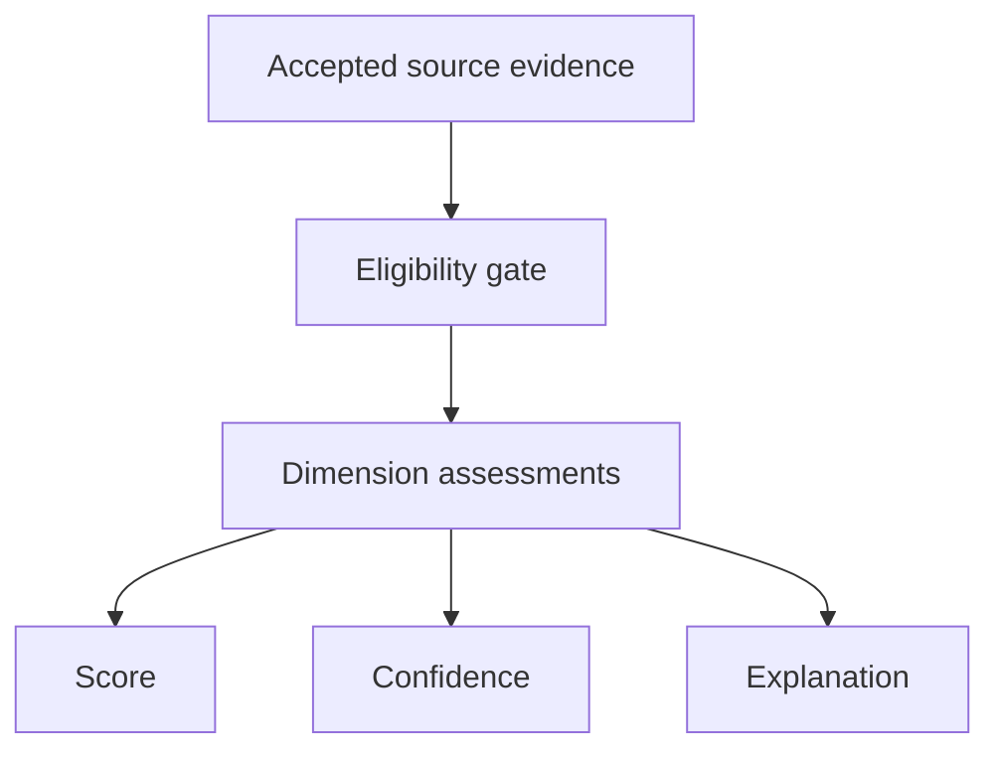

# BKL-041 F1 — Scientific Data Quality Score Source Discovery and Semantic Contract

| Campo | Valore |
|---|---|
| Identificativo | BKL-041-F1 |
| Stato | Accepted |
| Versione | 1.0 |
| Data | 10/09/2026 |
| Package | BKL-041 — Scientific Data Quality Score |
| Baseline | `97dc8250fcd2ccc90cf17657c7e637f599c1c175` |
| Accepted merge | `6d48318c460bad040fd0754b0300fbcd76a2d312` (PR #159) |
| Dipendenze | BKL-029, BKL-037, BKL-045 — Accepted |
| Authority | Repository-governed analytical contract; read-only and non-Safety |

## 1. Scopo

Definire il primo incremento governato di BKL-041: il significato dello **Scientific Data Quality Score**, le evidenze ammissibili, le dimensioni candidate, le regole di normalizzazione e weighting, la confidence, l'explainability, il trattamento dei dati mancanti, i rischi di bias e i confini di authority.

F1 è un contratto architetturale. Non implementa ancora un algoritmo, non assegna pesi numerici, non introduce soglie o classi `GOOD/BAD`, non pubblica uno score e non modifica i dati di sessione.

## 2. Definizione semantica

Lo **Scientific Data Quality Score** è un indicatore derivato, versionato e spiegabile della fitness delle evidenze scientifiche rispetto a un `assessmentProfile` dichiarato.

Non rappresenta:

- una verità assoluta sulla qualità estetica o scientifica dell'immagine;
- l'accettazione di una sessione o di un asset;
- un voto dell'astrofotografo, del target o dell'attrezzatura;
- una severity operativa, uno SLA/SLO o un health score;
- una decisione meteo o di Safety;
- una raccomandazione, remediation o autorizzazione a comandare apparati;
- una prova implicita di processing PixInsight quando la provenance è incompleta.

Uno score senza profilo, versione, coverage, confidence e spiegazione è semanticamente invalido.

## 3. Scope e non-scope

### In scope F1

- inventario delle fonti repository disponibili;
- distinzione fra source evidence, dimension assessment, score, confidence e explanation;
- eligibility fail-closed delle dimensioni;
- regole obbligatorie per future normalizzazioni e pesi;
- comportamento con evidence mancante, parziale, stale o incompatibile;
- authority, bias, sicurezza e tracciabilità;
- sequenza degli incrementi successivi.

### Fuori scope F1

- valori dei pesi e formula numerica;
- threshold di score o confidence;
- ranking fra sessioni, target, setup o operatori;
- confronto cross-cohort senza profilo governato;
- scoring di FWHM/background senza unità e metodo calibrati;
- inferenza della qualità finale dal numero di step PixInsight;
- consumer portale, API, persistenza o modifica della pipeline di import;
- device command, automazione, Safety Authority o acceptance authority.

## 4. Current state e source discovery

L'inventario è riferito alla baseline dichiarata e deve essere rivalutato da ogni successivo builder contro le fonti correnti.

| Fonte | Evidenza verificata | Ruolo possibile | Vincolo F1 |
|---|---|---|---|
| `data/sessions/**/normalized/session-metrics.json` | metriche N.I.N.A., PHD2, meteo e SQM per sessione | source evidence normalizzata | preservare unità, finestra, source path e null espliciti |
| `docs/data/scientific-session-catalog.json` | 15 sessioni; metriche sorgente presenti per 15/15 | discovery e session context | projection, non authority; non usare `qualityState` come score |
| BKL-029 SQM | SQM disponibile per 8/15 sessioni | dimension evidence candidata | `mag/arcsec2`, source e temporal coverage obbligatori |
| BKL-037 comparison projection | `SQM_MEDIAN`, 8 included e 7 exclusions | cohort/comparability evidence | descrittiva; non è score né threshold |
| storico guiding | RMS totale disponibile per 13/15 sessioni | dimension evidence candidata | campioni validi, periodo e unità `arcsec` devono essere verificabili |
| storico meteo | disponibile per 14/15 sessioni | context evidence | non è realtime e non diventa Safety evidence o penalità implicita |
| conteggi/integration N.I.N.A. | light started/completed e integration disponibili per 15/15; completion percent disponibile per 13/15 | acquisition evidence candidata | planned, started, completed, accepted e rejected non sono sinonimi |
| BKL-045 PixInsight provenance | OAT reale con `capture.completeness=UNAVAILABLE`, zero step observed e zero declared | processing-provenance evidence | non correlata a una sessione produttiva; nessun contributo positivo inferibile |
| AP-013/AP-014 | identity, lifecycle, catalog e reconciliation governati | authority per asset/session | BKL-041 consuma read model; non scrive né sostituisce le authority |
| BKL-044 | Citation, Provenance ed evidence class | regole cross-cutting | `OBSERVED`, `DECLARED` e `SUGGESTED` restano distinti |

### 4.1 Gap verificati

- nessuna source corrente dimostra FWHM angolare calibrato per l'intero catalogo;
- background non ha un metodo/unità/stage normalizzati accettati;
- non esiste una ground truth governata della qualità scientifica finale;
- la processing provenance reale non dimostra ancora la storia completa delle sessioni produttive;
- `severity`, `analyticsState` e `qualityState` correnti hanno semantiche operative/completeness e non sono target labels per BKL-041.

Questi gap restano `UNAVAILABLE` o `CONTEXT_ONLY`; non vengono colmati per inferenza.

## 5. Target state

Gli incrementi successivi potranno produrre una projection session-scoped soltanto attraverso questa sequenza:



Score, confidence ed explanation condividono lo stesso evidence snapshot ma restano concetti distinti. Nessun consumer può mostrare lo score senza confidence, coverage, limitations e provenance.

## 6. Modello concettuale

### 6.1 `QualityEvidence`

Fatto sorgente o projection accettata, immutabile nel contesto dell'assessment:

```text
evidenceId
sessionId
dimension
value / categoricalValue
unit
sourceRef
observedAt / interval
methodId / methodVersion
evidenceClass
quality
completeness
coverage
comparabilityClass
limitations[]
```

Un valore assente resta `null`/missing e non diventa zero.

### 6.2 `AssessmentProfile`

Definisce lo scopo dello score:

```text
profileId
profileVersion
intendedUse
eligibleCohort
requiredDimensions[]
optionalDimensions[]
excludedDimensions[]
normalizationMethods[]
weightSet
minimumEvidenceRules[]
confidenceMethod
limitations[]
```

Profili diversi non sono direttamente confrontabili. Una futura migrazione di formula, metodo o pesi richiede una nuova versione.

### 6.3 `DimensionAssessment`

Risultato derivato per una singola dimensione. Deve preservare valore sorgente, eligibility, normalizzazione, peso, contributo, confidence factor, provenance ed exclusion reason.

### 6.4 `ScientificDataQualityAssessment`

Envelope read-only dell'assessment:

```text
assessmentId
sessionId
profileId / profileVersion
algorithmId / algorithmVersion
evidenceSnapshotId
assessmentState
scoreValue / scoreScale
evidenceCoverage
confidence
dimensions[]
limitations[]
explanation
authority
generatedAt
```

`assessmentState` deve essere almeno distinguibile in `AVAILABLE`, `PARTIAL`, `UNAVAILABLE`, `NOT_APPLICABLE` e `INVALID`. Il default fail-closed è `UNAVAILABLE`.

## 7. Dimensioni candidate ed eligibility

| Dimensione | Evidenza corrente | Eligibility F1 | Regola |
|---|---|---|---|
| Metadata & lineage integrity | catalogo, AP-013/AP-014, source locators | candidata | valuta completezza/tracciabilità, non merito scientifico |
| Acquisition completion | integration e frame counts | condizionale | richiede denominatore e policy started/completed/accepted/rejected espliciti |
| Guiding stability | total RMS `arcsec` per 13 sessioni | condizionale | richiede campioni validi, interval coverage e total-RMS semantics |
| Sky quality & coverage | SQM median/coverage per 8 sessioni | condizionale | direzione e rilevanza dipendono da target, filtro, Luna e profilo |
| Weather context | storico per 14 sessioni | `CONTEXT_ONLY` | non trasformare full-window weather in Safety o causalità sulla sequenza |
| Optical image quality | FWHM/background | `UNAVAILABLE` / `CONTEXT_ONLY` | richiede metodo, stage, calibrazione e unità governati |
| Processing provenance completeness | BKL-045 | condizionale come completeness | numero di step e completeness non provano la qualità finale |
| Error evidence | N.I.N.A./PHD2 categories | `CONTEXT_ONLY` | error count grezzo non è severity o qualità senza exposure/window semantics |
| Final scientific outcome | nessuna ground truth accettata | `UNAVAILABLE` | vietato derivarla da severity, processing count o score circolari |

Una dimensione `CONTEXT_ONLY`, `UNAVAILABLE`, `PARTIAL`, `UNKNOWN` o `INCOMPATIBLE` non contribuisce numericamente finché un successivo contratto non ne dimostra l'eligibility.

## 8. Normalization contract

Ogni normalizzazione futura deve dichiarare:

- `normalizationMethodId` e versione;
- dimensione e unità ammesse;
- direzione semantica e motivazione scientifica;
- dominio, range di output e comportamento out-of-range;
- reference cohort e criteri di inclusione/esclusione;
- trattamento di null, outlier, coverage e sample size;
- monotonicità attesa e casi in cui non vale;
- precisione, rounding e determinismo;
- limitation e validation evidence.

È vietato:

- normalizzare solo perché il campo è numerico;
- convertire un valore mancante in zero;
- assumere che più integrazione, SQM più alto o RMS più basso siano sempre migliori fuori dal profilo dichiarato;
- unire unità, target, filtri, setup o processing stage incompatibili;
- apprendere min/max o direzione dalla stessa singola sessione valutata senza dichiararlo.

## 9. Weighting contract

1. I pesi appartengono a un `weightSet` versionato e a un solo `assessmentProfile`.
2. Ogni peso deve essere esplicito, non negativo e scientificamente motivato.
3. La somma dei pesi configurati deve essere verificabile; F1 non assegna valori numerici.
4. Dimensioni correlate devono essere dichiarate per evitare double counting.
5. Evidence mancante non causa redistribuzione o rinormalizzazione silenziosa dei pesi.
6. Le dimensioni required mancanti possono rendere lo score `UNAVAILABLE`; quelle optional mancanti riducono coverage/confidence secondo regole versionate.
7. Il peso zero o l'esclusione devono essere visibili nella explanation.
8. Cambiare pesi produce una nuova versione e non riscrive assessment storici.

Finché non esiste un `weightSet` approvato e testato, nessun valore aggregato è autorizzato.

## 10. Confidence ed evidence coverage

La confidence misura quanto l'assessment è sostenuto dall'evidence prevista dal profilo; non misura la qualità della sessione e non è una probabilità di successo.

Deve considerare almeno:

- presenza delle dimensioni required/optional;
- evidence class e provenance risolvibile;
- source quality e completeness;
- temporal/sample coverage;
- calibrazione e comparability;
- adeguatezza della cohort/reference population;
- limitation note.

Regole obbligatorie:

- score e confidence sono sempre mostrati separatamente;
- un valore alto con confidence bassa non può essere presentato come conclusione robusta;
- una confidence alta non trasforma uno score in acceptance decision;
- bande o threshold di confidence richiedono futura definizione e validazione esplicita;
- in assenza del metodo versionato, confidence è `UNKNOWN` e lo score resta `UNAVAILABLE`.

## 11. Missing, partial e incompatible evidence

| Stato evidence | Trattamento |
|---|---|
| missing / `UNAVAILABLE` | non imputare, non usare come zero; dichiarare motivo |
| `PARTIAL` | non promuovere a complete; eventuale uso limitato deve essere esplicito |
| `STALE` / `UNKNOWN` | fail-closed; non contribuire senza regola accettata |
| `INCOMPATIBLE` | escludere con incompatibility reason |
| `CONTEXT_ONLY` | mostrare nella explanation, contributo numerico vietato |
| `SUGGESTED` | recommendation evidence, mai esecuzione o osservazione |

Ogni esclusione resta visibile. Il consumer non può mostrare soltanto le dimensioni favorevoli.

## 12. Explainability contract

Ogni assessment disponibile deve consentire di ricostruire:

1. quale profilo/versione è stato applicato;
2. quali evidenze sono state considerate, escluse o mancanti;
3. valore e unità sorgente di ogni dimensione;
4. metodo/versione e risultato della normalizzazione;
5. peso e contributo della dimensione;
6. confidence factor e coverage;
7. source/Citation/Provenance e timestamp/finestra;
8. limitazioni, bias e incompatibilità;
9. formula/versione e rounding del risultato;
10. authority boundary.

Una label senza decomposition non soddisfa BKL-041.

## 13. Bias e comparabilità

Il profilo deve prevenire almeno questi bias:

- target type e luminosità superficiale;
- filtro broadband/narrowband e banda specifica;
- configurazione ottica, focale, camera, binning e sampling;
- durata/esposizione e numerosità dei frame;
- Luna, SQM e condizioni stagionali;
- coverage temporale differente;
- processing stage e completeness PixInsight;
- sopravvivenza delle sole sessioni più complete;
- doppio conteggio di metriche correlate;
- comparazione fra versioni diverse di profilo o algoritmo.

Il confronto è ammesso soltanto fra assessment con stesso `profileId`, `profileVersion`, `algorithmVersion`, score scale e cohort semantics compatibili.

## 14. Authority boundary

Ogni futuro assessment deve imporre:

```text
consumerMode = READ_ONLY
acceptanceAuthority = false
actionAuthority = NONE
safetyAuthority = LOCAL_PHYSICAL_INTERLOCKS
```

BKL-041:

- non scrive AP-013/AP-014, cataloghi, sessioni o asset;
- non accetta/rifiuta automaticamente sessioni o immagini;
- non cambia severity o analytics state;
- non esegue PixInsight e non promuove `SUGGESTED` a `OBSERVED`;
- non comanda EAGLE, cupola, montatura, camera, power o rete;
- non modifica interlock o Safety Authority locale.

## 15. Security, privacy e operations

- elaborazione repository-side/read-only sulle projection accettate;
- nessun secret, path locale sensibile o immagine binaria nello score;
- source locator repository-relative ove possibile;
- input malformato, authority escalation o versione non supportata vengono rifiutati fail-closed;
- log e diagnostica devono esporre profilo, versione, assessment state ed exclusion reasons;
- rollback futuro tramite revert della projection/consumer, senza migrazione o comando runtime;
- nessuna attività su PC/EAGLE è richiesta da F1.

## 16. Rischi e trade-off

| Rischio | Trattamento F1 |
|---|---|
| un singolo numero nasconde evidenze mancanti | score inseparabile da coverage, confidence ed explanation |
| più integrazione viene premiata sempre | direzione solo nel profilo e nella cohort dichiarati |
| severity diventa ground truth circolare | uso come target label vietato |
| sessioni senza SQM vengono penalizzate come zero | missing esplicito; niente imputazione |
| FWHM non calibrato viene promosso ad arcsec | eligibility negata finché unit provenance non è provata |
| processing incompleto viene interpretato come bassa qualità | completeness separata dalla qualità finale |
| pesi favoriscono un setup/target | profilo e cohort versionati; bias disclosure obbligatoria |
| score viene usato per accettazione o Safety | authority invariants fail-closed |

## 17. Migrazione e incrementi successivi

### F1 — accepted

- source inventory e gap analysis;
- semantic contract per dimensioni, normalization, weighting, confidence ed explanation;
- nessuna formula o projection.

### F2 — Machine-readable quality evidence and profile contract

- schema versionato per `QualityEvidence`, `AssessmentProfile` e `DimensionAssessment`;
- bounded fixtures positive/negative;
- validator fail-closed per unità, missing evidence, versioni e authority;
- nessuno score aggregato finché il profilo non è accettato.

### F3 — Deterministic scoring and confidence engine

- normalizzazioni e `weightSet` espliciti;
- algoritmo puro, deterministico e idempotente;
- decomposition completa, confidence e known-answer tests;
- test di sensitivity/bias e divieto di silent reweighting.

### F4 — Session-driven projection and portal consumer

- rigenerazione automatica dopo ogni nuova sessione importata;
- projection read-only con exclusions e limitation;
- consumer che espone score, confidence, coverage ed explanation insieme.

### F5 — Real-evidence acceptance and closure

- evidenza su sessioni reali e cohort dichiarate;
- ARB e Release Quality indipendenti;
- protected merge e post-merge verification;
- closure/transition soltanto su evidence verificata.

## 18. Traceability

| Driver / vincolo | Repository source |
|---|---|
| BKL-041 objective | `docs/project/FUNCTIONAL_ROADMAP_EXPANSION_2026-08-30.md` |
| current package e Definition of Ready | `docs/project/BACKLOG.md` |
| continuity baseline | `AI_BOOTSTRAP.md`, `docs/project/HANDOVER_2026-09-10.md`, `docs/project/CURRENT_TECHNICAL_BASELINE_2026-09-10.md` |
| SQM source e unità | `docs/architecture/ADR-007-SQM-Instrument-Source-Strategy.md`, BKL-029 evidence |
| comparability/exclusions | `docs/architecture/scientific-assets/BKL-037-F1-Session-Comparison-Source-Discovery-and-Semantic-Contract.md`, `docs/data/session-comparison-projection.json` |
| PixInsight evidence classes/completeness | `docs/architecture/scientific-assets/BKL-045-F1-PixInsight-Workflow-Provenance-Source-Discovery-and-Semantic-Contract.md`, BKL-045 accepted package |
| asset/session authority | AP-013, AP-014 |
| Citation/Provenance | BKL-044 accepted package |
| automatic session refresh boundary | `.github/workflows/analyze-session-automatic.yml` |

## 19. Acceptance criteria F1

F1 è accettabile quando:

1. l'inventario distingue source authority e projection;
2. score, dimension assessment, confidence, coverage ed explanation sono semanticamente separati;
3. nessuna formula, peso numerico, threshold o class label viene introdotta;
4. le dimensioni correnti sono classificate per eligibility con gap espliciti;
5. FWHM/background senza metodo e unit provenance restano non eleggibili;
6. SQM e guiding richiedono coverage/source semantics preservate;
7. PixInsight `PARTIAL/UNAVAILABLE` non viene trasformato in final-quality evidence;
8. missing evidence non diventa zero e non causa silent reweighting;
9. normalization e weighting richiedono profilo/versione e motivazione;
10. confidence resta distinta dallo score e dalla probability;
11. explainability espone input, normalizzazione, peso, contributo, exclusions e provenance;
12. bias/cohort compatibility sono espliciti;
13. assessment è read-only, senza acceptance/action/Safety authority;
14. F4 mantiene la rigenerazione automatica session-driven come requisito obbligatorio;
15. CI/documentation gates applicabili sono verdi sull'exact HEAD;
16. review indipendente ARB non rileva blocker o major finding aperti.

## 20. Open issues

1. Quali `assessmentProfile` iniziali rappresentano casi d'uso scientifici distinti senza creare uno score universale fuorviante?
2. Quale source potrà attestare FWHM/background con metodo, image stage, calibrazione e unità riproducibili?
3. Quale denominatore distingue completion, acceptance e rejection dei frame?
4. Quale evidence minima rende il processing completeness applicabile alle sessioni produttive?
5. Quali weight set, scale e confidence method supereranno sensitivity/bias review?

Le open issue sono input per F2/F3 e non autorizzano assunzioni implicite in F1.
