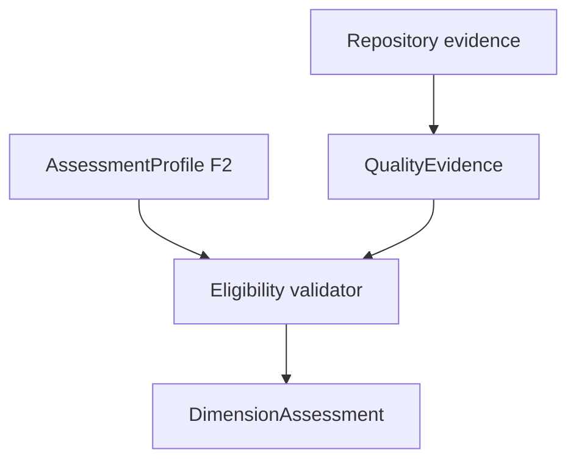

# BKL-041 F2 — Machine-readable Quality Evidence and Profile Contract

| Campo | Valore |
|---|---|
| Identificativo | BKL-041-F2 |
| Stato | Proposed |
| Versione | 1.0 |
| Data | 10/09/2026 |
| Package | BKL-041 — Scientific Data Quality Score |
| Baseline F1 | `6d48318c460bad040fd0754b0300fbcd76a2d312` — Accepted |
| Authority | Repository-governed analytical contract; read-only and non-Safety |

## 1. Scopo

Rendere eseguibili i tipi `QualityEvidence`, `AssessmentProfile` e `DimensionAssessment` definiti da F1. F2 introduce uno schema JSON versionato, una fixture bounded riferita a evidence reale, identità deterministiche SHA-256, un validator fail-closed e test negativi.

F2 non implementa `ScientificDataQualityAssessment`, normalizzazione, pesi, confidence numerica, score aggregato, ranking, threshold, consumer portale o persistenza. Tali elementi restano subordinati agli incrementi F3/F4.

## 2. Artefatti

| Artefatto | Responsabilità |
|---|---|
| `docs/contracts/scientific-data-quality-f2.schema.json` | JSON Schema Draft 2020-12 per envelope, profilo, evidence, dimension assessment e authority |
| `docs/data/scientific-data-quality-f2-fixture.json` | known-answer fixture bounded e interamente sintetica |
| `.github/scripts/scientific-data-quality-contract.mjs` | canonicalizzazione, digest e invarianti semantici fail-closed |
| `.github/scripts/verify-scientific-data-quality-contract.mjs` | verifica schema/fixture e invarianti F2 |
| `.github/scripts/test-scientific-data-quality-contract.mjs` | test positivi, negativi e anti-tampering |

## 3. Solution context



`E` non contiene score, peso o contributo. La pipeline F4 potrà in futuro costruire questi record dopo ogni sessione importata, ma F2 non modifica `.github/workflows/analyze-session-automatic.yml` e non pubblica una projection.

## 4. Contratto dell'envelope

Ogni fixture dichiara:

- `schemaVersion = 1.0`;
- `contractType = SCIENTIFIC_DATA_QUALITY_F2_FIXTURE`;
- `identityMethod = BKL041-F2-CANONICAL-JSON-SHA256-1`;
- un solo `sessionId`;
- un `AssessmentProfile` draft F2;
- evidence e dimension assessment bounded;
- authority esatta;
- limitation e digest dell'artefatto.

Il modello non è un output di produzione. `fixtureMode = BOUNDED_SYNTHETIC_FIXTURE` impedisce che il file venga interpretato come catalogo, session evidence o score corrente.

## 5. Identità e canonicalizzazione

`BKL041-F2-CANONICAL-JSON-SHA256-1` applica queste regole:

1. codifica UTF-8;
2. chiavi degli oggetti ordinate lessicograficamente;
3. ordine degli array preservato;
4. serializzazione JSON compatta senza whitespace;
5. digest SHA-256 lowercase hex;
6. il campo digest del record viene escluso dal proprio preimage.

Sono materializzati `profileDigest`, `evidenceDigest`, `assessmentDigest` e `artifactDigest`. Il known-answer `SHA-256({"a":1,"b":2})` è `43258cff783fe7036d8a43033f830adfc60ec037382473548ac742b888292777`.

Ogni modifica non accompagnata dal ricalcolo del digest viene rifiutata. F3 dovrà riusare o versionare esplicitamente questo metodo; non può cambiarne implicitamente le regole.

## 6. AssessmentProfile F2

Il profilo distingue quattro insiemi disgiunti:

| Insieme | Semantica F2 |
|---|---|
| `requiredDimensions` | richiedono sempre un assessment esplicito, anche quando l'evidence manca |
| `optionalDimensions` | possono essere unavailable senza imputazione o redistribuzione |
| `contextDimensions` | spiegazione/contesto; nessun contributo numerico |
| `excludedDimensions` | fuori dall'uso del profilo |

I seguenti valori sono invarianti:

```text
profileState = DRAFT_F2
weightSetState = NOT_ASSIGNED_F2
scoreState = NOT_IMPLEMENTED_F2
confidenceMethodState = NOT_ASSIGNED_F2
```

Il profilo foundation non è un profilo di scoring accettato. Serve esclusivamente a validare eligibility, missing-data behavior e confini semantici.

## 7. QualityEvidence

Ogni evidence conserva identità di sessione e dimensione, valore/null, unità, semantica dell'unità, source locator repository-relative, finestra temporale, metodo/versione, evidence class, quality, completeness, coverage, comparability, calibration state e limitation.

Regole eseguibili principali:

- `null` resta assenza e non viene convertito in zero;
- guiding valorizzato usa `arcsec`;
- SQM valorizzato usa `mag/arcsec2`;
- coverage è `null` oppure appartiene a `[0,1]`;
- source locator assoluti, drive path o traversal `..` sono rifiutati;
- `OBSERVED`, `DECLARED` e `SUGGESTED` restano distinti;
- un record `SUGGESTED` non può rendere una dimensione eleggibile;
- ogni evidence appartiene alla stessa sessione dell'envelope.

## 8. DimensionAssessment

Ogni dimensione espone:

- `assessmentState` fra `AVAILABLE`, `PARTIAL`, `UNAVAILABLE`, `NOT_APPLICABLE`, `INVALID`;
- eligibility esplicita;
- riferimenti alle evidence e exclusion reason;
- limitation;
- stati F2 non computazionali.

```text
normalizationState = NOT_IMPLEMENTED_F2
weightState = NOT_ASSIGNED_F2
contributionState = NOT_COMPUTED_F2
```

Una dimensione required senza evidence completa e valida deve essere `UNAVAILABLE`, avere eligibility `UNAVAILABLE` ed esporre `REQUIRED_EVIDENCE_MISSING`.

### 8.1 Vincoli scientifici specifici

- `WEATHER_CONTEXT` e `ERROR_EVIDENCE` restano `CONTEXT_ONLY`;
- `FINAL_SCIENTIFIC_OUTCOME` resta `UNAVAILABLE` senza ground truth governata;
- optical evidence è candidabile alla futura normalizzazione solo in `arcsec`, con `ANGULAR_CALIBRATED` e calibration `PROVEN`;
- PixInsight processing provenance è candidabile solo con evidence `VALID` e `COMPLETE`;
- optional evidence mancante non attiva alcun peso o silent reweighting perché F2 non contiene weight set.

## 9. Fixture bounded sintetica

La fixture `SYNTHETIC-F2-SESSION` contiene esclusivamente valori didattici sintetici e riferisce il contratto semantico F1. Non include metriche, percorsi o osservazioni di una sessione produttiva:

| Evidenza | Valore fixture | Trattamento |
|---|---:|---|
| metadata | `SYNTHETIC_COMPLETE` | condizionale; non è merito scientifico |
| acquisition completion | `0.75` | condizionale; accepted/rejected denominator irrisolto |
| guiding | `null` | required, `UNAVAILABLE`, non zero RMS |
| SQM median | `20.5 mag/arcsec2` | valore sintetico condizionale, coverage `0.9` |
| weather safe ratio | `0.8` | valore sintetico context-only, no Safety Authority |
| calibrated optical quality | `null` | unavailable, calibration not proven |
| PixInsight history | `null` | unavailable, nessuna final-quality inference |

La fixture non attesta alcun fatto produttivo e non deriva `qualityState`, severity o analytics state come label scientifica.

## 10. Failure behavior

Il validator rifiuta l'intero artefatto al primo contratto incompatibile. Non corregge, imputa o degrada silenziosamente l'input.

| Caso | Esito |
|---|---|
| versione/metodo identità sconosciuti | reject |
| digest non coerente | reject |
| required dimension non rappresentata | reject |
| required evidence assente ma dimensione dichiarata available | reject |
| unità guiding/SQM incompatibile | reject |
| FWHM non calibrato promosso a eligible | reject |
| PixInsight `PARTIAL/UNAVAILABLE` promosso a eligible | reject |
| `SUGGESTED` promosso a eligible | reject |
| score, weight, normalized value, contribution o confidence numerica | reject |
| authority escalation | reject |

## 11. Authority, security e safety

Ogni envelope impone esattamente:

```text
consumerMode = READ_ONLY
acceptanceAuthority = false
actionAuthority = NONE
safetyAuthority = LOCAL_PHYSICAL_INTERLOCKS
```

F2 non scrive cataloghi/sessioni/AP-013/AP-014, non accetta o rifiuta asset, non modifica severity, non esegue PixInsight e non comanda PC/EAGLE, cupola, montatura, camera, rete o alimentazione. Gli interlock locali restano indipendenti.

## 12. CI e validazione

Il quality gate deve eseguire:

```text
node .github/scripts/verify-scientific-data-quality-contract.mjs
node --test .github/scripts/test-scientific-data-quality-contract.mjs
```

La suite copre known-answer identity, fixture positiva, required evidence mancante, unità SQM incompatibile, optical calibration, PixInsight partial, evidence `SUGGESTED`, authority escalation, campi score/peso vietati e tampering del digest.

La validazione locale sul proposal ha prodotto 11 test passed. L'evidence CI exact-head resta requisito di acceptance del PR.

## 13. Compatibility, migration e rollback

- nessuna migrazione dati o schema esistente;
- nessuna modifica a runtime, device, scheduler o pipeline di import;
- nessun consumer dipende dal nuovo contratto;
- F4 mantiene l'obbligo di rigenerazione automatica dopo ogni nuova sessione scientifica importata;
- rollback tramite revert degli artefatti F2 e dei riferimenti di continuità.

## 14. Acceptance criteria F2

F2 è accettabile quando:

1. F1 è formalmente riconciliato come Accepted sulla merge baseline verificata;
2. schema e fixture sono JSON validi e versionati;
3. canonicalizzazione e digest hanno un known-answer test;
4. profile/evidence/dimension identity viene verificata;
5. required missing evidence resta esplicitamente `UNAVAILABLE`;
6. optional missing evidence non genera pesi o redistribuzione;
7. unità SQM/guiding incompatibili sono rifiutate;
8. FWHM non calibrato e PixInsight incomplete non diventano eligible;
9. evidence `SUGGESTED` non diventa osservazione o contributo;
10. score, peso, normalizzazione, contribution e confidence numerica sono vietati;
11. authority escalation è rifiutata;
12. test locali e CI exact-head sono verdi;
13. ARB non rileva blocker/major aperti;
14. Release Quality emette una recommendation esplicita.

## 15. Incremento successivo

F3 potrà introdurre normalizzazioni, weight set, score scale e confidence method soltanto dopo nuova valutazione scientifica e architetturale. Dovrà rendere eseguibili almeno: somma dei pesi, scale semantics, out-of-range behavior, no silent reweighting, decomposition, sensitivity/bias test e known-answer score.

L'acceptance F2 non autorizza automaticamente F3 o F4.
