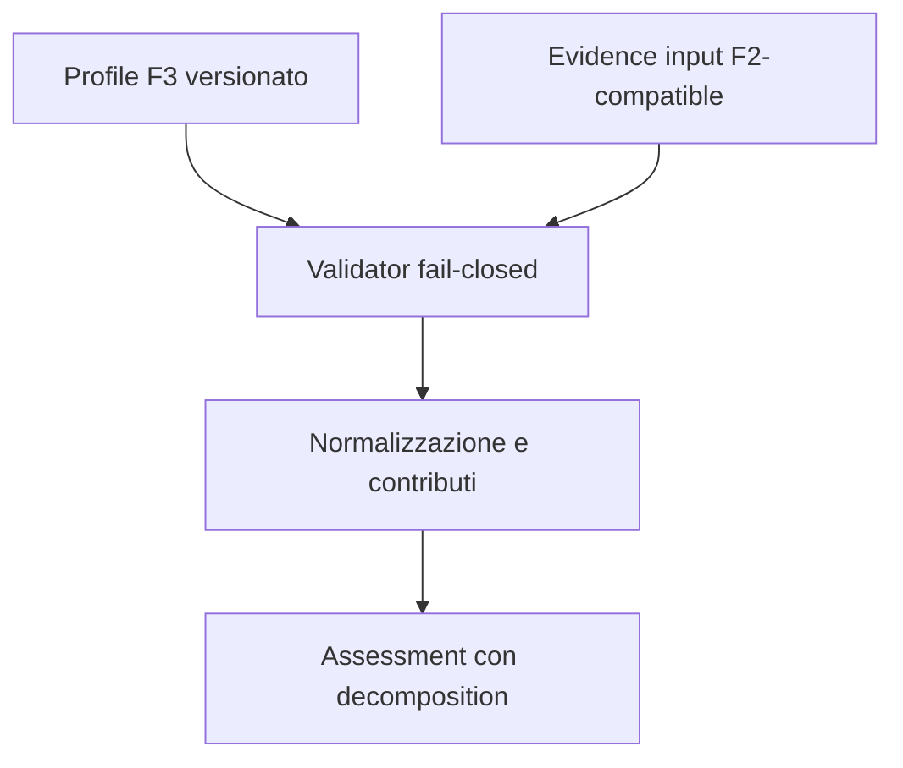

# BKL-041 F3 — Deterministic Scoring and Confidence Engine

| Campo | Valore |
|---|---|
| Identificativo | BKL-041-F3 |
| Stato | Proposed |
| Versione | 1.0 |
| Data | 11/09/2026 |
| Package | BKL-041 — Scientific Data Quality Score |
| Baseline F2 | `4ca5135043c508288fa2ba41b744f29b3b9032ed` — Accepted via PR #160 |
| Authority | Repository-governed analytical engine; read-only, non-operational and non-Safety |

## 1. Decisione

F3 introduce il primo motore eseguibile di normalizzazione, scoring e confidence per BKL-041. Il motore è puro, deterministico, versionato e fail-closed. Produce una decomposition per dimensione e identità SHA-256 compatibili con la canonicalizzazione F2.

Il solo profilo autorizzato in questo incremento è `DSG-SCIENTIFIC-QUALITY-SYNTHETIC-DEMONSTRATOR` `1.0.0-f3`. Valori, bounds e pesi sono parametri sintetici per testare l'algoritmo: non costituiscono calibrazione scientifica di produzione e non possono essere usati per acceptance, ranking, threshold, raccomandazioni o comandi.

## 2. Scope e artefatti

| Artefatto | Responsabilità |
|---|---|
| `.github/scripts/scientific-data-quality-scoring.mjs` | validazione del profilo, normalizzazione, score, confidence, decomposition e digest |
| `docs/contracts/scientific-data-quality-f3.schema.json` | contratto JSON Draft 2020-12 della fixture e del profilo dimostrativo |
| `docs/data/scientific-data-quality-f3-fixture.json` | known-answer bounded e interamente sintetico |
| `.github/scripts/verify-scientific-data-quality-scoring.mjs` | verifica schema, digest e output noto |
| `.github/scripts/test-scientific-data-quality-scoring.mjs` | test di determinismo, sensitivity, bias boundary e failure behavior |
| `.github/workflows/bkl-041-f3-governance.yml` | quality gate dedicato F3 |

Restano fuori scope consumer portale, persistenza, catalog projection, integrazione nella pipeline di import, profile calibration produttiva, classi GOOD/BAD, benchmark, ranking, threshold, recommendation, remediation e ogni authority operativa o Safety.

## 3. Flusso della soluzione



L'engine non legge file, rete, clock o stato globale. A parità di profile, session id, evidence e authority restituisce lo stesso output e lo stesso digest.

## 4. Profilo sintetico dimostrativo

| Dimensione | Requirement | Peso | Bounds | Direzione |
|---|---:|---:|---:|---|
| `METADATA_LINEAGE_INTEGRITY` | required | 0,20 | 0–1 ratio | higher is better |
| `ACQUISITION_COMPLETION` | required | 0,30 | 0–1 ratio | higher is better |
| `GUIDING_STABILITY` | required | 0,25 | 0,5–3 arcsec | lower is better |
| `SKY_QUALITY_COVERAGE` | required | 0,25 | 18–21,5 mag/arcsec² | higher is better |
| `OPTICAL_IMAGE_QUALITY` | optional | 0 | 0,5–5 arcsec | esclusa in F3 |
| `WEATHER_CONTEXT` | context-only | 0 | 0–1 ratio | esclusa in F3 |

I pesi delle dimensioni required devono essere positivi e sommare a 1 con tolleranza massima `1e-12`. Optional e context-only devono avere peso zero. Non esiste redistribuzione implicita.

La policy fuori range è sempre `REJECT`: l'engine non effettua clamp, imputazione o correzione automatica. La definizione di bounds e pesi produttivi richiede un futuro profilo calibrato, evidence scientifica, review indipendente e versionamento distinto.

## 5. Formula di normalizzazione e score

Per una dimensione higher-is-better:

\[
n_i = \frac{x_i-min_i}{max_i-min_i}
\]

Per una dimensione lower-is-better:

\[
n_i = 1-\frac{x_i-min_i}{max_i-min_i}
\]

Lo score usa esclusivamente le dimensioni required eleggibili:

\[
score = 100 \times \sum_i w_i n_i
\]

Ogni contribution `w_i n_i`, valore raw, valore normalizzato, peso, evidence reference ed exclusion reason è materializzato nella decomposition. Lo score finale è arrotondato secondo `scoreScale.roundingDigits`; i contributi intermedi conservano otto cifre decimali nell'output esplicativo.

## 6. Confidence ed evidence coverage

La confidence misura il supporto dell'evidence, non la probabilità che lo score sia corretto. La semantica machine-readable è `EVIDENCE_SUPPORT_NOT_PROBABILITY`.

Per ciascuna dimensione required:

\[
c_i = coverage_i \times class_i \times quality_i \times completeness_i \times calibration_i
\]

\[
confidence = 100 \times \sum_i w_i c_i
\]

I fattori F3 sono espliciti e versionati: `OBSERVED=1`, `DECLARED=0,8`, `SUGGESTED=0`; solo `VALID`, `COMPLETE` e `PROVEN/NOT_APPLICABLE` hanno fattore 1. La coverage separata è:

\[
evidenceCoverage = \sum_i w_i coverage_i
\]

Un fattore zero non rende automaticamente utilizzabile evidence non eleggibile: i controlli di eligibility precedono il calcolo e fanno fallire chiuso l'assessment.

## 7. Missing data e failure behavior

Se una dimensione required manca o ha unità incompatibile, evidence `SUGGESTED`, qualità diversa da `VALID`, completeness diversa da `COMPLETE`, calibration non valida o eligibility non autorizzata:

- `assessmentState = UNAVAILABLE`;
- `score = null` e `confidence = null`;
- la dimensione conserva peso e reason espliciti nella decomposition;
- gli altri contributi non vengono rinormalizzati;
- `evidenceCoverage` rappresenta soltanto la copertura effettivamente disponibile.

Evidence optional e context-only rimane visibile nelle exclusions con peso zero. Proprietà sconosciute, duplicati, digest alterati, algoritmi/versioni non supportati, pesi illegali, range invalidi e authority escalation provocano reject.

## 8. Known answer e sensitivity

La fixture `SYNTHETIC-F3-SESSION` usa solo valori artificiali e produce:

| Output | Valore atteso |
|---|---:|
| score | 77,86 / 100 |
| confidence | 74,00 / 100 |
| evidence coverage | 0,925 |

I test verificano inoltre:

- idempotenza, deep immutability e indipendenza dall'ordine degli input;
- riduzione dello score quando il guiding peggiora;
- aumento dello score quando cresce l'acquisition completion;
- assenza di effetti numerici da evidence optional a peso zero;
- rifiuto dei valori fuori range e dei weight set invalidi;
- stato unavailable, senza silent reweighting, per evidence required mancante o ineligible;
- separazione fra score, confidence ed evidence coverage.

Questi test dimostrano proprietà del calcolo, non validità scientifica dei parametri sintetici. Bias legati a target, filtro, setup, seeing, copertura e condizioni osservative restano non risolti fino a una calibrazione rappresentativa.

## 9. Identity e auditabilità

F3 riusa la canonicalizzazione `BKL041-F2-CANONICAL-JSON-SHA256-1`: UTF-8, chiavi ordinate, array order-preserving e JSON compatto. Sono materializzati:

- `profileDigest`, senza il proprio campo digest nel preimage;
- `evidenceSnapshotDigest`, su input ordinati per dimensione;
- `assessmentId`, derivato da session id, profile digest e snapshot digest;
- `assessmentDigest`, sull'intero assessment prima del proprio campo digest;
- `fixtureDigest`, sulla fixture prima del proprio campo digest.

L'identità rende rilevabile ogni variazione di profilo, evidence o risultato e consente un futuro ricalcolo controllato per versione.

## 10. Authority e safety

Il contratto accetta esclusivamente:

```text
consumerMode = READ_ONLY
acceptanceAuthority = false
actionAuthority = NONE
safetyAuthority = LOCAL_PHYSICAL_INTERLOCKS
```

L'assessment è informativo. Non può accettare o rifiutare una sessione, modificare apparati, intervenire su EAGLE/N.I.N.A./ASCOM/PLC, governare readiness o sostituire interlock fisici e procedure operative.

## 11. Compatibilità e migrazione

F2 resta il contratto di evidence e profile foundation accettato. F3 aggiunge un modulo separato e non modifica i consumer esistenti. Il rollback consiste nel rimuovere gli artefatti F3; nessuna migrazione dati o runtime è richiesta.

Un futuro profilo produttivo dovrà avere nuovo id/versione e non potrà sostituire silenziosamente `SYNTHETIC_DEMONSTRATOR_F3`. Un futuro cambio di algoritmo o confidence method richiederà nuova versione e known answer dedicato.

## 12. Vincolo dinamico per F4

F3 non modifica la pipeline `analyze-session-automatic.yml` e non pubblica una projection portale. Il requisito tecnico resta vincolante per F4: dopo ogni nuova sessione scientifica importata, il workflow governato deve rigenerare automaticamente evidence, assessment e consumer derivati, senza editing manuale dei dati pubblicati e con verifica della freshness.

F4 dovrà definire trigger, source-of-truth, ricalcolo per profile version, comportamento su failure, stale marker, atomicità di pubblicazione e test end-to-end. Nessuna pagina potrà presentare come corrente uno score non rigenerato dall'ultima importazione completata.

## 13. Acceptance criteria F3

- profilo, algoritmo, scale, bounds, pesi e confidence method sono versionati;
- formula e decomposition sono deterministiche e verificabili;
- missing required evidence rende lo score unavailable senza reweighting;
- synthetic known answer e digest sono riproducibili;
- sensitivity e boundary tests sono verdi;
- authority read-only/non-Safety è fail-closed;
- CI exact-head, ARB e Release Quality sono completati prima del merge;
- F4 dynamic update requirement resta esplicito e tracciato.
