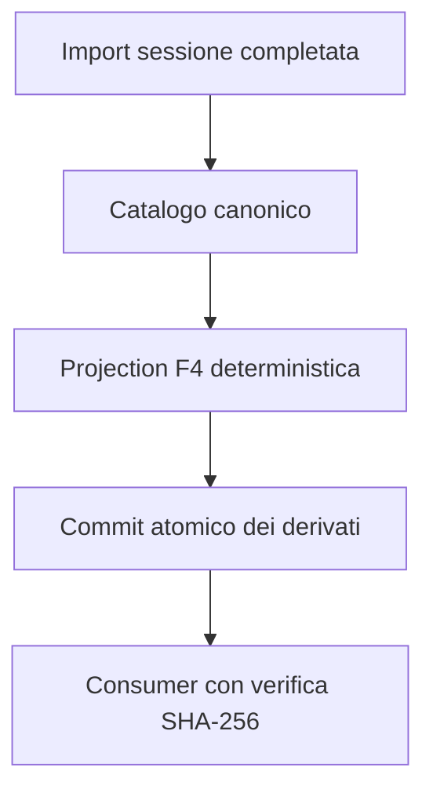

# BKL-041 F4 — Session-Driven Projection and Portal Consumer

| Campo | Valore |
|---|---|
| Identificativo | BKL-041-F4 |
| Stato | Proposed |
| Versione | 1.0 |
| Data | 11/09/2026 |
| Package | BKL-041 — Scientific Data Quality Score |
| Baseline F3 | `89d8979fa4e5b151d85ef889efe03ad468efcad1` — Accepted via PR #161 |
| Authority | Projection analitica read-only; uso produttivo, acceptance, action e Safety Authority non autorizzati |

## 1. Decisione

F4 rende session-driven il motore F3: genera una projection versionata per tutte le sessioni del catalogo e introduce un consumer portale che mostra score, confidence, coverage, decomposition, exclusions e limitazioni come un unico insieme spiegabile.

Il profilo resta il dimostratore sintetico F3. Ogni record e l'intera projection sono marcati `EXPERIMENTAL_NOT_ACCEPTED`; F4 dimostra integrazione e freshness, non calibrazione scientifica produttiva. F5 resta l'incremento responsabile di evidence reale rappresentativa, calibrazione, review e acceptance/closure.

## 2. Flusso e source of truth

`docs/data/scientific-session-catalog.json` resta la source of truth. `.github/workflows/analyze-session-automatic.yml` è l'orchestratore canonico: dopo l'import completo rigenera catalogo, comparison, analytics, projection F4 e altri derivati nello stesso tentativo di commit. Il meccanismo di retry rilegge `main` e rigenera l'intero insieme prima di un nuovo commit, evitando una projection costruita su un catalogo superato.

## 3. Contratti e componenti

| Artefatto | Responsabilità |
|---|---|
| `.github/scripts/scientific-data-quality-projection.mjs` | mapping catalogo→evidence F3 e generazione deterministica full-catalog |
| `.github/scripts/generate-scientific-data-quality-projection.mjs` | modalità `--write`, `--check` e `--print` idempotenti |
| `docs/contracts/scientific-data-quality-f4.schema.json` | schema Draft 2020-12 della projection |
| `docs/data/scientific-data-quality-projection.json` | projection pubblicata, mai authority |
| `docs/javascripts/scientific-data-quality-core.mjs` | verifica browser di identity, authority e freshness |
| `docs/javascripts/scientific-data-quality.js` | consumer accessibile e fail-closed |
| `docs/scientific-data-quality/index.md` | pagina portale read-only |
| `.github/workflows/bkl-041-f4-governance.yml` | gate F4 e regressione F3 |

## 4. Mapping dell'evidence

Il mapping usa esclusivamente campi già pubblicati dal catalogo:

| Dimensione F3 | Fonte catalogo | Coverage |
|---|---|---:|
| metadata lineage | source metrics, manifest versionato, metadata registered/canonical | 1 quando tutte le condizioni sono vere |
| acquisition completion | `completionPct` con light frame avviati | 1 |
| guiding stability | `guiding.rmsTotalArcsec` e sample count | 0 |
| sky quality coverage | SQM median e `temporalCoverage` | coverage SQM dichiarata |

L'evidence derivata è sempre `DECLARED`, mai `OBSERVED`. Il catalogo non espone un denominatore temporale governato per il guiding: F4 pubblica quindi coverage zero per quella dimensione. Confidence ed evidence coverage rendono visibile questo limite senza inventare supporto.

Evidence required mancante produce `UNAVAILABLE`, senza redistribuzione dei pesi. Un valore fuori dai bounds sintetici produce un record `INVALID` con errore esplicito e non interrompe la proiezione delle altre sessioni.

## 5. Identity, freshness e stale behavior

La projection registra schema/status/digest SHA-256 canonico, numero e identificativi ordinati delle sessioni sorgente, identità del profilo e proprio digest. Il browser scarica catalogo e projection con `cache: no-store`, ricalcola i digest tramite Web Crypto e verifica:

- identità e lifecycle F4 supportati;
- profile id/version/digest F3 attesi;
- authority esattamente read-only e non produttiva;
- digest, schema, status, count e session id del catalogo;
- digest dell'intera projection.

Qualsiasi divergenza, inclusa una nuova sessione importata senza la corrispondente rigenerazione, fallisce chiuso. Il consumer non mostra dati cache precedenti come correnti e presenta invece uno stato non disponibile verificabile.

## 6. Pubblicazione automatica e atomicità

Il trigger su `data/sessions/**/manifest.json` esegue analisi e generatori prima del commit. `docs/data/scientific-data-quality-projection.json` appartiene ai `governed_paths` dello stesso commit atomico che aggiorna il catalogo. Il deploy Pages viene richiesto solo dopo commit/push riuscito.

Il gate verifica che workflow, path governato, `--write`, `--check`, test F4 e test di regressione F3 restino presenti. La projection persistita deve essere semanticamente identica a quella rigenerata dalla source corrente; `generatedAt` non trasforma il clock in input scientifico.

## 7. Stato corrente e limitazioni

Sulla baseline F4 il catalogo contiene 15 sessioni: 5 assessment sperimentali `AVAILABLE`, 3 `UNAVAILABLE` e 7 `INVALID`. Gli invalid riflettono soprattutto valori di guiding al di fuori del lower bound sintetico F3; non sono giudizi negativi sulle sessioni e non devono essere reinterpretati come classi GOOD/BAD.

Restano esplicitamente esclusi:

- profilo o soglie di produzione;
- ranking, benchmark prescrittivo e raccomandazioni;
- acceptance/rejection automatica;
- remediation, device command o modifica del runtime osservativo;
- Safety Authority.

## 8. Sicurezza, privacy e operabilità

La soluzione pubblica solo dati già presenti nel catalogo documentale pubblico e riferimenti repository-relative. Non legge credenziali, host locali o percorsi runtime. Non introduce API mutative né dipendenze di controllo su EAGLE, N.I.N.A., ASCOM, PLC o interlock.

I failure sono osservabili nel workflow e nel consumer. Il rollback consiste nel rimuovere consumer/projection F4 e le relative chiamate dal workflow; catalogo, F2 e F3 restano compatibili e non richiedono migrazione.

## 9. Acceptance criteria F4

- ogni nuova sessione importata rigenera automaticamente la projection nello stesso commit governato del catalogo;
- generator e projection persistita sono deterministici e idempotenti;
- una projection stale o alterata fallisce chiuso nel browser;
- score, confidence, coverage, decomposition ed exclusions sono sempre presentati insieme;
- evidence mancante o fuori range resta esplicita e non viene corretta, imputata o rinormalizzata;
- profilo e output sono marcati sperimentali/non accettati per produzione;
- nessun ranking, threshold, acceptance, action o Safety Authority è introdotto;
- test F4, regressione F3, CI exact-head, ARB e Release Quality sono completati prima del merge;
- F5 conserva ownership esclusiva della calibrazione su evidence reale e della closure del package.
