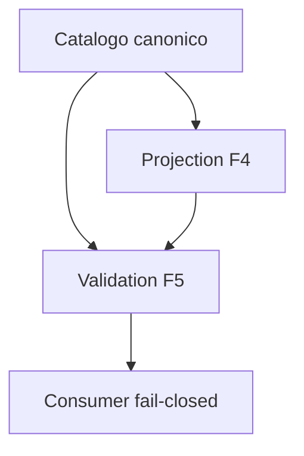

# BKL-041 F5 — Real-Evidence Validation and Capability Closure

| Campo | Valore |
|---|---|
| Identificativo | BKL-041-F5 |
| Stato | Proposed |
| Versione | 1.0 |
| Data | 11/09/2026 |
| Package | BKL-041 — Scientific Data Quality Score |
| Baseline F4 | `ed9ffcc92e1a5252b0d8c37634bc652397f3cde1` — Accepted via PR #162 |
| Decisione proposta | accettare/chiudere la capability read-only sperimentale; non autorizzare profilo o uso produttivi |

## 1. Decisione

F5 valuta l'intera cohort reale disponibile senza filtrare gli esiti. La evidence verificata non consente una calibrazione produttiva: il profilo resta sintetico, manca una ground truth finale, la coverage è incompleta e la distribuzione dei target è sbilanciata.

La decisione proposta separa quindi due concetti:

- **capability acceptance:** `ACCEPTED_AS_READ_ONLY_EXPERIMENTAL_WITH_RETAINED_LIMITATIONS`;
- **production readiness:** `NOT_READY_FOR_PRODUCTION`.

La closure accetta il comportamento deterministico, spiegabile, dinamico e fail-closed realizzato da F1–F5. Non accetta la validità scientifica produttiva dei pesi/bounds F3 e non crea un profilo produttivo.

## 2. Cohort reale

La cohort `ALL-CANONICAL-IMPORTED-SESSIONS-F5` include tutte le sessioni del catalogo canonico, senza scegliere solo quelle con score disponibile:

| Evidenza | Valore osservato |
|---|---:|
| sessioni | 15 |
| target noti | 2 (`LDN 1320`, `M 27`) |
| distribuzione | LDN 1320: 3; M 27: 11; UNKNOWN: 1 |
| source metrics | 15 |
| metadata lineage | 13 |
| acquisition completion | 13 |
| guiding RMS | 13 |
| guiding temporal coverage governata | 0 |
| SQM | 8 |
| assessment available / unavailable / invalid | 5 / 3 / 7 |

Tutti i 5 assessment disponibili appartengono a M 27. Il risultato non è generalizzabile a target, filtri o setup diversi.

## 3. Readiness policy

`DSG-SCIENTIFIC-QUALITY-PRODUCTION-READINESS-1` verifica esclusivamente stati dimostrabili dal repository. Non contiene soglie numeriche, non è una soglia di qualità scientifica e non classifica immagini o sessioni. Conteggi e distribuzioni restano evidence descrittiva, mai criteri impliciti.

| Criterio | Stato richiesto | Stato osservato | Evidence descrittiva | Esito |
|---|---|---|---|---|
| cohort representativeness | demonstrated by accepted method | not demonstrated | 15 sessioni; 2 target noti; 1 unknown | FAIL |
| assessment coverage adequacy | demonstrated by accepted method | not demonstrated | 5 available; 3 unavailable; 7 invalid | FAIL |
| SQM coverage adequacy | demonstrated by accepted method | not demonstrated | 8 available; 7 missing | FAIL |
| guiding temporal coverage | governed non-zero for cohort | unavailable | 0/15 con coverage governata | FAIL |
| ground truth scientifica finale | available | unavailable | nessuna source accettata | FAIL |
| profile calibration | calibrated on real evidence | synthetic demonstrator | profilo `1.0.0-f3` | FAIL |
| bound calibration | calibrated on real evidence | synthetic bounds reject real observations | 7 invalid | FAIL |

Anche se in futuro tutti gli input diventassero eleggibili per una review di calibrazione, F5 manterrebbe `productionReadiness=NOT_READY_FOR_PRODUCTION` e le authority a `false`. Un nuovo profilo produttivo richiede un contratto/versione e un'approvazione separati.

## 4. Componenti e aggiornamento dinamico

| Artefatto | Responsabilità |
|---|---|
| `.github/scripts/scientific-data-quality-real-evidence-validation.mjs` | cohort, policy, risultati, bias disclosure e decisione |
| `.github/scripts/generate-scientific-data-quality-f5-validation.mjs` | generazione/check idempotenti |
| `docs/contracts/scientific-data-quality-f5-validation.schema.json` | contratto machine-readable chiuso |
| `docs/data/scientific-data-quality-f5-validation.json` | evidence report derivato |
| `docs/javascripts/scientific-data-quality-core.mjs` | freshness e authority validation nel browser |
| `.github/workflows/bkl-041-f5-governance.yml` | gate F5 e regressioni |

Il workflow automatico genera prima catalogo e projection F4, quindi validation F5, e li include nello stesso commit governato. Il browser richiede corrispondenza dei digest catalogo/projection/validation e fallisce chiuso su stale o tampering.

## 5. Bias e limitation

- gli assessment disponibili riguardano soltanto M 27;
- la distribuzione dei target è fortemente sbilanciata;
- i bounds sintetici del guiding rifiutano valori RMS reali inferiori a 0,5 arcsec;
- non esiste ground truth accettata della qualità scientifica finale;
- missing evidence e disponibilità non sono missing-at-random;
- SQM dipende da target, filtro, Luna e condizioni e non può essere universalizzato;
- processing completeness non equivale a qualità finale.

Non vengono calcolate correlazioni o performance predittive contro label inesistenti. Nessun record viene escluso perché unavailable/invalid e nessun outlier viene corretto.

## 6. Authority, sicurezza e operabilità

La validation impone `READ_ONLY`, `productionUseAuthorized=false`, `acceptanceAuthority=false`, `actionAuthority=NONE` e `LOCAL_PHYSICAL_INTERLOCKS`. Il termine capability acceptance riguarda esclusivamente la maturità tecnica del componente documentale; non accetta sessioni o immagini.

Non cambiano EAGLE, N.I.N.A., PHD2, ASCOM, PLC, scheduler o interlock. Failure di generator/check impediscono il commit parziale; failure di freshness impediscono il rendering dei dati come correnti.

## 7. Migrazione, rollback e future re-entry

F5 è additivo. Il rollback rimuove report/validator/consumer F5 e le relative chiamate, lasciando intatti catalogo e projection sperimentale F4.

Una futura iniziativa di produzione dovrà riaprire esplicitamente la capability con:

- cohort più ampia e bilanciata;
- ground truth governata e review del metodo;
- coverage temporale guiding;
- nuovo profile id/version, mai sostituzione silenziosa di F3;
- calibration/bias/sensitivity evidence;
- ARB e Release Quality indipendenti.

## 8. Acceptance criteria F5

- cohort completa e selection rule machine-readable;
- readiness policy distinta da soglie di qualità;
- risultati reali riproducibili e failure esplicite;
- production readiness resta sempre `NOT_READY_FOR_PRODUCTION` in F5; un eventuale completamento degli input abilita solo una review separata;
- production profile/use restano non autorizzati;
- validation rigenerata automaticamente dopo ogni import e pubblicata atomicamente;
- consumer verifica freshness fino al report F5;
- test, CI exact-head, ARB e Release Quality verdi;
- closure distingue capability acceptance da scientific production acceptance;
- transition a BKL-046 soltanto dopo merge protetto e verifica post-merge.
