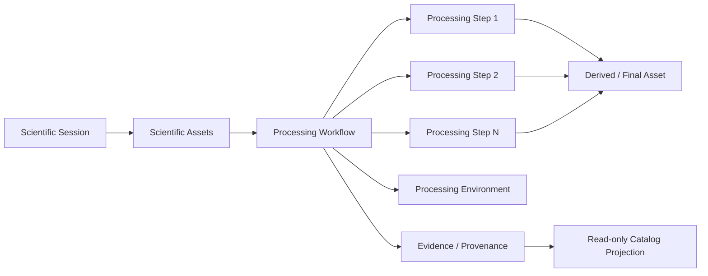

# BKL-045 F1 — PixInsight Workflow Provenance Source Discovery and Semantic Contract

**Identifier:** BKL-045-F1  
**Status:** Proposed  
**Version:** 1.0  
**Release:** RC3  

## 1. Purpose

Establish the governed foundation for **BKL-045 — PixInsight Workflow Provenance Plugin** by reconciling the PixInsight processing capabilities already present in the repository, defining the authoritative semantic boundary for processing provenance, and identifying the evidence required before choosing the PixInsight extension mechanism.

BKL-045 does not start from a blank slate. AP14-W06 already defines a PixInsight synchronization boundary and the repository already contains a versioned manifest schema, validator, idempotency logic, reconciliation logic, processing projection and automated tests. F1 therefore governs and extends that accepted foundation instead of introducing a parallel provenance model.

## 2. Scope

F1 covers:

- source discovery of existing PixInsight processing contracts and implementation evidence;
- semantic reconciliation with AP-013 scientific-asset provenance, AP-014 synchronization and BKL-044 evidence rules;
- a canonical distinction between observed, declared and suggested processing evidence;
- minimum identity, lineage and authority rules for future workflow capture;
- bounded selection criteria for the future PixInsight extension mechanism;
- migration and validation rules for subsequent BKL-045 increments.

F1 does **not** implement a PixInsight module or script package, does not execute PixInsight processes, does not upload image binaries, and does not introduce AI processing authority.

## 3. Architectural Drivers

1. Processing provenance must be reproducible and machine-readable.
2. Scientific session and asset lineage must remain compatible with AP-013/AP-014 identifiers and provenance authority.
3. Existing PixInsight manifest/reconciliation code must be reused where semantically compatible.
4. Missing historical provenance must remain missing or unresolved; it must never be reconstructed as observed fact without evidence.
5. The user must be able to document partially manual workflows.
6. The future extension must remain local-first and independent from mandatory cloud or AI processing.
7. BKL-046 may later consume BKL-045 provenance in advisory mode, but BKL-045 itself grants no AI authority.

## 4. Current State

Repository evidence already provides the following foundation:

| Existing element | Current role | BKL-045 interpretation |
|---|---|---|
| `docs/architecture/integration/AP14-W06-PixInsight-Synchronization-Adapter.md` | governed PixInsight-to-catalog synchronization boundary | retained integration boundary; PixInsight remains a candidate source, not authority |
| `docs/contracts/pixinsight-manifest.schema.json` | versioned manifest schema 1.0 | retained compatibility contract for synchronization manifests |
| `.github/scripts/pixinsight-manifest.mjs` | validation, canonicalization, digest and idempotency-key support | retained deterministic validation foundation |
| `.github/scripts/test-pixinsight-manifest.mjs` | manifest contract regression tests | retained governance evidence |
| `.github/scripts/test-pixinsight-ledger.mjs` | idempotency/ledger tests | retained governance evidence |
| `.github/scripts/test-pixinsight-reconciliation.mjs` | read-only reconciliation tests | retained governance evidence |
| `.github/scripts/pixinsight-processing-projection.mjs` | derived processing projection | retained read-model foundation |
| `.github/scripts/test-pixinsight-processing-projection.mjs` | projection regression tests | retained governance evidence |
| AP-013 DSDM conceptual/logical/manifest model | `WorkflowDefinition`, `ProcessingRun`, `ProcessingStep`, `ProcessingEnvironment`, provenance relationships | authoritative scientific-asset semantic model |
| ARB-013 condition C02 | provenance claims must remain bounded to captured evidence | mandatory fail-closed rule for BKL-045 |
| BKL-044 | stable evidence and provenance semantics across processing/AI consumers | mandatory evidence/claim boundary |

The existing manifest schema captures a processing run at coarse granularity (`processes`, `inputs`, `outputs`, `parameters`) but does not yet prove full ordered step-by-step provenance for real PixInsight processing sessions.

## 5. Target State

BKL-045 will produce a governed, versioned **Processing Workflow Provenance** record that can be correlated with one or more Digital StarGate scientific sessions and assets without changing AP-013 authority.

Target relationship:

The authoritative processing history is the set of versioned provenance records plus their source evidence. Catalog/search/UI consumers remain projections.

## 6. Semantic Contract

### 6.1 Evidence classes

Every process/step fact must declare one evidence class:

| Class | Meaning | Authority rule |
|---|---|---|
| `OBSERVED` | captured automatically from a verifiable PixInsight/runtime source | may be presented as observed provenance only with source locator and capture timestamp |
| `DECLARED` | manually entered by the astrophotographer | may be presented as user-declared provenance; never promoted to observed fact |
| `SUGGESTED` | proposed by an AI/advisor or planning tool | recommendation only; never represented as executed until separate observed/declared evidence exists |

A single workflow may contain a mixture of `OBSERVED` and `DECLARED` steps. `SUGGESTED` steps do not belong to the executed provenance chain unless execution evidence is later captured.

### 6.2 Canonical identity

Future BKL-045 records must support stable identifiers for at least:

- `processing_workflow_id`;
- `processing_run_id`;
- ordered `processing_step_id` values;
- related `session_id` values;
- input/output scientific asset references;
- processing environment identity/version;
- source evidence locator(s).

Identifiers must be immutable inside a published provenance revision. Re-exporting the same evidence must be deterministic and idempotent.

### 6.3 Lineage and authority

- AP-013 remains authoritative for scientific-asset identity, checksum, storage locator and lifecycle.
- AP-014 remains the synchronization/catalog integration boundary.
- PixInsight exports candidate processing evidence; PixInsight does not grant acceptance to assets or sessions.
- BKL-045 provenance can reference AP-013 assets but cannot silently replace their checksum, lifecycle or acceptance state.
- Consumers must preserve Citation/Provenance or equivalent source locators sufficient to trace every published processing assertion.
- unresolved input/output references remain `unresolved`; no fuzzy correlation may be promoted to authoritative lineage without a governed reconciliation rule.

### 6.4 Minimum step semantics

A processing step should be capable of representing:

- ordinal position;
- process/tool identifier and display name;
- process/module/script version when observable;
- evidence class (`OBSERVED`, `DECLARED`, `SUGGESTED`);
- relevant parameter set;
- start/end or capture timestamp where available;
- logical input/output references;
- mask/preview/reference-image relationships when observable;
- linear/non-linear phase or workflow milestone where declared/observable;
- notes for manual operations;
- source locator and capture method.

Not every field is mandatory for every evidence class. Missing values remain absent/unknown and are not inferred.

## 7. Existing Manifest Compatibility

`pixinsight-manifest.schema.json` version 1.0 remains a supported **synchronization envelope**. F1 does not redefine or silently break it.

Subsequent increments may introduce a separate, richer workflow-provenance schema or a backwards-compatible manifest revision. Any such decision must include:

1. explicit versioning;
2. migration/compatibility behavior for 1.0;
3. deterministic validation;
4. negative tests for authority escalation and invented lineage;
5. idempotency behavior;
6. clear mapping to DSDM processing concepts.

## 8. Extension Mechanism Decision Boundary

The repository currently does not contain sufficient evidence to declare a PixInsight native module or a governed script package as the accepted implementation mechanism. F1 therefore keeps this decision open and defines the comparison criteria for the next increment.

Candidate mechanisms:

1. PixInsight native module/plugin;
2. governed PixInsight script/package;
3. hybrid capture/export approach if a single mechanism cannot reliably observe the required provenance.

The selected mechanism must be evaluated against:

- reliable access to process execution/history and parameters;
- compatibility across supported PixInsight versions;
- installation/update burden;
- ability to capture ordered processing without invasive image modification;
- ability to represent manual steps;
- local-first operation;
- failure isolation and rollback;
- maintainability in the Digital StarGate repository;
- testability without requiring autonomous image-processing execution in CI.

No mechanism is accepted until evidence supports the decision and an ADR records the trade-off.

## 9. Migration Strategy

### F1 — current increment

- establish source inventory and semantic contract;
- retain AP14-W06 schema/validator/ledger/reconciliation/projection as baseline;
- correct continuity/governance documents that still describe BKL-039 as current;
- define fail-closed evidence classes and extension-selection criteria.

### F2 — extension mechanism and capture contract

- perform technical evidence collection for the candidate PixInsight extension mechanisms;
- record the selected mechanism in an ADR;
- define the versioned detailed workflow-provenance schema and compatibility mapping from manifest 1.0.

### F3 — local capture/export implementation

- implement the selected local PixInsight extension/exporter;
- produce deterministic sidecar provenance;
- cover partial/manual workflows;
- add negative and idempotency tests.

### F4 — repository ingestion and reconciliation

- integrate new sidecar provenance with the existing AP14-W06 read-only reconciliation path;
- preserve AP-013 asset authority and BKL-044 evidence semantics;
- publish governed processing projections.

### F5 — portal/consumer projection and acceptance

- expose processing provenance through read-only consumers;
- validate with real processing evidence;
- complete ARB, Release Quality, protected merge and post-merge verification.

## 10. Security, Safety and Operations

- local-first capture; no mandatory external image upload;
- no secrets inside provenance sidecars;
- no arbitrary remote script execution introduced by repository ingestion;
- no device-control or observatory-runtime authority;
- no Safety Authority coupling;
- malformed or unsupported provenance is rejected/quarantined fail-closed;
- large binary assets are referenced, not embedded in provenance records;
- logs/audit must avoid unnecessary sensitive local paths.

## 11. Risks and Trade-offs

| Risk | Treatment |
|---|---|
| existing manifest interpreted as full provenance when it is only coarse processing metadata | explicitly classify current 1.0 envelope as synchronization baseline, not proof of complete workflow history |
| PixInsight API/extension mechanism changes across releases | extension decision deferred until evidence; version compatibility is a first-class criterion |
| manual processing steps become invisible | support `DECLARED` evidence explicitly |
| AI suggestions become confused with execution | mandatory `SUGGESTED` class and no automatic promotion |
| AP-013 provenance authority is bypassed | all asset identity/checksum/lifecycle reconciliation remains read-only against AP-013 |
| historical workflow reconstructed from incomplete artifacts | prohibited by ARB-013-C02 fail-closed rule |

## 12. Traceability

| Requirement / concept | Repository source |
|---|---|
| BKL-045 objective and minimum provenance | `docs/project/FUNCTIONAL_ROADMAP_EXPANSION_2026-08-30.md` |
| BKL-045 current roadmap state | `.github/roadmap/roadmap-source.json` |
| PixInsight synchronization boundary | `docs/architecture/integration/AP14-W06-PixInsight-Synchronization-Adapter.md` |
| manifest schema | `docs/contracts/pixinsight-manifest.schema.json` |
| deterministic validator/digest | `.github/scripts/pixinsight-manifest.mjs` |
| processing projection | `.github/scripts/pixinsight-processing-projection.mjs` |
| AP-013 processing concepts | `docs/architecture/scientific-assets/DSDM-001-Scientific-Data-Manager-Conceptual-Model.md`, `DSDM-002-Scientific-Data-Manager-Logical-Data-Model.md`, `DSDM-003-Contract-and-Manifest-Model.md` |
| provenance evidence limitation | `docs/architecture/reviews/ARB-013-Scientific-Image-Repository-Architecture-Review.md` condition ARB-013-C02 |
| evidence semantics | BKL-044 accepted package and closure |

## 13. Acceptance Criteria

F1 is accepted when:

- repository source inventory is documented and no parallel PixInsight provenance model is introduced;
- current manifest/validator/ledger/reconciliation/projection artifacts are explicitly classified and retained;
- `OBSERVED`, `DECLARED` and `SUGGESTED` semantics are defined and fail-closed;
- AP-013 asset/provenance authority is preserved;
- extension mechanism remains undecided until supported by evidence and an ADR;
- continuity/bootstrap documents identify BKL-045 as current after accepted BKL-039 closure;
- applicable CI/documentation gates pass on the exact feature HEAD.

## 14. Open Issues

1. Which PixInsight extension mechanism exposes the required process/parameter history reliably across supported versions?
2. Which parameters can be captured automatically without over-collecting unstable or irrelevant UI state?
3. Which local identifiers can safely represent masks, previews and temporary references?
4. What is the minimum sidecar lifecycle and storage location required for real operational use?
5. Which image metrics, if any, belong in provenance versus downstream quality analytics?

## 15. Future Evolution

BKL-046 may consume accepted BKL-045 provenance to make advisory post-processing recommendations. Such recommendations remain separate `SUGGESTED` evidence and do not mutate images or authoritative provenance without explicit user action and new execution evidence.
