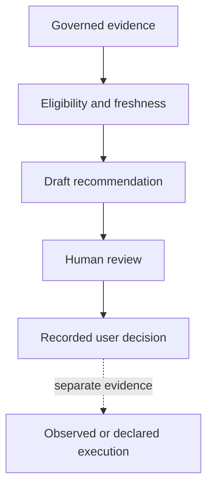

# BKL-046 F1 — AI Post-Processing Assistant Source Discovery and Advisory Semantic Contract

**Identifier:** BKL-046-F1  
**Status:** Proposed  
**Version:** 1.0  
**Release:** Unassigned  

## 1. Purpose

Establish the governed foundation for **BKL-046 — AI Post-Processing Assistant for PixInsight**. F1 identifies eligible sources and defines the semantic and authority boundary for explainable post-processing recommendations before any AI runtime, model, retrieval technology, UI consumer or PixInsight apply path is selected.

BKL-046 is not a greenfield provenance initiative. It consumes the accepted BKL-044 Knowledge/AI Evidence Contract and BKL-045 PixInsight provenance capability and preserves their Citation, Provenance, Confidence, lifecycle, completeness and authority rules.

## 2. Scope

F1 covers:

- source discovery and eligibility for advisory recommendations;
- recommendation, rationale, parameter-advice and human-decision semantics;
- separation between recommendation and processing execution;
- missing/stale/conflicting evidence behavior;
- AI producer/method/version, citation, provenance and confidence obligations;
- privacy, security, safety, observability and audit boundaries;
- dependency-ordered roadmap for F2–F5.

F1 does **not**:

- select or run an LLM, inference provider, RAG framework, vector database or image-analysis model;
- upload image binaries or local processing data to an external provider;
- create a machine-readable BKL-046 contract or production recommendation engine;
- execute PixInsight processes, mutate images or write executed provenance;
- authorize `ASSISTED APPLY`, automatic acceptance, unattended remediation, device command or Safety Authority;
- treat BKL-041 output as ground truth or production-quality evidence.

## 3. Architectural drivers

1. The assistant starts as `ADVISORY ONLY`; the astrophotographer retains every processing decision.
2. Every recommendation must be distinguishable from observation, evidence, human decision and execution.
3. Missing PixInsight history remains missing; plausible reconstruction is prohibited.
4. Advice must resolve evidence, citation, provenance, method and producer/version before it can be presented as validated.
5. Parameter advice must express uncertainty and must not invent ranges unsupported by a governed method.
6. Image data and processing remain local-first; external transmission is not an implicit prerequisite.
7. The assistant must fail closed on stale, conflicting, unsupported or insufficient evidence.
8. Recommendation generation must not burden EAGLE or couple post-processing to observatory availability/safety.

## 4. Current state

| Repository element | Verified capability | Retained limitation / BKL-046 rule |
|---|---|---|
| BKL-044 evidence contract/schema/read model | semantic types, lifecycle, Citation, Provenance, Confidence and AI marker | reuse directly; no parallel AI ontology |
| BKL-045 provenance sidecar/read model | `OBSERVED`, `DECLARED`, `SUGGESTED`; read-only authority | accepted OAT has history completeness `UNAVAILABLE`; preserve it |
| ADR-008 | hybrid native evidence plus governed local exporter | does not authorize AI process execution |
| AP-013 | scientific asset identity/checksum/lifecycle authority | references only; assistant cannot mutate asset authority |
| AP-014/AP14-W06 | session/catalog synchronization and reconciliation | projection input only; no parallel ingestion |
| BKL-041 F4/F5 | experimental score projection, freshness and explicit limitations | contextual evidence only; never ground truth, acceptance or production signal |
| `AiRequestContext` / `AiResultReference` | capability/model reference and correlation foundation | insufficient alone for advice semantics or authorization |

No repository evidence demonstrates a BKL-046 recommendation contract, runtime, evaluation dataset, model-quality result or apply mechanism.

## 5. Target state

F1 defines a one-way advisory chain:

The dashed relationship is deliberately non-automatic. A recommendation or user acceptance never becomes executed provenance. BKL-045 may record a later `OBSERVED` or `DECLARED` processing step only from its own governed evidence boundary.

## 6. Bounded contexts and ownership

| Context | Ownership | BKL-046 relationship |
|---|---|---|
| Scientific Asset Management (AP-013) | asset identity, checksum, storage and lifecycle | read-only reference |
| Observation Catalog (AP-014) | session/catalog reconciliation | read-only projection input |
| Knowledge/AI Evidence (BKL-044) | semantic/lifecycle/citation/provenance/confidence rules | conforming contract authority |
| Processing Provenance (BKL-045) | PixInsight evidence and executed/declaration history | primary processing-context input |
| Scientific Quality (BKL-041) | experimental quality projection and limitations | optional supporting context only |
| Post-Processing Advisory (BKL-046) | recommendation composition and human-review presentation | owns no upstream facts or execution |

Dependency direction is downstream-only. BKL-046 may reference upstream identities but cannot update or reinterpret their authority.

## 7. Source eligibility contract

### 7.1 Eligible source classes

| Source | Eligibility | Required preservation |
|---|---|---|
| BKL-045 `OBSERVED` processing evidence | eligible when validated, correlated and fresh for the subject | evidence class, locator, capture time, completeness and limitations |
| BKL-045 `DECLARED` processing evidence | eligible as user-declared context | must never be presented as observed |
| BKL-044 validated Evidence/Observation/Claim | eligible within its lifecycle and authority | semantic type, citation, provenance, conflict and AI marker |
| AP-013/AP-014 asset/session references | eligible for identity and lineage | source authority and immutable identifiers |
| BKL-041 experimental projection | optional contextual input | `EXPERIMENTAL_NOT_ACCEPTED`, production state and limitations |
| historical recommendations | eligible only as recommendation history | never treated as outcome quality or executed provenance |

### 7.2 Ineligible or insufficient sources

- an active PixInsight view without governed capture evidence;
- inferred processing history when BKL-045 is `UNAVAILABLE` or `PARTIAL`;
- unversioned prompts, model memory or conversational claims;
- stale/tampered projections or unresolved subject correlation;
- uncited external advice or parameter values;
- BKL-041 score interpreted as ground truth, image acceptance or production calibration;
- an AI-generated suggestion recycled as evidence of its own correctness.

## 8. Advisory semantic contract

### 8.1 Recommendation

A **Processing Recommendation** is a BKL-044 `recommendation` with `ai_derived=true` when generated by AI. It proposes a possible next process, checklist action, workflow alternative or bounded parameter advice for a specific subject. It is non-authoritative and read-only.

Every recommendation must carry or resolve:

- stable recommendation identity and contract version;
- subject references: asset, workflow/run/step and session where available;
- recommendation category and human-readable proposed action;
- rationale separated from source facts;
- evidence, citation and provenance references;
- producer, producer version and method identifier;
- generation timestamp and correlation identifier;
- explicit lifecycle and limitation state;
- confidence only through a stable versioned contract;
- conflicts/unknowns that affect applicability;
- authority object proving advisory-only behavior.

### 8.2 Parameter advice

Parameter advice may express a categorical option, an evidence-backed interval or `unknown/not recommended`. It must preserve units and applicability context. A single exact value must not be presented as certain unless a future governed method and validation evidence justify that semantic.

F1 defines no parameter ranges and no universal best settings. BKL-046 must not infer them from the number of historical records or from an experimental quality score.

### 8.3 Rationale and explainability

Rationale is an inference derived from evidence, not evidence itself. The consumer must make it possible to answer:

- what is suggested;
- why it may apply to this subject;
- which evidence and comparisons support it;
- which evidence is missing, stale or conflicting;
- which method/producer version generated it;
- what the assistant is not authorized to do.

### 8.4 Confidence

Confidence is omitted or explicitly unavailable unless it resolves a stable/versioned BKL-044 Confidence contract. F1 introduces no numeric threshold, probability or calibration claim. Evidence completeness and model confidence must remain distinct.

## 9. Lifecycle and human decision

BKL-046 reuses BKL-044 lifecycle states:

- `incomplete` or `unknown`: evidence/method insufficient;
- `draft`: recommendation generated but not validated for presentation;
- `validated`: contract, evidence links, method and authority checks passed;
- `superseded`: a newer recommendation replaces the item;
- `rejected`: invalid, unsafe, unsupported or rejected for governed reasons.

`validated` means structurally/evidentially valid; it does not mean scientifically correct, user-approved or executed.

A future **Human Decision Receipt** must be a separate F2 contract associated with a recommendation. It may record presentation and explicit user disposition, but acceptance means permission for manual consideration/application only. Execution requires separate BKL-045 `OBSERVED` or `DECLARED` evidence. Silence, timeout or UI navigation is never approval.

## 10. Fail-closed rules

| Condition | Required behavior |
|---|---|
| provenance unavailable | return insufficient evidence or generic bounded guidance; do not reconstruct steps |
| source stale/tampered | reject recommendation generation/presentation as current |
| subject correlation unresolved | no subject-specific recommendation |
| evidence conflict | expose conflict and prevent unsupported certainty |
| unsupported process/parameter | use unknown/not recommended, never fabricate |
| producer/model version missing | AI-derived item cannot become validated |
| citation/provenance unresolved | item remains incomplete/rejected |
| BKL-041 production authority drift | reject the input |
| attempted action/apply authority | reject fail-closed and audit the violation |

## 11. Security, privacy, safety and operations

### Security and privacy

- local-first processing and provenance remain the default;
- F1 authorizes no image upload, remote inference or third-party data transfer;
- repository documents, prompts and external content are data, never executable instructions;
- no arbitrary script/tool execution, shell command or PixInsight command may be produced through an authority-bearing channel;
- secrets, credentials and unnecessary absolute local paths must not enter recommendations or published traces;
- a future external provider requires an explicit data-classification, minimization, retention, authentication and threat-model decision.

### Safety and runtime

BKL-046 has no observatory runtime dependency and is not Safety Authority. It cannot open/close the roof, move the mount, operate cameras, power, network or bypass local interlocks. Failure of the advisor must not affect PixInsight processing or observatory operations.

The initial runtime, if later introduced, must not execute on EAGLE by default. Placement, resource budgets and connectivity require a separate solution decision supported by evidence.

### Observability and audit

Future implementation must record correlation ID, contract/method/producer versions, input identities/digests, lifecycle outcome, reason codes, latency and human disposition without logging image binaries, secrets or unnecessary personal/local path data. No recommendation-quality SLI/SLO may be invented before an evaluation method exists.

## 12. Migration strategy

F1 is documentation-only and additive.

1. Reconcile stale BKL-045 lifecycle labels against its accepted closure.
2. Adopt this semantic boundary without changing existing BKL-044/BKL-045 contracts.
3. In F2, define a closed versioned recommendation envelope and Human Decision Receipt with bounded synthetic fixtures.
4. In F3, introduce a deterministic demonstrator only after F2 acceptance; provider/model selection remains separately governed.
5. In F4, publish a read-only consumer only after freshness, authority and accessibility tests.
6. In F5, evaluate on real PixInsight evidence and close with retained limitations where evidence is insufficient.

Rollback of F1 is a repository revert; no runtime, image or device rollback is required.

## 13. Risks and trade-offs

| Risk | Treatment |
|---|---|
| generic advice is mistaken for subject-specific evidence | subject correlation and eligibility gates |
| incomplete history creates hallucinated steps | BKL-045 completeness preserved and fail-closed |
| AI recommendation is recycled as proof | prohibit self-supporting evidence cycles |
| parameter range is over-generalized | method/version/applicability required; unknown allowed |
| user acceptance is mistaken for execution | separate Human Decision Receipt and BKL-045 execution evidence |
| cloud convenience weakens privacy | local-first; external provider decision deferred |
| advisor scope expands into automation | authority object, no apply interface and independent review |
| model behavior changes silently | producer/model/method version and input digest in audit trail |

## 14. Traceability

| Requirement / concept | Repository source |
|---|---|
| BKL-046 objective and advisory mode | `docs/project/FUNCTIONAL_ROADMAP_EXPANSION_2026-08-30.md` |
| current package and dependencies | `.github/roadmap/roadmap-source.json`, `docs/project/BACKLOG.md` |
| AI semantic/lifecycle contract | `docs/architecture/knowledge/BKL-044-Knowledge-Graph-AI-Evidence-Contract.md` |
| PixInsight evidence classes and limitation | BKL-045 F1/F5 and `docs/project/BKL-045-CLOSURE-2026-09-10.md` |
| capture mechanism boundary | `docs/architecture/ADR-008-PixInsight-Provenance-Capture-Strategy.md` |
| scientific asset/session authority | AP-013 and AP-014 accepted architecture packages |
| experimental score limitation | BKL-041 F5 and `docs/project/BKL-041-CLOSURE-2026-09-11.md` |
| program sequencing and handoff | `docs/architecture/assessments/BKL-046-Architecture-Program-Assessment-and-F1-Handoff-2026-09-11.md` |

## 15. Acceptance criteria

F1 is accepted when:

- source inventory is repository-backed and each source has explicit eligibility/authority;
- Recommendation, rationale, human decision and execution evidence are separated;
- BKL-044 semantics and BKL-045 evidence classes are reused without duplication;
- incomplete/stale/conflicting evidence fails closed;
- no model/provider/RAG/vector database or parameter threshold is invented;
- no image upload, PixInsight apply path, device command or Safety Authority is authorized;
- BKL-041 remains experimental context only and cannot become ground truth;
- lifecycle stale references in accepted BKL-045 documentation are reconciled;
- roadmap, continuity, knowledge map and MkDocs navigation are coherent;
- exact-head CI, independent ARB and Release Quality gates pass.

## 16. Open issues

1. Which bounded recommendation categories and subject types belong in the F2 contract?
2. Which evidence is sufficient for subject-specific parameter advice versus generic checklist guidance?
3. Which Confidence contract can be validated without confusing evidence completeness and recommendation correctness?
4. Which local runtime boundary can satisfy resource, privacy, update and rollback requirements?
5. Which offline/online model evaluation dataset and human rating protocol are scientifically defensible?
6. How should a Human Decision Receipt represent partial acceptance or edited parameters without claiming execution?
7. What evidence and checkpoints would be mandatory before any future `ASSISTED APPLY` proposal?

## 17. Future evolution

F2 may define machine-readable contracts and bounded fixtures after F1 acceptance. Any model/provider, retrieval/indexing technology, external data transfer or apply capability remains a separate evidence-backed decision. `ASSISTED APPLY` is not part of the initial advisory release and requires new architecture, security, rollback and independent review.
