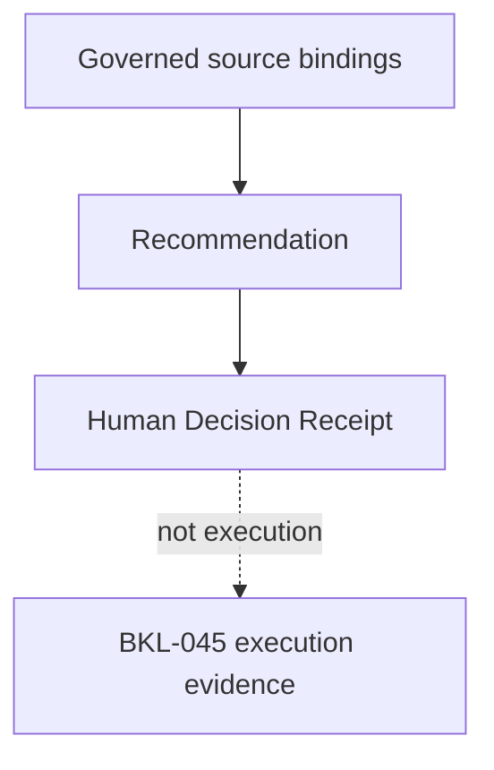

# BKL-046 F2 — Machine-Readable Recommendation and Human Decision Contracts

| Campo | Valore |
|---|---|
| Identificativo | BKL-046-F2 |
| Stato | Proposed |
| Versione | 1.0 |
| Data | 11/09/2026 |
| Package | BKL-046 — AI Post-Processing Assistant for PixInsight |
| Baseline F1 | `3f2e3edae93b009f5800a58a4ac5afc4f04e9bb7` — Accepted |
| Baseline di sviluppo | `fc4c82fdaa0cd1a3c438c9b6a0ad58ec1e54925d` |
| Authority | Repository-governed advisory contract; read-only, non-executing and non-Safety |

## 1. Purpose

Rendere eseguibili i confini semantici accettati in F1 mediante un envelope JSON chiuso e versionato per `Recommendation` e `HumanDecisionReceipt`, una fixture bounded sintetica, identità deterministiche SHA-256, un validator fail-closed e test negativi.

F2 non introduce un modello, provider, RAG/vector store, prompt runtime, image upload, recommendation engine produttivo, consumer portale o percorso di applicazione in PixInsight. Non modifica la pipeline automatica di import delle sessioni scientifiche.

## 2. Scope

F2 comprende:

- subject correlation e source binding bounded;
- recommendation lifecycle, category, rationale, provenance, citation, unknown/conflict e limitation;
- parameter advice categoriale, a intervallo bounded oppure esplicitamente non raccomandato;
- confidence esplicitamente non disponibile finché non esiste un contratto calibrato accettato;
- Human Decision Receipt separato dalla Recommendation e dall'execution evidence;
- authority read-only/advisory-only e divieti di apply/automatic acceptance;
- canonicalizzazione, digest, validator, fixture e CI dedicata.

Restano esclusi:

- inferenza AI o selezione model/provider;
- trasferimento di immagini o dati locali verso terze parti;
- generazione automatica dopo l'import di una sessione;
- esecuzione o scripting PixInsight;
- persistenza di outcome produttivi;
- device command, remediation o Safety Authority.

## 3. Artifacts

| Artefatto | Responsabilità |
|---|---|
| `docs/contracts/ai-post-processing-assistant-f2.schema.json` | JSON Schema Draft 2020-12 per envelope e tipi F2 |
| `docs/data/ai-post-processing-assistant-f2-fixture.json` | known-answer fixture bounded e interamente sintetica |
| `.github/scripts/ai-post-processing-advisory-contract.mjs` | canonicalizzazione, digest e invarianti semantici |
| `.github/scripts/verify-ai-post-processing-advisory-contract.mjs` | verifica schema, authority e fixture |
| `.github/scripts/test-ai-post-processing-advisory-contract.mjs` | test positivi, negativi, anti-escalation e anti-tampering |
| `.github/workflows/bkl-046-f2-governance.yml` | gate CI dedicato |

## 4. Architecture model



I tre record hanno ownership distinta:

| Record | Owner | Prova |
|---|---|---|
| `Recommendation` | BKL-046 Post-Processing Advisory | consiglio e relativa spiegazione |
| `HumanDecisionReceipt` | BKL-046 human-review boundary | disposizione esplicita dell'utente |
| execution evidence | BKL-045 Processing Provenance | attività realmente osservata o dichiarata |

Nessuna transizione automatica collega decisione ed esecuzione. Anche `ACCEPTED_FOR_MANUAL_APPLICATION` significa solo intenzione umana di valutare/applicare manualmente il consiglio.

## 5. Envelope and bounded fixture

Ogni artefatto dichiara:

```text
schemaVersion = 1.0
contractType = AI_POST_PROCESSING_ASSISTANT_F2_FIXTURE
identityMethod = BKL046-F2-CANONICAL-JSON-SHA256-1
fixtureMode = BOUNDED_SYNTHETIC_FIXTURE
```

Il contratto limita ogni fixture a 32 source binding, 16 recommendation e 16 receipt. L'esempio include due source binding, due recommendation e un receipt. Non contiene evidence produttiva, output di modello o immagine.

## 6. Subject and source bindings

Il subject identifica un asset, una sessione, un workflow o uno step senza sostituire AP-013, AP-014 o BKL-045. `correlationState` è `RESOLVED`, `PARTIAL` o `UNRESOLVED`; soltanto `RESOLVED` può sostenere una recommendation `validated`.

Ogni source binding conserva:

- semantic type BKL-044;
- evidence class `OBSERVED`, `DECLARED` o `SUGGESTED`;
- source authority e repository-relative locator;
- lifecycle, quality e completeness;
- citation e limitation;
- digest deterministico.

Un binding `SUGGESTED`, stale, invalid, partial o unavailable non può sostenere una recommendation `validated`.

## 7. Recommendation contract

La Recommendation espone identità, producer/version, method, correlation, subject, category, lifecycle, proposed action, rationale, source/citation/provenance refs, parameter advice, conflicts, unknowns, confidence e limitation.

Le categorie F2 sono chiuse:

- `PROCESS_ORDER`;
- `PARAMETER_RANGE`;
- `QUALITY_CHECK`;
- `WORKFLOW_ALTERNATIVE`;
- `STOP_AND_REVIEW`.

`validated` significa esclusivamente contract-valid ed evidentially eligible. Non significa correttezza scientifica, approvazione umana o esecuzione.

### 7.1 Parameter advice

| Mode | Regola |
|---|---|
| `CATEGORICAL` | valore categoriale, applicability ed evidence obbligatori; nessun bound numerico |
| `BOUNDED_INTERVAL` | lower/upper finite, ordine valido, unità, applicability ed evidence obbligatori |
| `UNKNOWN_NOT_RECOMMENDED` | parameter/value/unit/bounds null; limitation esplicita |

F2 non accetta un modo “exact value”. Un intervallo non prova che ogni valore al suo interno sia ottimo e deve rimanere legato a evidence, metodo e applicability.

### 7.2 Confidence

F2 impone:

```text
state = UNAVAILABLE_F2
contractRef = null
value = null
```

Non esiste ancora un metodo calibrato accettato per la qualità delle recommendation. Evidence completeness e confidence non sono intercambiabili.

## 8. Human Decision Receipt

Il receipt è un record distinto e referenzia una sola Recommendation. Registra presentation/decision time, actor reference, disposition, eventuali edit umani, rationale e correlation ID.

Le disposition sono:

- `ACCEPTED_FOR_MANUAL_APPLICATION`;
- `EDITED_FOR_MANUAL_APPLICATION`;
- `REJECTED`;
- `DEFERRED`.

Un edit è ammesso solo con `EDITED_FOR_MANUAL_APPLICATION` ed esprime una scelta dell'utente, non un'esecuzione. Ogni receipt impone:

```text
executionState = NOT_OBSERVED
executionEvidenceRefs = []
actionAuthority = NONE
```

Una futura esecuzione deve essere acquisita separatamente da BKL-045 come `OBSERVED` o `DECLARED` evidence.

## 9. Deterministic identity

`BKL046-F2-CANONICAL-JSON-SHA256-1` applica:

1. UTF-8;
2. chiavi object in ordine lessicografico;
3. ordine array preservato;
4. JSON compatto;
5. SHA-256 lowercase hex;
6. esclusione del campo digest dal proprio preimage.

Sono verificati `bindingDigest`, `recommendationDigest`, `receiptDigest` e `artifactDigest`. Il known-answer `SHA-256({"a":1,"b":2})` è `43258cff783fe7036d8a43033f830adfc60ec037382473548ac742b888292777`.

## 10. Fail-closed behavior

| Condizione | Esito |
|---|---|
| proprietà sconosciuta o versione/metodo sconosciuto | reject |
| digest non coerente | reject |
| source/correlation ref non risolto | reject |
| source stale, incomplete, invalid o `SUGGESTED` con lifecycle `validated` | reject |
| conflict/unknown presente con lifecycle `validated` | reject |
| confidence value priva di contratto accettato | reject |
| unknown parameter valorizzato | reject |
| intervallo invertito o senza unità/evidence | reject |
| receipt che precede la presentazione | reject |
| receipt che rivendica execution evidence | reject |
| apply/automatic acceptance/action authority | reject |
| chiavi model/provider/image/script/command | reject |

Il validator non corregge, imputa, ricostruisce o degrada silenziosamente l'input.

## 11. Authority, privacy and safety

L'envelope impone esattamente:

```text
consumerMode = READ_ONLY
advisoryOnly = true
acceptanceAuthority = HUMAN_ONLY
actionAuthority = NONE
executionAuthority = NONE
safetyAuthority = LOCAL_PHYSICAL_INTERLOCKS
pixInsightApplyAuthorized = false
automaticAcceptanceAuthorized = false
```

Nessun dato immagine, secret, credential o absolute local path appartiene al contratto. F2 non opera su EAGLE, PixInsight o apparati e non può alterare interlock, cupola, montatura, camera, power o network.

## 12. Dynamic update boundary

F2 introduce contratti e fixture statici di governance; non modifica `analyze-session-automatic.yml`, il catalogo AP-014 o i producer delle sessioni. Non esiste ancora una projection BKL-046 alimentata da sessioni reali.

Quando un futuro consumer dinamico verrà introdotto, dovrà:

1. dipendere esclusivamente dagli output canonici della pipeline di import;
2. rigenerarsi automaticamente dopo ogni sessione scientifica importata;
3. pubblicare atomicamente con catalogo e proiezioni dipendenti;
4. verificare source digest/freshness e fallire chiuso;
5. mantenere Recommendation e Human Decision Receipt separati dall'execution evidence.

Questi requisiti diventano gate obbligatori prima dell'acceptance di qualsiasi consumer F4.

## 13. Validation

Il gate dedicato esegue:

```text
node .github/scripts/verify-ai-post-processing-advisory-contract.mjs
node --test .github/scripts/test-ai-post-processing-advisory-contract.mjs
```

La suite copre fixture positiva, known-answer identity, proprietà sconosciute, tampering, source stale/`SUGGESTED`, subject correlation, conflict/unknown, confidence non governata, parameter missingness/range, authority escalation, falsa execution, correlation del receipt, edit senza dettaglio e canali model/provider vietati.

La validazione locale del proposal ha prodotto 16 test passed. L'evidence CI exact-head resta requisito di acceptance.

## 14. Compatibility, migration and rollback

- change additive e repository-only;
- nessuna modifica agli schemi BKL-044/BKL-045;
- nessuna data migration o consumer migration;
- nessun impatto su import automatico, runtime osservativo o PixInsight;
- rollback tramite revert degli artefatti F2 e dei riferimenti MkDocs/CI.

## 15. Risks and trade-offs

| Rischio | Trattamento |
|---|---|
| receipt interpretato come esecuzione | `NOT_OBSERVED`, refs vuoti e ownership BKL-045 |
| guidance generica presentata come subject-specific | correlation e eligibility fail-closed |
| missing history ricostruita | source completeness preservata e `UNKNOWN_NOT_RECOMMENDED` |
| confidence inventata | solo `UNAVAILABLE_F2` |
| parameter interval interpretato come optimum | applicability/evidence/limitation obbligatori |
| scope creep verso automazione | authority constants e forbidden keys |

## 16. Traceability

| Requirement | Repository source / implementation |
|---|---|
| F1 source, semantics and authority | `docs/architecture/scientific-assets/BKL-046-F1-AI-Post-Processing-Assistant-Source-Discovery-and-Advisory-Semantic-Contract.md` |
| F1 acceptance | `docs/project/BKL-046-F1-ACCEPTANCE-2026-09-11.md` |
| BKL-044 lifecycle/evidence semantics | `schemas/knowledge-ai-evidence-contract.schema.json` |
| BKL-045 execution-evidence ownership | `docs/contracts/pixinsight-workflow-provenance.schema.json` |
| F2 machine-readable contract | `docs/contracts/ai-post-processing-assistant-f2.schema.json` |
| bounded evidence | `docs/data/ai-post-processing-assistant-f2-fixture.json` |
| deterministic validation | `.github/scripts/ai-post-processing-advisory-contract.mjs` |
| negative tests | `.github/scripts/test-ai-post-processing-advisory-contract.mjs` |
| current roadmap | `.github/roadmap/roadmap-source.json` |

## 17. Acceptance criteria

F2 è accettabile quando:

1. schema ed envelope sono chiusi, versionati e JSON-valid;
2. Recommendation e Human Decision Receipt restano oggetti distinti;
3. source/citation/provenance refs e subject correlation falliscono chiuso;
4. `OBSERVED`, `DECLARED` e `SUGGESTED` non vengono confusi;
5. stale/partial/unavailable/conflicting evidence non abilita `validated`;
6. parameter advice non inventa valori e gli intervalli sono bounded;
7. confidence resta indisponibile senza contratto calibrato;
8. user disposition non prova esecuzione;
9. authority escalation, PixInsight apply e automatic acceptance sono rifiutati;
10. fixture bounded è esclusivamente sintetica;
11. import e proiezioni esistenti restano invariati;
12. test locali e CI exact-head sono verdi;
13. ARB non rileva Blocker/Major aperti;
14. Release Quality emette una recommendation esplicita.

## 18. Open issues

1. Quale metodo di recommendation quality e confidence calibration è scientificamente difendibile?
2. Quale runtime locale soddisfa privacy, resource budget, rollback e update policy?
3. Quale evaluation dataset separa qualità tecnica, preferenza estetica e outcome scientifico?
4. Come acquisire feedback umano senza trasformarlo implicitamente in ground truth?
5. Quali evidenze sarebbero necessarie per proporre, in una fase separata, un `ASSISTED APPLY`?

## 19. Future evolution

F3 potrà introdurre un demonstrator deterministico read-only che consumi esclusivamente fixture governate e produca recommendation conformi a questo contratto. Model/provider selection, dati reali, external transfer e qualsiasi apply path richiedono decisioni e review separate.

L'acceptance F2 non autorizza automaticamente F3 o successive capability.
