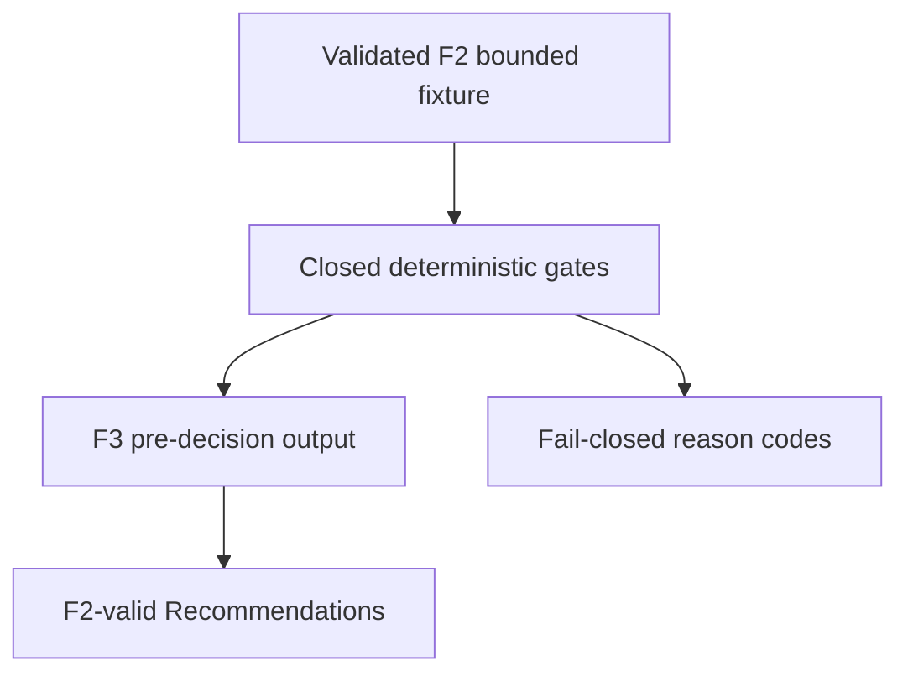

# BKL-046 F3 — Deterministic Advisory Demonstrator

| Campo | Valore |
|---|---|
| Identificativo | BKL-046-F3 |
| Stato | Proposed |
| Versione | 1.0 |
| Data | 11/09/2026 |
| Package | BKL-046 — AI Post-Processing Assistant for PixInsight |
| Baseline F2 | `b8a9025fdfc9b5254b9c79a5c37a775b4f8fd083` — Accepted |
| Baseline di sviluppo | `2d2f876cfa9deead5cc8fee556edb10ac666ecc1` |
| Authority | Deterministic, bounded, synthetic, read-only, human-only and non-Safety |

## 1. Purpose

Dimostrare che il contratto F2 può essere consumato da un componente eseguibile e produrre Recommendation conformi, ripetibili e auditabili senza introdurre inferenza AI, selezione model/provider, dati reali, confidence numerica o un percorso di applicazione in PixInsight.

F3 risolve esplicitamente `OBS-01` della review F2: l'output usa un envelope autonomo pre-decisione e riusa i tipi F2 tramite riferimenti versionati ai relativi `$defs`. Non pubblica il root envelope `AI_POST_PROCESSING_ASSISTANT_F2_FIXTURE`, che contiene anche Human Decision Receipt.

## 2. Scope

F3 comprende:

- input limitato a fixture F2 chiuse, bounded, sintetiche e validate;
- due regole deterministiche chiuse;
- output pre-decisione con Recommendation conformi a F2;
- reason code ordinati e stabili;
- identità e digest SHA-256 deterministici;
- known-answer output, validator, test e gate CI dedicato;
- fail-closed su correlation, lifecycle, quality, completeness ed evidence class.

Restano esclusi:

- sessioni scientifiche reali e relativi file immagine;
- LLM, machine learning, RAG, vector store, prompt e provider;
- recommendation di parametri numerici o presunta ottimizzazione scientifica;
- Human Decision Receipt nell'output pre-decisione;
- consumer portale e proiezione dinamica post-import;
- PixInsight apply, script, execution, remediation e device command;
- qualsiasi modifica della Safety Authority.

## 3. Architecture model



| Componente | Responsabilità | Divieto |
|---|---|---|
| F2 validator | verifica envelope, digest, source e authority prima dell'elaborazione | nessuna correzione o imputazione |
| F3 demonstrator | applica regole chiuse e costruisce output immutabile | nessun modello o side effect |
| F2 Recommendation validator | verifica ogni record generato contro le invarianti accettate | nessuna nuova semantic authority |
| F3 output validator | verifica envelope pre-decisione, reason code, authority e digest | nessun receipt o execution claim |

## 4. Contract and temporal boundary

L'envelope F3 dichiara:

```text
schemaVersion = 1.0
contractType = AI_POST_PROCESSING_ASSISTANT_F3_DEMONSTRATOR_OUTPUT
demonstratorMode = BOUNDED_SYNTHETIC_READ_ONLY
producer = DSG.DeterministicAdvisoryDemonstrator
producerVersion = 1.0.0-f3
methodId = BKL046-F3-CLOSED-RULES-1
decisionState = NOT_PRESENT_PRE_DECISION
```

Lo schema riusa dal contratto F2 `subject`, `sourceBinding`, `recommendation`, `authority` e `digest`. L'output non contiene `humanDecisionReceipts`: una decisione umana può esistere soltanto in un record F2 separato e successivo. L'esecuzione resta evidence BKL-045.

## 5. Deterministic rules

| Rule | Source authority | PASS | FAIL_CLOSED |
|---|---|---|---|
| `GOVERNANCE_READINESS` | `repository_authority` | `QUALITY_CHECK`, `validated` | `STOP_AND_REVIEW`, `incomplete` |
| `PROCESSING_HISTORY_AVAILABILITY` | `processing_evidence` | `QUALITY_CHECK`, `validated` | `STOP_AND_REVIEW`, `incomplete` |

Una regola passa soltanto se:

1. il subject ha `correlationState=RESOLVED`;
2. esiste almeno una source binding dell'authority richiesta;
3. ogni source ha lifecycle `validated`;
4. ogni source ha quality `VALID`;
5. ogni source ha completeness `COMPLETE`;
6. nessuna source è `SUGGESTED`.

I reason code possibili sono derivati meccanicamente dallo stato di input, deduplicati e ordinati. Non sono probabilità, diagnosi scientifiche o decisioni umane.

## 6. Known-answer behavior

La fixture F2 accettata produce due Recommendation:

| Rule | Esito | Reason code |
|---|---|---|
| `GOVERNANCE_READINESS` | `PASS` | nessuno |
| `PROCESSING_HISTORY_AVAILABILITY` | `FAIL_CLOSED` | `SOURCE_COMPLETENESS_UNAVAILABLE`, `SOURCE_QUALITY_UNKNOWN` |

Il secondo esito preserva la missingness BKL-045 e usa esclusivamente `UNKNOWN_NOT_RECOMMENDED`; non inventa parametri o valori.

L'output noto ha digest:

```text
a97f7ff5a394b6f714efc8a55b1b1ab6cd6c6865c9a58ea6b9ec5120e98a4070
```

## 7. Determinism, identity and audit

- `generatedAt` deriva dalla fixture e non dall'orologio di esecuzione;
- input digest, rule ID, method, subject e source refs determinano recommendation/correlation ID;
- source, reason code, evaluation e Recommendation sono ordinati stabilmente;
- ogni Recommendation è validata con il contratto F2;
- ogni output è deep-frozen e non modifica l'input;
- `artifactDigest` copre l'intero output eccetto il proprio campo.

Stesso input canonico e stessa versione producono byte-semantica, ID e digest identici.

## 8. Fail-closed behavior

| Condizione | Comportamento |
|---|---|
| fixture F2 non valida o alterata | reject prima delle regole |
| source richiesta assente | `FAIL_CLOSED` |
| correlation non risolta | tutte le regole `FAIL_CLOSED` |
| source stale, invalid, unknown, partial o unavailable | `FAIL_CLOSED` |
| source `SUGGESTED` | `FAIL_CLOSED` |
| proprietà, metodo, producer o mode sconosciuti | reject |
| output/digest alterato | reject |
| reason code incoerenti con la decisione | reject |
| receipt, model/provider o canale eseguibile | reject |

Il demonstrator non degrada silenziosamente, non completa dati mancanti e non trasforma una Recommendation incompleta in validated.

## 9. Confidence, authority, privacy and safety

F3 mantiene `OBS-02`:

```text
confidence.state = UNAVAILABLE_F2
confidence.contractRef = null
confidence.value = null
```

L'authority resta:

```text
consumerMode = READ_ONLY
advisoryOnly = true
acceptanceAuthority = HUMAN_ONLY
actionAuthority = NONE
executionAuthority = NONE
safetyAuthority = LOCAL_PHYSICAL_INTERLOCKS
pixInsightApplyAuthorized = false
automaticAcceptanceAuthorized = false
```

Nessuna immagine, URI immagine, path assoluto, secret o credential viene ammessa. Il componente non accede a EAGLE, PixInsight o apparati e non altera gli interlock fisici locali.

## 10. Dynamic update boundary

F3 è un demonstrator statico di governance: usa soltanto `docs/data/ai-post-processing-assistant-f2-fixture.json` e non modifica `analyze-session-automatic.yml`, AP-014, catalogo o proiezioni alimentate da sessioni.

Il requisito di aggiornamento automatico dopo ogni nuova sessione scientifica importata resta obbligatorio per F4. Prima dell'acceptance di un consumer dinamico, F4 dovrà dimostrare trigger post-import, input canonici reali autorizzati, rigenerazione deterministica, pubblicazione atomica, freshness/digest gate e comportamento fail-closed. L'acceptance di F3 non autorizza anticipazioni di tali capacità.

## 11. Operations, compatibility and rollback

- repository tooling eseguito solo in CI o localmente;
- nessun servizio, processo residente, rete, storage o secret aggiunto;
- modifica additiva, salvo l'export compatibile del validator F2 per una singola Recommendation;
- nessuna migrazione dati o consumer;
- rollback tramite revert degli artefatti F3 e dell'export additivo;
- nessun runbook operativo richiesto perché non esiste un runtime osservativo.

## 12. Artifacts

| Artefatto | Responsabilità |
|---|---|
| `docs/contracts/ai-post-processing-assistant-f3.schema.json` | envelope pre-decisione chiuso con `$ref` ai tipi F2 |
| `docs/data/ai-post-processing-assistant-f3-output.json` | known-answer output sintetico |
| `.github/scripts/ai-post-processing-advisory-demonstrator.mjs` | regole, identity, generazione e validazione F3 |
| `.github/scripts/verify-ai-post-processing-advisory-demonstrator.mjs` | verifica schema reuse e known answer |
| `.github/scripts/test-ai-post-processing-advisory-demonstrator.mjs` | test determinismo, fail-closed, anti-tampering e authority |
| `.github/workflows/bkl-046-f3-governance.yml` | gate CI dedicato |

## 13. Validation

Il gate esegue:

```text
node .github/scripts/verify-ai-post-processing-advisory-demonstrator.mjs
node --test .github/scripts/test-ai-post-processing-advisory-demonstrator.mjs
```

La validazione locale del proposal comprende 16/16 test F2 e 21/21 test F3. L'evidence CI exact-head, la review ARB indipendente e il gate Release Quality restano requisiti di acceptance.

## 14. Risks and trade-offs

| Rischio | Trattamento |
|---|---|
| output F3 interpretato come runtime produttivo | mode sintetica, limitation e nessun consumer |
| envelope F2 fixture usato come runtime | envelope F3 separato pre-decisione |
| regola deterministica scambiata per AI | `aiDerived=false`, producer/method chiusi |
| missing history ricostruita | reason code e `UNKNOWN_NOT_RECOMMENDED` |
| confidence inventata | value e contractRef null |
| recommendation scambiata per decisione/esecuzione | decision state esplicito, receipt vietato, authority NONE |

## 15. Traceability

| Requirement | Repository source / implementation |
|---|---|
| F2 accepted baseline | `docs/project/BKL-046-F2-ACCEPTANCE-2026-09-11.md` |
| OBS-01/OBS-02 | `docs/architecture/reviews/ARB-BKL-046-F2-Independent-Review-2026-09-11.md` |
| F2 schema and Recommendation | `docs/contracts/ai-post-processing-assistant-f2.schema.json` |
| F2 validator reuse | `.github/scripts/ai-post-processing-advisory-contract.mjs` |
| F3 output schema | `docs/contracts/ai-post-processing-assistant-f3.schema.json` |
| F3 known answer | `docs/data/ai-post-processing-assistant-f3-output.json` |
| implementation and tests | `.github/scripts/ai-post-processing-advisory-demonstrator.mjs`, `.github/scripts/test-ai-post-processing-advisory-demonstrator.mjs` |
| current roadmap | `.github/roadmap/roadmap-source.json` |

## 16. Acceptance criteria

F3 è accettabile quando:

1. l'input F2 viene validato prima di ogni regola;
2. l'envelope F3 è autonomo e pre-decisione;
3. i tipi F2 sono riusati tramite `$ref` e validator;
4. le due regole e i reason code sono chiusi, deterministici e auditabili;
5. ogni Recommendation generata è F2-valid;
6. missingness, stale state, suggestion e correlation non risolta falliscono chiuso;
7. known answer, idempotenza, immutabilità e anti-tampering sono verificati;
8. confidence resta non numerica;
9. model/provider, receipt, apply ed execution channel sono assenti o rifiutati;
10. authority e Safety boundary restano invariati;
11. pipeline di import e pagine dinamiche restano invariate;
12. test locali e CI exact-head sono verdi;
13. ARB non rileva Blocker/Major aperti;
14. Release Quality emette una recommendation esplicita.

## 17. Open issues

1. Quali output canonici reali e policy di freshness potranno alimentare F4?
2. Come rappresentare una projection pre-decisione senza duplicare i contratti F2?
3. Quale UX deve distinguere recommendation validated, fail-closed e decisione umana?
4. Quale evaluation separata potrà giustificare una futura recommendation quality o confidence?

## 18. Future evolution

F4 potrà introdurre un consumer read-only e una projection aggiornata automaticamente dopo ogni import, solo dopo architecture package e review dedicati. Model/provider, trasferimento immagini e Assisted Apply restano incrementi separati e non sono autorizzati da F3.
