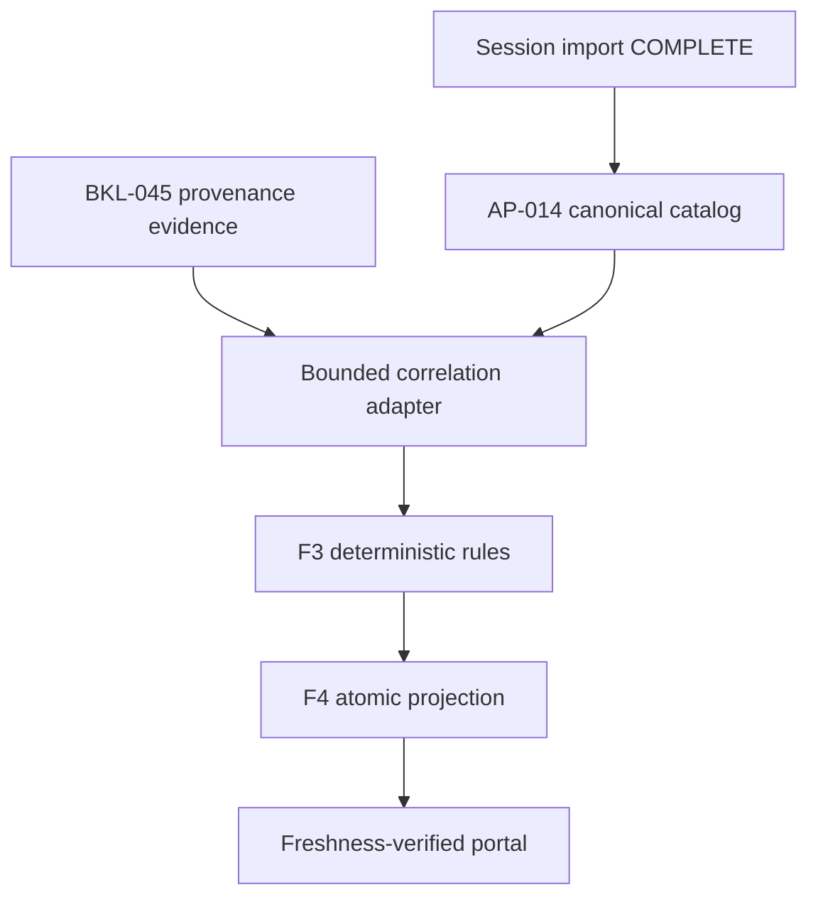

# BKL-046 F4 — Session/Provenance-Driven Read-Only Consumer

| Campo | Valore |
|---|---|
| Identificativo | BKL-046-F4 |
| Stato | CLOSED / ACCEPTED / POST-MERGE VERIFIED |
| Versione | 1.6 |
| Data | 12/09/2026 |
| Package | BKL-046 — AI Post-Processing Assistant for PixInsight |
| Baseline F3 | PR #169, merge `8339aecf0b6b7fa19396561b20253c0411fd7ee7` — Accepted |
| Baseline F4-A | PR #173, merge `439bd0d53e38a18286e6baa1e330482f280e278f` |
| Baseline F4-B | PR #174, merge `a7db5c95f413282109174d7d8662a57c4ed9590c` |
| Technical implementation head | `b2f8543d0a7fd3e354c40d9acb0206ef7e6edea4` |
| Review publication head | `ae1b8f2ae04fc9c4891e794bc930ec0e09fcf640` |
| Accepted merge / repository baseline | `af48cc2441cf956d88c13c81845fc2a2f7c599f2` |
| Acceptance record | `docs/project/BKL-046-F4-ACCEPTANCE-2026-09-12.md` |
| Authority | Session/provenance-driven, deterministic, read-only, human-only and non-Safety |

## 1. Purpose

Definire la soluzione implementabile che porta il demonstrator F3 dalle fixture sintetiche a una projection persistita e a un consumer portale alimentati da sessioni e provenance PixInsight reali già governate. F4 deve aggiornarsi automaticamente dopo ogni nuova sessione scientifica importata, pubblicare atomicamente i derivati e rifiutare come correnti dati stale, alterati, ambigui o non correlabili.

F4 non introduce inferenza AI, qualità scientifica calibrata o ottimizzazione automatica. Espone soltanto gli esiti deterministici delle regole F3 e le relative limitation, citation e source state.

## 2. Scope

F4 comprende:

- population session-driven dal catalogo canonico AP-014;
- discovery bounded della provenance BKL-045 repository-governed;
- correlazione esatta e fail-closed fra sessione, sidecar e processing projection;
- adapter real-input verso il contratto F3 pre-decisione;
- projection full-catalog deterministica, versionata e digest-protected;
- consumer portale accessibile, read-only e freshness-verified;
- integrazione nel workflow automatico post-import e nel suo retry path;
- test positivi, negativi, idempotenza, anti-tampering e gate CI dedicato.

Restano esclusi:

- LLM, machine learning, prompt runtime, RAG, vector store o selezione provider;
- upload, copia o lettura dei file immagine;
- suggestion di parametri numerici o claim di ottimizzazione scientifica;
- Human Decision Receipt generato automaticamente;
- PixInsight apply, script execution, image mutation o remediation;
- device command, modifica del runtime osservativo o Safety Authority;
- calibrazione, confidence numerica, production readiness e closure F5.

## 3. Architectural drivers

| Driver | Conseguenza architetturale |
|---|---|
| Aggiornamento dopo ogni import | un solo orchestratore canonico; generator inserito sia nel primo passaggio sia nel retry `regenerate()` |
| Atomicità | projection F4 nello stesso commit governato del catalogo e degli altri derivati |
| Missingness reale BKL-045 | `UNAVAILABLE`/`PARTIAL` restano espliciti e producono esiti F3 fail-closed |
| No stale data | catalog digest, source-set digest, session identity e projection digest verificati prima del rendering |
| Authority separata | AP-013 governa asset/provenance; AP-014 governa catalogo/reconciliation; BKL-046 è solo advisory projection |
| UX verificabile | stato, rationale, limitation e source citation visibili insieme; nessun controllo mutativo |
| Rollback sicuro | artefatti additivi; rimozione di consumer e generator senza migrare catalogo o provenance |

## 4. Current state

- F2 definisce Recommendation e Human Decision Receipt come contratti separati.
- F3 genera deterministicamente due Recommendation su una fixture bounded e sintetica.
- `docs/data/scientific-session-catalog.json` è il catalogo canonico pubblicato delle sessioni.
- `.github/workflows/analyze-session-automatic.yml` rigenera i derivati dopo un nuovo `data/sessions/**/manifest.json` e ripete l'intera generazione dopo ogni riallineamento a `main`.
- BKL-045 espone sidecar reali e `buildPixInsightProvenanceReadModel`, preservando evidence class e completeness senza inferenza.
- l'evidence reale BKL-045 accettata ha processing history `UNAVAILABLE` e zero step osservati o dichiarati.
- F4-A ha introdotto schema source-mapped, allowlist eseguibile, correlation adapter, negative tests e gate dedicato tramite PR #173.
- F4-B ha integrato projection persistita, generator atomico e aggiornamento automatico post-import tramite PR #174;
- F4-C è integrata tramite PR #175 e merge `af48cc2441cf956d88c13c81845fc2a2f7c599f2`; validator browser, pagina read-only, stati fail-closed e test accessibility/freshness sono verificati. Le review ARB/RQ sono AI-assistite, owner-authorized e non equivalenti ad approvazioni umane indipendenti. La deroga una tantum `W-BKL046-F4-001`, limitata alla branch protection della PR #175, è consumata e scaduta.

## 5. Target state and solution model



| Layer | Componente proposto | Responsabilità |
|---|---|---|
| External evidence | catalogo AP-014 e sidecar/read model BKL-045 | fatti e provenance già governati |
| Infrastructure adapter | F4 source discovery/correlation | discovery bounded, canonicalizzazione e exact-match |
| Application | projection generator | orchestration full-catalog, ordinamento, idempotenza e pubblicazione |
| Domain policy | regole F3 accettate | valutazioni chiuse senza side effect o nuova authority |
| Contract | schema/projection F4 | envelope persistito, identity snapshot, limitation e digest |
| Presentation | core validator e pagina portale | verifica client-side e rendering accessibile fail-closed |

Il Domain policy non dipende da browser, filesystem, workflow o GitHub. Gli adapter trasformano input governati nei tipi F2/F3 senza alterare source evidence o completare campi mancanti.

## 6. Source authority and eligibility

### 6.1 Session population

`docs/data/scientific-session-catalog.json` determina l'intera popolazione F4. Ogni record della projection deve corrispondere a un solo `sessionId` del catalogo; nessuna sessione può essere aggiunta da pathname, nome target o provenance non riconciliata.

### 6.2 PixInsight provenance

Sono eleggibili soltanto sidecar BKL-045 che:

1. hanno schema e authority supportati;
2. sono validabili dal contratto BKL-045;
3. mantengono `actionAuthority=NONE`;
4. hanno un `observationContext.sessionId` esatto;
5. se associati a una processing projection AP-014, superano la correlazione già governata e hanno `acceptanceAuthority=false`.

La discovery usa un pattern repository-relative chiuso e restituisce path ordinati. Non accede a directory locali PixInsight, EAGLE, OneDrive o file immagine.

### 6.3 Correlation rules

| Condizione | Stato F4 |
|---|---|
| una sola provenance eleggibile correlata esattamente | `PROVENANCE_MATCHED` |
| nessuna provenance correlata | `PROVENANCE_UNAVAILABLE` |
| più candidate per la stessa identità senza regola canonica | `CORRELATION_AMBIGUOUS` |
| sidecar/projection discordanti | `CORRELATION_INVALID` |
| evidence stale, alterata o con authority non ammessa | reject / `SOURCE_INVALID` |

Target name, data, directory e similarità testuale non autorizzano correlazioni implicite. Un record senza provenance resta pubblicabile soltanto come fail-closed, mai come recommendation validated.

## 7. F4 projection contract

Artefatti previsti per l'implementazione:

| Artefatto | Responsabilità |
|---|---|
| `docs/contracts/ai-post-processing-assistant-f4.schema.json` | schema chiuso della projection full-catalog |
| `.github/scripts/ai-post-processing-advisory-projection.mjs` | discovery, correlation, mapping e builder deterministico |
| `.github/scripts/generate-ai-post-processing-advisory-projection.mjs` | comandi `--write`, `--check`, `--print` |
| `docs/data/ai-post-processing-advisory-projection.json` | projection persistita e pubblicata |
| `docs/javascripts/ai-post-processing-assistant-core.mjs` | contract, authority, freshness e digest validation |
| `docs/javascripts/ai-post-processing-assistant.js` | consumer UI senza capability mutative |
| `docs/ai-post-processing-assistant/index.md` | pagina portale F4 |
| `.github/scripts/verify-ai-post-processing-advisory-projection.mjs` | drift, workflow e persisted-projection verification |
| `.github/scripts/test-ai-post-processing-advisory-projection.mjs` | determinismo, correlation, missingness e anti-tampering |
| `.github/scripts/test-ai-post-processing-assistant-consumer.mjs` | freshness, authority e browser failure paths |
| `.github/workflows/bkl-046-f4-governance.yml` | gate F4 e regressioni F2/F3 |

L'envelope deve contenere almeno:

- `schemaVersion`, `projectionType`, `projectionState`, `projectionId` e `generatedAt`;
- snapshot del catalogo con path, digest, session count e session ID ordinati;
- snapshot delle source di provenance con path e digest ordinati;
- method/producer/version F3 riusati senza ridefinizione;
- un record per ogni sessione, ordinato per `sessionId`;
- Recommendation F2-valid, source/correlation state, citation e limitation;
- summary esclusivamente descrittiva per stato, senza ranking o quality score;
- authority chiusa e `projectionDigest` SHA-256 canonico.

`generatedAt` è metadata di pubblicazione e non può influenzare regole, Recommendation ID o classificazione. In modalità `--check` viene riusato il timestamp persistito; una scrittura non avviene quando l'unica differenza sarebbe il clock.

### 7.1 F4-A implementation decision

F4-A implementa il contratto intermedio `SOURCE_MAPPED_PRE_ADVISORY`, non persistito dal workflow di import e non consumato dal browser. Questa separazione è intenzionale: il demonstrator F3 accettato è bounded e sintetico, quindi non viene presentato come motore già autorizzato per input operativi reali. F4-B completerà l'adapter delle regole, la projection finale persistita e l'integrazione atomica post-import.

Artefatti F4-A implementati:

- schema chiuso `docs/contracts/ai-post-processing-assistant-f4.schema.json`;
- allowlist e validator build-time in `.github/scripts/ai-post-processing-advisory-projection.mjs`;
- correlation/source-mapping builder deterministico con record digest e projection digest;
- test negativi e gate `.github/workflows/bkl-046-f4-governance.yml`.

L'allowlist eseguibile ammette esclusivamente path repository-relative nella directory evidence BKL-045, con filename `BKL-045-F3B-PXP-<UTC timestamp>-<bounded suffix>.json`. Path assoluti, backslash, traversal, file estranei, duplicati di path e duplicati di `sidecarId` vengono rifiutati. Il catalogo determina comunque l'intera popolazione; sidecar non correlati non creano sessioni F4.

Per la privacy è adottata la strategia **raw validation at build time + sanitized public snapshot**. Il raw sidecar può contenere campi operativi necessari alla source evidence, ma la projection espone soltanto path repository-relative, digest, identità sidecar/session/workflow, timestamp, target, completeness e limitation. `hostId`, `workspaceId`, path locali, payload immagine e secret non entrano nel contratto pubblico. In F4-C il browser verificherà catalog digest, source-set digest e projection digest senza scaricare i raw sidecar.

F4-A non genera Recommendation: ogni record dichiara `recommendationState=NOT_GENERATED_F4A`; missingness, ambiguità e mismatch producono `FAIL_CLOSED`. Questo evita di attribuire al runtime F3 sintetico una capability reale non ancora implementata e mantiene F4-B come gate esplicito prima della pubblicazione dinamica.

### 7.2 F4-B implementation

F4-B completa la projection persistita senza introdurre un secondo rule set. Il modulo F3 espone ora `buildDeterministicAdvisoryRecords`, utilizzato sia dal demonstrator sintetico accettato sia dal builder session-driven. Il known answer F3 rimane byte-semantically invariato e la relativa suite di regressione resta obbligatoria.

Artefatti F4-B:

- projection finale schema `1.1`, stato `PRE_DECISION_READ_ONLY` e method `BKL046-F3-CLOSED-RULES-1`;
- generator `.github/scripts/generate-ai-post-processing-advisory-projection.mjs` con `--write`, `--check` e `--print`;
- verifier `.github/scripts/verify-ai-post-processing-advisory-projection.mjs` per persisted drift, first path, retry path e `governed_paths`;
- projection versionata `docs/data/ai-post-processing-advisory-projection.json`;
- integrazione nello stesso orchestration/commit delle altre projection scientifiche.

La baseline reale al momento dell'implementazione contiene 15 sessioni nel catalogo e due sidecar BKL-045 non correlabili esattamente: la projection misura quindi 15 record, zero provenance match, due source non correlate e 15 gate `PROCESSING_HISTORY_AVAILABILITY=FAIL_CLOSED`. Questo è un risultato valido e atteso, non un errore di popolamento: nessuna sessione viene soppressa e nessuna provenance viene associata tramite target, data o similarità.

In modalità `--write`, il generator non riscrive il file quando cambia soltanto il clock. In modalità `--check`, riusa `generatedAt` persistito e richiede uguaglianza completa. Il workflow invoca `--write`, `--check` e il verifier sia nel primo percorso sia dentro `regenerate()` dopo `git reset --hard origin/main`; la projection è inclusa in `governed_paths` e viene quindi pubblicata atomicamente con il catalogo aggiornato.

### 7.3 F4-C implementation

F4-C completa il consumer portale senza modificare il contratto persistito F4-B. La delivery introduce:

- `docs/javascripts/ai-post-processing-assistant-core.mjs`, validator browser indipendente dalla UI;
- `docs/javascripts/ai-post-processing-assistant.js`, rendering idempotente compatibile con Instant Navigation;
- `docs/styles/ai-post-processing-assistant.css`, layout responsive, focus visibile, stati non affidati al solo colore e reduced-motion;
- `docs/ai-post-processing-assistant/index.md`, pagina read-only con summary, ricerca, filtri, rationale, reason code, citation e limitation;
- `.github/scripts/test-ai-post-processing-assistant-consumer.mjs`, test su persisted projection reale, freshness, tampering, authority, Web Crypto e accessibilità statica.

Il browser scarica catalogo e projection con `cache: no-store`; valida contratto chiuso, authority, catalog digest, insieme delle sessioni, source-set digest, projection identity, binding/recommendation/record digest, summary e projection digest. I raw sidecar BKL-045 non vengono scaricati: la verifica client-side resta limitata allo snapshot pubblico sanitizzato e digest-protected scelto per ARB-F4-C02.

Qualunque errore produce uno stato `VERIFICA FALLITA · FAIL-CLOSED` senza riuso permissivo di dati precedenti. Il consumer non contiene controlli Apply, Execute o automatic acceptance e non introduce endpoint, token, upload, image data, runtime AI o device command.

## 8. Deterministic mapping to F3

Per ogni sessione, l'adapter costruisce un input pre-decisione con:

- subject derivato dall'identità canonica del catalogo;
- `repository_authority` derivata soltanto dal catalogo validato;
- `processing_evidence` derivata soltanto dal read model BKL-045 correlato;
- lifecycle, quality, completeness, citations e limitations preservati;
- confidence invariata a `UNAVAILABLE_F2`;
- authority F2/F3 invariata.

L'assenza di processing history non sopprime la sessione: `PROCESSING_HISTORY_AVAILABILITY` deve produrre `FAIL_CLOSED` con reason code deterministici. Nessuna regola può dedurre processi PixInsight dal target, dagli output immagine o da pattern statistici.

## 9. Automatic post-import publication

F4 estende l'orchestratore esistente senza crearne uno parallelo:

1. il trigger corrente rileva un nuovo manifest di sessione;
2. catalogo e source governate vengono rigenerati/validati;
3. il generator F4 esegue `--write` e poi `--check`;
4. test F4 e regressioni F2/F3 bloccano la pubblicazione in caso di errore;
5. `docs/data/ai-post-processing-advisory-projection.json` entra in `governed_paths`;
6. la stessa sequenza è presente nella funzione di retry `regenerate()` dopo il reset su `origin/main`;
7. catalogo, projection F4 e altri derivati vengono committati e pushati atomicamente;
8. Pages viene richiesto soltanto dopo il push riuscito.

Una modifica alla provenance BKL-045 deve includere la projection riallineata nella stessa PR oppure fallire il gate `--check`; non è ammesso un merge che lasci il consumer stale.

## 10. Freshness and fail-closed contract

Prima del rendering, il browser scarica catalogo e projection con `cache: no-store` e verifica:

- schema, lifecycle, producer/method e authority supportati;
- SHA-256 del catalogo corrente contro lo snapshot F4;
- session count e insieme ordinato degli ID;
- digest di ogni source di provenance referenziata;
- digest dell'intera projection;
- corrispondenza uno-a-uno dei record alle sessioni;
- assenza di proprietà o stati sconosciuti.

| Failure | UX obbligatoria |
|---|---|
| catalogo più recente della projection | banner `DATI NON ALLINEATI`, nessuna Recommendation mostrata come corrente |
| projection o source digest alterato | stato `VERIFICA FALLITA`, dettagli tecnici non sensibili |
| Web Crypto non disponibile | consumer non disponibile, nessun fallback permissivo |
| schema/versione non supportati | aggiornamento richiesto, dati non renderizzati |
| correlation missing/ambiguous | record visibile come incompleto con rationale; nessun claim validato |
| fetch parziale o errore rete | stato vuoto esplicito, nessun riuso di cache precedente come corrente |

## 11. Portal UX and accessibility

La pagina F4 distingue chiaramente:

- **Projection verified**: digest e session set coerenti;
- **Recommendation validated**: sola validità contrattuale, non qualità scientifica;
- **Fail-closed / incomplete evidence**: source mancante, incompleta o non correlabile;
- **Human decision not present**: nessuna decisione implicita;
- **Execution not evidenced**: Recommendation e decisione non provano una lavorazione PixInsight.

Il consumer implementa summary descrittiva, ricerca per sessione/target, filtri per source/correlation state, elenco ordinabile senza ranking predefinito e dettaglio con rationale, reason code, citation, provenance e limitation. Stati e azioni non dipendono dal solo colore; focus, tastiera, live region e reduced motion rispettano il design system. Non sono presenti pulsanti Apply, Accept automatically, Execute o comandi verso PixInsight.

## 12. Security, privacy and safety

- solo JSON e riferimenti già destinati alla pubblicazione documentale;
- nessuna immagine, URI locale, hostname, credential, secret o prompt esterno;
- path source sempre repository-relative e allowlisted;
- proprietà inattese, path assoluti e traversal vengono rifiutati;
- nessun endpoint mutativo, token browser o upload;
- nessuna dipendenza di controllo da PixInsight, EAGLE, N.I.N.A., ASCOM, PLC o cupola;
- interlock fisici locali restano l'unica Safety Authority.

Authority invariata:

```text
consumerMode = READ_ONLY
advisoryOnly = true
acceptanceAuthority = HUMAN_ONLY
actionAuthority = NONE
executionAuthority = NONE
safetyAuthority = LOCAL_PHYSICAL_INTERLOCKS
pixInsightApplyAuthorized = false
automaticAcceptanceAuthorized = false
```

## 13. Observability and operations

Il workflow deve esporre conteggi per sessioni totali, provenance matched/unavailable/ambiguous/invalid e Recommendation PASS/FAIL_CLOSED, oltre a errori di validation e drift. I log non devono contenere dati immagine, payload completi non necessari o path locali.

Non sono introdotti servizi residenti, database, scheduler, secret o runbook hardware. La diagnosi avviene tramite gate CI, reason code persistiti e stato fail-closed del consumer.

## 14. Migration and rollback

La migrazione è additiva:

1. contratto e source adapter;
2. generator/projection e test;
3. integrazione post-import atomica;
4. consumer e navigazione;
5. ARB/RQ, exact-head CI, merge e verifica post-merge.

Il rollback rimuove artefatti F4 e le chiamate aggiunte al workflow. Catalogo AP-014, provenance BKL-045 e contratti F2/F3 restano invariati; non è richiesta migrazione dati o modifica runtime.

## 15. Delivery slices

| Slice | Output | Exit gate |
|---|---|---|
| F4-A — source and projection contract | schema, discovery/correlation adapter, builder e negative tests | Implemented — PR #173 |
| F4-B — automatic atomic publication | generator persistito, workflow first/retry path e governed path | Integrated — PR #174; exact-head e post-merge CI successful |
| F4-C — portal consumer and readiness | core browser validator, pagina, accessibility tests e governance workflow | Accepted — PR #175; merge e post-merge/Pages verified |

Le slice sono incrementi interni di delivery. Con l'acceptance completa di F4, F5 può iniziare esclusivamente come real-evidence evaluation e capability-closure design.

## 16. Quality and validation plan

| Gate | Evidenza richiesta |
|---|---|
| Architecture | boundary AP-013/AP-014/BKL-045/BKL-046 e dependency direction verificati |
| Contract | schema chiuso, validator, unknown-property e authority-escalation tests |
| Determinism | output byte-semantico, ID, ordering e digest stabili |
| Source correlation | exact match, missing, duplicate, mismatch e tamper tests |
| Dynamic update | workflow contiene `--write`, `--check`, test e output in entrambi i generation path |
| Atomicity | projection inclusa nei `governed_paths`; retry rigenera dopo reset |
| Consumer | no-store, SHA-256, stale/session-set/digest failure e empty-state tests |
| Accessibility | tastiera, focus, semantic labels, non-color status e reduced motion |
| Regression | suite F2 e F3 integralmente verdi |
| Documentation | MkDocs strict, link/navigation e Mermaid verificati |
| Security/safety | path/secret/image rejection; authority e interlock invariati |
| Release | ARB/RQ, exact-head CI, protected merge oppure owner-authorized one-time waiver con expected-head control, post-merge workflows e Pages |

## 17. Risks and trade-offs

| ID | Rischio | Trattamento |
|---|---|---|
| F4-R01 | molte sessioni senza provenance PixInsight | record espliciti `PROVENANCE_UNAVAILABLE`; nessuna soppressione o inferenza |
| F4-R02 | OAT BKL-045 non correlabile al catalogo scientifico | mantiene evidence separata; nessun fuzzy match |
| F4-R03 | doppio generator path nel workflow diverge | verifier statico e test obbligatori su first/retry path |
| F4-R04 | Recommendation validata interpretata come scientificamente corretta | label e limitation obbligatorie; nessuna confidence numerica |
| F4-R05 | merge provenance senza projection aggiornata | gate `--check` fail-closed sulla stessa PR |
| F4-R06 | consumer mostra cache stale | `no-store`, digest chain e hard failure |
| F4-R07 | crescita lineare delle source | discovery e ordinamento O(n); nessun database introdotto prima di evidence di scala |
| F4-R08 | merge senza branch protection server-side | waiver `W-BKL046-F4-001` applicata soltanto alla PR #175 con exact-head CI ed expected-head merge; consumata e scaduta al merge |

Non è richiesta una nuova ADR: F4 applica ADR-008, i contratti F2/F3 e il pattern di projection atomica già accettato in BKL-041 F4. Una ADR diventa necessaria solo se l'implementazione richiede un nuovo store, un servizio runtime, una correlation strategy non esatta o una modifica al capture mechanism PixInsight.

## 18. Traceability

| Requisito | Source |
|---|---|
| F3 accepted baseline | `docs/project/BKL-046-F3-ACCEPTANCE-2026-09-11.md` |
| Recommendation/Human Decision semantics | BKL-046 F1/F2 |
| deterministic rule behavior | `docs/architecture/scientific-assets/BKL-046-F3-Deterministic-Advisory-Demonstrator.md` |
| PixInsight provenance semantics | BKL-045 F1/F5 e `docs/project/BKL-045-CLOSURE-2026-09-10.md` |
| capture strategy | `docs/architecture/ADR-008-PixInsight-Provenance-Capture-Strategy.md` |
| session/catalog authority | AP-013, AP-014 e `docs/data/scientific-session-catalog.json` |
| automatic import boundary | `.github/workflows/analyze-session-automatic.yml` |
| atomic projection reference pattern | `docs/architecture/scientific-assets/BKL-041-F4-Session-Driven-Projection-and-Portal-Consumer.md` |
| roadmap authority | `.github/roadmap/roadmap-source.json` |
| F4-C AI-assisted ARB | `docs/architecture/reviews/ARB-BKL-046-F4C-AI-Assisted-Implementation-Review-2026-09-12.md` |
| F4-C AI-assisted Release Quality | `docs/architecture/reviews/RQ-BKL-046-F4C-AI-Assisted-Release-Quality-Review-2026-09-12.md` |
| one-time branch protection waiver | `W-BKL046-F4-001`, owner-authorized 12/09/2026, PR #175 only; consumed and expired |
| F4 acceptance | `docs/project/BKL-046-F4-ACCEPTANCE-2026-09-12.md` |
| F5 architecture | `docs/architecture/scientific-assets/BKL-046-F5-Real-Evidence-Evaluation-and-Capability-Closure.md` |

## 19. Acceptance criteria

F4 è accettabile soltanto quando:

1. ogni catalog session ha esattamente un record F4;
2. le source BKL-045 sono scoperte mediante pattern chiuso, validate e ordinate;
3. la correlazione è exact-match e missing/ambiguous/invalid falliscono chiuso;
4. Recommendation e reason code sono prodotti esclusivamente dalle regole F3 accettate;
5. F2/F3 authority, confidence e decision boundary restano invariati;
6. projection, source snapshot e digest sono deterministici e anti-tampering;
7. il consumer verifica catalogo, session set, source digest e projection digest prima del rendering;
8. dati stale non sono presentati come correnti;
9. il workflow post-import rigenera e verifica F4 sia nel first path sia nel retry path;
10. projection e catalogo sono pubblicati nello stesso commit governato;
11. ogni modifica di provenance non può essere integrata con projection drift;
12. UX, accessibility ed empty/failure states sono testati;
13. nessun image data, path locale, secret, model/provider, apply o automatic acceptance è introdotto;
14. Safety Authority e runtime osservativo restano invariati;
15. test F2/F3/F4, MkDocs e exact-head CI sono verdi;
16. ARB e Release Quality documentano review scope e modalità senza claim non verificati;
17. merge protetto oppure deroga una tantum owner-authorized con CI exact-head ed `expected_head_sha`; workflow post-merge e Pages risultano verificati.

## 20. Open issues

1. La baseline reale contiene 15 sessioni e zero sidecar BKL-045 correlabili esattamente; il consumer espone il risultato come `PROVENANCE_UNAVAILABLE` senza inferire collegamenti.
2. La completezza della processing history resta limitata da ADR-008 e dall'OAT BKL-045; F4 non può migliorarla semanticamente.
3. F5 deve ancora definire cohort, evaluation criteria e retained limitations per la valutazione su evidence reale; l'acceptance F4 non prova sufficienza scientifica né capability closure.

## 21. Future evolution

F5 è promosso come prossimo incremento di architettura/design; il package proposto è `docs/architecture/scientific-assets/BKL-046-F5-Real-Evidence-Evaluation-and-Capability-Closure.md` e separa closure tecnica, scientific effectiveness, human evidence e production readiness. Qualsiasi model/provider, confidence scientifica, image transfer o modalità Assisted Apply resta separata, richiede nuovi driver, evidence, security/privacy assessment e decisione architetturale dedicata.

## 22. Accepted outcome

F4 è CLOSED / ACCEPTED / POST-MERGE VERIFIED tramite PR #175 e merge `af48cc2441cf956d88c13c81845fc2a2f7c599f2`. Sul technical head sono passati 24/24 test projection, 11/11 test consumer, 16/16 regressioni F2 e 21/21 regressioni F3. Sul merge accettato sono risultati `SUCCESS` Deploy Pages #776 (`34664520952`), BKL-041 F4 Governance #39 (`34664520962`), BKL-046 F4 governance #9 (`34664520958`), Validate documentation #969 (`34664520964`), Genera manuale Word #1394 (`34664520981`) e Developer Foundation #1333 (`34664520999`).

La Pages live verifica 15 sessioni, 0 provenance matched, 15 provenance unavailable e 15 processing-history fail-closed; ricerca, filtri e navigazione al dettaglio sessione risultano operativi senza errori applicativi o overflow orizzontale. Questo outcome accetta il consumer deterministico read-only e le limitation osservate: non autorizza quality/confidence scientifica, model/provider, decisione automatica, execution o apply authority.
