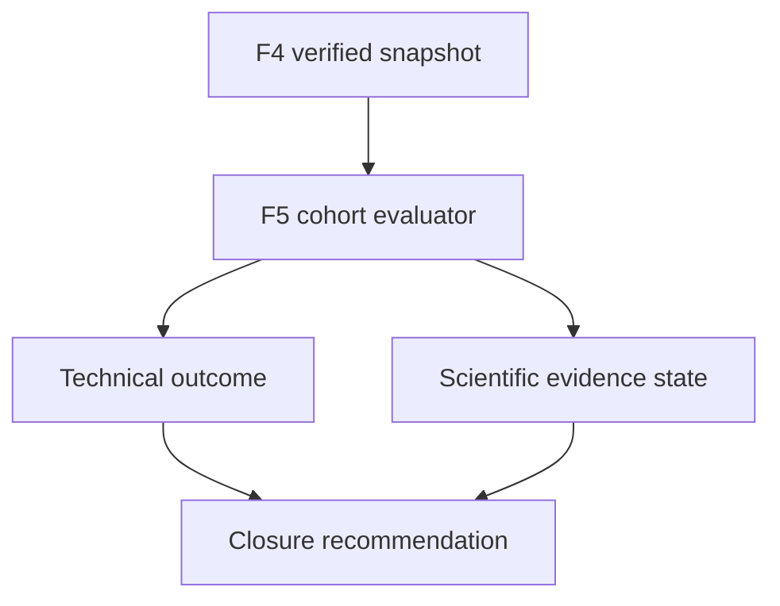

# BKL-046 F5 — Real-Evidence Evaluation and Capability Closure

| Campo | Valore |
|---|---|
| Identificativo | BKL-046-F5 |
| Stato | Architecture integrated; F5-A implementation candidate; F5-B/F5-C not started |
| Versione | 0.2 |
| Data | 12/09/2026 |
| Package | BKL-046 — AI Post-Processing Assistant for PixInsight |
| Baseline F4 | PR #175, merge `af48cc2441cf956d88c13c81845fc2a2f7c599f2` — Accepted |
| Baseline F5 architecture | PR #177, merge `16e0f101fda50e375bff6d5e9c8ec90d2083bc12` — integrated |
| Repository baseline | `16e0f101fda50e375bff6d5e9c8ec90d2083bc12` |
| Release impact | F5-A additive evaluation foundation; no consumer/runtime behavior or semantic release assigned |
| Authority | Deterministic, read-only, human-only, non-production and non-Safety |

## 1. Purpose

Definire la valutazione F5 degli output F4 sulla evidence reale disponibile e il processo con cui potrà essere proposta la chiusura di BKL-046. F5 deve distinguere la maturità tecnica del consumer dalla validità scientifica delle Recommendation e dalla production readiness.

Il risultato corretto può essere una closure tecnica con limitation oppure un package mantenuto aperto. L'assenza di evidence non può essere trasformata in confidence, qualità, efficacia o accettazione.

## 2. Scope

F5 comprende:

- cohort complete e selection rule machine-readable;
- snapshot digest-protected di catalogo, projection F4 e source state;
- valutazione deterministica di contract integrity, coverage, missingness, authority e freshness;
- stato separato per technical capability, scientific effectiveness, human-decision evidence e production readiness;
- bias/representativeness disclosure senza soglie implicite;
- report persistito, riproducibile e pubblicato atomicamente;
- consumer status fail-closed, test, CI, ARB/RQ e closure record proposto.

Restano esclusi:

- model/provider selection, prompt runtime, LLM, ML, RAG o vector store;
- confidence numerica o claim di ottimizzazione scientifica;
- inferenza di provenance, decisioni umane, processing step o outcome;
- image upload/transfer, PixInsight apply, script execution o mutation;
- automatic acceptance, remediation, device command o Safety Authority;
- profilo produttivo, threshold di qualità o production authorization.

## 3. Architectural drivers

| Driver | Conseguenza |
|---|---|
| F4 tecnicamente accettata | F5 riusa projection, validator e rule set; non li ridefinisce |
| 0 provenance matched | scientific-effectiveness cohort esplicitamente vuota e `NOT_EVALUABLE_CURRENT_EVIDENCE` |
| 15 history fail-closed | missingness è un risultato da preservare, non un difetto da imputare |
| nessuna decisione umana | Recommendation quality non può essere dedotta da acceptance o execution |
| nessuna ground truth | nessuna accuracy, uplift, precision, recall o confidence |
| aggiornamento dinamico | evaluation report nello stesso percorso atomico first/retry di F4 |
| authority invariata | closure tecnica non abilita produzione, apply o Safety |

## 4. Current state

La baseline reale verificata è:

| Evidenza | Valore |
|---|---:|
| sessioni canoniche | 15 |
| LDN 1320 / M 27 / UNKNOWN | 3 / 11 / 1 |
| provenance matched / unavailable | 0 / 15 |
| source BKL-045 non correlate | 2 |
| governance PASS / FAIL_CLOSED | 15 / 0 |
| processing history PASS / FAIL_CLOSED | 0 / 15 |
| Recommendation validated / incomplete | 15 / 15 |
| record con Human Decision Receipt | 0 |

Questi conteggi sono evidence descrittiva. Non dimostrano rappresentatività, correttezza scientifica, qualità delle immagini o beneficio delle Recommendation.

## 5. Target state

F5 produrrà un report versionato che espone quattro esiti indipendenti:

| Asse | Stato corrente atteso | Significato |
|---|---|---|
| Technical capability | `READY_FOR_F5_EVALUATION` | F1-F4 forniscono contratti e consumer valutabili |
| Scientific effectiveness | `NOT_EVALUABLE_CURRENT_EVIDENCE` | cohort correlata e ground truth assenti |
| Human-decision evidence | `NOT_AVAILABLE` | nessun receipt pre-decisione |
| Production readiness | `NOT_READY_FOR_PRODUCTION` | nessuna autorizzazione o validazione produttiva |

La decisione di closure F5 deve essere emessa solo dopo implementazione, evidence, ARB/RQ, exact-head CI, merge governato e post-merge verification.

## 6. Evaluation model

Il Domain policy dell'evaluator contiene soltanto selection rule e decision table. Filesystem, generator, workflow e browser sono adapter esterni. Nessun dato UI o tipo persistence entra nelle regole di evaluation.

## 7. Governed cohorts

| Cohort ID | Selection rule | Baseline osservata | Uso |
|---|---|---:|---|
| `ALL-CANONICAL-SESSIONS-F5` | tutti gli ID del catalogo, senza esclusioni | 15 | contract, population, missingness e freshness |
| `EXACT-PROVENANCE-MATCHED-F5` | solo `PROVENANCE_MATCHED` con source valida | 0 | prerequisito per valutazioni processing-specific |
| `HUMAN-DECISION-RECEIPTS-F5` | receipt F2 validi e correlati a Recommendation | 0 | human disposition; mai execution proof |
| `EXECUTION-EVIDENCE-F5` | evidence BKL-045 valida e correlata dopo decisione | 0 | verifica separata di execution, non outcome quality |

`ALL-CANONICAL-SESSIONS-F5` non può essere filtrata per mostrare solo PASS o target noti. Le altre cohort possono essere vuote; il report deve rappresentarle come `NOT_EVALUABLE`, mai come zero errori, 100% success o evidenza sufficiente.

## 8. Evidence sufficiency rules

### 8.1 Technical closure evidence

È valutabile ora e richiede: popolazione completa, schema/authority validi, deterministic identity, digest/freshness chain, fail-closed behavior, automatic atomic update, accessibility, regression e rollback verificati.

### 8.2 Scientific effectiveness evidence

Non è valutabile nella baseline corrente. Una futura evaluation richiede almeno una cohort non vuota con exact provenance, un metodo approvato di outcome/ground truth, contesto di target/setup/filtri, confronto che eviti leakage e self-supporting evidence, e bias/uncertainty documentati. F5 non inventa una numerosità minima o una soglia di performance.

### 8.3 Human and execution evidence

Un Human Decision Receipt può descrivere la disposizione dell'utente, ma non prova l'esecuzione. L'execution evidence BKL-045 può provare che un processo è stato eseguito, ma non prova che la Recommendation fosse corretta o migliorativa.

## 9. Closure decision table

| Condizione | Technical outcome | Scientific outcome | Closure recommendation |
|---|---|---|---|
| tutti i gate tecnici passano; limitation preservate | `ACCEPTED_READ_ONLY_WITH_LIMITATIONS` | stato evidence effettivo | `CLOSE_DETERMINISTIC_CAPABILITY` consentita |
| gate tecnici incompleti o drift | `NOT_ACCEPTED` | non promossa | `KEEP_OPEN` |
| authority escalation, evidence inventata o freshness permissiva | `REJECTED` | `INVALID` | `DO_NOT_CLOSE` |
| technical PASS con cohort scientifica vuota | `ACCEPTED_READ_ONLY_WITH_LIMITATIONS` | `NOT_EVALUABLE_CURRENT_EVIDENCE` | closure tecnica possibile, nessuna claim scientifica |

Il nome BKL-046 non autorizza una claim di AI runtime: se F5 chiude la baseline corrente, l'outcome deve dichiarare `aiModelImplemented=false`.

## 10. Machine-readable contract — F5-A candidate

Il report F5-A contiene:

- `schemaVersion`, `evaluationType`, `evaluationState`, `evaluationId`, `generatedAt`;
- snapshot di catalogo e projection F4 con path, identity e digest;
- cohort definition, population count, eligible count, exclusion states e limitation;
- technical gate results con reason code chiusi;
- scientific, human-decision e execution evidence state separati;
- bias/representativeness disclosure;
- `capabilityOutcome`, `productionReadiness`, `aiModelImplemented` e authority;
- `evaluationDigest` SHA-256 canonico.

Stati o proprietà sconosciuti, digest non validi, snapshot stale e authority drift devono essere rifiutati.

## 11. Components and layers

| Layer | Artefatto | Stato F5-A | Responsabilità |
|---|---|---|---|
| Contract | `docs/contracts/ai-post-processing-assistant-f5-evaluation.schema.json` | Implemented candidate | envelope F5 chiuso e registry enumerata |
| Domain policy | `.github/scripts/ai-post-processing-advisory-real-evidence-evaluation.mjs` | Implemented candidate | cohort, allowlist, exact correlation e decision table pure |
| Application | `.github/scripts/generate-ai-post-processing-advisory-f5-evaluation.mjs` | Implemented candidate | `--write`, `--check`, `--print` |
| Projection | `docs/data/ai-post-processing-advisory-f5-evaluation.json` | Implemented candidate | report persistito digest-protected |
| Verification | `.github/scripts/verify-ai-post-processing-advisory-f5-evaluation.mjs` | Implemented candidate | registry/schema drift, source contract e deterministic reconstruction |
| Test | `.github/scripts/test-ai-post-processing-advisory-f5-evaluation.mjs` | Implemented candidate | positive, negative, known-answer e failure semantics |
| Presentation | consumer F4 esteso | Not started — F5-B | stato F5 e limitation; nessuna azione mutativa |
| CI | `.github/workflows/bkl-046-f5-governance.yml` | Implemented candidate | F5-A e regressioni F2-F4 |

## 12. Dynamic update and atomicity — F5-B target, not executed

Il generator F5 deve essere eseguito dopo catalogo e projection F4 nel first path e nella funzione `regenerate()` di `analyze-session-automatic.yml`. Il report entra in `governed_paths` e viene committato atomicamente. Modifiche a catalogo, provenance o projection F4 devono includere il report riallineato oppure fallire il gate `--check`.

Il browser verifica catalog digest, F4 projection digest ed evaluation digest prima di presentare F5 come corrente. In caso di failure mostra `EVALUATION UNAVAILABLE · FAIL-CLOSED` e non riusa uno stato precedente come corrente.

## 13. Security, privacy, safety and operations

- nessun raw sidecar, path locale, hostname, image data, secret o credential nel report;
- nessun provider, rete esterna, token browser, endpoint mutativo o upload;
- log limitati a conteggi, identity, reason code e digest non sensibili;
- nessun nuovo servizio, scheduler, database o processo residente;
- EAGLE, N.I.N.A., PHD2, PixInsight, ASCOM e apparati non vengono comandati;
- `LOCAL_PHYSICAL_INTERLOCKS` resta l'unica Safety Authority.

## 14. Migration and rollback

F5 è additivo. L'implementazione procede F5-A contratto/evaluator/report, F5-B workflow/consumer e F5-C review/closure. Il rollback rimuove artefatti F5 e chiamate aggiunte, lasciando intatti F1-F4, catalogo, provenance e consumer F4.

## 15. Quality and validation impact

Il piano `BKL-046-F5-Real-Evidence-Evaluation-Plan.md` governa test di cohort completeness, empty-cohort semantics, determinism, anti-tampering, no-self-evidence, authority, dynamic update, accessibility e regressioni F2-F4. L'evidence F5-A è registrata in `BKL-046-F5A-Evaluation-Foundation-Evidence-2026-09-12.md`; dynamic update, consumer, accessibility e closure restano F5-B/F5-C non eseguiti.

## 16. Risks and trade-offs

| ID | Rischio | Trattamento |
|---|---|---|
| F5-R01 | closure letta come efficacia AI | outcome deterministico e `aiModelImplemented=false` |
| F5-R02 | cohort vuota produce successo apparente | `NOT_EVALUABLE`, conteggi assoluti e test divide-by-zero |
| F5-R03 | target imbalance ignorato | distribuzione e limitation obbligatorie |
| F5-R04 | BKL-041 diventa ground truth circolare | source prohibition e negative test |
| F5-R05 | decisione umana diventa execution proof | cohort e semantic type separati |
| F5-R06 | nuovo import rende report stale | first/retry generation e digest chain |
| F5-R07 | scope cresce verso model/apply | nuovo Architecture Package, ADR, security/privacy e review |

## 17. Traceability

| Requirement | Source |
|---|---|
| F4 accepted baseline | `docs/project/BKL-046-F4-ACCEPTANCE-2026-09-12.md` |
| F4 architecture/projection | `docs/architecture/scientific-assets/BKL-046-F4-Session-Provenance-Driven-Read-Only-Consumer.md` |
| Recommendation and Human Decision semantics | BKL-046 F1/F2 |
| deterministic rules | BKL-046 F3 |
| PixInsight execution evidence | BKL-045 and ADR-008 |
| session authority | AP-013/AP-014 and `docs/data/scientific-session-catalog.json` |
| forbidden experimental ground truth | BKL-041 closure |
| program handoff | `docs/architecture/assessments/BKL-046-F5-Architecture-Program-Handoff-2026-09-12.md` |
| validation plan | `docs/architecture/validation/BKL-046-F5-Real-Evidence-Evaluation-Plan.md` |
| F5 architecture review | `docs/architecture/reviews/ARB-BKL-046-F5-AI-Assisted-Architecture-Review-2026-09-12.md` |
| F5-A implementation evidence | `docs/architecture/validation/BKL-046-F5A-Evaluation-Foundation-Evidence-2026-09-12.md` |

## 18. Acceptance criteria

F5 è accettabile soltanto quando:

1. tutte le sessioni canoniche appartengono a `ALL-CANONICAL-SESSIONS-F5`;
2. cohort correlate, decisioni ed execution evidence usano selection rule chiuse e non inferite;
3. cohort vuote producono `NOT_EVALUABLE` senza percentuali ingannevoli;
4. technical capability, scientific effectiveness, human evidence e production readiness restano separati;
5. nessun quality metric o ground truth viene derivato da BKL-041, Recommendation o availability;
6. report, cohort, reason code, identity e digest sono deterministici;
7. aggiornamento first/retry e pubblicazione atomica sono verificati;
8. consumer e failure state verificano l'intera freshness chain;
9. regressioni F2, F3 e F4 restano verdi;
10. security, privacy, authority e Safety boundary restano invariati;
11. ARB e Release Quality documentano scope, evidence, limitation e modalità di review;
12. exact-head CI, merge governato e workflow/Pages post-merge sono verificati;
13. closure record separa capability acceptance, scientific evidence e production authorization;
14. `aiModelImplemented=false` e `productionReadiness=NOT_READY_FOR_PRODUCTION` restano obbligatori per la baseline corrente.

## 19. Open issues

1. Quale source futura può costituire una ground truth scientifica governata senza usare BKL-041 in modo circolare?
2. Quale protocollo umano può produrre receipt comparabili senza trasformare preferenze in verità scientifica?
3. Quale campagna PixInsight può generare provenance esattamente correlata alle sessioni senza upload di immagini?
4. Quale metodo futuro può dimostrare rappresentatività per target, setup, filtro e condizioni senza soglie implicite?
5. Una eventuale capability AI runtime deve restare BKL-046 o diventare un nuovo backlog item con ADR dedicata?

## 20. Future evolution

Dopo una eventuale closure tecnica, model/provider evaluation, confidence scientifica, image transfer e Assisted Apply restano iniziative separate. Richiedono nuovi driver, threat model, data governance, rollback, runtime placement, budget di risorse e review indipendente; non ereditano l'authority di F5.
