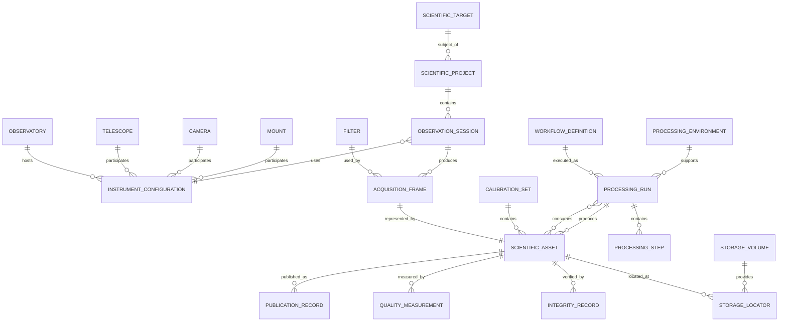
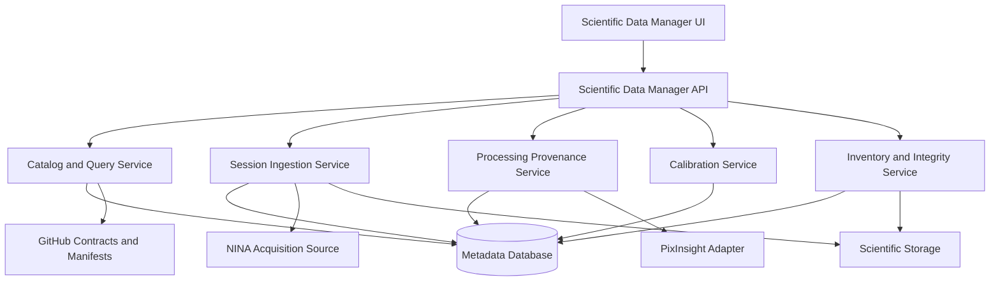

# DSDM-001 — Digital StarGate Scientific Data Manager Conceptual Model

| Campo | Valore |
|---|---|
| Architecture Package | AP-013 — Scientific Image Repository Architecture |
| Documento | Digital StarGate Scientific Data Manager Conceptual Model |
| Identificativo | DSDM-001 |
| Data | 04/08/2026 |
| Autorità | Digital StarGate Chief Architect |
| Sponsor | Project Owner / Architecture Sponsor — Massimo Mainini |
| Stato | Conceptual baseline approved for detailed modelling |
| Implementazione | Non avviata |
| Dipendenze | AP-013; SIR-VIS-001; SIR-INV-001; E-AP13-W02-01 |

## 1. Scopo

DSDM-001 definisce il modello concettuale del Digital StarGate Scientific Data Manager, il sistema destinato a governare sessioni osservative, asset scientifici, strumentazione, calibrazioni, processing, storage, qualità e pubblicazioni.

Il documento stabilisce il linguaggio comune e i confini del futuro sistema. Non definisce ancora uno schema fisico di database, una tecnologia applicativa, API operative o automazioni già esistenti.

## 2. Obiettivo architetturale

Il Scientific Data Manager deve permettere di rispondere in modo verificabile a domande come:

- quali sessioni sono state acquisite per un determinato target;
- quante ore di integrazione sono disponibili per filtro, telescopio o camera;
- quali asset appartengono a una sessione e dove sono conservati;
- quali prodotti derivati provengono da quali RAW e workflow;
- quali calibrazioni sono compatibili con un determinato dataset;
- quali progetti sono pronti per il processing o richiedono ulteriori dati;
- quali immagini sono state pubblicate e su quali canali;
- quali file sono duplicati, orfani, non classificati o non verificati.

## 3. Principi vincolanti

- il catalogo non sostituisce lo storage binario;
- il path fisico è un locator, non l'identità dell'asset;
- i RAW originali sono immutabili;
- ogni derivazione deve avere provenance esplicita;
- i valori non noti restano `unknown`;
- una workflow definition non prova una processing run;
- le sessioni multi-night restano distinguibili pur appartenendo allo stesso progetto;
- le calibrazioni devono essere identificabili per compatibilità tecnica;
- le pubblicazioni sono riferimenti al prodotto, non copie autorevoli dell'asset scientifico;
- nessun componente DSDM possiede autorità di controllo sui dispositivi fisici.

## 4. Contesti funzionali

Il modello è suddiviso in nove bounded context concettuali.

| Context | Responsabilità |
|---|---|
| Observation Planning | target, progetto, obiettivi e stato di completamento |
| Acquisition | sessioni, frame, filtri, esposizioni e metriche di acquisizione |
| Instrument Configuration | osservatorio, telescopio, camera, montatura, filtri e configurazioni |
| Scientific Asset Registry | asset, versioni, locator, formati, dimensioni e checksum |
| Calibration Management | librerie, compatibilità e riutilizzo delle calibrazioni |
| Processing Provenance | workflow, run, step, ambiente, input e output |
| Quality Management | FWHM, scarti, completezza, review e readiness |
| Publication Management | prodotti pubblicati, canali, URL, data e versione |
| Storage and Preservation | volume, capacità, replica, backup, integrity e migration state |

## 5. Modello concettuale



Il diagramma rappresenta relazioni concettuali e non costituisce ancora uno schema relazionale definitivo.

## 6. Entità principali

### 6.1 ScientificTarget

Rappresenta l'oggetto astronomico o il campo osservato.

Attributi candidati:

- `targetId`;
- `canonicalName`;
- `alternativeNames`;
- `targetType`;
- `ra`;
- `dec`;
- `constellation`;
- `catalogReferences`;
- `notes`.

### 6.2 ScientificProject

Raggruppa una o più sessioni dedicate allo stesso obiettivo scientifico o fotografico.

Attributi candidati:

- `projectId`;
- `targetId`;
- `projectName`;
- `status`;
- `objective`;
- `requiredFilters`;
- `requiredIntegrationByFilter`;
- `priority`;
- `startedAt`;
- `completedAt`;
- `notes`.

Stati candidati:

`PLANNED`, `ACQUIRING`, `READY_FOR_PROCESSING`, `PROCESSING`, `REVIEW`, `PUBLISHED`, `ON_HOLD`, `ARCHIVED`.

### 6.3 ObservationSession

Rappresenta una singola finestra osservativa o una notte di acquisizione.

Attributi candidati:

- `sessionId`;
- `projectId`;
- `startedAtUtc`;
- `completedAtUtc`;
- `localObservingDate`;
- `observatoryId`;
- `instrumentConfigurationId`;
- `operatorId`;
- `ninaProfile`;
- `weatherSummary`;
- `moonContext`;
- `sessionStatus`;
- `sourcePath`;
- `transferStatus`;
- `notes`.

Una sessione che attraversa la mezzanotte mantiene un unico `sessionId` e una data osservativa definita secondo una regola canonica da stabilire.

### 6.4 AcquisitionFrame

Rappresenta il significato scientifico e tecnico di un singolo frame acquisito.

Attributi candidati:

- `frameId`;
- `sessionId`;
- `assetId`;
- `imageType`;
- `frameNumber`;
- `filterId`;
- `exposureSeconds`;
- `binning`;
- `gain`;
- `offset`;
- `sensorTemperatureC`;
- `focusPosition`;
- `fwhmObserved`;
- `acquiredAtUtc`;
- `qualityStatus`;
- `rejectionReason`.

Valori candidati di `imageType`:

`LIGHT`, `DARK`, `FLAT`, `BIAS`, `DARKFLAT`, `OTHER`.

### 6.5 InstrumentConfiguration

Rappresenta la configurazione effettivamente usata nella sessione.

Attributi candidati:

- `instrumentConfigurationId`;
- `observatoryId`;
- `telescopeId`;
- `cameraId`;
- `mountId`;
- `focuserId`;
- `filterWheelId`;
- `reducerOrCorrector`;
- `effectiveFocalLengthMm`;
- `effectiveFocalRatio`;
- `pixelScaleArcsec`;
- `validFrom`;
- `validTo`;
- `configurationVersion`.

La configurazione deve essere versionata: una variazione significativa genera una nuova versione.

### 6.6 ScientificAsset

È l'entità autorevole per ogni file scientifico o tecnico governato.

Attributi candidati:

- `assetId`;
- `assetClass`;
- `originalFileName`;
- `format`;
- `sizeBytes`;
- `createdAtObserved`;
- `modifiedAtObserved`;
- `immutabilityStatus`;
- `lifecycleStatus`;
- `contentIdentityStatus`;
- `metadataCompleteness`;
- `registeredAtUtc`.

Classi iniziali:

- `RAW_ORIGINAL`;
- `CALIBRATION_ORIGINAL`;
- `CALIBRATION_MASTER`;
- `CALIBRATED`;
- `REGISTERED`;
- `INTEGRATED`;
- `PROCESSING_INTERMEDIATE`;
- `FINAL_SCIENTIFIC`;
- `FINAL_PUBLICATION`;
- `DOCUMENTATION`.

### 6.7 StorageLocator

Rappresenta una posizione fisica o logica dell'asset.

Attributi candidati:

- `locatorId`;
- `assetId`;
- `storageVolumeId`;
- `relativePath`;
- `locatorType`;
- `isPrimary`;
- `availabilityStatus`;
- `firstSeenAtUtc`;
- `lastVerifiedAtUtc`;
- `supersededAtUtc`.

Un asset può avere più locator, per esempio archivio attivo e copia di backup.

### 6.8 StorageVolume

Rappresenta un volume, disco, share o bucket.

Attributi candidati:

- `storageVolumeId`;
- `logicalName`;
- `volumeLabel`;
- `deviceSerialReference`;
- `storageType`;
- `filesystem`;
- `capacityBytes`;
- `role`;
- `healthStatus`;
- `encryptionStatus`;
- `backupStatus`;
- `lastObservedAtUtc`.

Ruoli iniziali approvati:

- `D:` — archivio storico;
- `F:` — archivio attivo;
- `E:` — calibration library.

La lettera di unità resta un attributo osservato, non l'identità permanente del volume.

### 6.9 CalibrationSet

Rappresenta un insieme di calibrazioni compatibili.

Attributi candidati:

- `calibrationSetId`;
- `cameraId`;
- `imageType`;
- `gain`;
- `offset`;
- `binning`;
- `temperatureC`;
- `exposureSeconds`;
- `filterId`;
- `validFrom`;
- `validTo`;
- `qualityStatus`;
- `masterAssetId`;
- `notes`.

Le regole di compatibilità saranno definite separatamente e non devono essere dedotte soltanto dal nome della cartella.

### 6.10 WorkflowDefinition

Rappresenta una ricetta di processing versionata.

Attributi candidati:

- `workflowId`;
- `workflowName`;
- `workflowVersion`;
- `workflowType`;
- `definitionLocator`;
- `scriptVersion`;
- `createdBy`;
- `createdAtUtc`;
- `status`.

### 6.11 ProcessingRun

Rappresenta una specifica esecuzione di processing.

Attributi candidati:

- `processingRunId`;
- `projectId`;
- `workflowId`;
- `processingEnvironmentId`;
- `operatorId`;
- `startedAtUtc`;
- `completedAtUtc`;
- `status`;
- `parentProcessingRunId`;
- `manualStepsDeclared`;
- `warnings`;
- `notes`.

Ogni modifica sostanziale a workflow o parametri genera una nuova run.

### 6.12 ProcessingStep

Attributi candidati:

- `processingStepId`;
- `processingRunId`;
- `sequenceNumber`;
- `processName`;
- `processVersion`;
- `parameters`;
- `maskAssetId`;
- `roiDefinition`;
- `executionMode`;
- `startedAtUtc`;
- `completedAtUtc`;
- `resultStatus`.

`executionMode` distingue almeno `AUTOMATED`, `ASSISTED`, `MANUAL`, `UNKNOWN`.

### 6.13 ProcessingEnvironment

Attributi candidati:

- `processingEnvironmentId`;
- `hostId`;
- `operatingSystem`;
- `pixInsightVersion`;
- `moduleVersions`;
- `scriptVersions`;
- `configurationReference`;
- `capturedAtUtc`.

### 6.14 QualityMeasurement

Attributi candidati:

- `qualityMeasurementId`;
- `assetId` o `sessionId`;
- `metricName`;
- `metricValue`;
- `unit`;
- `measurementMethod`;
- `toolVersion`;
- `measuredAtUtc`;
- `qualityFlag`.

Metriche candidate:

- FWHM;
- eccentricità;
- star count;
- background median;
- noise estimate;
- rejection percentage;
- integration time;
- metadata completeness.

Le soglie qualitative non sono ancora definite.

### 6.15 PublicationRecord

Attributi candidati:

- `publicationId`;
- `assetId`;
- `channel`;
- `externalUrl`;
- `publishedAtUtc`;
- `title`;
- `language`;
- `publicationVersion`;
- `status`;
- `notes`.

Canali candidati:

`ASTROBIN`, `FACEBOOK`, `INSTAGRAM`, `YOUTUBE`, `LINKEDIN`, `BOOK`, `ARTICLE`, `OTHER`.

## 7. Relazioni chiave

- un target può avere più progetti;
- un progetto può contenere più sessioni;
- una sessione usa una configurazione strumentale versionata;
- una sessione produce più acquisition frame;
- ogni frame è rappresentato da un asset;
- un asset può esistere in più storage locator;
- una processing run consuma e produce asset;
- un prodotto finale può avere più publication record;
- una calibration set può servire più sessioni compatibili;
- una sessione può utilizzare più calibration set.

## 8. Regole per il parsing dei nomi NINA

Il parser iniziale userà il pattern osservato:

```text
IMAGETYPE_BINNING_EXPOSURETIMEs_GAIN_OFFSET_TARGETNAME_TELESCOPE__SENSORTEMPC_FILTER_FRAMENR_DATETIME_FWHM_FWHM_Fok_FOCUSERPOSITION
```

I dati ricavati dal nome file avranno uno stato di provenienza:

- `OBSERVED_FROM_FILENAME`;
- `OBSERVED_FROM_HEADER`;
- `OBSERVED_FROM_FILESYSTEM`;
- `DECLARED_BY_OPERATOR`;
- `NORMALIZED_BY_RULE`;
- `UNKNOWN`.

La normalizzazione non sovrascrive il valore osservato. Entrambi devono poter essere conservati.

## 9. Identificatori

Gli identificatori interni dovranno essere:

- univoci;
- immutabili;
- indipendenti dal path;
- non derivati esclusivamente dal nome file;
- generabili anche offline;
- non riutilizzati dopo cancellazione logica.

Formato candidato:

```text
DSG-<ENTITY>-<UUID>
```

Esempi:

```text
DSG-SESSION-550e8400-e29b-41d4-a716-446655440000
DSG-ASSET-550e8400-e29b-41d4-a716-446655440001
DSG-RUN-550e8400-e29b-41d4-a716-446655440002
```

La scelta definitiva appartiene al logical data model.

## 10. Eventi di dominio candidati

- `SessionDiscovered`;
- `SessionImportPlanned`;
- `SessionTransferStarted`;
- `SessionTransferVerified`;
- `SessionTransferFailed`;
- `AssetRegistered`;
- `AssetLocatorAdded`;
- `AssetIntegrityVerified`;
- `AssetIntegrityMismatchDetected`;
- `CalibrationSetCreated`;
- `CalibrationCompatibilityConfirmed`;
- `ProcessingRunStarted`;
- `ProcessingRunCompleted`;
- `DerivedAssetRegistered`;
- `QualityMeasurementRecorded`;
- `PublicationRecorded`;
- `StorageVolumeObserved`;
- `DuplicateCandidateDetected`.

Gli eventi non costituiscono ancora contratti API o messaggi implementati.

## 11. Query target

Il modello dovrà supportare almeno:

- integrazione totale per target, filtro e setup;
- sessioni per anno, osservatorio, telescopio o camera;
- frame con FWHM entro una soglia;
- progetti incompleti rispetto ai filtri richiesti;
- asset privi di checksum;
- asset senza locator disponibile;
- prodotti derivati senza provenance completa;
- calibrazioni compatibili con una sessione;
- sessioni non ancora trasferite;
- sessioni pronte per il processing;
- immagini finali non pubblicate;
- pubblicazioni per canale e data;
- duplicati candidati e confermati;
- capacità e crescita per volume.

## 12. Architettura applicativa candidata



Questa è un'ipotesi logica. Tecnologia, hosting e deployment restano differiti.

## 13. Confini di sicurezza

- ingestion iniziale avviata dal PC principale;
- accesso alla sorgente EAGLE limitato alla share autorizzata;
- scrittura consentita solo sullo storage destinazione autorizzato;
- nessuna credenziale privilegiata nei nomi file, manifest o script;
- nessuna cancellazione automatica dalla sorgente durante il pilot;
- database e catalogo non autorizzano azioni sui dispositivi fisici;
- tutte le operazioni distruttive richiederanno una policy separata.

## 14. Decisioni differite

- database relazionale, documentale o ibrido;
- tecnologia API e UI;
- hosting locale, VM, container o altro;
- formato fisico dei manifest;
- algoritmo checksum canonico;
- modalità di sincronizzazione GitHub;
- autenticazione e ruoli applicativi;
- modello di backup del catalogo;
- integrazione diretta con PixInsight;
- normalizzazione dei cataloghi astronomici;
- regole definitive di compatibilità delle calibrazioni;
- soglie di qualità e readiness;
- strategia di pubblicazione verso AP-014.

## 15. Work breakdown aggiornato

La sequenza approvata diventa:

| Ordine | Work item | Risultato |
|---:|---|---|
| 1 | DSDM conceptual model | linguaggio e domini comuni |
| 2 | Logical data model | entità, attributi, cardinalità e vincoli |
| 3 | Contract and manifest model | JSON schema e versioning |
| 4 | Session Importer design | parsing, staging, copy e verification |
| 5 | Calibration Manager design | compatibilità e library organization |
| 6 | Inventory Engine design | P0–P4, checksum, duplicate e summary |
| 7 | Repository/API architecture | servizi, persistence e security |
| 8 | Dashboard and query model | viste, filtri e query target |
| 9 | Pilot implementation | dry-run e test su una sessione campione |
| 10 | Validation and ARB review | evidence, finding e disposition |

## 16. Acceptance criteria DSDM-001

La baseline concettuale è completa quando:

- i bounded context sono definiti;
- le entità principali e le relazioni sono registrate;
- storage, asset, sessione e processing sono separati;
- le query target sono esplicite;
- le decisioni tecnologiche restano differite;
- il modello non dichiara implementazioni inesistenti;
- la sequenza aggiornata dei work item è approvata.

## 17. Stato

Il modello concettuale è approvato come base per il dettaglio.

Non sono ancora presenti:

- database;
- schema SQL;
- JSON schema;
- API;
- applicazione web o desktop;
- script di importazione;
- adapter PixInsight;
- catalogo popolato;
- dashboard;
- test runtime.

## 18. Prossimo passo

Il prossimo deliverable è **DSDM-002 — Scientific Data Manager Logical Data Model**, che definirà:

- chiavi e identificatori;
- attributi obbligatori e opzionali;
- cardinalità;
- enumerazioni;
- stati e transizioni;
- vincoli di unicità;
- regole di versioning;
- audit fields;
- mapping iniziale dal filename NINA.
