# DSDM-002 — Digital StarGate Scientific Data Manager Logical Data Model

| Campo | Valore |
|---|---|
| Architecture Package | AP-013 — Scientific Image Repository Architecture |
| Documento | Scientific Data Manager Logical Data Model |
| Identificativo | DSDM-002 |
| Data | 04/08/2026 |
| Autorità | Digital StarGate Chief Architect |
| Sponsor | Project Owner / Architecture Sponsor — Massimo Mainini |
| Stato | Logical baseline — implementation not started |
| Dipendenze | DSDM-001; AP-013; SIR-VIS-001; SIR-INV-001; E-AP13-W02-01 |

## 1. Scopo

DSDM-002 traduce il modello concettuale DSDM-001 in un modello dati logico implementabile, ma ancora indipendente dalla tecnologia di database.

Definisce:

- entità logiche;
- chiavi e identificatori;
- attributi obbligatori e opzionali;
- cardinalità;
- enumerazioni;
- vincoli di unicità e coerenza;
- stati e transizioni;
- audit fields;
- versioning;
- mapping iniziale dal nome file NINA;
- regole per valori osservati, normalizzati e dichiarati.

Il documento non costituisce schema SQL, migrazione database o contratto API definitivo.

## 2. Convenzioni generali

### 2.1 Identificatori

Ogni entità autorevole usa un identificatore immutabile:

```text
DSG-<ENTITY>-<UUID>
```

Esempi:

```text
DSG-TARGET-550e8400-e29b-41d4-a716-446655440000
DSG-SESSION-550e8400-e29b-41d4-a716-446655440001
DSG-ASSET-550e8400-e29b-41d4-a716-446655440002
```

L'identificatore:

- non dipende dal path;
- non dipende dal nome file;
- non viene riutilizzato;
- può essere generato offline;
- resta stabile durante spostamenti, rinomine e migrazioni.

### 2.2 Audit fields comuni

Tutte le entità persistenti includono:

| Campo | Tipo logico | Obbligatorio | Regola |
|---|---|---:|---|
| `createdAtUtc` | timestamp UTC | sì | valorizzato alla creazione |
| `createdBy` | identity reference | sì | persona o service identity |
| `updatedAtUtc` | timestamp UTC | sì | aggiornato ad ogni modifica |
| `updatedBy` | identity reference | sì | persona o service identity |
| `recordVersion` | integer | sì | optimistic concurrency, parte da 1 |
| `lifecycleStatus` | enum | sì | stato logico del record |
| `sourceSystem` | string | sì | NINA, INVENTORY, MANUAL, PIXINSIGHT, IMPORTER, altro |
| `correlationId` | string | no | collega operazioni e manifest |

### 2.3 Provenienza del valore

Per ogni attributo derivato o importato deve essere possibile registrare:

- `OBSERVED_FROM_FILENAME`;
- `OBSERVED_FROM_HEADER`;
- `OBSERVED_FROM_FILESYSTEM`;
- `DECLARED_BY_OPERATOR`;
- `NORMALIZED_BY_RULE`;
- `IMPORTED_FROM_MANIFEST`;
- `UNKNOWN`.

Il valore originale osservato non viene eliminato quando viene creato un valore normalizzato.

### 2.4 Null e unknown

- `null` significa non presente o non applicabile;
- `UNKNOWN` è un valore esplicito quando il dominio richiede uno stato noto di incompletezza;
- una stringa vuota non sostituisce `null`;
- zero non viene usato per rappresentare un valore sconosciuto.

## 3. Diagramma logico

```mermaid
erDiagram
    SCIENTIFIC_TARGET ||--o{ TARGET_ALIAS : has
    SCIENTIFIC_TARGET ||--o{ SCIENTIFIC_PROJECT : subject_of
    SCIENTIFIC_PROJECT ||--o{ PROJECT_REQUIREMENT : defines
    SCIENTIFIC_PROJECT ||--o{ OBSERVATION_SESSION : contains

    OBSERVATORY ||--o{ INSTRUMENT_CONFIGURATION : hosts
    TELESCOPE ||--o{ INSTRUMENT_CONFIGURATION : includes
    CAMERA ||--o{ INSTRUMENT_CONFIGURATION : includes
    MOUNT ||--o{ INSTRUMENT_CONFIGURATION : includes
    FOCUSER ||--o{ INSTRUMENT_CONFIGURATION : includes
    FILTER_WHEEL ||--o{ INSTRUMENT_CONFIGURATION : includes
    FILTER ||--o{ FILTER_WHEEL_SLOT : assigned_to
    FILTER_WHEEL ||--o{ FILTER_WHEEL_SLOT : contains

    OBSERVATION_SESSION }o--|| INSTRUMENT_CONFIGURATION : uses
    OBSERVATION_SESSION ||--o{ ACQUISITION_FRAME : produces
    ACQUISITION_FRAME ||--|| SCIENTIFIC_ASSET : represented_by
    ACQUISITION_FRAME }o--o| FILTER : uses

    SCIENTIFIC_ASSET ||--o{ STORAGE_LOCATOR : located_at
    STORAGE_VOLUME ||--o{ STORAGE_LOCATOR : provides
    SCIENTIFIC_ASSET ||--o{ INTEGRITY_RECORD : verified_by
    SCIENTIFIC_ASSET ||--o{ ASSET_RELATION : source
    SCIENTIFIC_ASSET ||--o{ ASSET_RELATION : target

    CALIBRATION_SET ||--o{ CALIBRATION_SET_MEMBER : contains
    SCIENTIFIC_ASSET ||--o{ CALIBRATION_SET_MEMBER : member
    OBSERVATION_SESSION ||--o{ SESSION_CALIBRATION_USAGE : uses
    CALIBRATION_SET ||--o{ SESSION_CALIBRATION_USAGE : applied_to

    WORKFLOW_DEFINITION ||--o{ WORKFLOW_VERSION : versions
    WORKFLOW_VERSION ||--o{ PROCESSING_RUN : executed_as
    PROCESSING_ENVIRONMENT ||--o{ PROCESSING_RUN : supports
    PROCESSING_RUN ||--o{ PROCESSING_STEP : contains
    PROCESSING_RUN ||--o{ PROCESSING_INPUT : consumes
    SCIENTIFIC_ASSET ||--o{ PROCESSING_INPUT : input
    PROCESSING_RUN ||--o{ PROCESSING_OUTPUT : produces
    SCIENTIFIC_ASSET ||--o{ PROCESSING_OUTPUT : output

    SCIENTIFIC_ASSET ||--o{ QUALITY_MEASUREMENT : measured_by
    OBSERVATION_SESSION ||--o{ QUALITY_MEASUREMENT : summarized_by
    SCIENTIFIC_PROJECT ||--o{ PROJECT_READINESS_ASSESSMENT : assessed_by
    SCIENTIFIC_ASSET ||--o{ PUBLICATION_RECORD : published_as
```



## 4. Entità di planning scientifico

### 4.1 `ScientificTarget`

| Campo | Tipo | Obbligatorio | Vincolo |
|---|---|---:|---|
| `targetId` | identifier | sì | PK logica |
| `canonicalName` | string(200) | sì | univoco case-insensitive nel catalogo locale |
| `targetType` | TargetType | sì | può essere `UNKNOWN` |
| `rightAscension` | decimal/string canonicale | no | formato definitivo differito |
| `declination` | decimal/string canonicale | no | formato definitivo differito |
| `constellationCode` | string(3) | no | codice normalizzato |
| `catalogObjectType` | string | no | valore da catalogo esterno |
| `notes` | text | no | testo libero |

#### `TargetType`

`GALAXY`, `NEBULA`, `PLANETARY_NEBULA`, `STAR_CLUSTER`, `GLOBULAR_CLUSTER`, `OPEN_CLUSTER`, `SUPERNOVA_REMNANT`, `COMET`, `PLANET`, `MOON`, `STAR`, `DARK_NEBULA`, `WIDE_FIELD`, `OTHER`, `UNKNOWN`.

### 4.2 `TargetAlias`

| Campo | Tipo | Obbligatorio | Vincolo |
|---|---|---:|---|
| `targetAliasId` | identifier | sì | PK |
| `targetId` | identifier | sì | FK ScientificTarget |
| `alias` | string(200) | sì | non vuoto |
| `aliasType` | enum | sì | `CATALOG`, `COMMON_NAME`, `FILENAME`, `LEGACY_FOLDER`, `OTHER` |
| `isPreferred` | boolean | sì | massimo uno preferred per tipo |

Un alias non deve creare automaticamente un nuovo target senza review quando il match è ambiguo.

### 4.3 `ScientificProject`

| Campo | Tipo | Obbligatorio | Vincolo |
|---|---|---:|---|
| `projectId` | identifier | sì | PK |
| `targetId` | identifier | sì | FK ScientificTarget |
| `projectName` | string(250) | sì | univoco per target tra progetti attivi |
| `projectStatus` | ProjectStatus | sì | transizioni governate |
| `objective` | text | no | obiettivo scientifico/fotografico |
| `priority` | integer 1..5 | no | 1 più alta, convenzione da confermare |
| `startedAtUtc` | timestamp | no | non futuro rispetto a completion |
| `completedAtUtc` | timestamp | no | richiesto quando COMPLETED/ARCHIVED |
| `processingReadiness` | ReadinessStatus | sì | default `NOT_ASSESSED` |
| `notes` | text | no |  |

#### `ProjectStatus`

`PLANNED`, `ACQUIRING`, `READY_FOR_PROCESSING`, `PROCESSING`, `REVIEW`, `PUBLISHED`, `ON_HOLD`, `COMPLETED`, `ARCHIVED`, `CANCELLED`.

#### Transizioni minime

```text
PLANNED -> ACQUIRING | ON_HOLD | CANCELLED
ACQUIRING -> READY_FOR_PROCESSING | ON_HOLD | CANCELLED
READY_FOR_PROCESSING -> PROCESSING | ACQUIRING | ON_HOLD
PROCESSING -> REVIEW | ACQUIRING | ON_HOLD
REVIEW -> PUBLISHED | PROCESSING | ACQUIRING
PUBLISHED -> COMPLETED | PROCESSING
COMPLETED -> ARCHIVED
ON_HOLD -> PLANNED | ACQUIRING | CANCELLED
```

### 4.4 `ProjectRequirement`

Definisce l'integrazione desiderata per filtro o canale.

| Campo | Tipo | Obbligatorio | Vincolo |
|---|---|---:|---|
| `projectRequirementId` | identifier | sì | PK |
| `projectId` | identifier | sì | FK ScientificProject |
| `filterId` | identifier | no | null per requisito non filtrato |
| `requiredExposureSeconds` | decimal | sì | > 0 |
| `minimumAcceptedFrames` | integer | no | >= 0 |
| `maximumAcceptedFwhm` | decimal | no | > 0 |
| `requirementStatus` | enum | sì | `OPEN`, `PARTIALLY_MET`, `MET`, `WAIVED` |
| `waiverReason` | text | no | obbligatorio se WAIVED |

Unicità candidata: `projectId + filterId + requirement type`.

## 5. Entità strumentali

### 5.1 `Observatory`

| Campo | Tipo | Obbligatorio |
|---|---|---:|
| `observatoryId` | identifier | sì |
| `name` | string(200) | sì |
| `siteCode` | string(50) | no |
| `latitude` | decimal | no |
| `longitude` | decimal | no |
| `elevationMeters` | decimal | no |
| `timezoneId` | string | sì |
| `status` | enum | sì |

Coordinate e sito richiedono una policy di pubblicazione separata se considerati sensibili.

### 5.2 `Telescope`

| Campo | Tipo | Obbligatorio |
|---|---|---:|
| `telescopeId` | identifier | sì |
| `manufacturer` | string | no |
| `model` | string | sì |
| `apertureMm` | decimal | no |
| `nativeFocalLengthMm` | decimal | no |
| `nativeFocalRatio` | decimal | no |
| `opticalDesign` | string | no |
| `assetReference` | string | no |
| `status` | enum | sì |

### 5.3 `Camera`

| Campo | Tipo | Obbligatorio |
|---|---|---:|
| `cameraId` | identifier | sì |
| `manufacturer` | string | no |
| `model` | string | sì |
| `serialReference` | string | no |
| `sensorName` | string | no |
| `sensorType` | enum | no |
| `isColor` | boolean | sì |
| `pixelSizeMicron` | decimal | no |
| `widthPixels` | integer | no |
| `heightPixels` | integer | no |
| `coolingSupported` | boolean | no |
| `status` | enum | sì |

### 5.4 `Mount`, `Focuser`, `FilterWheel`, `Filter`

Ogni entità usa identificatore stabile, manufacturer, model, serialReference opzionale, stato e audit fields.

`Filter` include almeno:

- `filterId`;
- `name`;
- `filterType` (`L`, `R`, `G`, `B`, `HA`, `OIII`, `SII`, `LPRO`, `LEXTREME`, `UVIR`, `CLEAR`, `OTHER`);
- `bandpassNm` opzionale;
- `manufacturer`;
- `model`;
- `isNarrowband`;
- `status`.

### 5.5 `InstrumentConfiguration`

| Campo | Tipo | Obbligatorio | Vincolo |
|---|---|---:|---|
| `instrumentConfigurationId` | identifier | sì | PK |
| `observatoryId` | identifier | sì | FK |
| `telescopeId` | identifier | sì | FK |
| `cameraId` | identifier | sì | FK |
| `mountId` | identifier | no | FK |
| `focuserId` | identifier | no | FK |
| `filterWheelId` | identifier | no | FK |
| `reducerOrCorrector` | string | no | valore dichiarato/versionato |
| `effectiveFocalLengthMm` | decimal | no | > 0 |
| `effectiveFocalRatio` | decimal | no | > 0 |
| `pixelScaleArcsecPerPixel` | decimal | no | > 0 |
| `configurationName` | string | sì | descrittivo |
| `configurationVersion` | integer | sì | >= 1 |
| `validFromUtc` | timestamp | sì |  |
| `validToUtc` | timestamp | no | > validFrom |
| `status` | enum | sì | `DRAFT`, `ACTIVE`, `RETIRED` |

Una modifica a elementi che incidono scientificamente sui dati genera una nuova versione e non modifica retroattivamente le sessioni precedenti.

## 6. Sessioni e acquisizioni

### 6.1 `ObservationSession`

| Campo | Tipo | Obbligatorio | Vincolo |
|---|---|---:|---|
| `sessionId` | identifier | sì | PK |
| `projectId` | identifier | sì | FK ScientificProject |
| `instrumentConfigurationId` | identifier | sì | FK |
| `operatorIdentity` | string | sì | identity reference |
| `startedAtUtc` | timestamp | no | nullable durante discovery |
| `completedAtUtc` | timestamp | no | >= startedAt |
| `localObservingDate` | date | no | regola canonica da definire |
| `sessionStatus` | SessionStatus | sì |  |
| `ninaProfileName` | string | no |  |
| `sourceRootObserved` | string | no | può essere sanitizzato |
| `transferStatus` | TransferStatus | sì | default `NOT_PLANNED` |
| `frameCountObserved` | integer | no | valore denormalizzato riconciliabile |
| `totalExposureSecondsObserved` | decimal | no | valore denormalizzato riconciliabile |
| `notes` | text | no |  |

#### `SessionStatus`

`DISCOVERED`, `PLANNED`, `ACQUIRING`, `ACQUISITION_COMPLETED`, `TRANSFER_PENDING`, `TRANSFER_IN_PROGRESS`, `TRANSFER_VERIFIED`, `READY_FOR_PROCESSING`, `PARTIAL`, `FAILED`, `CANCELLED`, `ARCHIVED`.

#### `TransferStatus`

`NOT_PLANNED`, `PLANNED`, `IN_PROGRESS`, `PARTIAL`, `VERIFIED`, `FAILED`, `SOURCE_CLEANUP_PENDING`, `SOURCE_CLEANUP_COMPLETED`.

Durante il pilot non è consentito raggiungere automaticamente `SOURCE_CLEANUP_COMPLETED`.

### 6.2 `AcquisitionFrame`

| Campo | Tipo | Obbligatorio | Vincolo |
|---|---|---:|---|
| `frameId` | identifier | sì | PK |
| `sessionId` | identifier | sì | FK ObservationSession |
| `assetId` | identifier | sì | FK ScientificAsset, univoco |
| `imageType` | ImageType | sì |  |
| `frameNumber` | integer | no | >= 0 |
| `filterId` | identifier | no | FK Filter |
| `filterObserved` | string | no | conserva valore NINA originale |
| `exposureSeconds` | decimal | no | > 0 se applicabile |
| `binningX` | integer | no | > 0 |
| `binningY` | integer | no | > 0 |
| `gain` | decimal | no |  |
| `offset` | decimal | no |  |
| `sensorTemperatureC` | decimal | no |  |
| `focusPosition` | integer | no |  |
| `fwhmObserved` | decimal | no | > 0 |
| `acquiredAtUtc` | timestamp | no |  |
| `qualityStatus` | FrameQualityStatus | sì | default `NOT_ASSESSED` |
| `rejectionReason` | string | no | obbligatorio se REJECTED |
| `filenameParseStatus` | ParseStatus | sì |  |

#### Enumerazioni

`ImageType`: `LIGHT`, `DARK`, `FLAT`, `BIAS`, `DARKFLAT`, `OTHER`, `UNKNOWN`.

`FrameQualityStatus`: `NOT_ASSESSED`, `ACCEPTED`, `MARGINAL`, `REJECTED`, `UNKNOWN`.

`ParseStatus`: `NOT_PARSED`, `PARSED`, `PARTIAL`, `FAILED`, `AMBIGUOUS`.

## 7. Registro degli asset scientifici

### 7.1 `ScientificAsset`

| Campo | Tipo | Obbligatorio | Vincolo |
|---|---|---:|---|
| `assetId` | identifier | sì | PK |
| `assetClass` | AssetClass | sì |  |
| `originalFileName` | string(1024) | sì | nome osservato |
| `format` | string | sì | `UNKNOWN` ammesso |
| `mediaType` | string | no |  |
| `sizeBytes` | integer64 | sì | >= 0 |
| `createdAtObserved` | timestamp | no |  |
| `modifiedAtObserved` | timestamp | no |  |
| `immutabilityStatus` | ImmutabilityStatus | sì |  |
| `integrityStatus` | IntegrityStatus | sì |  |
| `metadataCompleteness` | decimal 0..100 | no |  |
| `registrationStatus` | enum | sì | `DISCOVERED`, `REGISTERED`, `VERIFIED`, `QUARANTINED`, `WITHDRAWN` |
| `canonicalContentHash` | string | no | valorizzato solo dopo policy hash |
| `canonicalHashAlgorithm` | string | no | richiesto con hash |

#### `AssetClass`

`RAW_ORIGINAL`, `CALIBRATION_ORIGINAL`, `CALIBRATION_MASTER`, `CALIBRATED`, `REGISTERED`, `INTEGRATED`, `PROCESSING_INTERMEDIATE`, `FINAL_SCIENTIFIC`, `FINAL_PUBLICATION`, `DOCUMENTATION`, `UNCLASSIFIED`.

#### `ImmutabilityStatus`

`NOT_ASSESSED`, `LOGICALLY_IMMUTABLE`, `WRITE_PROTECTED`, `MUTABLE`, `VIOLATION_DETECTED`, `UNKNOWN`.

#### `IntegrityStatus`

`NOT_VERIFIED`, `VERIFIED_ONCE`, `VERIFIED_PERIODICALLY`, `MISMATCH`, `UNREADABLE`, `UNKNOWN`.

### 7.2 `StorageVolume`

| Campo | Tipo | Obbligatorio | Vincolo |
|---|---|---:|---|
| `storageVolumeId` | identifier | sì | PK |
| `logicalName` | string | sì | univoco |
| `volumeLabelObserved` | string | no |  |
| `deviceSerialReference` | string | no | sensibile, pubblicazione governata |
| `storageType` | enum | sì | `LOCAL_DISK`, `USB_DISK`, `NETWORK_SHARE`, `OBJECT_STORAGE`, `OTHER` |
| `filesystem` | string | no |  |
| `capacityBytes` | integer64 | no | >= 0 |
| `role` | StorageRole | sì |  |
| `healthStatus` | enum | sì | `HEALTHY`, `DEGRADED`, `FAILED`, `UNKNOWN` |
| `availabilityStatus` | enum | sì | `ONLINE`, `OFFLINE`, `NOT_CONNECTED`, `UNKNOWN` |
| `encryptionStatus` | enum | sì | `ENCRYPTED`, `NOT_ENCRYPTED`, `UNKNOWN` |
| `backupStatus` | enum | sì | `PROTECTED`, `PARTIALLY_PROTECTED`, `NOT_PROTECTED`, `UNKNOWN` |

`StorageRole`: `ACQUISITION_SOURCE`, `ACTIVE_ARCHIVE`, `HISTORICAL_ARCHIVE`, `CALIBRATION_LIBRARY`, `STAGING`, `BACKUP`, `OTHER`.

### 7.3 `StorageLocator`

| Campo | Tipo | Obbligatorio | Vincolo |
|---|---|---:|---|
| `locatorId` | identifier | sì | PK |
| `assetId` | identifier | sì | FK ScientificAsset |
| `storageVolumeId` | identifier | sì | FK StorageVolume |
| `relativePath` | string(2048) | sì | relativo alla root logica |
| `locatorType` | enum | sì | `PRIMARY`, `SECONDARY`, `STAGING`, `SOURCE`, `BACKUP` |
| `availabilityStatus` | enum | sì |  |
| `firstSeenAtUtc` | timestamp | sì |  |
| `lastVerifiedAtUtc` | timestamp | no |  |
| `supersededAtUtc` | timestamp | no |  |
| `sanitizedForPublication` | boolean | sì |  |

Unicità candidata: `storageVolumeId + relativePath + active state`.

### 7.4 `IntegrityRecord`

| Campo | Tipo | Obbligatorio |
|---|---|---:|
| `integrityRecordId` | identifier | sì |
| `assetId` | identifier | sì |
| `locatorId` | identifier | no |
| `algorithm` | string | sì |
| `hashValue` | string | sì |
| `computedAtUtc` | timestamp | sì |
| `computedBy` | identity/tool reference | sì |
| `verificationType` | enum | sì |
| `result` | enum | sì |
| `previousIntegrityRecordId` | identifier | no |
| `errorDetail` | string | no |

`verificationType`: `INITIAL`, `REPEAT`, `TRANSFER_SOURCE`, `TRANSFER_DESTINATION`, `PERIODIC`, `MIGRATION`.

`result`: `MATCH`, `MISMATCH`, `COMPUTED`, `FAILED`, `PARTIAL`.

### 7.5 `AssetRelation`

Rappresenta lineage e relazioni tra asset.

| Campo | Tipo | Obbligatorio |
|---|---|---:|
| `assetRelationId` | identifier | sì |
| `sourceAssetId` | identifier | sì |
| `targetAssetId` | identifier | sì |
| `relationType` | enum | sì |
| `processingRunId` | identifier | no |
| `confidence` | enum | sì |
| `notes` | text | no |

`relationType`: `DERIVED_FROM`, `CALIBRATED_FROM`, `REGISTERED_FROM`, `INTEGRATED_FROM`, `PUBLICATION_VARIANT_OF`, `DUPLICATE_OF`, `POSSIBLE_DUPLICATE_OF`, `SUPERSEDES`, `RELATED_TO`.

Source e target non possono coincidere.

## 8. Gestione calibrazioni

### 8.1 `CalibrationSet`

| Campo | Tipo | Obbligatorio | Vincolo |
|---|---|---:|---|
| `calibrationSetId` | identifier | sì | PK |
| `cameraId` | identifier | sì | FK Camera |
| `imageType` | ImageType | sì | DARK, FLAT, BIAS, DARKFLAT |
| `gain` | decimal | no |  |
| `offset` | decimal | no |  |
| `binningX` | integer | no | > 0 |
| `binningY` | integer | no | > 0 |
| `temperatureC` | decimal | no |  |
| `exposureSeconds` | decimal | no |  |
| `filterId` | identifier | no | tipicamente per FLAT |
| `validFromUtc` | timestamp | no |  |
| `validToUtc` | timestamp | no | > validFrom |
| `qualityStatus` | enum | sì | `NOT_ASSESSED`, `VALID`, `MARGINAL`, `INVALID`, `EXPIRED` |
| `masterAssetId` | identifier | no | FK ScientificAsset |
| `compatibilityRuleVersion` | string | no |  |

La compatibilità non è dedotta soltanto dalla cartella o dal filename.

### 8.2 `CalibrationSetMember`

| Campo | Tipo | Obbligatorio |
|---|---|---:|
| `calibrationSetMemberId` | identifier | sì |
| `calibrationSetId` | identifier | sì |
| `assetId` | identifier | sì |
| `memberRole` | enum | sì |
| `includedAtUtc` | timestamp | sì |
| `exclusionReason` | string | no |

`memberRole`: `SOURCE_FRAME`, `MASTER`, `REJECTED_FRAME`, `REFERENCE`.

### 8.3 `SessionCalibrationUsage`

Registra quale set è stato effettivamente usato, distinguendo compatibilità da uso reale.

| Campo | Tipo | Obbligatorio |
|---|---|---:|
| `sessionCalibrationUsageId` | identifier | sì |
| `sessionId` | identifier | sì |
| `calibrationSetId` | identifier | sì |
| `usageStatus` | enum | sì |
| `processingRunId` | identifier | no |
| `compatibilityAssessment` | enum | sì |
| `notes` | text | no |

`usageStatus`: `CANDIDATE`, `SELECTED`, `USED`, `REJECTED`.

## 9. Processing provenance

### 9.1 `WorkflowDefinition`

| Campo | Tipo | Obbligatorio |
|---|---|---:|
| `workflowId` | identifier | sì |
| `workflowName` | string | sì |
| `workflowType` | enum | sì |
| `ownerIdentity` | string | sì |
| `status` | enum | sì |

### 9.2 `WorkflowVersion`

| Campo | Tipo | Obbligatorio |
|---|---|---:|
| `workflowVersionId` | identifier | sì |
| `workflowId` | identifier | sì |
| `versionLabel` | string | sì |
| `definitionLocator` | string | no |
| `definitionHash` | string | no |
| `publishedAtUtc` | timestamp | no |
| `status` | enum | sì |

Unicità: `workflowId + versionLabel`.

### 9.3 `ProcessingEnvironment`

| Campo | Tipo | Obbligatorio |
|---|---|---:|
| `processingEnvironmentId` | identifier | sì |
| `hostReference` | string | sì |
| `operatingSystem` | string | no |
| `pixInsightVersion` | string | no |
| `moduleManifest` | structured value | no |
| `scriptManifest` | structured value | no |
| `configurationReference` | string | no |
| `capturedAtUtc` | timestamp | sì |
| `environmentHash` | string | no |

### 9.4 `ProcessingRun`

| Campo | Tipo | Obbligatorio | Vincolo |
|---|---|---:|---|
| `processingRunId` | identifier | sì | PK |
| `projectId` | identifier | sì | FK ScientificProject |
| `workflowVersionId` | identifier | no | può essere null per workflow non formalizzato |
| `processingEnvironmentId` | identifier | no |  |
| `operatorIdentity` | string | sì |  |
| `startedAtUtc` | timestamp | no |  |
| `completedAtUtc` | timestamp | no | >= startedAt |
| `status` | ProcessingRunStatus | sì |  |
| `parentProcessingRunId` | identifier | no | self FK |
| `manualStepsDeclared` | boolean | sì |  |
| `warnings` | structured/text | no |  |
| `notes` | text | no |  |

`ProcessingRunStatus`: `PLANNED`, `RUNNING`, `COMPLETED`, `COMPLETED_WITH_WARNINGS`, `FAILED`, `CANCELLED`, `ABANDONED`.

### 9.5 `ProcessingStep`

| Campo | Tipo | Obbligatorio |
|---|---|---:|
| `processingStepId` | identifier | sì |
| `processingRunId` | identifier | sì |
| `sequenceNumber` | integer | sì |
| `processName` | string | sì |
| `processVersion` | string | no |
| `parameterPayload` | structured value | no |
| `maskAssetId` | identifier | no |
| `roiDefinition` | structured value | no |
| `executionMode` | enum | sì |
| `startedAtUtc` | timestamp | no |
| `completedAtUtc` | timestamp | no |
| `resultStatus` | enum | sì |
| `evidenceReference` | string | no |

Unicità: `processingRunId + sequenceNumber`.

### 9.6 `ProcessingInput` e `ProcessingOutput`

Entrambe collegano una run agli asset.

`ProcessingInput` include ruolo: `RAW`, `CALIBRATION`, `MASK`, `REFERENCE`, `INTERMEDIATE`, `OTHER`.

`ProcessingOutput` include ruolo: `INTERMEDIATE`, `MASTER`, `FINAL_SCIENTIFIC`, `FINAL_PUBLICATION`, `MASK`, `REPORT`, `OTHER`.

Un output non può essere registrato come prodotto di due run differenti senza una relazione esplicita di equivalenza o importazione.

## 10. Qualità e readiness

### 10.1 `QualityMeasurement`

| Campo | Tipo | Obbligatorio |
|---|---|---:|
| `qualityMeasurementId` | identifier | sì |
| `assetId` | identifier | no |
| `sessionId` | identifier | no |
| `metricName` | string | sì |
| `metricValueNumeric` | decimal | no |
| `metricValueText` | string | no |
| `unit` | string | no |
| `measurementMethod` | string | sì |
| `toolVersion` | string | no |
| `measuredAtUtc` | timestamp | sì |
| `qualityFlag` | enum | sì |

Esattamente uno tra `assetId` e `sessionId` deve essere valorizzato nella baseline iniziale.

### 10.2 `ProjectReadinessAssessment`

| Campo | Tipo | Obbligatorio |
|---|---|---:|
| `assessmentId` | identifier | sì |
| `projectId` | identifier | sì |
| `assessedAtUtc` | timestamp | sì |
| `assessedBy` | identity reference | sì |
| `readinessStatus` | ReadinessStatus | sì |
| `integrationSummary` | structured value | no |
| `missingRequirements` | structured value | no |
| `qualitySummary` | structured value | no |
| `evidenceReference` | string | no |

`ReadinessStatus`: `NOT_ASSESSED`, `NOT_READY`, `PARTIALLY_READY`, `READY`, `READY_WITH_WAIVER`.

## 11. Pubblicazioni

### 11.1 `PublicationRecord`

| Campo | Tipo | Obbligatorio |
|---|---|---:|
| `publicationId` | identifier | sì |
| `assetId` | identifier | sì |
| `channel` | PublicationChannel | sì |
| `externalUrl` | string | no |
| `publishedAtUtc` | timestamp | no |
| `title` | string | no |
| `language` | string | no |
| `publicationVersion` | string | no |
| `status` | enum | sì |
| `notes` | text | no |

`PublicationChannel`: `ASTROBIN`, `FACEBOOK`, `INSTAGRAM`, `YOUTUBE`, `LINKEDIN`, `BOOK`, `ARTICLE`, `PRESENTATION`, `OTHER`.

`status`: `DRAFT`, `SCHEDULED`, `PUBLISHED`, `WITHDRAWN`, `FAILED`, `UNKNOWN`.

## 12. Mapping iniziale dal filename NINA

Pattern corrente:

```text
$$IMAGETYPE$$_$$BINNING$$_$$EXPOSURETIME$$s_$$GAIN$$_$$OFFSET$$_$$TARGETNAME$$_$$TELESCOPE$$__$$SENSORTEMP$$C_$$FILTER$$_$$FRAMENR$$_$$DATETIME$$_FWHM_$$FWHM$$_Fok_$$FOCUSERPOSITION$$
```

Esempio:

```text
LIGHT_1x1_600.00s_910_99_LDN 1320_Skywatcher quattro 200p__-10.00C_LPRO_0163_2026-07-17_04-16-06_FWHM_5.77_Fok_116189.xisf
```

### 12.1 Mapping

| Token NINA | Destinazione logica | Regola |
|---|---|---|
| `IMAGETYPE` | `AcquisitionFrame.imageType` | normalizzazione enum, originale conservato |
| `BINNING` | `binningX`, `binningY` | parse `NxM` |
| `EXPOSURETIME` | `exposureSeconds` | decimal invariant |
| `GAIN` | `gain` | decimal/integer |
| `OFFSET` | `offset` | decimal/integer |
| `TARGETNAME` | `TargetAlias.alias` + candidate target | match governato, non auto-merge ambiguo |
| `TELESCOPE` | candidate `Telescope`/configuration | mapping tramite alias strumentale |
| `SENSORTEMP` | `sensorTemperatureC` | supporta valori negativi |
| `FILTER` | `filterObserved` + candidate Filter | mapping tramite alias filtro |
| `FRAMENR` | `frameNumber` | integer |
| `DATETIME` | `acquiredAtUtc` candidate | timezone e formato devono essere configurati |
| `FWHM` | `fwhmObserved` | decimal; unità e metodo da documentare |
| `FOCUSERPOSITION` | `focusPosition` | integer |
| estensione | `ScientificAsset.format` | verifica futura con signature/header |
| filename completo | `originalFileName` | preservato integralmente |

### 12.2 Ambiguità strutturale

Poiché `TARGETNAME` e `TELESCOPE` possono contenere underscore o spazi, il parser non deve usare una semplice divisione globale su `_`.

La strategia logica è:

1. riconoscere marker stabili da destra: `_Fok_`, `_FWHM_`, datetime, frame number, filter, temperatura preceduta da doppio underscore;
2. riconoscere i campi iniziali a cardinalità nota: image type, binning, exposure, gain, offset;
3. trattare la porzione centrale residua come combinazione target/telescope;
4. risolverla con un registro di alias noti e longest-match governato;
5. produrre `AMBIGUOUS` se più mapping sono possibili;
6. non inventare target o configurazione senza review.

### 12.3 Regole di parse

- parsing culture-invariant per decimali con punto;
- date e orari non vengono convertiti in UTC senza timezone configurato;
- i valori originali sono sempre conservati;
- un parse parziale non impedisce la registrazione dell'asset;
- errori di parse producono finding, non rinomina automatica;
- il parser è versionato e la versione è registrata nel manifest.

## 13. Vincoli trasversali

### 13.1 Unicità

- `ScientificTarget.canonicalName` univoco case-insensitive;
- `TargetAlias.alias + aliasType` non deve puntare a target diversi senza stato ambiguous;
- un `AcquisitionFrame.assetId` è univoco;
- `StorageLocator(storageVolumeId, relativePath)` univoco tra locator attivi;
- `WorkflowVersion(workflowId, versionLabel)` univoco;
- `ProcessingStep(processingRunId, sequenceNumber)` univoco;
- un hash non implica automaticamente unicità semantica, ma può confermare identità binaria.

### 13.2 Referential integrity

- nessun frame senza sessione e asset;
- nessun locator senza volume e asset;
- nessun processing input/output senza asset;
- nessuna pubblicazione senza asset;
- nessuna calibration usage senza sessione e calibration set;
- soft deletion o withdrawal preservano le relazioni storiche.

### 13.3 Immutabilità

- `ScientificAsset.assetId` non cambia;
- i RAW non vengono sostituiti in place;
- una nuova versione del contenuto genera un nuovo asset;
- una processing run completata non viene riscritta: eventuali correzioni generano nuova run o append-only amendment;
- integrity record ed eventi di audit sono append-only.

## 14. Versioning

### 14.1 Record version

`recordVersion` supporta concorrenza e aggiornamenti del record descrittivo.

### 14.2 Scientific content version

Una modifica dei byte produce un nuovo `ScientificAsset`, non un incremento del solo `recordVersion`.

### 14.3 Workflow version

Ogni modifica sostanziale a sequenza o parametri crea una nuova `WorkflowVersion`.

### 14.4 Instrument configuration version

Ogni variazione scientificamente significativa crea una nuova `InstrumentConfiguration`.

## 15. Cancellazione e retention

Nella baseline iniziale:

- cancellazione fisica non prevista dal DSDM;
- i record possono essere `WITHDRAWN` o `ARCHIVED`;
- un locator può essere `SUPERSEDED` o `UNAVAILABLE`;
- la retention policy definitiva appartiene ad AP-002/AP-013;
- nessuna cancellazione automatica è consentita durante il pilot.

## 16. Audit events minimi

Ogni operazione significativa registra:

- actor/service identity;
- timestamp UTC;
- correlation ID;
- entity type e ID;
- operazione;
- stato precedente e successivo;
- source system;
- tool/parser version;
- outcome;
- error detail sanitizzato;
- evidence reference.

Eventi obbligatori candidati:

- asset discovery;
- parse result;
- session association;
- transfer plan/start/verification/failure;
- locator creation/change;
- checksum computation/verification;
- duplicate detection;
- processing run lifecycle;
- publication lifecycle;
- manual correction di metadata.

## 17. Viste logiche candidate

- `ProjectIntegrationByFilter`;
- `SessionAcquisitionSummary`;
- `AssetCurrentLocation`;
- `UnverifiedAssets`;
- `OrphanDerivedAssets`;
- `CalibrationCompatibilityCandidates`;
- `ProcessingLineage`;
- `PublicationCoverage`;
- `StorageCapacityTrend`;
- `DuplicateCandidateReport`;
- `ReadyForProcessingProjects`;
- `ParseExceptionQueue`.

Le viste sono requisiti logici, non query implementate.

## 18. Quality rules iniziali

| ID | Regola | Severità candidata |
|---|---|---|
| DQ-001 | asset senza filename | ERROR |
| DQ-002 | sizeBytes negativo | ERROR |
| DQ-003 | RAW senza locator disponibile | CRITICAL |
| DQ-004 | derived asset senza processing provenance | WARNING/ERROR |
| DQ-005 | LIGHT senza target o sessione | WARNING |
| DQ-006 | parse ambiguo target/telescope | REVIEW |
| DQ-007 | hash mismatch | CRITICAL |
| DQ-008 | duplicate candidate non revisionato | REVIEW |
| DQ-009 | completed processing run senza output | ERROR |
| DQ-010 | publication riferita ad asset withdrawn | WARNING |
| DQ-011 | calibration set senza camera | ERROR |
| DQ-012 | sessione transfer verified senza evidence | ERROR |

Le severità definitive richiedono validation e governance.

## 19. Mapping storage iniziale approvato

| Volume osservato | StorageRole | Scrittura automatica iniziale |
|---|---|---|
| EAGLE `D:\Images NINA\Target` | `ACQUISITION_SOURCE` | vietata, sola lettura per importer |
| PC `D:` WD Elements 2621 | `HISTORICAL_ARCHIVE` | vietata nella fase iniziale |
| PC `F:` WD Elements 2620 | `ACTIVE_ARCHIVE` | solo dry-run finché non autorizzata copia reale |
| PC `E:` | `CALIBRATION_LIBRARY` | nessuna migrazione o riorganizzazione iniziale |

L'identità dei volumi dovrà usare logical ID e riferimenti hardware/label, non solo drive letter.

## 20. Decisioni differite

- tipo di database;
- tipi fisici e precisioni definitive;
- schema SQL e naming convention fisica;
- strategia UUID specifica;
- formato JSON dei payload strutturati;
- modello completo identity e RBAC;
- cataloghi astronomici esterni;
- timezone canonica per NINA datetime;
- algoritmo hash canonico;
- soglie qualità;
- regole di calibration compatibility;
- soft-delete implementation;
- strategia eventi e messaging;
- API e UI.

## 21. Validation matrix

| ID | Verifica | Stato |
|---|---|---|
| LDM-01 | ogni entità ha identificatore stabile | Documentale |
| LDM-02 | cardinalità session-frame-asset coerente | Documentale |
| LDM-03 | path separato dall'identità asset | Documentale |
| LDM-04 | RAW immutability preservata | Documentale |
| LDM-05 | provenance processing esplicita | Documentale |
| LDM-06 | uso calibrazioni distinto dalla compatibilità | Documentale |
| LDM-07 | mapping filename NINA copre sample reale | Da testare |
| LDM-08 | parser gestisce spazi, underscore e temperature negative | Da testare |
| LDM-09 | sessioni multi-night rappresentabili | Documentale; da simulare |
| LDM-10 | query target supportabili dal modello | Da verificare con query prototype |
| LDM-11 | audit e versioning completi | Documentale |
| LDM-12 | storage roles coerenti con scope approvato | Documentale |

## 22. Acceptance criteria DSDM-002

DSDM-002 può essere considerato baseline logica completa quando:

- entità e cardinalità sono definite;
- identificatori e audit fields sono uniformi;
- enumerazioni e stati principali sono registrati;
- mapping NINA è esplicito;
- le ambiguità del parser sono trattate senza invenzioni;
- asset identity, path e checksum sono separati;
- processing definition e processing execution sono separate;
- calibration compatibility e actual usage sono separate;
- storage volume e locator sono modellati;
- decisioni tecnologiche restano differite;
- non viene dichiarata alcuna implementazione runtime.

## 23. Stato corrente

La baseline logica è definita a livello documentale.

Non sono ancora presenti:

- schema JSON machine-readable;
- schema SQL;
- database;
- migration;
- parser NINA;
- test automatici;
- API;
- UI;
- inventory popolato;
- importazione reale.

## 24. Prossimo passo

Il prossimo deliverable è **DSDM-003 — Contract and Manifest Model**.

Dovrà definire almeno:

- `session-manifest.schema.json`;
- `asset-manifest.schema.json`;
- `inventory-run.schema.json`;
- `processing-run.schema.json`;
- versioning e compatibility rules;
- esempi validi e invalidi;
- schema validation strategy;
- mapping tra manifest e modello logico DSDM-002.
