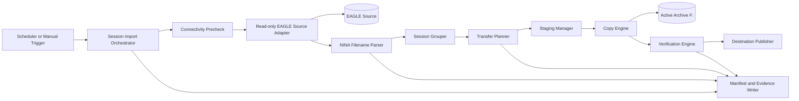

# DSDM-004 — Session Importer Architecture and Safe Transfer Design

| Campo | Valore |
|---|---|
| Architecture Package | AP-013 — Scientific Image Repository Architecture |
| Documento | Session Importer Architecture and Safe Transfer Design |
| Identificativo | DSDM-004 |
| Data | 04/08/2026 |
| Autorità | Digital StarGate Chief Architect |
| Sponsor | Project Owner / Architecture Sponsor — Massimo Mainini |
| Stato | Architecture baseline — implementation not started |
| Dipendenze | DSDM-001; DSDM-002; DSDM-003; SIR-INV-001; E-AP13-W02-01 |

## 1. Scopo

DSDM-004 definisce l'architettura del componente incaricato di individuare, classificare e trasferire in sicurezza le sessioni NINA dall'EAGLE verso l'archivio attivo collegato al PC principale.

Il design copre:

- connettività PC principale → EAGLE;
- discovery read-only della sorgente;
- verifica di stabilità dei file;
- parsing dei filename NINA;
- raggruppamento per target e sessione;
- preparazione della struttura di destinazione;
- dry-run e `-WhatIf`;
- staging;
- copia;
- verifica;
- gestione collisioni;
- recovery e resume;
- manifest, log ed evidence;
- stop conditions;
- progressione controllata dal pilot alla copia reale.

Il documento non implementa ancora script, task schedulati, share SMB o trasferimenti reali.

## 2. Contesto operativo verificato

### 2.1 Sorgente

| Campo | Valore |
|---|---|
| Host | `EAGLE30154` |
| Root NINA | `D:\Images NINA\Target` |
| Accesso previsto | share SMB read-only dal PC principale |
| Rete Ethernet candidata | `192.168.1.144/24` |
| Rete Wi-Fi alternativa | `192.168.1.184/24` |
| Finestra preferita | 07:30–08:30 ora locale |
| Spegnimento normale EAGLE | circa 08:30 |
| NINA attiva durante il trasferimento | No |

### 2.2 Nodo di importazione

| Campo | Valore |
|---|---|
| Host | `WIN-QOOF3903TQS` |
| Sistema operativo | Windows 11 Pro |
| Rete candidata verso EAGLE | `192.168.1.145/24` |
| Ruolo | orchestrazione, staging, verifica e scrittura sugli storage locali |

### 2.3 Storage

| Volume logico | Ruolo | Regola iniziale |
|---|---|---|
| EAGLE `D:\Images NINA\Target` | Acquisition Source | sola lettura |
| PC `D:` WD Elements 2621 | Historical Archive | nessuna modifica automatica |
| PC `F:` WD Elements 2620 | Active Archive | destinazione candidata; solo dry-run finché non autorizzata |
| PC `E:` | Calibration Library | nessuna riorganizzazione automatica iniziale |

## 3. Decisione architetturale

Il trasferimento sarà **pull-based**:

- il PC principale legge una share autorizzata sull'EAGLE;
- l'EAGLE non ottiene accesso di scrittura generale agli SSD del PC;
- il PC verifica destinazione, spazio, finestra e stabilità prima di iniziare;
- la sorgente resta autorevole fino al completamento della verifica;
- nessuna cancellazione automatica è consentita nel pilot.

Questa scelta riduce l'esposizione delle credenziali e mantiene il controllo della destinazione sul nodo che ospita gli storage.

## 4. Componenti logici



## 5. Moduli previsti

| Modulo | Responsabilità |
|---|---|
| Trigger | avvio manuale o schedulato |
| Connectivity Precheck | DNS, ping opzionale, TCP 445, share access |
| Source Adapter | enumerazione read-only dei file |
| Stability Analyzer | verifica file non più in scrittura |
| Filename Parser | estrazione metadata NINA |
| Session Grouper | raggruppamento per target/data/configurazione |
| Transfer Planner | calcolo destinazioni e azioni |
| Collision Analyzer | confronto con file già esistenti |
| Staging Manager | directory temporanea controllata |
| Copy Engine | copia con retry e progress |
| Verification Engine | count, byte e hash opzionali |
| Publisher | promozione atomica/logica da staging a destinazione |
| Manifest Writer | session, asset e transfer manifest |
| Evidence Writer | log, summary e checksum degli output |

## 6. Flusso operativo

```text
TRIGGER
→ PRECHECK
→ DISCOVERY
→ STABILITY ANALYSIS
→ PARSING
→ GROUPING
→ PLAN
→ DRY-RUN REVIEW
→ STAGING
→ COPY
→ VERIFY
→ PUBLISH
→ RECORD COMPLETION
```

Nel pilot l'esecuzione si arresta dopo `DRY-RUN REVIEW`.

## 7. Finestra temporale

Valori iniziali:

| Parametro | Valore |
|---|---|
| `notBeforeLocal` | 07:35 |
| `doNotStartAfterLocal` | 08:10 |
| `mustFinishBeforeLocal` | 08:25 |
| `expectedEagleShutdown` | 08:30 |
| `minimumFileStableMinutes` | 10 |

Regole:

- prima delle 07:35: nessun avvio;
- dopo le 08:10: nessun nuovo trasferimento;
- entro le 08:25: il processo deve terminare o fermarsi in stato sicuro;
- il tempo stimato di copia deve essere inferiore al tempo residuo con margine configurabile;
- il calcolo del tempo stimato usa throughput storico solo dopo misure reali.

## 8. Precheck obbligatori

| ID | Controllo | Failure action |
|---|---|---|
| PRE-01 | hostname EAGLE risolvibile oppure IP autorizzato disponibile | stop |
| PRE-02 | TCP 445 raggiungibile | stop |
| PRE-03 | share configurata e accessibile | stop |
| PRE-04 | accesso sorgente read-only | stop se scrittura necessaria |
| PRE-05 | root attesa disponibile | stop |
| PRE-06 | destinazione presente | stop |
| PRE-07 | identità volume destinazione coerente | stop |
| PRE-08 | spazio libero sufficiente | stop |
| PRE-09 | finestra temporale valida | stop |
| PRE-10 | lock di esecuzione non già presente | stop |
| PRE-11 | nessuna acquisizione NINA in corso | stop |
| PRE-12 | output directory per log/manifest scrivibile | stop |

L'uso del ping è diagnostico; la decisione operativa si basa sulla raggiungibilità del servizio richiesto.

## 9. Verifica che NINA non stia acquisendo

Meccanismi candidati, in ordine di preferenza:

1. marker di sessione completata prodotto da NINA o da uno script post-sequence;
2. verifica API o stato applicativo, se disponibile e governato;
3. controllo process + stabilità file;
4. stabilità temporale dell'intera source;
5. conferma manuale nel pilot.

Nessun singolo controllo basato solo sul nome del processo è considerato sufficiente per la copia reale.

## 10. Stability Analyzer

Un file è candidato stabile quando:

- la dimensione non cambia per almeno `minimumFileStableMinutes`;
- `LastWriteTime` non cambia nello stesso intervallo;
- il file può essere aperto in lettura senza share violation;
- non è un file temporaneo o parziale noto;
- appartiene a un'estensione autorizzata;
- la sessione non presenta nuovi file durante la finestra di osservazione.

Stati:

`NOT_CHECKED`, `GROWING`, `LOCKED`, `STABLE`, `EXCLUDED`, `ERROR`.

## 11. Parsing filename NINA

Il parser segue DSDM-002 e DSDM-003.

Pattern:

```text
IMAGETYPE_BINNING_EXPOSURETIMEs_GAIN_OFFSET_TARGETNAME_TELESCOPE__SENSORTEMPC_FILTER_FRAMENR_DATETIME_FWHM_FWHM_Fok_FOCUSERPOSITION
```

Strategia:

1. estrazione da destra dei marker `_Fok_` e `_FWHM_`;
2. estrazione datetime, frame number, filter e temperatura;
3. estrazione da sinistra dei campi a cardinalità nota;
4. risoluzione della porzione target/telescope tramite alias registry;
5. stato `AMBIGUOUS` quando non esiste una separazione univoca;
6. conservazione del filename originale e dei token osservati.

Il parser deve essere versionato e testato con filename reali e casi patologici.

## 12. Raggruppamento in sessioni

### 12.1 Chiave candidata

```text
normalized target
+ observing date
+ instrument configuration candidate
+ image acquisition continuity window
```

### 12.2 Regole

- sessioni che attraversano la mezzanotte possono appartenere alla stessa notte osservativa;
- sessioni su più notti restano separate ma collegate allo stesso progetto;
- target ambiguo produce gruppo `UNRESOLVED`;
- frame calibration possono essere associati alla sessione o alla library, ma non spostati automaticamente nel pilot;
- la regola definitiva della notte osservativa deve essere configurabile.

## 13. Struttura destinazione

Baseline candidata:

```text
<ArchiveRoot>\<Target>\
├── Light\
│   └── YYYY-MM-DD\
├── Dark\
│   └── YYYY-MM-DD\
├── Flat\
│   └── YYYY-MM-DD\
├── Bias\
│   └── YYYY-MM-DD\
├── DarkFlat\
│   └── YYYY-MM-DD\
├── 12_Processing\
└── _Inventory\
    └── <SessionId>\
```

La data può essere disabilitata per compatibilità con la struttura storica, ma nel pilot sarà mostrata nel piano prima di qualsiasi creazione.

### Naming directory

- il nome target normalizzato non sostituisce l'alias originale nel manifest;
- caratteri non validi Windows vengono sanitizzati secondo regola versionata;
- nomi riservati Windows vengono rifiutati o trasformati in modo esplicito;
- collisioni tra target normalizzati richiedono review.

## 14. Dry-run e WhatIf

Modalità obbligatoria iniziale:

```powershell
Invoke-DSGSessionImport -Mode DryRun
```

o equivalente:

```powershell
Invoke-DSGSessionImport -WhatIf
```

Il dry-run può:

- leggere la sorgente;
- eseguire precheck;
- verificare stabilità;
- analizzare filename;
- generare session grouping;
- calcolare spazio richiesto;
- simulare directory e destinazioni;
- classificare collisioni;
- generare manifest e report.

Non può:

- creare cartelle finali;
- copiare file scientifici;
- modificare timestamp;
- spostare o cancellare file;
- scrivere sulla sorgente;
- aggiornare un catalogo operativo.

## 15. Transfer Plan

Ogni file produce un'azione pianificata:

| Azione | Significato |
|---|---|
| `COPY_NEW` | destinazione assente |
| `SKIP_CONFIRMED_DUPLICATE` | contenuto identico verificato |
| `REVIEW_DUPLICATE_CANDIDATE` | nome/dimensione compatibili, hash assente |
| `BLOCK_CONFLICT` | stesso path, contenuto differente o non verificabile |
| `EXCLUDE` | regola di esclusione |
| `QUARANTINE` | parse o integrità problematica |
| `DEFER_UNSTABLE` | file non stabile |

Il piano include source, destination, size, parse result, session, action, reason e verification mode.

## 16. Staging

Percorso logico candidato:

```text
<ActiveArchiveRoot>\_DSG_STAGING\<TransferRunId>\
```

Regole:

- staging sullo stesso volume della destinazione finale quando possibile;
- nessuna visibilità come sessione completata prima della verifica;
- directory nominata con transfer run ID;
- manifest e lock inclusi;
- cleanup staging solo dopo verifica o con comando esplicito;
- staging parziale conservato per resume e diagnosi.

## 17. Copy Engine

Requisiti:

- copia binaria senza trasformazione;
- nessuna sovrascrittura silenziosa;
- buffer e parallelismo configurabili;
- default conservativo nel pilot;
- retry limitato per errori transitori;
- nessun retry infinito;
- progress registrato per file;
- source e destination size registrate;
- timestamp preservation policy esplicita;
- supporto resume tramite manifest, non tramite assunzioni sul path.

## 18. Collision policy

### Caso A — destinazione assente

`COPY_NEW`.

### Caso B — stesso nome e stessa dimensione, hash non disponibile

`REVIEW_DUPLICATE_CANDIDATE` oppure sample hash, se autorizzato.

### Caso C — stesso nome e stesso hash

`SKIP_CONFIRMED_DUPLICATE`, registrando entrambi i locator.

### Caso D — stesso nome ma dimensione/hash differente

`BLOCK_CONFLICT`. Nessuna rinomina automatica nel pilot.

### Caso E — stesso hash ma nome differente

`DUPLICATE_CONTENT_CANDIDATE`, senza cancellazione.

## 19. Verification Engine

Livelli:

### V1 — Count and bytes

- numero file sorgente pianificati = numero file copiati;
- somma byte sorgente = somma byte destinazione;
- ogni file ha size corrispondente.

### V2 — Sample hash

- hash su campione configurato;
- campione e metodo registrati.

### V3 — Full hash

- hash di tutti i file trasferiti;
- algoritmo approvato;
- source e destination hash match.

Nel primo pilot reale, il livello minimo proposto è V1; V2 sarà usato per validare il motore. V3 richiede autorizzazione separata e valutazione delle prestazioni.

Lo stato `VERIFIED` richiede almeno V1 positivo e nessun file in errore.

## 20. Publish

Dopo verifica:

1. lo staging viene marcato verificato;
2. viene creato il manifest finale;
3. la directory viene promossa alla destinazione;
4. l'operazione viene registrata come `TRANSFER_VERIFIED`;
5. la sorgente resta invariata;
6. eventuale cleanup rimane manuale e separato.

La promozione deve essere idempotente o rilevare uno stato già pubblicato.

## 21. Resume e recovery

Ogni transfer run registra:

- file pianificati;
- file completati;
- file falliti;
- byte copiati;
- verification status;
- retry count;
- ultimo checkpoint.

Alla ripresa:

- il manifest esistente viene validato;
- sorgente e destinazione vengono nuovamente verificate;
- file già completati non vengono ricopiati senza motivo;
- file cambiati in sorgente vengono marcati conflict;
- la run originale mantiene identità e audit history.

## 22. Idempotenza

La stessa sessione importata due volte non deve produrre copie incontrollate.

Chiavi candidate:

- session ID;
- asset ID;
- source locator;
- size + hash quando disponibile;
- transfer run manifest.

Una seconda esecuzione deve produrre principalmente `SKIP_CONFIRMED_DUPLICATE`, `REVIEW_DUPLICATE_CANDIDATE` o `BLOCK_CONFLICT`.

## 23. Locking

Lock previsti:

- global importer lock sul PC principale;
- source/session logical lock;
- destination transfer-run lock;
- manifest lock durante aggiornamenti atomici.

Un lock stale non viene rimosso automaticamente senza verifiche su processo, timestamp e stato manifest.

## 24. Manifest e output

Ogni dry-run o transfer run produce:

```text
<RunEvidenceRoot>\<TransferRunId>\
├── transfer-run.json
├── session-manifest.json
├── asset-manifests.ndjson
├── transfer-plan.csv
├── precheck-results.json
├── parse-findings.csv
├── collision-report.csv
├── verification-summary.json
├── run.log
└── evidence-checksums.txt
```

Nel dry-run, `verification-summary.json` indica `NOT_EXECUTED` per la copia.

## 25. Logging

Ogni evento registra:

- UTC timestamp;
- severity;
- run ID;
- correlation ID;
- module;
- event code;
- asset/session reference;
- message;
- sanitized path;
- outcome;
- error code;
- retry count.

Secret, password, credential e connection string non devono comparire nei log.

## 26. Sicurezza SMB

Baseline:

- share dedicata, non l'intero disco D: dell'EAGLE;
- root limitata a `D:\Images NINA\Target`;
- account dedicato o identità Windows autorizzata;
- permessi share e NTFS in sola lettura;
- nessuna credenziale hard-coded nello script;
- Credential Manager o meccanismo governato, se necessario;
- TCP 445 limitato alla rete autorizzata;
- accesso verificato dal PC principale;
- audit degli accessi quando disponibile.

La creazione della share richiede una procedura separata e una verifica dei permessi effettivi.

## 27. Stop conditions

La run si arresta senza modifiche alla sorgente se:

- NINA è attiva o lo stato è incerto;
- file instabili o nuovi file continuano ad apparire;
- share non disponibile;
- destinazione errata o volume identity non verificata;
- spazio insufficiente;
- tempo residuo insufficiente;
- parser produce ambiguità oltre la soglia approvata;
- collisione bloccante;
- manifest non validabile;
- errori I/O non transitori;
- sospetto secret nei manifest;
- mismatch count/bytes/hash;
- orologio sistema non affidabile per audit;
- esiste una run concorrente.

## 28. Failure handling

| Failure | Stato | Azione |
|---|---|---|
| rete persa prima della copia | `PRECHECK_FAILED` | stop |
| rete persa durante copia | `PARTIAL` | preserva staging e manifest |
| destinazione disconnessa | `FAILED/PARTIAL` | stop immediato |
| file sorgente cambia | `CONFLICT` | non pubblicare |
| spazio esaurito | `FAILED` | preserva evidence |
| hash mismatch | `FAILED` | quarantena staging |
| deadline raggiunta | `CANCELLED_SAFE` | stop dopo file corrente o checkpoint sicuro |
| manifest corrotto | `QUARANTINED` | nessun resume automatico |

## 29. Configurazione candidata

```json
{
  "mode": "DRY_RUN",
  "source": {
    "host": "EAGLE30154",
    "sharePath": "TO-BE-CONFIGURED",
    "sourceId": "SRC-EAGLE30154-NINA-001"
  },
  "destination": {
    "storageVolumeId": "DSG-STORAGE-ACTIVE-F",
    "rootPath": "TO-BE-CONFIRMED",
    "expectedVolumeLabel": "Elements",
    "expectedDeviceSerialReference": "PROTECTED-CONFIG"
  },
  "window": {
    "notBeforeLocal": "07:35",
    "doNotStartAfterLocal": "08:10",
    "mustFinishBeforeLocal": "08:25"
  },
  "stability": {
    "minimumStableMinutes": 10,
    "observationPasses": 2
  },
  "verification": {
    "mode": "COUNT_AND_BYTES"
  },
  "sourceCleanup": {
    "authorized": false
  }
}
```

Il seriale non sarà pubblicato nei manifest sanitizzati.

## 30. Interfaccia PowerShell candidata

```powershell
Invoke-DSGSessionImport `
  -ConfigurationPath .\session-importer.json `
  -Mode DryRun
```

Parametri candidati:

- `-Mode DryRun|Transfer`;
- `-ConfigurationPath`;
- `-SourceOverride` solo per test;
- `-DestinationOverride` solo per test;
- `-SessionDate`;
- `-TargetFilter`;
- `-VerificationMode`;
- `-ResumeTransferRunId`;
- `-WhatIf`;
- `-Verbose`.

`-Transfer` non sarà disponibile finché il pilot dry-run non sarà accettato.

## 31. Test plan

### Fase T0 — unit test parser

- filename reale LDN 1320;
- target con spazi;
- telescope con spazi;
- temperatura negativa;
- esposizione decimale;
- filename malformato;
- target/telescope ambiguo;
- estensione inattesa.

### Fase T1 — filesystem simulato

- source e destination temporanee;
- nessun accesso a EAGLE o SSD reali;
- directory creation plan;
- collisioni;
- resume;
- stop deadline;
- manifest validation.

### Fase T2 — EAGLE connectivity only

- DNS;
- IP;
- TCP 445;
- share read-only;
- enumeration senza copia.

### Fase T3 — dry-run su sessione reale

- una sessione campione;
- parsing completo;
- grouping;
- transfer plan;
- nessuna scrittura scientifica.

### Fase T4 — copia in area test

Destinazione:

```text
F:\_DSG_TEST\<Target>\
```

- copia autorizzata di una sessione campione;
- V1 + sample hash;
- sorgente invariata;
- review manuale.

### Fase T5 — pilot archivio attivo

Solo dopo accettazione T4.

## 32. Evidence previste

| Evidence ID | Descrizione | Stato |
|---|---|---|
| `E-DSDM004-01` | PC → EAGLE connectivity and SMB test | Pending |
| `E-DSDM004-02` | share and NTFS read-only permission evidence | Pending |
| `E-DSDM004-03` | parser unit test report | Not produced |
| `E-DSDM004-04` | simulated filesystem test report | Not produced |
| `E-DSDM004-05` | real-session dry-run manifest | Not produced |
| `E-DSDM004-06` | test-area copy and verification evidence | Not produced |
| `E-DSDM004-07` | source unchanged verification | Not produced |
| `E-DSDM004-08` | independent pilot review | Not produced |

## 33. Validation matrix

| ID | Verifica | Stato |
|---|---|---|
| IMP-01 | pull-based boundary definito | Documentale |
| IMP-02 | sorgente read-only | Da verificare |
| IMP-03 | precheck completi | Da implementare |
| IMP-04 | parser sample reale | Da implementare/testare |
| IMP-05 | dry-run senza scritture scientifiche | Da implementare/testare |
| IMP-06 | collisioni senza overwrite | Da implementare/testare |
| IMP-07 | staging e publish controllati | Da implementare/testare |
| IMP-08 | V1 count/bytes | Da implementare/testare |
| IMP-09 | sample hash | Da implementare/testare |
| IMP-10 | resume idempotente | Da implementare/testare |
| IMP-11 | deadline e safe stop | Da implementare/testare |
| IMP-12 | sorgente invariata | Da dimostrare |

## 34. Acceptance criteria DSDM-004

La baseline architetturale è completa quando:

- boundary pull-based e read-only sono espliciti;
- precheck, staging, copy, verification e publish sono separati;
- dry-run è obbligatorio nel pilot;
- collision policy impedisce overwrite silenzioso;
- source cleanup è proibito;
- finestra 07:35–08:25 è incorporata;
- manifest e evidence sono definiti;
- recovery, resume e idempotenza sono coperti;
- test plan e stop conditions sono registrati;
- nessuna implementazione inesistente è dichiarata operativa.

## 35. Stato corrente

La baseline architetturale del Session Importer è definita.

Non sono ancora presenti:

- share SMB dedicata;
- test di connettività completato;
- configurazione definitiva della root su F:;
- script PowerShell;
- parser implementato;
- unit test;
- dry-run reale;
- copie in area test;
- task schedulato;
- cancellazione o spostamento della sorgente.

## 36. Prossimo passo

Il prossimo passo operativo è produrre **E-DSDM004-01 — PC to EAGLE Connectivity and SMB Test**.

Successivamente:

1. definire e verificare la share read-only;
2. completare la root definitiva dell'archivio attivo;
3. implementare il parser e la modalità dry-run su filesystem simulato;
4. eseguire il dry-run su una sessione reale;
5. autorizzare separatamente una copia nella sola area `F:\_DSG_TEST`.
