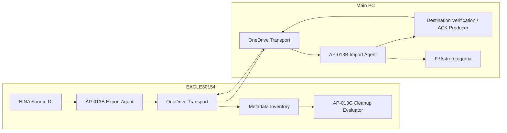

# DSDM-005 — Verified Transport Cleanup Solution Design

| Campo | Valore |
|---|---|
| Identificativo | DSDM-005 |
| Package | AP-013C |
| Stato | Accepted dry-run contract — productive cleanup not authorized |
| Versione | 0.2 |
| Data | 04/09/2026 |
| Runtime mode iniziale | `DRY_RUN / NO_DELETE` |
| ACK schema | `1.0` frozen for dry-run/OAT |

## 1. Purpose

Definire il solution design implementabile di AP-013C senza modificare l'intento enterprise di AP-013/AP-013B: il RAW resta immutabile, il trasporto resta no-overwrite, la source N.I.N.A. resta fuori dal cleanup e qualsiasi evidence incompleta deve fallire chiusa.

La versione 0.2 recepisce ARB-013C-C01, C02 e C06: inventario XISF/READY/ACK metadata-only, separazione tra candidacy tecnica e autorizzazione di cleanup, e freeze dello schema ACK 1.0 per la campagna dry-run/OAT.

## 2. Component model



### Responsibilities

- **AP-013B Export Agent**: invariato; produce XISF transport + READY.
- **AP-013B Import Agent**: mantiene comportamento COPY_ONLY; verifica transport/destination.
- **Destination Verification / ACK Producer**: materializza evidence persistente soltanto dopo verifica positiva della destinazione.
- **Metadata Inventory**: enumera path/nome di XISF, READY e ACK senza leggere/hashare bulk XISF; rende visibili orphan e combinazioni mancanti.
- **Cleanup Evaluator**: valida READY/ACK e calcola candidacy tecnica; non possiede autorità di delete.
- **Future Cleanup Controller**: fuori scope; richiederà retention approvata, OAT reale, ARB re-review e promotion esplicita.

## 3. Ports and adapters

### Verification Evidence Writer port

Input logico:

- READY manifest valido;
- destination path;
- destination size/hash verificati tramite primitive AP-013B.

Output:

- `<transport>.imported.json` scritto atomicamente nello stesso namespace OneDrive del READY.

### Cleanup Evidence Reader port

Input:

- transport root locale EAGLE.

Output per asset:

- lifecycle/evidence state;
- `TechnicalCandidate` boolean;
- `CleanupEligible=false` durante questa versione;
- `CleanupAuthorized=false` durante questa versione;
- reason code tecnico;
- policy reason code;
- evidence paths/identifiers;
- `Deleted=0`.

Il reader non possiede autorità di delete.

## 4. ACK contract

Schema **1.0**, congelato per dry-run e OAT AP-013C:

```json
{
  "SchemaVersion": "1.0",
  "State": "DESTINATION_VERIFIED",
  "FileName": "sample.xisf",
  "SizeBytes": 11897856,
  "Sha256": "...",
  "ReadyManifestSha256": "...",
  "DestinationPath": "F:\\Astrofotografia\\...\\sample.xisf",
  "DestinationSha256": "...",
  "VerifiedByHost": "PC",
  "VerifiedAtUtc": "2026-09-04T00:00:00Z",
  "CorrelationId": "..."
}
```

### Contract invariants

1. `State` è `DESTINATION_VERIFIED`.
2. `FileName`, `SizeBytes`, `Sha256` corrispondono al READY.
3. `DestinationSha256` corrisponde a `Sha256`.
4. `ReadyManifestSha256` lega l'ACK all'esatta evidence READY.
5. ACK viene pubblicato con temp-file + atomic rename.
6. ACK esistente e identico è idempotente.
7. ACK incompatibile è conflict/block, mai overwrite silenzioso.
8. Un futuro cambiamento incompatibile richiede nuova `SchemaVersion`; non si modifica silenziosamente 1.0.

## 5. Non-hydrating inventory and proof chain

L'evaluator EAGLE **non legge né hasha in massa gli XISF transport**. La discovery usa metadata filesystem (path/nome/presenza) per costruire l'unione degli asset osservati da:

- `*.xisf` esclusi i partial;
- `*.xisf.ready.json`;
- `*.xisf.imported.json`.

Questo rende classificabili almeno:

- XISF senza READY → `READY_MISSING`;
- ACK senza READY → `ORPHAN_ACK_READY_MISSING`;
- READY senza XISF → `TRANSPORT_PAYLOAD_MISSING`;
- READY senza ACK → `ACK_MISSING`;
- READY + XISF + ACK coerenti → candidacy tecnica, ancora policy-blocked.

La proof chain end-to-end deriva da:

1. READY creato dopo verifica XISF sul producer;
2. verifica XISF + destination sul PC tramite AP-013B;
3. ACK contenente hash scientifico e hash dell'esatto READY;
4. riconvergenza del piccolo ACK sul namespace EAGLE;
5. evaluator che verifica READY/ACK e relativo hash;
6. presenza metadata del payload transport necessaria prima di classificare la candidacy tecnica.

La presenza dell'XISF non sostituisce la proof chain e non richiede hashing EAGLE.

## 6. Sequence

```mermaid
sequenceDiagram
  participant E as EAGLE Export
  participant OD as OneDrive
  participant P as PC Import
  participant F as F:\Astrofotografia
  participant A as ACK Producer
  participant I as Metadata Inventory
  participant C as Cleanup Evaluator

  E->>OD: XISF + READY
  OD-->>P: converged XISF + READY
  P->>F: COPY_ONLY + verify size/SHA-256
  P->>A: verified result + READY
  A->>OD: atomic imported.json
  OD-->>I: ACK converged to EAGLE
  I->>I: enumerate XISF/READY/ACK metadata
  I->>C: correlated evidence paths
  C->>C: verify READY + ACK + READY hash
  C-->>C: TECHNICAL_CANDIDATE or BLOCKED
  Note over C: CleanupAuthorized=false; Deleted=0
```

## 7. Failure semantics

Reason codes dry-run:

- `READY_MISSING`
- `READY_INVALID`
- `ORPHAN_ACK_READY_MISSING`
- `TRANSPORT_PAYLOAD_MISSING`
- `ACK_MISSING`
- `ACK_INVALID`
- `ACK_READY_HASH_MISMATCH`
- `DESTINATION_HASH_MISMATCH`
- `TECHNICAL_CANDIDATE_POLICY_BLOCKED`

Policy reason corrente:

- `RETENTION_NOT_APPROVED`

Unknown reason o schema non supportato => block.

## 8. Candidacy versus authorization

Tre concetti sono distinti:

1. **TechnicalCandidate** — proof chain READY/ACK valida e payload transport osservato metadata-only.
2. **CleanupEligible** — resta `false` nella versione dry-run perché retention/promotion non sono approvate.
3. **CleanupAuthorized** — resta `false`; potrà diventare vero solo in una futura implementazione esplicitamente promossa dopo policy, OAT e ARB.

Pertanto una proof chain completa produce:

```text
State = TECHNICAL_CANDIDATE_DRY_RUN
TechnicalCandidate = true
CleanupEligible = false
CleanupAuthorized = false
ReasonCode = TECHNICAL_CANDIDATE_POLICY_BLOCKED
PolicyReasonCode = RETENTION_NOT_APPROVED
Deleted = 0
```

Nessun controller futuro può interpretare `TechnicalCandidate` come autorizzazione.

## 9. Retention boundary

La retention numerica non appartiene alla slice corrente. L'assenza di decisione non equivale a retention zero. Prima del productive cleanup devono essere approvati:

- retention/grace period;
- riferimento temporale;
- ACK freshness/expiry;
- retry cadence;
- comportamento OneDrive offline;
- retention READY/ACK post-cleanup.

## 10. Vertical slices and status

### C4-A — ACK Producer

Implementato in dry-run baseline: schema 1.0, binding al READY, atomicità, idempotenza, conflict block.

### C4-B — Dry-Run Evaluator

Implementato e corretto dopo ARB-013C: inventory metadata-only XISF/READY/ACK, orphan classification, technical candidacy separata da authorization, `Deleted=0`.

### C5 — Import integration

Implementato: ACK emesso dopo `COPIED_VERIFIED` e destination già presente/hash-identica, mantenendo AP-013B COPY_ONLY.

### C6 — Failure injection

CI sintetica riproduce 445 READY/426 ACK e riconvergenza; nessun delete. Dopo remediation ARB la stessa campagna deve confermare `TechnicalCandidates=426/445` e `CleanupAuthorized=0` in entrambi gli stati.

### C7 — Independent ARB

ARB-013C ha deciso `Approved with Conditions — DRY-RUN / NO-DELETE ONLY`. C01/C02/C06 sono oggetto della versione 0.2; C03 real OAT resta aperta; C04/C05 sono remediation di governance/documentation.

## 11. Security, safety and operations

- nessun secret nell'ACK;
- destination path è evidence operativa, non credenziale;
- nessun impatto su Safety Authority/interlock;
- nessuna cancellazione source/transport;
- source `D:\Images NINA\Target` invariata;
- rollback: ignorare ACK/evaluator e continuare AP-013B COPY_ONLY.

## 12. Acceptance before real OAT

- ACK schema 1.0 frozen;
- metadata inventory copre XISF/READY/ACK e orphan states;
- evaluator non forza bulk hydration;
- `TechnicalCandidate` distinto da `CleanupAuthorized`;
- retention non inventata;
- `CleanupAuthorized=0` e `Deleted=0` invarianti;
- failure injection 445/426 e regression suite verdi;
- governance e MkDocs riconciliati.

## 13. Open decisions before productive cleanup

- retention/grace period;
- retention READY/ACK dopo cleanup;
- transaction/crash-safe semantics del futuro delete;
- retry/cadence produttiva;
- promotion/rollback thresholds;
- real host-to-host OAT;
- ARB re-review dopo evidence reale.

## 14. Disposition

**GO** per dry-run e OAT non distruttiva.

**NO-GO** per delete produttivo.
