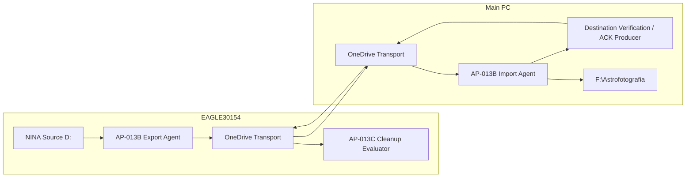
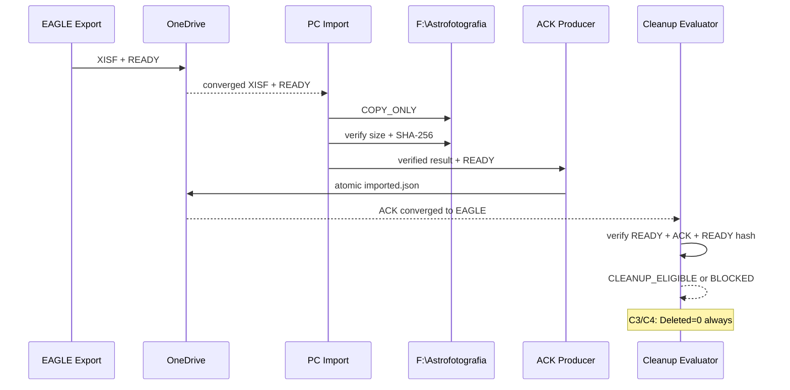

# DSDM-005 — Verified Transport Cleanup Solution Design

| Campo | Valore |
|---|---|
| Identificativo | DSDM-005 |
| Package | AP-013C |
| Stato | Proposed — C3/C4 solution baseline |
| Versione | 0.1 |
| Data | 04/09/2026 |
| Runtime mode iniziale | `DRY_RUN / NO_DELETE` |

## 1. Purpose

Definire il solution design implementabile di AP-013C senza modificare l'intento enterprise di AP-013/AP-013B: il RAW resta immutabile, il trasporto resta no-overwrite, la source N.I.N.A. resta fuori dal cleanup e qualsiasi evidence incompleta deve fallire chiusa.

## 2. Component model



### Responsibilities

- **AP-013B Export Agent**: invariato; produce XISF transport + READY.
- **AP-013B Import Agent**: invariato nel comportamento COPY_ONLY; verifica transport/destination.
- **Destination Verification / ACK Producer**: materializza una evidence persistente soltanto dopo verifica positiva della destinazione.
- **Cleanup Evaluator**: osserva evidence riconvergente lato EAGLE e calcola eligibility; nella prima slice non cancella nulla.
- **Future Cleanup Controller**: fuori dalla prima slice; richiederà promotion separata.

## 3. Ports and adapters

### Verification Evidence Writer port

Input logico:

- READY manifest valido;
- destination path;
- destination size/hash già verificati o verificabili tramite primitive AP-013B.

Output:

- `<transport>.imported.json` scritto atomicamente nello stesso namespace OneDrive del READY.

### Cleanup Evidence Reader port

Input:

- transport root locale EAGLE.

Output per asset:

- lifecycle state;
- `CleanupEligible` boolean;
- reason code;
- evidence paths/identifiers.

Il reader non possiede autorità di delete.

## 4. ACK contract

Schema `1.0`:

```json
{
  "SchemaVersion": "1.0",
  "State": "DESTINATION_VERIFIED",
  "FileName": "sample.xisf",
  "SizeBytes": 11897856,
  "Sha256": "...",
  "ReadyManifestSha256": "...",
  "DestinationPath": "F:\\Astrofotografia\\...\\sample.xisf",
  "DestinationSha256": "...",
  "VerifiedByHost": "PC",
  "VerifiedAtUtc": "2026-09-04T00:00:00Z",
  "CorrelationId": "..."
}
```

### Contract invariants

1. `State` deve essere `DESTINATION_VERIFIED`.
2. `FileName`, `SizeBytes`, `Sha256` devono corrispondere al READY.
3. `DestinationSha256` deve corrispondere a `Sha256`.
4. `ReadyManifestSha256` lega l'ACK all'esatta evidence READY, non solo al nome file.
5. ACK viene pubblicato con temp-file + atomic rename.
6. ACK esistente e identico è idempotente.
7. ACK esistente ma incompatibile è conflict/block, mai overwrite silenzioso.

## 5. Avoiding OneDrive hydration pressure

L'evaluator EAGLE **non deve leggere/hashare in massa gli XISF transport per decidere l'eligibility**. Questa scelta evita che file cloud-only vengano reidratati su `C:` soltanto per una scansione di cleanup.

La prova end-to-end deriva invece da:

1. READY creato dopo verifica XISF sul producer;
2. verifica XISF + destination sul PC tramite AP-013B;
3. ACK contenente hash scientifico e hash dell'esatto READY;
4. riconvergenza del piccolo ACK sul namespace EAGLE;
5. evaluator che verifica READY/ACK e relativo hash senza dover leggere il bulk payload XISF.

L'esistenza locale dell'XISF può essere osservata come informazione operativa, ma non deve causare hydration e non sostituisce il proof chain.

## 6. Sequence



## 7. Failure semantics

Reason codes iniziali:

- `READY_MISSING`
- `READY_INVALID`
- `ACK_MISSING`
- `ACK_INVALID`
- `ACK_READY_HASH_MISMATCH`
- `ASSET_HASH_MISMATCH`
- `DESTINATION_HASH_MISMATCH`
- `DESTINATION_NOT_VERIFIED`
- `RETENTION_NOT_APPROVED`
- `ELIGIBLE_DRY_RUN`

Il reason model è additive/versionabile. Unknown reason o schema non supportato => block.

## 8. Retention boundary

La retention numerica non appartiene alla slice C3/C4. Per evitare che l'assenza di una decisione venga interpretata come retention zero, il dry-run distingue:

- proof chain completa;
- eligibility tecnica candidata;
- promotion/retention non ancora autorizzate.

Nessun delete può essere inferito da `ELIGIBLE_DRY_RUN`.

## 9. Vertical slices

### Slice C4-A — ACK Producer

- aggiungere primitive per creare/verificare ACK;
- riusare `Get-DSGTransportSha256`;
- scrittura atomica;
- nessun delete;
- test idempotenza e conflict.

### Slice C4-B — Dry-Run Evaluator

- enumerare READY;
- correlare ACK;
- verificare `ReadyManifestSha256` e hash contract;
- classificare asset;
- generare JSON/CSV evidence;
- `Deleted = 0` hard-coded nel contratto della slice.

### Slice C5 — Import integration

- emettere ACK anche per `COPIED_VERIFIED` e per destination già presente ma hash-identica;
- mantenere AP-013B COPY_ONLY;
- regression test.

### Slice C6 — Failure injection / OAT

- riprodurre divergenza 445/445 vs 426/426;
- dimostrare no-delete;
- convergere, riverificare destination e dimostrare eligibility tecnica controllata.

## 10. Security, safety and operations

- nessun secret nell'ACK;
- destination path è evidence operativa, non credenziale;
- nessun impatto su Safety Authority/interlock;
- nessun Scheduled Task nuovo in C3/C4;
- nessuna cancellazione source/transport;
- rollback: ignorare ACK/evaluator e continuare AP-013B COPY_ONLY.

## 11. Acceptance C3/C4

- component boundaries definiti;
- ACK legato crittograficamente al READY tramite SHA-256;
- ACK atomic/idempotent;
- evaluator non forza bulk hydration;
- failure model fail-closed;
- retention non inventata;
- `Deleted=0` invariant della dry-run;
- test sintetici richiesti prima dell'OAT reale.

## 12. Open decisions before productive cleanup

- retention/grace period;
- retention READY/ACK dopo cleanup;
- transaction semantics del futuro delete;
- retry/cadence produttiva;
- promotion/rollback thresholds;
- ARB indipendente.
