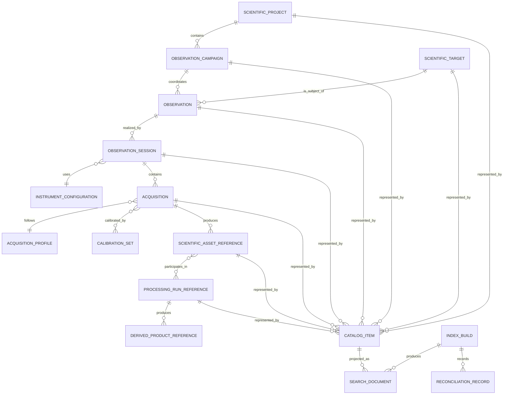

# AP14-W01 — Observation Catalog Conceptual Model

| Campo | Valore |
|---|---|
| Architecture Package | AP-014 — Scientific Observation Catalog and Search |
| Work Package | AP14-W01 — Observation Catalog Conceptual Model |
| Identificativo | SOCS-CM-001 |
| Versione | 1.0 |
| Data | 05/08/2026 |
| Autorità | Digital StarGate Chief Architect |
| Sponsor | Project Owner / Architecture Sponsor — Massimo Mainini |
| Stato | Conceptual baseline ready for review |
| Dipendenze | AP-014; AP-013; DSDM-001; DSDM-002; Scientific Data Engine 2.1 |
| Successivo | AP14-W02 — Logical Data Model and Identifier Standard |

## 1. Scopo

Questo documento definisce il modello concettuale del catalogo osservativo di Digital StarGate.

Il modello organizza il patrimonio scientifico attorno al significato dell'osservazione — progetto, campagna, target, sessione, acquisizione, calibrazione, asset e processing — anziché attorno ai soli file o path fisici.

Il catalogo è una proiezione read-only delle fonti autorevoli governate da AP-013. Non modifica asset, checksum, locator, provenance o stati di acceptance.

## 2. Obiettivi del modello

Il catalogo deve permettere di rispondere in modo verificabile a domande come:

- quali osservazioni sono state eseguite per un determinato target;
- quali sessioni appartengono allo stesso progetto o alla stessa campagna;
- quali acquisizioni usano una determinata configurazione strumentale;
- quanta integrazione esiste per target, filtro, setup o periodo;
- quali sessioni dispongono di calibration set compatibili;
- quali asset sono associati a una sessione o acquisizione;
- quali prodotti derivati provengono da una determinata osservazione;
- quali record sono incompleti, non riconciliati o non accettati;
- quali risultati possono essere esposti nell'Enterprise Search Center.

## 3. Boundary di autorità

| Dominio | Autorità |
|---|---|
| Asset scientifici, checksum, locator e integrità | AP-013 / Scientific Asset Registry |
| Processing run e provenance | AP-013 / Processing Provenance |
| Sessioni e metriche scientifiche correnti | Scientific Data Engine |
| Progetti, campagne, osservazioni e catalog item | AP-014 / Observation Catalog |
| Ricerca, ranking, facet e query | AP-014 / Search Service |
| Relazioni semantiche e knowledge graph | AP-015 |

Il catalogo conserva riferimenti alle entità autorevoli e non ne replica l'autorità.

## 4. Bounded context concettuali

| Context | Responsabilità |
|---|---|
| Scientific Planning | progetto, campagna, obiettivo scientifico e priorità |
| Target Registry | nome canonico, alias, coordinate e riferimenti di catalogo |
| Observation Management | intento osservativo, stato e relazione con target e campagna |
| Session Catalog | sessioni, date, condizioni, configurazione e qualità |
| Acquisition Catalog | sequenze omogenee di frame, filtro, esposizione e integrazione |
| Calibration Context | calibration set, compatibilità e periodo di validità |
| Scientific Asset Projection | riferimenti read-only agli asset di AP-013 |
| Processing Projection | riferimenti read-only a run, workflow e prodotti derivati |
| Indexing and Reconciliation | catalog item, search document, index build e reconciliation |

## 5. Modello concettuale



Il diagramma descrive relazioni di dominio. Non costituisce ancora uno schema fisico o relazionale definitivo.

## 6. Entità canoniche

### 6.1 ScientificProject

Rappresenta un'iniziativa scientifica, fotografica o tecnica che raggruppa una o più campagne.

Attributi candidati:

- `projectId`;
- `projectName`;
- `objective`;
- `projectType`;
- `priority`;
- `status`;
- `ownerId`;
- `startedAt`;
- `targetCompletionDate`;
- `completedAt`;
- `notes`.

Stati candidati:

`PLANNED`, `ACTIVE`, `ON_HOLD`, `READY_FOR_PROCESSING`, `PROCESSING`, `REVIEW`, `COMPLETED`, `ARCHIVED`.

### 6.2 ObservationCampaign

Raggruppa osservazioni coordinate da un obiettivo comune, una finestra temporale o una strategia di acquisizione.

Attributi candidati:

- `campaignId`;
- `projectId`;
- `campaignName`;
- `objective`;
- `validFrom`;
- `validTo`;
- `status`;
- `requiredTargets`;
- `requiredFilters`;
- `completionCriteria`;
- `notes`.

Una campagna appartiene a un solo progetto; un progetto può contenere zero o più campagne.

### 6.3 ScientificTarget

Rappresenta l'oggetto, il campo o la regione astronomica osservata.

Attributi candidati:

- `targetId`;
- `canonicalName`;
- `alternativeNames`;
- `targetType`;
- `rightAscension`;
- `declination`;
- `constellation`;
- `catalogReferences`;
- `fieldCenter`;
- `notes`.

Regole:

- il nome canonico è unico nel relativo namespace;
- gli alias non possono identificare target differenti senza una regola di disambiguazione;
- coordinate non note restano `unknown`;
- nessun alias viene inferito automaticamente senza una fonte dichiarata.

### 6.4 Observation

Rappresenta l'intento osservativo verso un target in un contesto di progetto o campagna.

Attributi candidati:

- `observationId`;
- `campaignId`;
- `targetId`;
- `observationTitle`;
- `scientificObjective`;
- `observationMode`;
- `priority`;
- `status`;
- `requiredIntegrationByFilter`;
- `achievedIntegrationByFilter`;
- `completionState`;
- `notes`.

Una Observation può essere realizzata da più sessioni; ogni sessione appartiene a una sola Observation primaria.

### 6.5 ObservationSession

Rappresenta una finestra osservativa operativa, normalmente una notte o una parte di notte.

Attributi candidati:

- `sessionId`;
- `observationId`;
- `startedAtUtc`;
- `completedAtUtc`;
- `localObservingDate`;
- `observatoryId`;
- `instrumentConfigurationId`;
- `operatorId`;
- `sessionStatus`;
- `qualityState`;
- `weatherSummary`;
- `moonContext`;
- `sourceReference`;
- `transferState`;
- `notes`.

Regole:

- `sessionId` è stabile e indipendente dal path;
- una sessione che supera la mezzanotte mantiene un solo identificatore;
- `startedAtUtc <= completedAtUtc` quando entrambi sono noti;
- una sessione non può essere `ACCEPTED` se è priva di osservazione e configurazione strumentale.

### 6.6 InstrumentConfiguration

Rappresenta la configurazione effettivamente usata da una sessione.

Attributi candidati:

- `instrumentConfigurationId`;
- `observatoryId`;
- `telescopeId`;
- `cameraId`;
- `mountId`;
- `focuserId`;
- `filterWheelId`;
- `correctorOrReducer`;
- `effectiveFocalLengthMm`;
- `effectiveFocalRatio`;
- `pixelScaleArcsec`;
- `configurationVersion`;
- `validFrom`;
- `validTo`.

Una variazione significativa di OTA, camera, riduttore/correttore, scala o catena ottica genera una nuova versione.

### 6.7 AcquisitionProfile

Descrive una configurazione omogenea di acquisizione riutilizzabile.

Attributi candidati:

- `acquisitionProfileId`;
- `imageType`;
- `filterId`;
- `exposureSeconds`;
- `binning`;
- `gain`;
- `offset`;
- `sensorTemperatureC`;
- `frameCountPlanned`;
- `ditherStrategy`;
- `notes`.

### 6.8 Acquisition

Rappresenta una sequenza omogenea di frame acquisiti nella stessa sessione con lo stesso profilo.

Attributi candidati:

- `acquisitionId`;
- `sessionId`;
- `acquisitionProfileId`;
- `sequenceNumber`;
- `startedAtUtc`;
- `completedAtUtc`;
- `frameCountPlanned`;
- `frameCountCaptured`;
- `frameCountAccepted`;
- `frameCountRejected`;
- `integrationSecondsCaptured`;
- `integrationSecondsAccepted`;
- `qualityState`;
- `notes`.

Regole:

- `frameCountAccepted + frameCountRejected <= frameCountCaptured`;
- l'integrazione accettata non può superare quella catturata;
- ogni Acquisition appartiene a una sola sessione;
- una sessione può contenere zero o più Acquisition.

### 6.9 CalibrationSet

Rappresenta un insieme governato di calibrazioni compatibili con una o più Acquisition.

Attributi candidati:

- `calibrationSetId`;
- `calibrationType`;
- `instrumentConfigurationId`;
- `cameraId`;
- `filterId`;
- `exposureSeconds`;
- `gain`;
- `offset`;
- `sensorTemperatureC`;
- `validFrom`;
- `validTo`;
- `qualityState`;
- `assetReferences`;
- `notes`.

La compatibilità è una relazione dichiarata e verificabile; non viene inferita soltanto dal nome file.

### 6.10 ScientificAssetReference

Riferimento read-only a un asset governato da AP-013.

Attributi candidati:

- `assetId`;
- `assetClass`;
- `authoritativeRegistry`;
- `checksumReference`;
- `locatorReference`;
- `format`;
- `sizeBytes`;
- `integrityState`;
- `qualityState`;
- `sourceEntityType`;
- `sourceEntityId`.

Il catalogo non modifica questi attributi; li proietta dalla fonte autorevole.

### 6.11 ProcessingRunReference

Riferimento read-only a un processing run governato da AP-013.

Attributi candidati:

- `processingRunId`;
- `workflowDefinitionId`;
- `processingEnvironmentId`;
- `startedAtUtc`;
- `completedAtUtc`;
- `runStatus`;
- `qualityState`;
- `inputAssetIds`;
- `outputAssetIds`;
- `evidenceReference`.

### 6.12 DerivedProductReference

Proiezione di un asset derivato con significato di prodotto.

Attributi candidati:

- `productId`;
- `assetId`;
- `productClass`;
- `processingRunId`;
- `version`;
- `qualityState`;
- `publicationState`;
- `supersedesProductId`;
- `notes`.

### 6.13 CatalogItem

Rappresenta il record normalizzato che collega un'entità di dominio al catalogo.

Attributi candidati:

- `catalogItemId`;
- `entityType`;
- `entityId`;
- `sourceSystem`;
- `sourceVersion`;
- `sourceDigest`;
- `catalogState`;
- `qualityState`;
- `indexedAt`;
- `lastReconciledAt`;
- `reconciliationState`.

Stati candidati di `catalogState`:

`DISCOVERED`, `NORMALIZED`, `INDEXABLE`, `INDEXED`, `SUPERSEDED`, `WITHDRAWN`.

### 6.14 SearchDocument

Proiezione ottimizzata per ricerca e faceting.

Attributi candidati:

- `searchDocumentId`;
- `catalogItemId`;
- `documentType`;
- `title`;
- `summary`;
- `normalizedText`;
- `keywords`;
- `targetId`;
- `projectId`;
- `campaignId`;
- `sessionId`;
- `instrumentConfigurationId`;
- `observationDate`;
- `qualityState`;
- `processingState`;
- `facetValues`;
- `sourceUrl`;
- `rankingSignals`.

### 6.15 IndexBuild

Rappresenta un'esecuzione deterministica della pipeline di indicizzazione.

Attributi candidati:

- `indexBuildId`;
- `algorithmVersion`;
- `sourceSnapshotDigest`;
- `startedAtUtc`;
- `completedAtUtc`;
- `documentCount`;
- `failureCount`;
- `outputDigest`;
- `buildStatus`;
- `evidenceReference`.

### 6.16 ReconciliationRecord

Registra il confronto fra catalogo derivato e fonti autorevoli.

Attributi candidati:

- `reconciliationRecordId`;
- `indexBuildId`;
- `catalogItemId`;
- `sourceDigestExpected`;
- `sourceDigestObserved`;
- `reconciliationState`;
- `differenceType`;
- `detectedAtUtc`;
- `resolvedAtUtc`;
- `resolutionReference`.

Stati candidati:

`MATCHED`, `MISSING_SOURCE`, `MISSING_PROJECTION`, `STALE_PROJECTION`, `CONFLICT`, `RESOLVED`.

## 7. Cardinalità principali

| Relazione | Cardinalità |
|---|---|
| ScientificProject → ObservationCampaign | 1 : 0..N |
| ObservationCampaign → Observation | 1 : 0..N |
| ScientificTarget → Observation | 1 : 0..N |
| Observation → ObservationSession | 1 : 0..N |
| ObservationSession → InstrumentConfiguration | N : 1 |
| ObservationSession → Acquisition | 1 : 0..N |
| Acquisition → AcquisitionProfile | N : 1 |
| Acquisition ↔ CalibrationSet | N : M |
| Acquisition → ScientificAssetReference | 1 : 0..N |
| ScientificAssetReference ↔ ProcessingRunReference | N : M |
| ProcessingRunReference → DerivedProductReference | 1 : 0..N |
| Domain Entity → CatalogItem | 1 : 0..N versioni/proiezioni |
| CatalogItem → SearchDocument | 1 : 0..N versioni indicizzate |
| IndexBuild → SearchDocument | 1 : 0..N |
| IndexBuild → ReconciliationRecord | 1 : 0..N |

## 8. Identificatori stabili

| Entità | Formato candidato |
|---|---|
| Project | `PRJ-YYYY-NNN` |
| Campaign | `CAM-YYYY-NNN` |
| Target | `TGT-<namespace>-<canonical-key>` |
| Observation | `OBS-YYYYMMDD-NNN` |
| Session | identificatore stabile già governato dal Scientific Data Engine |
| Acquisition Profile | `ACP-<configuration-id>-NNN` |
| Acquisition | `ACQ-<session-id>-NNN` |
| Calibration Set | `CAL-YYYYMM-NNN` |
| Catalog Item | `CAT-<entity-type>-<stable-id>` |
| Search Document | `SRCH-<catalog-item-id>-<index-version>` |
| Index Build | `IDX-YYYYMMDDTHHMMSSZ` |
| Reconciliation Record | `REC-<index-build-id>-NNN` |

Regole generali:

- gli identificatori non dipendono da path, lettere di unità o nomi file;
- non vengono riutilizzati dopo withdrawal o supersession;
- eventuali correzioni generano una nuova versione o relazione di supersession;
- il formato finale sarà congelato in AP14-W02.

## 9. Vocabolari controllati baseline

### 9.1 QualityState

`UNKNOWN`, `PENDING`, `ACCEPTABLE`, `ACCEPTED`, `REJECTED`, `DEGRADED`, `SUPERSEDED`.

### 9.2 SessionStatus

`PLANNED`, `READY`, `RUNNING`, `COMPLETED`, `PARTIAL`, `FAILED`, `CANCELLED`, `ACCEPTED`, `ARCHIVED`.

### 9.3 ObservationMode

`BROADBAND`, `NARROWBAND`, `LUMINANCE`, `RGB`, `SHO`, `HOO`, `LRGB`, `SURVEY`, `CALIBRATION`, `ENGINEERING`, `OTHER`.

### 9.4 ImageType

`LIGHT`, `DARK`, `FLAT`, `BIAS`, `DARKFLAT`, `OTHER`.

### 9.5 ProcessingState

`NOT_STARTED`, `CALIBRATING`, `REGISTERING`, `INTEGRATING`, `PROCESSING`, `REVIEW`, `ACCEPTED`, `REJECTED`, `SUPERSEDED`.

### 9.6 ReconciliationState

`MATCHED`, `MISSING_SOURCE`, `MISSING_PROJECTION`, `STALE_PROJECTION`, `CONFLICT`, `RESOLVED`.

## 10. Regole di integrità concettuali

1. Ogni Observation deve riferirsi a un solo ScientificTarget primario.
2. Ogni ObservationSession deve riferirsi a una sola Observation primaria.
3. Ogni ObservationSession deve usare una sola InstrumentConfiguration versionata.
4. Ogni Acquisition deve appartenere a una sola sessione e usare un solo AcquisitionProfile.
5. Una Acquisition non può dichiarare più frame accettati di quelli catturati.
6. L'integrazione accettata non può superare l'integrazione catturata.
7. Una CalibrationSet può essere associata a una Acquisition solo tramite una regola di compatibilità esplicita.
8. Un ScientificAssetReference deve puntare a un asset esistente nel registro autorevole di AP-013.
9. Un ProcessingRunReference deve puntare a una processing run esistente e non inventata dal catalogo.
10. Ogni CatalogItem deve conservare `sourceSystem`, `sourceVersion` e `sourceDigest`.
11. Ogni SearchDocument deve essere riconducibile a un CatalogItem.
12. Ogni IndexBuild deve dichiarare versione algoritmo, digest input e digest output.
13. I record in conflitto non possono essere promossi a `INDEXED` senza una policy esplicita.
14. `unknown` è un valore valido; stringa vuota e valore inventato non lo sono.
15. Nessuna operazione del catalogo può modificare checksum, locator o provenance autorevoli.

## 11. Eventi di dominio candidati

- `project-created`;
- `campaign-created`;
- `observation-created`;
- `session-linked`;
- `acquisition-normalized`;
- `calibration-associated`;
- `asset-reference-resolved`;
- `processing-reference-resolved`;
- `catalog-item-created`;
- `catalog-item-updated`;
- `catalog-item-superseded`;
- `index-build-started`;
- `index-build-completed`;
- `index-build-failed`;
- `reconciliation-difference-detected`;
- `reconciliation-resolved`.

Gli eventi descrivono cambiamenti del catalogo; non sono comandi verso sistemi operativi o dispositivi fisici.

## 12. Query abilitate dal modello

Il modello supporta query come:

```text
target:LDN1320 date:2026-07 filter:LPRO
project:PRJ-2026-001 status:ACTIVE
campaign:CAM-2026-001 telescope:"Quattro 200P"
session:2026-07-09 quality:ACCEPTED
missing:calibration processing:NOT_STARTED
assetClass:RAW_ORIGINAL integrity:VERIFIED
```

Le regole sintattiche e il ranking saranno definite in AP14-W04.

## 13. Aspetti non ancora definiti

Questa baseline non stabilisce ancora:

- tecnologia database o motore indice;
- schema fisico;
- API REST o GraphQL;
- serializzazione definitiva JSON/Parquet;
- tassonomia astronomica completa;
- algoritmo definitivo di alias resolution;
- soglie di performance;
- regole finali di compatibilità delle calibrazioni;
- integrazione operativa con PixInsight;
- policy di pubblicazione esterna.

Questi elementi appartengono ai work package successivi.

## 14. Acceptance criteria AP14-W01

AP14-W01 può essere dichiarato completato quando:

- entità e bounded context sono documentati;
- cardinalità principali sono esplicite;
- identificatori candidati sono definiti;
- vocabolari baseline sono versionati;
- regole di integrità concettuali sono approvate;
- boundary con AP-013, Scientific Data Engine e AP-015 è chiaro;
- il modello è accettato come input di AP14-W02.

## 15. Decisione

Il modello concettuale `SOCS-CM-001` è dichiarato **ready for review**.

Il prossimo incremento è `AP14-W02 — Logical Data Model and Identifier Standard`.