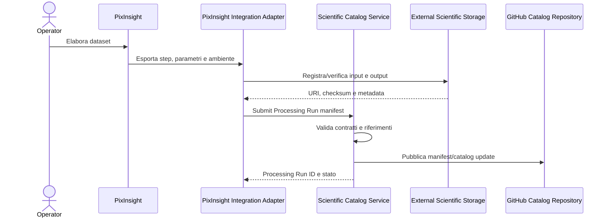

# SIR-VIS-001 — Scientific Image Lifecycle and Processing Provenance Vision

| Campo | Valore |
|---|---|
| Documento | Scientific Image Lifecycle and Processing Provenance Vision |
| Identificativo | SIR-VIS-001 |
| Programma | Digital StarGate |
| Repository | `maininimassimo-bit/digital-stargate-manual` |
| Branch | `main` |
| Data | 30/07/2026 |
| Autorità | Project Owner / Architecture Sponsor — Massimo Mainini |
| Stato | Approved for architecture planning |
| Package correlati | AP-013, AP-014 |
| Capability correlate | CAP-37, CAP-38, CAP-39 |

## 1. Scopo

Questa vision definisce il modello target per conservare, catalogare e rendere verificabile l'intero ciclo di vita delle immagini scientifiche di Digital StarGate, dalla sessione di acquisizione fino ai prodotti finali elaborati con PixInsight.

I file RAW e gli altri artefatti binari ad alto volume sono conservati in uno storage separato. GitHub mantiene il catalogo autorevole, i metadati, i manifest, i checksum, i riferimenti allo storage, le definizioni dei workflow e la storia delle elaborazioni; non diventa lo storage primario dei RAW.

## 2. Driver architetturali

- preservare i RAW originali come asset immutabili;
- collegare ogni file a sessione, target, strumentazione e condizioni osservative;
- rendere riproducibile il trattamento PixInsight;
- distinguere workflow dichiarato, esecuzione effettiva e prodotto generato;
- automatizzare l'acquisizione dei metadati di processing tramite script o moduli integrati in PixInsight;
- evitare commit di file binari voluminosi in GitHub;
- consentire ricerca, audit, confronto e analytics sul processo di elaborazione.

## 3. Boundary e responsabilità

### External Scientific Storage

Conserva:

- RAW/FITS originali;
- calibration frame e master;
- file calibrati, registrati e integrati;
- progetti PixInsight;
- file XISF, TIFF e altri intermedi;
- immagini finali e versioni pubblicabili;
- preview e thumbnail, quando non pubblicate direttamente nel catalogo.

### GitHub Scientific Catalog

Conserva:

- observation e processing identifier;
- URI logici o locator verso lo storage esterno;
- checksum e dimensione degli asset;
- manifest di sessione e di processing;
- workflow definition versionate;
- script PixInsight e relativi test;
- cronologia delle processing run;
- provenance graph;
- collegamenti a report, analytics e prodotti finali.

### PixInsight Integration Adapter

È un adapter infrastrutturale. Raccoglie e normalizza dati da PixInsight senza introdurre dipendenze dal prodotto nel Domain.

Responsabilità previste:

- esportare il workflow applicato;
- registrare processi, ordine, parametri e maschere utilizzate;
- rilevare script, process icon, process container o pipeline invocate;
- registrare versione di PixInsight, moduli e script;
- produrre manifest machine-readable;
- calcolare o richiedere checksum degli input e output;
- associare la run a sessione, dataset e prodotti derivati;
- sincronizzare il manifest con il catalogo GitHub tramite un servizio applicativo autorizzato.

## 4. Modello di provenance

Ogni elaborazione è rappresentata da una `Processing Run` immutabile.

```text
Observation Session
    |
    +--> Raw Asset Set
            |
            +--> Processing Run
                    |
                    +--> Workflow Definition
                    +--> PixInsight Environment
                    +--> Ordered Processing Steps
                    +--> Input Asset References
                    +--> Output Asset References
                    +--> Parameters and Masks
                    +--> Quality Measurements
                    +--> Operator and Timestamp
```

Una modifica al workflow o ai parametri genera una nuova Processing Run. Non modifica retroattivamente una run precedente.

## 5. Contratto minimo della Processing Run

Il contratto canonico dovrà includere almeno:

- `processingRunId`;
- `observationSessionId`;
- `workflowId` e `workflowVersion`;
- `startedAt` e `completedAt`;
- operatore o service identity;
- versione PixInsight;
- versione degli script e dei moduli rilevanti;
- lista ordinata degli step;
- identificatore del processo;
- parametri normalizzati;
- riferimenti a mask, preview e ROI;
- input asset con URI e checksum;
- output asset con URI e checksum;
- stato della run;
- warning, errori e step manuali dichiarati;
- metriche qualità prima/dopo, quando disponibili;
- correlation ID e provenance parent.

I valori non acquisibili automaticamente devono essere dichiarati `unknown` o inseriti manualmente; non devono essere inventati.

## 6. Workflow di sincronizzazione target



La pubblicazione GitHub può avvenire tramite pull request, commit automatizzato su branch dedicato o altra modalità governata da AP-008 e AP-014. Gli script PixInsight non devono possedere credenziali GitHub a privilegi elevati.

## 7. Automazione PixInsight

L'automazione sarà progettata per incrementi:

1. **Export manuale assistito** — script che genera un manifest locale da allegare alla sessione.
2. **Sync controllata** — adapter locale che valida e invia il manifest al catalog service.
3. **Capture automatica** — registrazione degli step supportati direttamente durante o al termine del workflow.
4. **Quality enrichment** — associazione automatica di metriche e confronti input/output.

L'implementazione dovrà valutare JavaScript Runtime di PixInsight, process history disponibile nei formati supportati, metadata XISF e script custom. La scelta tecnica definitiva appartiene ad AP-013/AP-014 e richiede un proof of concept.

## 8. Regole architetturali

1. **Scientific images are immutable assets.** I RAW non vengono modificati o sostituiti.
2. **Derived assets have explicit provenance.** Ogni prodotto derivato deve indicare input, workflow e run che lo hanno generato.
3. **GitHub stores knowledge, not bulk pixels.** GitHub conserva catalogo, manifest, workflow e link; lo storage esterno conserva i binari voluminosi.
4. **Workflow definition and execution history are separate.** Una ricetta versionata non prova che sia stata eseguita.
5. **Automation must preserve manual truth.** Gli step non acquisibili automaticamente devono essere dichiarati, non omessi silenziosamente.
6. **No privileged credentials inside PixInsight scripts.** La sincronizzazione usa un adapter o service boundary con privilegi minimi.
7. **Checksums anchor provenance.** Gli asset critici sono identificati anche tramite checksum, non soltanto tramite path mutabili.

## 9. Integrazioni

- AP-002 governa classificazione, retention, lineage e contratti dati.
- AP-006 governa configurazioni, versioni PixInsight, script e baseline software.
- AP-008 governa API, adapter, autenticazione e affidabilità della sincronizzazione.
- AP-009 governa storage, backup, capacità e disaster recovery.
- AP-011 consuma metadata e provenance per analytics e confronti.
- AP-013 governa asset, storage lifecycle e processing provenance.
- AP-014 governa catalogo, ricerca, indicizzazione e pubblicazione GitHub.

## 10. Rischi principali

| Rischio | Trattamento |
|---|---|
| Process history PixInsight incompleta o non esportabile | PoC, step manuali dichiarati e schema estensibile |
| Path storage modificati | URI logici, asset ID e checksum |
| Manifest non coerente con gli output | validazione atomica e reconciliation |
| Credenziali esposte negli script | adapter locale e least privilege |
| Workflow troppo dettagliati o non confrontabili | modello canonico più payload vendor-specific opzionale |
| Commit automatici rumorosi | batching, branch dedicato e policy di pubblicazione |
| Perdita di provenance durante elaborazioni manuali | checkpoint e dichiarazione esplicita degli step manuali |

## 11. Acceptance criteria per AP-013/AP-014

- schema machine-readable per asset, workflow e Processing Run;
- identificatori stabili e checksum per input/output;
- separazione tra storage binario e catalogo GitHub;
- PoC PixInsight che esporta almeno ambiente, step supportati, parametri e output;
- gestione esplicita degli step manuali o non osservabili;
- autenticazione senza secret privilegiati nello script;
- idempotenza, retry e reconciliation della sincronizzazione;
- versionamento di workflow, script e contratti;
- ricerca per sessione, target, strumento, workflow, processo, versione e qualità;
- audit trail e validation matrix;
- backup e recovery testati per catalogo e manifest.

## 12. Validazioni

### Eseguite

- verifica della roadmap AMP-002;
- ricerca repository dei riferimenti PixInsight;
- verifica della presenza di riferimenti PixInsight nella capability Observation Session e nella Development Guide;
- verifica del modello corrente GitHub come repository documentale e di catalogo.

### Non eseguite

- prova tecnica del runtime JavaScript PixInsight;
- esportazione reale di process history;
- test XISF metadata;
- sincronizzazione con storage esterno;
- commit o pull request generati automaticamente da script;
- performance, sicurezza e failure testing.

## 13. Decisione

La processing provenance PixInsight è inclusa nella roadmap come parte integrante di AP-013 e AP-014 e abilita la nuova capability CAP-39 — Scientific Processing Provenance. Non costituisce ancora implementazione né prova di sincronizzazione automatica.