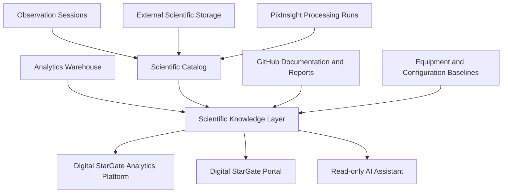

# SKL-VIS-001 — Digital StarGate Scientific Knowledge Layer Vision

| Campo | Valore |
|---|---|
| Documento | Scientific Knowledge Layer Vision |
| Identificativo | SKL-VIS-001 |
| Programma | Digital StarGate |
| Repository | `maininimassimo-bit/digital-stargate-manual` |
| Branch | `main` |
| Data | 30/07/2026 |
| Autorità | Project Owner / Architecture Sponsor — Massimo Mainini |
| Stato | Superseded by AP-015 Accepted / Post-Merge Verified design baseline |
| Package futuro | AP-015 — Scientific Knowledge Platform Architecture |
| Capability | CAP-40 — Scientific Knowledge Layer |

## 1. Scopo

La Scientific Knowledge Layer (SKL) unifica semanticamente il patrimonio informativo prodotto dall'osservatorio senza sostituire le fonti autorevoli esistenti. Collega osservazioni, sessioni, asset scientifici, workflow PixInsight, processing run, strumenti, condizioni ambientali, qualità, report e prodotti finali in una rete di conoscenza interrogabile e tracciabile.

La SKL non è lo storage dei RAW, non è il Data Warehouse e non è il catalogo GitHub. È un livello semantico governato che riferisce tali sistemi mediante identificatori, contratti e provenance.

## 2. Driver architetturali

- preservare la conoscenza scientifica accumulata nel tempo;
- rendere ricercabili relazioni che attraversano sessioni, immagini, workflow e risultati;
- supportare DSAP, DSGP e il futuro AI Assistant con dati citabili e governati;
- evitare duplicazioni tra Warehouse, Scientific Catalog e documentazione GitHub;
- consentire analisi riproducibili e confronto tra acquisizione, processing e risultato;
- mantenere provenance, ownership, classificazione e retention esplicite.

## 3. Concetti canonici

| Concetto | Descrizione |
|---|---|
| Knowledge Entity | Entità semanticamente identificata, come target, sessione, asset, strumento, workflow o report |
| Knowledge Relation | Relazione tipizzata e versionata tra entità |
| Scientific Claim | Affermazione derivata da evidenze, con fonte, metodo e livello di confidenza |
| Provenance Chain | Catena osservazione → asset → processing run → prodotto → report |
| Knowledge Projection | Vista derivata per ricerca, analytics o AI; non fonte autorevole |
| Citation Locator | Riferimento verificabile a documento, manifest, checksum, asset o data product |

## 4. Architettura target

## 5. Boundary e autorità

- lo storage esterno resta autorevole per i file binari scientifici;
- il Scientific Catalog resta autorevole per asset ID, URI, checksum, manifest e processing provenance;
- il Warehouse resta autorevole per data product analitici curati;
- GitHub resta autorevole per architettura, documentazione, workflow versionati e report pubblicati;
- la SKL conserva relazioni, indici e projection semanticamente governate, ma non modifica silenziosamente le fonti;
- eventuali conflitti sono esposti come data issue o knowledge conflict, non risolti automaticamente.

## 6. Modello di integrazione

La SKL sarà alimentata tramite contratti e adapter definiti da AP-008. La materializzazione potrà usare un indice documentale, un grafo o un modello ibrido, ma la scelta tecnologica sarà separata dal modello semantico.

Ogni ingestione deve essere:

- idempotente;
- versionata;
- riconciliabile;
- osservabile;
- collegata alla fonte;
- reversibile a livello di projection.

## 7. Casi d'uso

- trovare tutte le elaborazioni di un target e confrontare workflow e qualità;
- risalire da un'immagine finale ai RAW, alle calibrazioni e ai parametri PixInsight;
- correlare seeing, SQM, setup, filtri e risultati;
- individuare sessioni o asset privi di provenance completa;
- produrre report scientifici con citazioni verificabili;
- fornire contesto governato al futuro AI Assistant senza accesso diretto ai RAW;
- supportare knowledge search trasversale nel DSGP.

## 8. Sicurezza, privacy e safety

La SKL è inizialmente read-only rispetto ai sistemi operativi. Non costituisce safety authority e non può autorizzare comandi agli apparati. Accesso, classificazione, auditing e least privilege seguono AP-005 e AP-008.

## 9. Migrazione incrementale

1. Definire identificatori e vocabolario minimo.
2. Collegare sessioni, asset e processing run esistenti.
3. Integrare report, configurazioni e data product.
4. Pubblicare ricerca e viste nel DSGP.
5. Abilitare analytics scientifiche in DSAP.
6. Abilitare retrieval citabile per AI read-only.

## 10. Dipendenze

AP-015 dipende almeno da AP-002, AP-006, AP-008, AP-011, AP-013 e AP-014. Può iniziare con un modello semantico preliminare dopo AP-014, ma non deve selezionare una tecnologia definitiva prima della stabilizzazione dei contratti e dei volumi.

## 11. Acceptance criteria

    - CAP-40 registrata come architecture baseline accepted; implementation remains `Planned`;
- AP-015 registrato nella roadmap dopo AP-014;
- fonti autorevoli e boundary espliciti;
- modello minimo di entità, relazioni, claim e citation locator;
- nessuna duplicazione fisica obbligatoria dei RAW;
- provenance end-to-end interrogabile;
- integrazione prevista con DSAP, DSGP e AI read-only;
- conflitti e dati mancanti rappresentati esplicitamente;
- validazioni runtime separate dalla vision documentale.

## 12. Rischi aperti

- proliferazione incontrollata di entità e relazioni;
- conflitti tra fonti non governati;
- scarsa qualità dei metadata storici;
- scelta prematura di graph database o vector database;
- assenza di ownership sul vocabolario scientifico;
- uso AI che trasforma inferenze in fatti non verificati;
- costi di indicizzazione, retention e reprocessing.

## 13. Validazioni

### Eseguite

- verifica della roadmap AMP-002;
- verifica di CAP-37…CAP-39 e AP-013/AP-014;
- verifica del metamodel e del traceability register;
- verifica della separazione tra storage, catalogo, Warehouse e GitHub.

### Non eseguite

- proof of concept di knowledge graph o semantic index;
- definizione machine-readable del vocabolario;
- test di ingestione, reconciliation o query;
- valutazione vector search o RAG;
- `mkdocs build --strict` e link checker.

## 14. Decisione

La Scientific Knowledge Layer è approvata come capability trasversale CAP-40 a livello di architecture/design baseline tramite AP-015. L’implementazione, la materializzazione tecnologica e qualsiasi runtime restano pianificati e separatamente governati.
