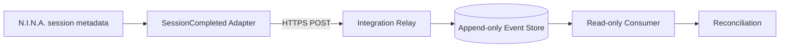

# DSG-SOL-SESSIONCOMPLETED-001 — SessionCompleted Read-only Transport

| Campo | Valore |
|---|---|
| Identificativo | DSG-SOL-SESSIONCOMPLETED-001 |
| Package | AP-008 |
| Owner / Accountable | Massimo Mainini |
| Stato | Proposed — not operationally authorized |
| Scope | read-only SessionCompleted event transport |
| Safety class | non_safety |
| Runtime authorization | NONE |

## 1. Scopo

Definire il trasporto candidato per l'evento
`DSG.Observation.Event.SessionCompleted` dalla sessione completata su EAGLE verso
consumer read-only del repository/analytics/portal.

La proposta riusa il pattern già documentato per il transport Observatory Status:
publisher outbound HTTPS, relay separato e query/replay read-only. Non attiva
runtime, broker, scheduler, command path o Safety Authority.

## 2. Decisione proposta

Il percorso candidato è:

L'EAGLE effettua solo connessioni outbound. Il relay valida autenticazione,
schema, provenance e idempotency; il consumer non riceve credenziali di ingest.

## 3. Semantica dell'evento

A differenza di uno snapshot corrente, `SessionCompleted` è un fatto immutabile:

- `message_id` identifica l'evento;
- `session_id + manifest_sha256` costituiscono l'identità funzionale;
- una consegna duplicata produce `NO_OP`;
- un esito sconosciuto dopo il POST richiede query/reconciliation, non retry cieco;
- il payload contiene riferimenti e checksum, non file binari, secret o comandi;
- `runtime_published=false` resta obbligatorio finché il live gate non è approvato.

Lo schema shadow v1 resta limitato all'evidenza repository-only. Un contratto live
dovrà avere una compatibility review distinta.

## 4. Boundary e sicurezza

### EAGLE -> Relay

- HTTPS/TLS obbligatorio;
- credential scoped esclusivamente all'ingest;
- credential fuori dal repository e fuori dai log;
- timeout esplicito;
- retry limitato a timeout, rete, 408, 429 e 5xx;
- nessun retry automatico su 400, 401, 403, 409 o 422;
- validazione di schema, timestamp, session identity, manifest digest e source identity.

### Consumer -> Relay

- query/replay read-only;
- nessuna credential di ingest nel browser;
- accesso limitato al consumer registrato;
- audit di letture, replay e divergence;
- dati stale, mancanti o non autenticati non sono promossi a current.

### Safety

Il percorso non chiama N.I.N.A., PHD2, CPWI, ASCOM, dome, mount, camera,
relay o PLC per impartire comandi. Gli interlock fisici e la Local Safety Authority
restano indipendenti e prevalenti.

## 5. Delivery slices

| Slice | Contenuto | Gate |
|---|---|---|
| S1 | promozione del contratto live e compatibility matrix | contract owner + ARB |
| S2 | adapter read-only su EAGLE con outbox limitato | security review |
| S3 | relay HTTPS con append-only store e deduplica | deployment/security evidence |
| S4 | consumer replay, reconciliation e divergence report | consumer owner |
| S5 | disable/rollback drill e post-review | operations owner + ARB |

Nessuna slice abilita comandi o modifica la Safety Authority.

## 6. Failure model

| Failure | Comportamento obbligatorio |
|---|---|
| Relay non raggiungibile | retry bounded; evento resta locale senza promozione |
| Timeout dopo POST | query/reconciliation prima di un eventuale retry |
| 401/403 | stop retry e security alert |
| Schema reject | reject permanente, evidence conservata |
| Duplicato | NO_OP e audit |
| Evento stale/incompleto | quarantena o UNKNOWN |
| Consumer indisponibile | evento resta nel relay; replay controllato |
| Divergenza | non scegliere arbitrariamente; aprire reconciliation case |
| Disable | nessun nuovo evento, evidence esistente immutabile |

## 7. Exit criteria della proposta

La proposta può passare a implementazione solo dopo:

1. approvazione del trasporto candidato;
2. assegnazione distinta di adapter, consumer, security e operations owner;
3. security/trust review;
4. definizione retention, replay e audit;
5. compatibility test del contratto live;
6. piano di rollback approvato.

Fino a quel momento lo stato resta `Proposed — not operationally authorized`.
