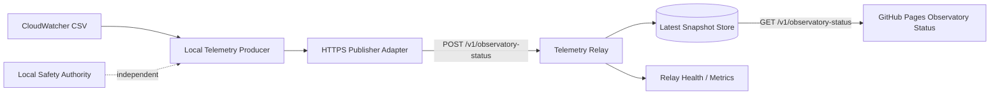
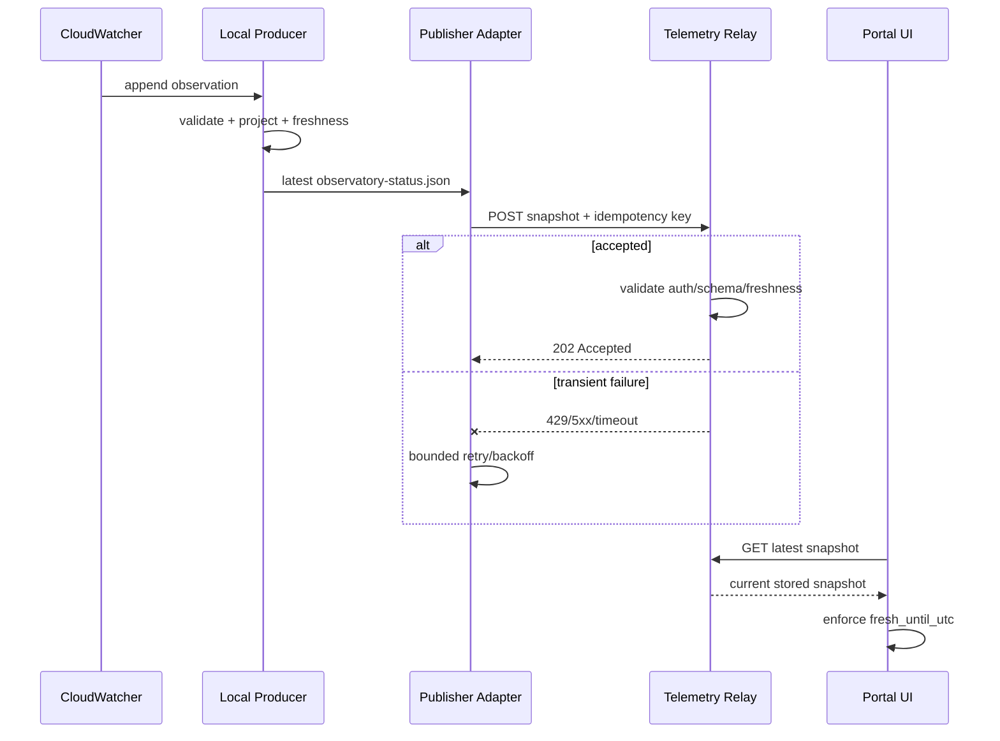

# Observatory Status Telemetry Transport Solution

| Campo | Valore |
|---|---|
| Identificativo | DSG-SOL-OBS-RT-001 |
| Versione | 0.1 |
| Stato | In development |
| Data | 16/08/2026 |
| Scope | Transport read-only EAGLE -> Observatory Status portal |
| Governing packages | AP-004; AP-008; AP-009; AP-012 |
| Related pilot | DSG-OBS-RT-001 |

## 1. Scopo

Definire il transport del contratto `observatory-status-v1` dal producer locale validato su `EAGLE30154` al portale **Observatory Status**, preservando i principi contract-first, read-only first, freshness esplicita, least privilege e indipendenza della Safety Authority locale.

Questa soluzione non abilita command path e non trasforma GitHub Pages in un realtime data plane.

## 2. Current state verificato

Il pilot DSG-OBS-RT-001 ha verificato fisicamente su `EAGLE30154`:

- sorgente CloudWatcher locale leggibile mentre il processo producer la mantiene aperta;
- cadenza osservata ~30 secondi;
- freshness pilot accettata a 60 secondi;
- adapter read-only e producer continuo con polling 15 secondi;
- projection locale `C:\DigitalStarGate\TelemetryRuntime\observatory-status.json`;
- weather evidence `SAFE|UNSAFE|UNKNOWN` distinta da overall observatory safety;
- overall safety sempre `UNKNOWN` finché la Local Safety Authority non è integrata;
- producer health e log locali disponibili.

Il portale MkDocs/GitHub Pages consuma invece una risorsa HTTP statica e non dispone di un ingress runtime nativo.

## 3. Driver

1. Nessuna porta inbound deve essere necessaria sull'EAGLE.
2. Git/GitHub Pages non deve ricevere commit ogni 15-30 secondi.
3. Il browser non deve possedere credential di ingest.
4. Stato stale/assente deve degradare a `UNKNOWN`.
5. Il transport deve essere sostituibile dietro un adapter.
6. Retry o replay non devono creare ambiguità sullo stato corrente.
7. La perdita del relay non deve impattare CloudWatcher, EAGLE o safety locale.
8. Il payload pubblico deve essere minimizzato e privo di secret.

## 4. Decisione di soluzione

Per il pilot viene adottato un pattern **outbound HTTPS snapshot push + read-only snapshot query**.

### Rationale

- l'EAGLE effettua esclusivamente una connessione outbound;
- HTTPS è un protocollo interoperabile e sostituibile dietro adapter AP-008;
- il relay disaccoppia frequenza producer e frequenza consumer;
- il browser accede solo al lato query, senza credential del producer;
- GitHub Pages resta presentation/static hosting;
- lo snapshot corrente è idempotente per subject e non richiede semantica exactly-once.

La decisione non seleziona provider cloud, reverse proxy, database o runtime host.

## 5. Component model

| Componente | Responsabilità | Non responsabilità |
|---|---|---|
| `DSG.ObservatoryStatusTelemetryProducer` | produrre snapshot locale valido | transport internet, safety authority |
| `DSG.ObservatoryStatusTelemetryPublisher` | inviare snapshot al relay | modificare payload, decidere safety |
| Telemetry Relay Ingress | autenticare, validare e accettare snapshot | comandare EAGLE/device |
| Latest Snapshot Store | mantenere ultimo snapshot accettato per subject | storicizzazione scientifica |
| Relay Query API | esporre snapshot sanitizzato read-only | ingest credential exposure |
| Observatory Status UI | rendering e freshness lato browser | inferire safety da dati mancanti |

## 6. Contract boundary

### Ingest

`POST /v1/observatory-status`

- content type: `application/json`;
- body: contratto Observatory Status v1;
- producer identity: credential scoped all'ingest;
- idempotency key: `correlation_id` della projection;
- source instance attesa: `EAGLE30154` per il pilot;
- payload massimo: da fissare nel deployment, con valore conservativo;
- timestamp futuri oltre clock-skew ammesso: reject;
- schema/version non supportati: reject;
- overall safety diversa da `UNKNOWN` nel pilot: reject.

### Query

`GET /v1/observatory-status`

- side-effect free;
- nessuna credential producer nel browser;
- response con `Cache-Control: no-store` o max-age compatibile con freshness;
- CORS limitato alle origin del portale governate;
- se nessuno snapshot è disponibile: `404` oppure payload `UNKNOWN` secondo deployment contract;
- consumer applica comunque `fresh_until_utc` localmente.

## 7. Security model

### EAGLE -> Relay

Per il pilot il publisher supporta un token bearer **scoped esclusivamente all'ingest** e letto da secret store/environment locale, mai committato nel repository. Il deployment può evolvere a mTLS senza cambiare il contratto applicativo.

Regole:

- TLS obbligatorio per endpoint non-localhost;
- token non scritto nei log;
- timeout esplicito;
- retry solo su errori transient (`408`, `429`, `5xx`, network timeout);
- nessun retry su `400`, `401`, `403`, `409`, `422` salvo decisione successiva;
- credential ruotabile indipendentemente dal producer;
- relay autorizza il subject/source ammesso dalla credential.

### Browser -> Relay

Il browser usa solo il query endpoint pubblico o operator-readable e non possiede secret. Il payload esposto non contiene IP interni, VPN detail sensibili, token, filesystem path o credential.

## 8. Reliability e offline behavior

Il dato è uno **snapshot di stato corrente**, non un event log. Il publisher applica quindi latest-wins:

1. legge la projection locale già validata;
2. verifica freshness e schema;
3. tenta l'invio;
4. se il relay è indisponibile mantiene localmente al massimo l'ultimo snapshot pending;
5. al recovery pubblica il più recente snapshot ancora semanticamente utile;
6. snapshot già stale non viene ripubblicato come current;
7. nessuna coda infinita di snapshot obsoleti.

Questo implementa store-and-forward limitato senza trasformare ogni campione in evento durevole.

## 9. Sequence

## 10. Failure mapping

| Failure | Publisher behavior | Portal behavior |
|---|---|---|
| Relay offline | bounded retry; latest pending retained | previous snapshot becomes stale -> UNKNOWN |
| 401/403 | stop retry; health DEGRADED; operator action | previous snapshot becomes stale |
| schema reject | no retry; evidence/log | previous snapshot becomes stale |
| timeout | transient retry with backoff | unchanged until freshness expires |
| producer stopped | no new POST | snapshot expires naturally |
| browser cannot reach relay | UI renders unavailable/UNKNOWN | no impact local |
| token compromised | revoke/rotate ingest token | no device command exposure |

## 11. Observability

Publisher health deve includere almeno:

- last publish attempt;
- last publish success;
- HTTP/result class;
- consecutive failures;
- pending snapshot age;
- endpoint identity senza secret;
- source observation timestamp;
- correlation/idempotency key.

Relay deve misurare almeno accepted/rejected requests, auth failures, validation failures, ingest latency e age dell'ultimo snapshot.

## 12. Deployment boundary

Il relay richiede un runtime HTTPS raggiungibile sia dall'EAGLE in outbound sia dal browser del portale. **Il provider/host non è deciso in questo documento.** La selezione deve essere compatibile con AP-009 e deve produrre evidence su DNS/TLS, availability, backup/configuration, secret management, logging e costi operativi.

GitHub Pages ospita soltanto HTML/JS e non è considerato il relay.

## 13. Vertical slices

### Slice T1 — Publisher adapter

- PowerShell publisher configurabile;
- HTTPS-only enforcement;
- bearer token da environment;
- validate-only/dry-run;
- bounded retry;
- health/log locale;
- nessuna modifica al producer.

### Slice T2 — Relay contract/reference implementation

- OpenAPI contract;
- ingest + query endpoint;
- validation schema;
- latest snapshot semantics;
- CORS e auth boundary;
- local/integration test.

### Slice T3 — Hosted pilot

- selezione host;
- DNS/TLS;
- secret provisioning;
- EAGLE -> relay runtime test;
- browser -> relay test;
- disconnect/recovery test.

### Slice T4 — Portal cutover

- endpoint runtime configurabile;
- fallback fail-safe;
- no-store cache policy;
- OAT end-to-end;
- operational runbook.

## 14. Acceptance

La soluzione non è `Active` finché non esistono:

- CI verde del publisher/contract;
- relay pilot realmente deployato;
- authentication test positivo/negativo;
- stale and disconnect test;
- EAGLE outbound publication evidence;
- browser read evidence;
- CORS/TLS evidence;
- rollback al comportamento `UNKNOWN` verificato.

## 15. Open decisions

- hosting concreto del relay;
- dominio/DNS;
- secret store definitivo;
- bearer token vs mTLS per produzione;
- retention opzionale degli snapshot per operations analytics;
- rate limit e payload limit definitivi;
- public vs authenticated operator query endpoint quando verranno aggiunti segnali sensibili.

## 16. Traceability

- AP-004 Enterprise Telemetry and Observability Architecture;
- AP-008 Enterprise Integration Architecture;
- AP-009 Enterprise Infrastructure Architecture;
- AP-012 Enterprise Operations Center Architecture;
- INT-CAT-001 Integration Contract Catalog;
- DSG-OBS-RT-001 Observatory Status Realtime Telemetry Pilot;
- `contracts/telemetry/observatory-status-v1.schema.json`.
