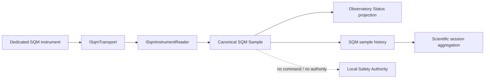

# BKL-029 — Dedicated SQM Source Selection Assessment

**Status:** Proposed  
**Date:** 2026-08-30  
**Capability:** BKL-029 — SQM Sky Quality Telemetry & Scientific History

## 1. Purpose

Select an implementable dedicated SQM source strategy after the current CloudWatcher pipeline was proven unable to expose a valid instrumental SQM value.

This assessment does not authorize procurement, physical installation, firmware changes, or production enablement. It defines the preferred integration shape and the evidence required before ADR-007 can move from `Proposed` to `Accepted`.

## 2. Confirmed constraints

- SQM must be a real instrumental value in `mag/arcsec²` / mpsas.
- Brightness/LDR, cloud cover, sky temperature and image-background estimates are forbidden as substitutes.
- SQM is scientific telemetry, not Safety Authority input.
- The collector on EAGLE must remain lightweight and read-only.
- The adapter must expose source identity, timestamp/freshness, quality and raw evidence.
- Historical statistics are computed outside the physical-device transport adapter.
- A source failure must degrade to `UNKNOWN`/`STALE`, never to a synthetic value.

## 3. Reference candidates

### 3.1 Unihedron SQM-LU-DL — USB / serial VCP

Vendor documentation confirms:

- native measurement in visual magnitudes per square arcsecond;
- factory calibration;
- USB FTDI virtual COM port;
- 115200 baud serial interface;
- open and documented software protocol;
- device identity/model/serial and sensor temperature available;
- autonomous logging capability;
- optional weatherproof housing for permanent installation.

The standard read command is `rx` followed by carriage return. The response contains the sky-brightness result plus additional raw/temperature fields. The transport is single-client and should be opened, queried and released rather than held indefinitely.

Architecture assessment:

- semantic fit: **high**;
- integration complexity: **low**;
- EAGLE dependency: USB/VCP and COM stability;
- outdoor suitability: requires approved enclosure/housing;
- provenance: strong — model/serial/calibration can be retained;
- current vendor availability: listed as available at assessment time.

### 3.2 Unihedron SQM-LE — Ethernet

Vendor documentation confirms:

- Ethernet interface;
- PC commands relayed to the SQM micro-controller;
- one TCP client at a time;
- fixed/reserved IP recommended for stable automation.

Architecture assessment:

- semantic fit: **high**;
- integration complexity: **low**;
- EAGLE dependency: network only, no USB/COM dependency;
- operational isolation: **better** than USB for a permanently installed remote observatory;
- current vendor availability: vendor page reports the unit as out of stock at assessment time.

Because the device is not currently listed as available, SQM-LE is retained as a transport-preferred future option rather than the immediate reference implementation target.

### 3.3 Other devices

Other SQM-capable instruments remain admissible if they provide:

- documented mpsas output;
- stable read-only protocol;
- source identity/version;
- predictable failure behavior;
- suitable environmental installation;
- no dependency on Safety Authority logic.

No other device is selected by this assessment without equivalent evidence.

## 4. Proposed source strategy

Use a **transport-neutral SQM adapter contract** and adopt **Unihedron SQM-LU-DL as the initial reference device** for development/OAT, subject to explicit procurement/installation approval.

The domain contract must not depend on USB, COM, TCP, Unihedron-specific response strings or vendor classes.

A future SQM-LE or another instrument must be replaceable by implementing a different transport/source adapter without changing scientific session aggregation or Observatory Status contracts.

## 5. Adapter architecture



### 5.1 Transport boundary

```text
ISqmTransport
- Open/read request/close semantics
- timeout
- transport identity
- no configuration writes in baseline
```

Reference implementations:

```text
SerialSqmTransport   # SQM-LU-DL / VCP
TcpSqmTransport      # SQM-LE or equivalent
```

### 5.2 Instrument reader boundary

```text
ISqmInstrumentReader
- ReadSample()
- GetIdentity()
```

The instrument reader is responsible only for protocol parsing and validation. It does not calculate night statistics and does not interact with Safety.

## 6. Canonical sample contract

```json
{
  "schema_version": "1.0",
  "observed_at_utc": "2026-08-30T00:00:00Z",
  "sqm_mag_arcsec2": 21.10,
  "quality": "CURRENT",
  "source": {
    "component": "DSG.SqmInstrumentAdapter",
    "vendor": "Unihedron",
    "model": "SQM-LU-DL",
    "serial": "example-only-not-runtime-evidence",
    "transport": "serial"
  },
  "evidence": {
    "raw_response": "retained by evidence bundle",
    "confidence": "instrumental"
  }
}
```

The numeric value above is schema illustration only and is **not runtime evidence**.

## 7. Validation rules

A sample is `CURRENT` only if all conditions are true:

1. transport request succeeded within timeout;
2. response is syntactically valid for the selected protocol;
3. a finite numeric mpsas value is present;
4. value passes a broad physical/plausibility guard defined by the selected instrument contract;
5. source identity is available or previously bound to the configured source;
6. sample timestamp is within the configured freshness window.

Otherwise:

- parse/device error -> `UNKNOWN`, value `null`;
- no new sample beyond freshness -> `STALE`, production value not promoted;
- transport unavailable -> `UNKNOWN` or `STALE` according to last-valid-sample policy;
- no proxy substitution is allowed.

The exact plausibility range must be fixed from vendor documentation and OAT evidence before production enablement; it is not hard-coded by this assessment.

## 8. Cadence and resource model

Initial design target:

- one read request every 30–60 seconds for Observatory Status;
- no permanent serial lock;
- short timeout and immediate close/release after each read;
- local lightweight evidence/spool only;
- aggregation/statistics outside the transport layer.

The final cadence/freshness values are established by OAT after the actual instrument is connected.

## 9. Scientific history contract

For each observing session, valid samples are aggregated into:

```text
sqm.start
sqm.end
sqm.min
sqm.max
sqm.mean
sqm.median
sqm.valid_samples
sqm.temporal_coverage
sqm.source
sqm.quality
```

Rules:

- only valid `CURRENT` instrumental samples contribute to statistics;
- source changes during a session must remain traceable;
- insufficient temporal coverage must degrade session SQM quality rather than fabricate completeness;
- a session remains valid when SQM is absent.

## 10. Security, safety and operations

- adapter is read-only;
- no commands to dome, mount, power, router or SafetyMonitor;
- no SQM value may change roof/interlock state;
- device failure must not affect observatory safety closure capability;
- USB transport requires COM identity/drift monitoring if selected;
- TCP transport requires fixed/reserved addressing and network reachability monitoring if selected;
- physical mounting must avoid local light contamination and weather exposure not covered by the device rating.

## 11. Option comparison

| Criterion | SQM-LU-DL | SQM-LE |
|---|---|---|
| Native mpsas | Yes | Yes |
| Open/documented protocol | Yes | Yes |
| Transport | USB FTDI VCP | Ethernet/TCP |
| EAGLE USB dependency | Yes | No |
| Network dependency | No | Yes |
| Permanent remote integration | Good | Preferred |
| Current vendor availability observed | Available | Out of stock |
| Baseline recommendation | **Reference device** | Preferred future network variant |

## 12. Proposed decision

For development planning, select:

```text
Architecture contract: transport-neutral
Reference implementation target: Unihedron SQM-LU-DL
Preferred long-term transport when available: Ethernet / SQM-LE-class source
```

This is a **Proposed** source-selection assessment, not procurement approval and not BKL-029 acceptance.

## 13. Acceptance gate before implementation on hardware

Required before production/OAT:

- explicit approval of the physical source choice;
- actual model and serial evidence;
- installation position and environmental protection decision;
- Windows device/COM identity evidence for USB, or IP identity for Ethernet;
- first raw read and parsed mpsas sample;
- cadence/freshness measurement;
- disconnect/reconnect test;
- long-running stability test;
- evidence that Safety Authority is unaffected.

## 14. Next implementation slice

The next repository slice may implement **protocol-independent contracts and parser tests using documented sample strings**, without claiming device acceptance or runtime success.

Runtime transport activation remains disabled until real hardware/source approval exists.

## References

- Unihedron SQM-LU-DL product page: <https://www.unihedron.com/projects/sqm-lu-dl/>
- Unihedron SQM-LU-DL Operator's Manual: <https://unihedron.com/projects/darksky/cd/SQM-LU-DL/SQM-LU-DL_Users_manual.pdf>
- Unihedron SQM-LE product page: <https://www.unihedron.com/projects/sqm-le/>
- Unihedron SQM-LE Operator's Manual: <https://www.unihedron.com/projects/darksky/cd/SQM-LE/SQM-LE_Users_manual.pdf>
- `docs/architecture/ADR-007-SQM-Instrument-Source-Strategy.md`
- `docs/architecture/telemetry/BKL-029-SQM-Source-Discovery-and-Architecture-Contract.md`
