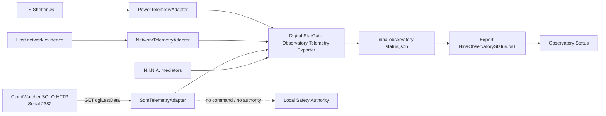

# BKL-029 — SQM Source Discovery and Architecture Contract

| Campo | Valore |
|---|---|
| Identificativo | BKL-029 |
| Capability | SQM Sky Quality Telemetry & Scientific History |
| Stato | **In progress — realtime/G6 verified; G3 implementation complete on PR #68, final CI/ARB acceptance pending** |
| Data | 2026-09-01 |
| Autorità | Digital StarGate Architecture Office |
| Dipendenze | AP-004; AP-013; AP-014; Observatory Status; BKL-027/BKL-028 telemetry boundary; scientific session catalog |
| Runtime effect | SQM-capable N.I.N.A. plugin commissioned on EAGLE30154; historical aggregation implemented from canonical session evidence, pending final PR quality gates |

## 1. Decision summary

BKL-029 uses the existing **Digital StarGate N.I.N.A. Observatory Telemetry Exporter** as its runtime collection boundary.

This preserves the architecture already commissioned for Network and Power:

```text
approved passive source
  -> dedicated read-only adapter inside N.I.N.A. plugin
  -> nina-observatory-status.json
  -> Export-NinaObservatoryStatus.ps1
  -> canonical Observatory Status projection
  -> hosted relay / portal
```

No independent SQM sidecar producer is introduced.

SQM remains scientific telemetry and **never becomes a Safety Authority signal**.

## 2. Source evidence

The local EAGLE CloudWatcher pipeline (`Serial 2264 / FW 5.86`) does not expose a valid SQM value. Its ASCOM `SkyQuality=0` remains invalid and its live CSV has no SQM/mpsas field.

A second existing AAG CloudWatcher SOLO source was verified at Manciano and confirmed physically close enough to Digital StarGate to represent site sky quality.

Verified endpoint:

```text
http://meteo.deeplab.space:8080/cgi-bin/cgiLastData
```

Observed discovery evidence:

```text
dataGMTTime=2026/08/30 20:31:42
cwinfo=Serial: 2382, FW: 5.88
lightmpsas=18.74
```

`lightmpsas` is accepted as the instrumental source field. Brightness/LDR, cloud cover and other proxies remain forbidden.

## 3. Source disposition

| Source | Disposition |
|---|---|
| CloudWatcher SOLO HTTP, serial 2382 | **PRIMARY — G1 and runtime OAT satisfied** |
| Local CloudWatcher ASCOM/CSV, serial 2264 | Rejected for SQM; retained for existing weather functions |
| CloudWatcher direct serial | Diagnostic fallback only |
| Dedicated Unihedron SQM | Architecture fallback only |

No CloudWatcher firmware update or new SQM hardware is currently required.

## 4. N.I.N.A. plugin architecture

Repository truth from BKL-027/BKL-028 establishes that passive Network and Power telemetry are owned by the Digital StarGate N.I.N.A. plugin rather than independent producers. SQM follows the same rule.



### Runtime ownership

`SqmTelemetryAdapter` is a passive adapter inside:

```text
integrations/nina/DigitalStarGate.DomeTelemetryExporter/
```

It performs:

- HTTP GET only;
- bounded timeout;
- low-frequency polling independent of the 5-second projection timer;
- parsing only of `dataGMTTime`, `cwinfo`, `lightmpsas` for SQM semantics;
- cached latest observation for non-blocking plugin projection;
- `CURRENT / STALE / UNKNOWN` quality;
- fail-safe null value on invalid/stale/unreachable source.

The adapter does **not** consume `safe`, `lightSafe`, `rainSafe` or other SOLO safety flags as BKL-029 inputs.

A governed local configuration file may override endpoint and timing for commissioning/testing. Absence of the file restores built-in defaults. Configuration changes are blocked while N.I.N.A. is running.

## 5. Projection contract

The N.I.N.A. local projection keeps `schemaVersion = 2` and exposes:

```text
services.sqm.state
services.sqm.reason
services.sqm.details.source
services.sqm.details.endpoint
services.sqm.details.configurationSource
services.sqm.details.sqmMagArcsec2
services.sqm.details.observedAtUtc
services.sqm.details.freshUntilUtc
services.sqm.details.quality
services.sqm.details.serial
services.sqm.details.firmware
```

The canonical projection maps this to weather field-level provenance:

```text
weather.sqm_mag_arcsec2
weather.sqm_observed_at_utc
weather.sqm_fresh_until_utc
weather.sqm_quality
weather.sqm_source
```

Rules:

1. only `lightmpsas` may populate `sqm_mag_arcsec2`;
2. source timestamp comes from `dataGMTTime`;
3. identity comes from `cwinfo`;
4. non-positive/non-numeric/missing values become `UNKNOWN/null`;
5. stale source values are not promoted as current SQM;
6. stale overall N.I.N.A. projection also prevents current SQM publication;
7. HTTP failure becomes `UNKNOWN`, with no synthetic fallback;
8. SQM has no effect on safety, interlocks or equipment commands.

## 6. Resource and failure model

Commissioned built-in defaults:

```text
SQM poll interval : 30 s
HTTP timeout      : 5 s
source freshness  : 120 s
plugin projection : 5 s (existing)
```

Observed nominal source cadence during OAT was approximately 30 seconds. The HTTP request runs on a dedicated background worker so network delay does not block the N.I.N.A. projection timer.

The controlled failure/recovery OAT verified the required state sequence:

```text
CURRENT -> UNKNOWN/null -> CURRENT
```

without changing CloudWatcher, router/network configuration, equipment state or Safety Authority.

## 7. Scientific history contract

Valid SQM session evidence is normalized once and projected downstream with the governed fields:

```text
sqm.start
sqm.end
sqm.min
sqm.max
sqm.mean
sqm.median
sqm.valid_samples
sqm.temporal_coverage
sqm.source
sqm.quality
```

Historical aggregation remains downstream of the N.I.N.A. source adapter. The plugin is not responsible for session statistics. PR #68 implements this contract through canonical `session-metrics.json`, history schema 2.1.0, the post-consolidation enrichment adapter and scientific catalog/search projections. No downstream component reparses N.I.N.A. raw evidence for these fields.

The real-session regression fixture `2026-08-31_2026-09-01` provides sample-history evidence from `raw/sqm/sqm-summary.json`: start `2026-08-31T17:00:06Z`, end `2026-09-01T03:59:49Z`, source `AAG CloudWatcher SOLO HTTP / lightmpsas`, quality `AVAILABLE`, median `18.66`, 1301 valid samples and temporal coverage `0.9849`.

## 8. CI and implementation status

The operative realtime implementation remains the N.I.N.A. plugin adapter; no second production collector path is authorized.

The configurable SQM adapter build at commit `0dd2dd9ae47625566cc36ccd14bc58d684dcd361` passed the N.I.N.A. plugin workflow and produced the commissioned artifact. The artifact DLL was installed on EAGLE30154 with SHA256:

```text
CF185813F4A6E063F36642478251860E7590EE43B1996B607ADA8E4C186EDB8C
```

The installer reported `PILOT INSTALL RESULT: PASS` and explicitly reported no N.I.N.A. process start, equipment connection or device command.

Historical implementation on PR #68 includes analyzer normalization, history schema/update/enrichment, scientific catalog/search projection, latest-observation projection and a real-session E2E gate. At the time of this document update, the complete G3 provenance extension is committed but its resulting GitHub Actions runs have not yet been accepted; therefore G3/G4/G5 are not declared satisfied here.

## 9. Acceptance gates

- **G1 Source discovery:** `SATISFIED` — real `lightmpsas`, timestamp, identity and site proximity verified;
- **G2 Realtime contract:** `SATISFIED` — N.I.N.A. adapter and canonical mapping commissioned and observed on EAGLE30154;
- **G3 Historical contract:** `IMPLEMENTED / FINAL CI+ARB PENDING` — complete governed field set now implemented and covered by real-session E2E assertions;
- **G4 Regression:** `FINAL CI+ARB PENDING` — regression gates exist; acceptance waits for the new HEAD executions;
- **G5 CI/docs:** `FINAL CI+ARB PENDING` — architecture contract aligned; acceptance waits for the new HEAD executions;
- **G6 Runtime OAT:** `SATISFIED` — nominal cadence plus controlled failure/recovery verified on EAGLE30154.

## 10. Runtime OAT evidence

The commissioned runtime has verified:

1. exact N.I.N.A. workflow artifact retrieved;
2. artifact/DLL hash recorded;
3. N.I.N.A. stopped before installation;
4. governed pilot installer PASS;
5. normal N.I.N.A. restart;
6. `services.sqm` observed in `nina-observatory-status.json`;
7. nominal sample/source cadence approximately 30 seconds;
8. canonical SQM value, source identity and quality observed;
9. controlled unreachable-source test using a localhost-only endpoint override;
10. SQM degraded to `UNKNOWN/null` while Safety and unrelated telemetry remained independent;
11. governed configuration removal restored built-in defaults;
12. source recovered to serial `2382`, FW `5.88`, real `lightmpsas` and `CURRENT` in both local and canonical projections.

Evidence documents:

```text
docs/architecture/telemetry/evidence/BKL-029-SQM-Nominal-OAT-2026-08-30.md
docs/architecture/telemetry/evidence/BKL-029-SQM-Failure-OAT-2026-08-30.md
docs/architecture/telemetry/evidence/BKL-029-SQM-Recovery-OAT-2026-08-30.md
```

## 11. Safety disposition

No BKL-029 component may:

- command the dome, mount, camera, power or router;
- alter SOLO/CloudWatcher configuration;
- use SQM to drive SafetyMonitor or roof interlocks;
- reinterpret SOLO safety flags as local Safety Authority;
- retain a stale SQM value as current.

The existing physical/local safety chain remains authoritative.

## 12. Next governed step

Run and accept the PR #68 quality gates on the complete G3 provenance implementation. If Developer Foundation, Validate Digital StarGate History and the real-session E2E remain green, perform an independent ARB re-review. Only after that review may G3/G4/G5 be declared satisfied and PR #68 become merge-ready.
