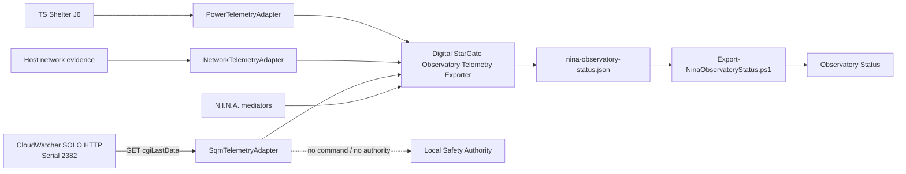

# BKL-029 — SQM Source Discovery and Architecture Contract

| Campo | Valore |
|---|---|
| Identificativo | BKL-029 |
| Capability | SQM Sky Quality Telemetry & Scientific History |
| Stato | **In progress — CloudWatcher SOLO source verified; N.I.N.A. plugin shadow integration implemented; CI/OAT pending** |
| Data | 2026-08-30 |
| Autorità | Digital StarGate Architecture Office |
| Dipendenze | AP-004; AP-013; AP-014; Observatory Status; BKL-027/BKL-028 telemetry boundary; scientific session catalog |
| Runtime effect | Repository implementation only until updated plugin is commissioned on EAGLE30154 |

## 1. Decision summary

BKL-029 uses the existing **Digital StarGate N.I.N.A. Observatory Telemetry Exporter** as its runtime collection boundary.

This preserves the architecture already commissioned for Network and Power:

```text
approved passive source
  -> dedicated read-only adapter inside N.I.N.A. plugin
  -> nina-observatory-status.json
  -> Export-NinaObservatoryStatus.ps1
  -> canonical Observatory Status projection
  -> hosted relay / portal
```

No independent SQM sidecar producer is introduced.

SQM remains scientific telemetry and **never becomes a Safety Authority signal**.

## 2. Source evidence

The local EAGLE CloudWatcher pipeline (`Serial 2264 / FW 5.86`) does not expose a valid SQM value. Its ASCOM `SkyQuality=0` remains invalid and its live CSV has no SQM/mpsas field.

A second existing AAG CloudWatcher SOLO source was verified at Manciano and confirmed physically close enough to Digital StarGate to represent site sky quality.

Verified endpoint:

```text
http://meteo.deeplab.space:8080/cgi-bin/cgiLastData
```

Observed evidence:

```text
dataGMTTime=2026/08/30 20:31:42
cwinfo=Serial: 2382, FW: 5.88
lightmpsas=18.74
```

`lightmpsas` is accepted as the instrumental source field. Brightness/LDR, cloud cover and other proxies remain forbidden.

## 3. Source disposition

| Source | Disposition |
|---|---|
| CloudWatcher SOLO HTTP, serial 2382 | **PRIMARY — G1 satisfied, plugin OAT pending** |
| Local CloudWatcher ASCOM/CSV, serial 2264 | Rejected for SQM; retained for existing weather functions |
| CloudWatcher direct serial | Diagnostic fallback only |
| Dedicated Unihedron SQM | Architecture fallback only |

No CloudWatcher firmware update or new SQM hardware is currently required.

## 4. N.I.N.A. plugin architecture

Repository truth from BKL-027/BKL-028 establishes that passive Network and Power telemetry are owned by the Digital StarGate N.I.N.A. plugin rather than independent producers. SQM follows the same rule.



### Runtime ownership

`SqmTelemetryAdapter` is a passive adapter inside:

```text
integrations/nina/DigitalStarGate.DomeTelemetryExporter/
```

It performs:

- HTTP GET only;
- bounded timeout;
- low-frequency polling independent of the 5-second projection timer;
- parsing only of `dataGMTTime`, `cwinfo`, `lightmpsas` for SQM semantics;
- cached latest observation for non-blocking plugin projection;
- `CURRENT / STALE / UNKNOWN` quality;
- fail-safe null value on invalid/stale/unreachable source.

The adapter does **not** consume `safe`, `lightSafe`, `rainSafe` or other SOLO safety flags as BKL-029 inputs.

## 5. Projection contract

The N.I.N.A. local projection keeps `schemaVersion = 2` and adds a service member:

```text
services.sqm.state
services.sqm.reason
services.sqm.details.source
services.sqm.details.endpoint
services.sqm.details.sqmMagArcsec2
services.sqm.details.observedAtUtc
services.sqm.details.freshUntilUtc
services.sqm.details.quality
services.sqm.details.serial
services.sqm.details.firmware
```

The canonical projection maps this to weather field-level provenance:

```text
weather.sqm_mag_arcsec2
weather.sqm_observed_at_utc
weather.sqm_fresh_until_utc
weather.sqm_quality
weather.sqm_source
```

Rules:

1. only `lightmpsas` may populate `sqm_mag_arcsec2`;
2. source timestamp comes from `dataGMTTime`;
3. identity comes from `cwinfo`;
4. non-positive/non-numeric/missing values become `UNKNOWN/null`;
5. stale source values are not promoted as current SQM;
6. stale overall N.I.N.A. projection also prevents current SQM publication;
7. HTTP failure becomes `UNKNOWN`, with no synthetic fallback;
8. SQM has no effect on safety, interlocks or equipment commands.

## 6. Resource and failure model

Current shadow defaults pending OAT:

```text
SQM poll interval : 30 s
HTTP timeout      : 5 s
source freshness  : 120 s
plugin projection : 5 s (existing)
```

These are commissioning defaults, not final scientific cadence acceptance.

The HTTP request runs on a dedicated background worker so network delay does not block the N.I.N.A. projection timer.

## 7. Scientific history contract

After realtime OAT, valid `CURRENT` samples may feed session history:

```text
sqm.start
sqm.end
sqm.min
sqm.max
sqm.mean
sqm.median
sqm.valid_samples
sqm.temporal_coverage
sqm.source
sqm.quality
```

Historical aggregation remains downstream of the N.I.N.A. source adapter. The plugin is not responsible for session statistics.

## 8. CI and implementation status

The earlier standalone SOLO parser slice exposed a Developer Foundation build failure caused by .NET analyzer rules `CA1512` and `CA1859`. The parser has been corrected in repository; a new Developer Foundation run must be observed before G4/G5 can pass.

The operative implementation is now the N.I.N.A. plugin adapter. This deliberately avoids a second production collector path.

Files involved:

```text
integrations/nina/DigitalStarGate.DomeTelemetryExporter/SqmTelemetryAdapter.cs
integrations/nina/DigitalStarGate.DomeTelemetryExporter/DomeTelemetryExporterPlugin.cs
scripts/telemetry/Export-NinaObservatoryStatus.ps1
```

The existing plugin workflow `.github/workflows/nina-dome-telemetry-exporter.yml` is expected to build changes under the N.I.N.A. integration directory; success must be verified from actual Actions evidence.

## 9. Acceptance gates

- **G1 Source discovery:** `SATISFIED` — real `lightmpsas=18.74`, timestamp, identity and site proximity verified;
- **G2 Realtime contract:** `IMPLEMENTED / CI PENDING` — N.I.N.A. plugin adapter and canonical mapping present in repository;
- **G3 Historical contract:** `BLOCKED ON SAMPLE HISTORY`;
- **G4 Regression:** `PENDING` — Developer Foundation and N.I.N.A. plugin workflow must be GREEN;
- **G5 CI/docs:** `PENDING` — latest commits must be verified;
- **G6 Runtime OAT:** `PENDING` — updated plugin not yet commissioned on EAGLE30154.

## 10. Runtime OAT required

After CI is GREEN:

1. download the exact N.I.N.A. plugin workflow artifact;
2. record SHA256;
3. stop N.I.N.A.;
4. install with the governed pilot installer and exact expected hash;
5. start N.I.N.A.;
6. verify `services.sqm` in `nina-observatory-status.json`;
7. observe a sequence of samples and source timestamps to measure cadence;
8. verify `sqm_mag_arcsec2`, source identity and quality in canonical projection;
9. perform a controlled unreachable-source test or equivalent non-invasive failure test;
10. verify SQM becomes `UNKNOWN/STALE` without affecting Safety Authority;
11. restore connectivity and verify recovery to `CURRENT`;
12. record evidence before enabling historical aggregation.

## 11. Safety disposition

No BKL-029 component may:

- command the dome, mount, camera, power or router;
- alter SOLO/CloudWatcher configuration;
- use SQM to drive SafetyMonitor or roof interlocks;
- reinterpret SOLO safety flags as local Safety Authority;
- retain a stale SQM value as current.

The existing physical/local safety chain remains authoritative.

## 12. Next governed step

Wait for CI on the corrected parser and N.I.N.A. plugin integration. If GREEN, commission the updated plugin on `EAGLE30154` using the existing artifact/hash/backup installation procedure, then execute G6 shadow OAT.
