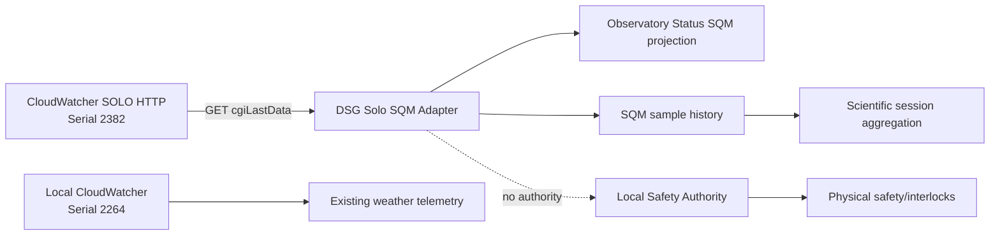

# BKL-029 — SQM Source Discovery and Architecture Contract

| Campo | Valore |
|---|---|
| Identificativo | BKL-029 |
| Capability | SQM Sky Quality Telemetry & Scientific History |
| Stato | **In progress — primary source candidate verified via CloudWatcher SOLO HTTP; shadow adapter/OAT pending** |
| Data | 2026-08-30 |
| Autorità | Digital StarGate Architecture Office |
| Dipendenze | AP-004; AP-013; AP-014; Observatory Status; scientific session catalog |
| Runtime effect | Shadow/read-only only until OAT acceptance |

## 1. Scopo

Definire la source SQM e il contratto architetturale per valorizzare realmente `weather.sqm_mag_arcsec2` e storicizzare la qualità del cielo nelle sessioni scientifiche.

SQM resta una metrica scientifica di qualità della notte e **non è mai un Safety signal**. Nessun adapter BKL-029 può comandare cupola, montatura, power, router o Safety Authority.

## 2. Repository truth ed evidence runtime

La discovery iniziale sul CloudWatcher locale `EAGLE30154` ha verificato che:

- il CloudWatcher locale identifica `Serial: 2264, FW: 5.86`;
- il CSV live locale non contiene alcun campo SQM/mpsas/sky-quality;
- il driver `ASCOM.CloudWatcher.ObservingConditions` è raggiungibile ma ha restituito `SkyQuality = 0`, valore DSG invalidato;
- `aag_json.dat` configurato nel driver ASCOM locale è stale e non contiene SQM;
- `Brightness Value`/LDR restano proxy vietati;
- nessun accesso seriale diretto è stato necessario o autorizzato.

Questa linea locale resta non idonea a BKL-029.

Successivamente è stata verificata una seconda source esistente, **AAG CloudWatcher SOLO**, raggiungibile via HTTP e fisicamente installata nello stesso sito di Manciano, sufficientemente vicina al Digital StarGate per rappresentarne la qualità del cielo secondo conferma operativa del proprietario del sistema.

Endpoint verificato:

```text
http://meteo.deeplab.space:8080/cgi-bin/cgiLastData
```

Evidence osservata:

```text
dataGMTTime=2026/08/30 20:31:42
cwinfo=Serial: 2382, FW: 5.88
clouds=-1.520000
cloudsSafe=1
temp=24.500000
wind=6
windSafe=1
gust=7
rain=3200
rainSafe=1
lightmpsas=18.74
lightSafe=1
switch=1
safe=1
hum=62
humSafe=1
dewp=16.750000
rawir=9.880000
abspress=993.175000
relpress=1010.426464
pressureSafe=1
```

Questa evidence è determinante perché `lightmpsas` è un campo esplicito in magnitudini per arcsec² e non una trasformazione DSG di brightness/LDR. La source espone inoltre timestamp UTC e identity (`Serial 2382`, `FW 5.88`).

## 3. Source selection

### 3.1 CloudWatcher SOLO HTTP — PRIMARY CANDIDATE

Disposizione corrente: `VERIFIED SOURCE CANDIDATE / SHADOW OAT PENDING`.

Caratteristiche:

```text
Transport: HTTP read-only
Endpoint: /cgi-bin/cgiLastData
Field: lightmpsas
Timestamp: dataGMTTime
Identity: cwinfo
Observed device: Serial 2382 / FW 5.88
Site: Manciano, physically close enough to Digital StarGate for scientific night-quality telemetry
```

Vantaggi:

- nessun nuovo hardware necessario;
- nessuna seriale/USB sull'EAGLE;
- nessuna modifica firmware del CloudWatcher locale;
- campo SQM esplicito in mpsas;
- timestamp sorgente disponibile;
- identity/provenance disponibile;
- integrazione HTTP leggera e read-only;
- indipendenza funzionale dal Safety Authority locale.

Rischi da validare in OAT:

- disponibilità/reachability HTTP;
- comportamento in caso di timeout o endpoint non raggiungibile;
- cadenza reale di aggiornamento `dataGMTTime`;
- eventuale jitter/staleness;
- stabilità del valore `lightmpsas` durante una finestra osservativa;
- continuità della rappresentatività spaziale del sensore rispetto alla cupola.

### 3.2 CloudWatcher locale ASCOM/CSV

Disposizione: `REJECTED FOR SQM / RETAINED FOR EXISTING WEATHER FUNCTIONS`.

Il locale `Serial 2264 / FW 5.86` non espone un SQM valido nella pipeline osservata. `SkyQuality=0` resta invalidato.

### 3.3 CloudWatcher native serial

Disposizione: `FALLBACK DIAGNOSTIC ONLY`.

Non necessario finché SOLO HTTP soddisfa il contratto.

### 3.4 Dedicated SQM / Unihedron

Disposizione: `FALLBACK ARCHITECTURE`.

Il contratto transport-neutral e il parser Unihedron sviluppati restano utili come fallback futuro, ma non sono più il percorso primario per BKL-029.

## 4. Source selection gate

Una source è promossa a production solo con evidence runtime riproducibile di:

1. identity/versione;
2. campo mpsas esplicito;
3. timestamp sorgente;
4. campioni plausibili e non sintetici;
5. freshness/cadence verificata;
6. error/timeout behavior fail-safe;
7. provenance preservata;
8. assenza di command path verso Safety o apparati.

Disposizione corrente:

- SOLO HTTP: `PRIMARY / G1 SATISFIED FOR SOURCE IDENTITY AND VALID VALUE; OAT PENDING`;
- locale ASCOM: `REACHABLE / INVALID SQM VALUE`;
- locale CSV: `NO SQM FIELD`;
- serial native: `FALLBACK`;
- dedicated SQM: `FALLBACK`.

## 5. Contratto realtime

Il valore canonico resta:

```text
weather.sqm_mag_arcsec2: number | null
```

Provenance field-level target:

```text
sqm_mag_arcsec2
sqm_observed_at_utc
sqm_fresh_until_utc
sqm_quality        CURRENT | STALE | UNKNOWN
sqm_source
```

Regole:

1. per SOLO il valore arriva esclusivamente da `lightmpsas`;
2. `dataGMTTime` è il timestamp sorgente canonico;
3. `cwinfo` fornisce identity/version provenance;
4. valore mancante/non numerico/non positivo -> `null / UNKNOWN`;
5. campione oltre freshness -> `null / STALE` nella projection production;
6. timeout/rete indisponibile -> mai ultimo valore promosso come CURRENT;
7. nessun fallback automatico a brightness/LDR;
8. nessun effetto su Safety Authority o interlock.

La freshness esatta viene fissata dopo misura della cadence reale in OAT.

## 6. Contratto storico scientifico

Per sessioni con campioni validi:

```text
sqm.start
sqm.end
sqm.min
sqm.max
sqm.mean
sqm.median
sqm.valid_samples
sqm.temporal_coverage
sqm.source
sqm.quality
```

Solo campioni `CURRENT` da `lightmpsas` contribuiscono alle statistiche. Una sessione senza SQM resta scientificamente valida.

## 7. Boundary e responsabilità

### EAGLE / collector

Consentito:

- HTTP GET read-only verso SOLO;
- parsing di `dataGMTTime`, `cwinfo`, `lightmpsas`;
- timestamp/freshness evaluation;
- evidence/spool leggero;
- shadow projection.

Vietato:

- configurazione del SOLO;
- comandi Safety/relay;
- uso di `safe`/`lightSafe` come source SQM;
- analytics pesanti;
- proxy brightness/LDR.

### Safety boundary

Il fatto che lo stesso payload contenga campi `safe`, `lightSafe`, `rainSafe` ecc. **non autorizza BKL-029 a interpretarli o usarli**. L'adapter SQM deve leggere solo i campi necessari al dominio scientifico e non diventa una Safety Authority.

### Scientific Data Engine

Responsabile di history, aggregazione per sessione, qualità temporale e correlazione con scientific session catalog.

## 8. Acceptance gates BKL-029

- **G1 Source discovery:** `SATISFIED` — source HTTP reale, identity, timestamp e `lightmpsas=18.74` verificati; prossimità fisica al sito confermata;
- **G2 Realtime contract:** `IN PROGRESS` — parser disponibile; client HTTP/shadow projection da completare;
- **G3 Historical contract:** `BLOCKED ON SAMPLE HISTORY` — contratto definito, history runtime non ancora acquisita;
- **G4 Regression:** `PENDING` — test parser presenti, CI da verificare sull'HEAD corrente;
- **G5 CI/docs:** `PENDING` — nessun GREEN assunto sui commit recenti senza evidence Actions;
- **G6 Runtime OAT:** `PENDING` — richiede polling shadow e verifica cadence/freshness/timeout.

## 9. Architecture direction

Target immediato:



## 10. Prossimo passo governato

Implementare in **shadow mode** il client HTTP read-only per `cgiLastData` usando il contratto `ISqmInstrumentReader` già introdotto.

Requisiti minimi:

1. `HttpClient` con endpoint configurabile;
2. solo metodo GET;
3. timeout corto/configurabile;
4. parser `SoloCloudWatcherSqmPayloadParser`;
5. freshness configurabile e non hard-coded come acceptance finale;
6. nessun retry aggressivo sull'EAGLE;
7. failure -> `UNKNOWN` senza synthetic fallback;
8. nessuna projection production finché G6 non è completato;
9. evidence OAT con almeno cadence, timeout/disconnect e sequenza campioni.

Dopo G2/G6 si potrà abilitare `weather.sqm_mag_arcsec2` nella projection realtime e avviare la raccolta storica per G3.
