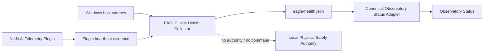

# BKL-030 — EAGLE Health & Reliability Architecture Assessment

| Campo | Valore |
|---|---|
| Identificativo | BKL-030 |
| Stato | **In Progress — D1/D2/D3 complete; D4 and G1–G8 pending** |
| Data | 2026-09-03 |
| Priorità | P1 |
| Target | EAGLE30154 / Digital StarGate Observatory Status |
| Dipendenza bloccante | Nessuna — BKL-029 closed as `Done` |

## 1. Scopo

Definire e governare la capability **EAGLE Health & Reliability Telemetry** mediante un collector host-side leggero, read-only e separato da N.I.N.A.

La capability produce observability spiegabile del computer operativo EAGLE mantenendo separati health del computer, stato degli apparati astronomici, Safety Authority locale, futuro Observatory Health Score BKL-036 e analytics/AI downstream. BKL-030 non autorizza alcun comando verso cupola, montatura, power, router o altri apparati.

## 2. Repository truth e stato

Sequenza canonica:

```text
BKL-029 Done -> BKL-030 In Progress -> BKL-015 -> BKL-044
```

D1 Host Baseline Inventory, D2 Privilege Assessment e D3 Overhead Pilot sono completati con evidence reale su `EAGLE30154` il 03/09/2026. D4 Failure Model e G1–G8 restano soggetti alla propria evidence e acceptance.

Evidence primaria:

- `docs/architecture/telemetry/evidence/BKL-030-EAGLE-Health-Source-Discovery-2026-09-03.md`
- `docs/architecture/telemetry/BKL-030-D1-D2-Progress-2026-09-03.md`
- `docs/architecture/telemetry/evidence/BKL-030-D3A-Overhead-Pilot-2026-09-03.md`
- `docs/architecture/telemetry/evidence/BKL-030-D3B-Overhead-Pilot-2026-09-03.md`

## 3. Boundary confermato

Il target resta un **lightweight EAGLE Host Health Collector**, separato dal processo N.I.N.A., read-only e fail-safe. La discovery D2 conferma che il boundary low-privilege è praticabile con `EAGLE30154\PrimaLuceLab` non elevato per la maggior parte delle source richieste.



Non integrare l'intero BKL-030 nel plugin N.I.N.A.: Event Log, filesystem/storage, process inventory, Scheduled Tasks, registry/update state, time service, SMART, USB/COM, drift e pending reboot sono responsabilità host-level e aumenterebbero failure surface e blast radius del software di acquisizione.

## 4. D1/D2 source inventory verificato

| Area | Source verificata | Disposition | Note |
|---|---|---|---|
| OS / uptime | CIM `Win32_OperatingSystem` | VERIFIED | Windows 10 Enterprise LTSC 10.0.17763 x64; boot time leggibile |
| RAM / system | CIM | VERIFIED | Total/free memory leggibili non-elevated |
| CPU | CIM `Win32_Processor` | VERIFIED | J4005 2C/2T; raw load disponibile |
| Disk capacity | `Win32_LogicalDisk` | VERIFIED | C:/D: size/free disponibili |
| Physical disk | `Get-PhysicalDisk` | VERIFIED | KINGSTON SA400S37960G SSD/SATA `Healthy / OK` |
| Detailed SMART/reliability | `Get-StorageReliabilityCounter` | UNAVAILABLE_NON_ELEVATED | Nested CIM access error; non elevare automaticamente il collector |
| Time sync | `w32tm` | VERIFIED_SOURCE / SERVICE_INACTIVE | Service not started `0x80070426`; source/offset non inferibili |
| Scheduled Tasks | Task Scheduler read API | VERIFIED | DSG Daily Session Upload e OneDrive Export visibili |
| Process inventory | process table | VERIFIED_SOURCE | presenza processi time-dependent |
| Event Log | System/Application Event Log | VERIFIED | Critical/Error leggibili; recurrent EagleManager failures osservabili |
| USB/COM | PnP inventory | VERIFIED | COM1, COM9, COM14, COM47 osservati; PnP prevale su `Win32_SerialPort` per presence |
| `Win32_SerialPort` | CIM | INSUFFICIENT_AS_SOLE_SOURCE | Probe eseguibile ma zero righe nel discovery |
| Pending reboot | registry evidence | VERIFIED_RAW_EVIDENCE | CBS/WU reboot keys assenti; PendingFileRenameOperations presente |
| Windows Update | service state | VERIFIED | Read-only; nessun trigger/update autorizzato |
| DSG paths/logs | filesystem metadata | VERIFIED | Source disponibili non-elevated |

### Capacity evidence

Il 03/09/2026 C: aveva `1500758016` byte liberi su `223397015552` (~0.67%); D: `355645206528` su `735304478720` (~48.37%). C: è una **risk candidate prioritaria**, ma nessuno stato `DEGRADED/CRITICAL` viene dichiarato finché non esiste una policy/soglia governata.

### Reliability evidence

Application Event Log espone crash ricorrenti `EagleManager.exe`, inclusi eventi `.NET Runtime` 1026 e `Application Error` 1000. Questa evidence valida Event Log come source reliability ma non autorizza a classificare ogni Windows Error come observatory-critical: serve una allowlist/provider/event policy governata.

## 5. Contratto di projection locale proposto

Target indicativo:

```text
%LOCALAPPDATA%\DigitalStarGate\telemetry\eagle-health.json
```

Schema di principio:

```json
{
  "schema_version": "1.0",
  "component": "DSG.EagleHostHealthCollector",
  "computer": "EAGLE30154",
  "observed_at_utc": "...",
  "fresh_until_utc": "...",
  "quality": "CURRENT | STALE | UNKNOWN",
  "summary": {
    "state": "HEALTHY | DEGRADED | CRITICAL | UNKNOWN",
    "reasons": []
  },
  "signals": {
    "storage": {}, "memory": {}, "cpu": {}, "uptime": {}, "time_sync": {},
    "event_log": {}, "processes": {}, "scheduled_tasks": {}, "log_sources": {},
    "usb_com": {}, "pending_reboot": {}, "configuration_drift": {}
  }
}
```

Il dettaglio finale e la field provenance saranno consolidati in G2.

## 6. Health state governance

`HEALTHY / DEGRADED / CRITICAL / UNKNOWN` deve essere spiegabile: nessun unico numero opaco; ogni stato non-HEALTHY deve indicare evidence/reasons; `UNKNOWN` quando una source obbligatoria non è osservabile o stale; nessuna soglia hardware inventata; valori raw separati dalla classificazione; BKL-036 potrà costruire un Observatory Health Score downstream; nessuno stato health può autorizzare operazioni Safety.

## 7. Collection cadence e D3 — COMPLETE

D3-A ha misurato il discovery completo senza N.I.N.A./PHD2: 3/3 successi, elapsed medio 9502.1 ms, massimo 11308.9 ms, CPU media disponibile 5.859 s, peak working set massimo 232718336 B, stderr zero.

D3-B ha ripetuto il pilot durante una normale sessione con N.I.N.A. e PHD2 attivi: 3/3 successi, elapsed medio 16769.9 ms, massimo 23204.4 ms, CPU media disponibile 7.086 s, peak working set massimo 206995456 B, stderr zero.

Decisione: il discovery monolitico non sarà il polling frequente del collector. G2/G3 dovranno separare sorgenti **fast / medium / slow-on-change** in base a costo e volatilità. D3 non introduce intervalli numerici né soglie health; imaging workload mantiene priorità.

## 8. Safety e security boundary

Il collector è strettamente read-only salvo un futuro bounded I/O self-test sulla sola working directory Digital StarGate, che richiederà specifica autorizzazione/evidence.

Vietato: kill/restart automatico di N.I.N.A./PHD2/ASCOM; reset USB/COM; riavvio Windows; installazione Windows Update; modifica Scheduled Tasks; modifica registry/config; cambio power/network; uso health state come Safety Authority. Credenziali o segreti non devono essere copiati nella projection.

## 9. Discovery gates

- **D1 — Host baseline inventory: COMPLETE.** Evidence runtime 03/09/2026.
- **D2 — Privilege assessment: COMPLETE.** Low-privilege boundary confermato; detailed SMART unavailable non-elevated.
- **D3 — Overhead pilot: COMPLETE.** D3-A e D3-B eseguiti; full discovery escluso come fast polling design.
- **D4 — Failure model: NEXT.** Deve formalizzare source unavailable, stale/collector stopped, access denied, malformed source, timeout/hung probe, partial projection, disk/write failure e recovery senza crash loop o remediation automatica.

## 10. Acceptance plan BKL-030

- **G1 Source inventory:** D1/D2 evidence disponibile; classification/policy finale ancora da formalizzare prima della closure G1.
- **G2 Contract:** projection, field provenance, cadence class e failure semantics da consolidare.
- **G3 Collector:** non implementato.
- **G4 CI:** non dichiarato.
- **G5 Runtime OAT:** non eseguito.
- **G6 History:** non implementato.
- **G7 Portal:** non implementato.
- **G8 Safety review:** boundary definito; acceptance finale non ancora eseguita.

## 11. Open questions dopo D3

1. Detailed SMART/reliability counters: optional/UNKNOWN o adapter separato? Nessuna elevation automatica.
2. Esiste una temperatura CPU/hardware verificabile senza driver invasivi?
3. Quale clock synchronization evidence usare con Windows Time inattivo?
4. Quale provider/event allowlist e severity mapping per Event Log?
5. Quale baseline governata usare per configuration drift?
6. Quale mapping per Scheduled Task `LastTaskResult`?
7. Quale policy deterministica per pending reboot?
8. Quali soglie/trend policy per storage capacity?
9. Quale retention e intervalli concreti per le cadence class?

## 12. Read-only discovery implementation

Il discovery D1/D2 è implementato da `scripts/telemetry/Inspect-EagleHealthSources.ps1` e resta discovery-only: non è un producer, non genera `eagle-health.json`, non modifica registry/task/servizi/Windows Update, non apre connessioni agli apparati, non esegue reset/restart e non effettua benchmark aggressivi.

**Disposition corrente: BKL-030 `In Progress`; D1/D2/D3 complete; D4 e G1–G8 pending.**
