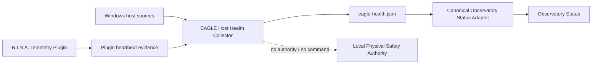

# BKL-030 — EAGLE Health & Reliability Architecture Assessment

| Campo | Valore |
|---|---|
| Identificativo | BKL-030 |
| Stato | **Planning only — implementation blocked until BKL-029 closure** |
| Data | 2026-08-31 |
| Priorità | P1 |
| Target | EAGLE30154 / Digital StarGate Observatory Status |
| Dipendenza bloccante | BKL-029 |

## 1. Scopo

Preparare il contratto architetturale e il source-discovery plan per la capability **EAGLE Health & Reliability Telemetry**, senza anticiparne l'implementazione prima della chiusura formale di BKL-029.

La capability deve produrre health observability spiegabile del computer operativo EAGLE, mantenendo separati:

- health del computer;
- stato degli apparati astronomici;
- Safety Authority locale;
- Observatory Health Score futuro (BKL-036);
- analytics/AI futuri.

BKL-030 non autorizza alcun comando verso cupola, montatura, power, router o altri apparati.

## 2. Repository truth e vincolo di sequenza

Il backlog canonico mantiene:

```text
BKL-029 -> BKL-030 -> BKL-015 -> BKL-044
```

BKL-030 resta `Planned` finché BKL-029 non è formalmente chiuso. Questo documento è quindi un package di planning/discovery e non modifica lo stato della milestone.

## 3. Decisione di boundary proposta

### 3.1 Non integrare l'intero BKL-030 nel plugin N.I.N.A.

Il plugin Digital StarGate N.I.N.A. resta il boundary appropriato per telemetry vicina al runtime N.I.N.A. e agli adapter già commissionati (dome/mount/camera/weather, Power, Network, SQM, Safety observation).

BKL-030 richiede invece accesso a sorgenti host-level come:

- Windows Event Log;
- filesystem e storage;
- process inventory;
- Windows Scheduled Tasks;
- registry/update state;
- time service / clock synchronization;
- SMART/storage health;
- USB/COM error evidence;
- configuration drift;
- pending reboot/update state.

Caricare queste responsabilità nel processo N.I.N.A. aumenterebbe failure surface, privilegi, latenza potenziale e blast radius del software di acquisizione.

### 3.2 Target boundary

La direzione proposta è un **lightweight EAGLE Host Health Collector**, separato da N.I.N.A., read-only e fail-safe.



Il collector deve limitarsi a raccogliere evidence host-side e produrre una projection locale machine-readable. Trend analysis, prediction, Health Score, anomaly detection e AI restano downstream e fuori dall'EAGLE quando possibile.

## 4. Source inventory previsto

| Area | Source candidate | Modalità | Note |
|---|---|---|---|
| Disk free/capacity | CIM `Win32_LogicalDisk` / filesystem | read-only | Source primaria prevista |
| Disk trend | history downstream dei campioni | derived | Non calcolare trend pesanti sull'EAGLE |
| RAM | CIM / performance counters | read-only | Available/commit/pressure evidence |
| CPU | performance counters / CIM | read-only | Media/picchi con finestra leggera |
| Uptime | OS boot time | read-only | Baseline per reboot detection |
| Hardware temperature | WMI/vendor source se realmente disponibile | read-only | `UNKNOWN` se non verificabile |
| SMART | `Get-PhysicalDisk`, storage reliability counters o vendor source | read-only | Nessun test distruttivo |
| I/O | small bounded write/read/delete probe in DSG working dir | non-destructive | Mai usare volumi immagine come benchmark aggressivo |
| Time sync | `w32tm /query /status` / Windows Time | read-only | State, source, offset se disponibile |
| System/Application Event Log | Windows Event Log | read-only | Aggregazione bounded Critical/Error |
| N.I.N.A. process | process table + plugin projection freshness | read-only | Nessun restart automatico |
| PHD2 process | process table/log freshness | read-only | Nessun restart automatico |
| ASCOM LocalServer | process/service inventory | read-only | Solo processi verificati |
| DSG components | producer files/process/task state | read-only | Heartbeat/freshness |
| Scheduled Tasks | Task Scheduler read API | read-only | Stato/LastTaskResult/NextRun |
| N.I.N.A./PHD2/CloudWatcher logs | filesystem metadata | read-only | Existence + last write time |
| USB/COM errors | Event Log + device inventory | read-only | Pattern evidence, niente reset device |
| Pending reboot | registry keys documented/verified | read-only | `UNKNOWN` se source non deterministica |
| Windows Update | Windows Update state/API if accessible read-only | read-only | Nessun update trigger |
| Configuration drift | governed baseline manifest vs observed versions/hashes | read-only | Drift evidence, non auto-remediation |

## 5. Contratto di projection locale proposto

File target indicativo:

```text
%LOCALAPPDATA%\DigitalStarGate\telemetry\eagle-health.json
```

Schema di principio:

```json
{
  "schema_version": "1.0",
  "component": "DSG.EagleHostHealthCollector",
  "computer": "EAGLE30154",
  "observed_at_utc": "...",
  "fresh_until_utc": "...",
  "quality": "CURRENT | STALE | UNKNOWN",
  "summary": {
    "state": "HEALTHY | DEGRADED | CRITICAL | UNKNOWN",
    "reasons": []
  },
  "signals": {
    "storage": {},
    "memory": {},
    "cpu": {},
    "uptime": {},
    "time_sync": {},
    "event_log": {},
    "processes": {},
    "scheduled_tasks": {},
    "log_sources": {},
    "usb_com": {},
    "pending_reboot": {},
    "configuration_drift": {}
  }
}
```

Il dettaglio finale dello schema deve essere definito solo dopo source discovery reale su `EAGLE30154`.

## 6. Health state: regole di governance

`HEALTHY / DEGRADED / CRITICAL / UNKNOWN` deve essere **spiegabile**.

1. nessun unico numero opaco come source of truth;
2. ogni stato non-HEALTHY deve indicare evidence/reasons;
3. `UNKNOWN` quando una source obbligatoria non è osservabile o è stale;
4. nessuna soglia hardware inventata;
5. valori quantitativi raw separati dalla classificazione;
6. BKL-036 potrà costruire un Observatory Health Score downstream;
7. nessuno stato health può autorizzare operazioni Safety.

## 7. Collection cadence proposta

La cadence non viene ancora fissata come acceptance. Segnali economici potranno avere polling nell'ordine di decine di secondi/minuti; Event Log, Scheduled Tasks, update/reboot/drift e SMART avranno scansioni meno frequenti; analytics e trend restano downstream. La cadence finale dovrà essere misurata in pilot durante N.I.N.A. attivo.

## 8. Safety e security boundary

Il collector è strettamente read-only salvo un futuro bounded I/O self-test sulla sola working directory Digital StarGate.

Vietato:

- kill/restart automatico di N.I.N.A./PHD2/ASCOM;
- reset USB/COM;
- riavvio Windows;
- installazione Windows Update;
- modifica Scheduled Tasks;
- modifica registry/config;
- cambio power/network;
- uso health state come Safety Authority.

Credenziali o segreti non devono essere copiati nella projection.

## 9. Source-discovery gates

### D1 — Host baseline inventory

Verificare realmente su EAGLE30154 Windows/build, storage, memory/CPU, SMART, Windows Time, Scheduled Tasks, processi N.I.N.A./PHD2/ASCOM/DSG, Event Log, directory/log, pending reboot/update e USB/COM.

### D2 — Privilege assessment

Per ogni source verificare se è leggibile come utente operativo `PrimaLuceLab` senza elevazione. La baseline preferisce funzionamento non elevato.

### D3 — Overhead pilot

Misurare CPU, working set, I/O, latency e failures/timeouts durante N.I.N.A. attivo.

### D4 — Failure model

Source non disponibile -> `UNKNOWN`; collector fermo -> projection stale; access denied deve degradare il singolo signal; SMART non disponibile non va inventato; malformed source non deve causare crash loop.

## 10. Acceptance plan BKL-030

Da attivare solo dopo chiusura BKL-029:

- **G1 Source inventory:** source classificate `VERIFIED / UNAVAILABLE / REJECTED`;
- **G2 Contract:** projection e field provenance definiti;
- **G3 Collector:** lightweight collector implementato;
- **G4 CI:** lint/build/test applicabili GREEN;
- **G5 Runtime OAT:** EAGLE30154 nominal/failure/recovery;
- **G6 History:** campioni conservati downstream;
- **G7 Portal:** Observatory Status mostra EAGLE health e reasons;
- **G8 Safety review:** nessun command path e separazione Safety verificata.

## 11. Open questions da risolvere nel discovery

1. SMART/reliability counters sono esposti in modo utile sull'EAGLE3?
2. Esiste una temperatura CPU/hardware verificabile senza software/vendor driver invasivo?
3. Quale Windows Time source è attivo e quale offset è esposto realmente?
4. Quali Event Log provider identificano crash N.I.N.A., PHD2 e ASCOM?
5. Quale baseline governata usare per configuration drift?
6. Quali Scheduled Tasks DSG sono realmente presenti?
7. Pending reboot/update state è leggibile senza elevation?
8. Quale retention dei raw health samples è sostenibile?

## 12. Read-only discovery implementation

Il discovery D1/D2 è implementato come:

```text
scripts/telemetry/Inspect-EagleHealthSources.ps1
```

Lo script è deliberatamente **discovery-only**:

- non è un producer;
- non genera `eagle-health.json`;
- non modifica registry, task, servizi o Windows Update;
- non apre connessioni agli apparati;
- non esegue reset/restart;
- non effettua ancora I/O benchmark;
- raccoglie metadata e capability availability in un evidence bundle locale;
- registra se la sessione PowerShell è elevata, per distinguere source disponibili come utente operativo da source che potrebbero richiedere privilegi.

Evidence target:

```text
C:\DigitalStarGate\TelemetryEvidence\eagle-health-source-discovery-YYYYMMDD-HHMMSS\
  eagle-health-source-discovery.json
  eagle-health-source-discovery.txt
```

L'esecuzione dello script prima della chiusura BKL-029 è ammessa esclusivamente come source discovery e **non costituisce BKL-030 acceptance né cambio stato a In Progress**.
