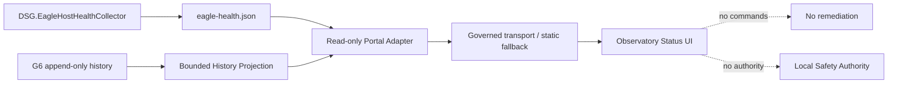

# BKL-030 G7 — EAGLE Health Portal Design

| Campo | Valore |
|---|---|
| Package | `BKL-030` |
| Gate | `G7 — Portal` |
| Status | **Proposed for implementation** |
| Date | 2026-09-04 |
| Target | Digital StarGate Observatory Status |
| Depends on | G1-G5 collector/projection; G6 history/persistence |
| Safety Authority | **Outside scope** |

## 1. Purpose

Expose EAGLE host-health evidence in the existing **Observatory Status** portal without turning telemetry into a command, remediation or Safety Authority surface.

G7 consumes the governed BKL-030 current projection and, where transport is available, bounded G6 history. It must preserve source state, freshness, provenance and unknown semantics rather than deriving unapproved host-health severity.

## 2. Verified current portal baseline

The repository already provides:

- `docs/status/index.md` as the Observatory Status surface;
- `docs/javascripts/observatory-status.js` as the browser binding;
- hosted relay first, static projection fallback second;
- 15-second browser refresh for realtime observatory telemetry;
- browser-side freshness enforcement that converts expired evidence to `UNKNOWN` / `STALE`;
- explicit wording that Observatory Status is read-only and not Safety Authority.

G7 extends this surface; it does not create a second operational portal.

## 3. Governing BKL-030 inputs

### 3.1 Current host-health projection

Canonical runtime input:

```text
%LOCALAPPDATA%\DigitalStarGate\telemetry\eagle-health.json
```

Producer:

```text
DSG.EagleHostHealthCollector
```

The portal adapter must preserve at least:

- `schema_version`;
- `component`;
- `computer` / host identity;
- `observed_at_utc`;
- `fresh_until_utc`;
- `quality`;
- `cadence_class`;
- per-signal evidence state and quality;
- source/provenance;
- optional reason/raw evidence where approved for publication.

### 3.2 Historical host-health evidence

G6 persists duplicate-safe append-only records under:

```text
%LOCALAPPDATA%\DigitalStarGate\telemetry\history\eagle-health\YYYY\MM\
```

G7 may consume only a bounded read model derived from those records. The browser must not fetch or parse an unbounded NDJSON archive.

No history deletion, compaction or retention enforcement is introduced by G7.

## 4. Architectural boundary



Rules:

1. Portal is a **consumer**, never a controller.
2. G7 must not invoke CIM/WMI, Event Log, Task Scheduler, registry or host probes from the browser or relay.
3. G7 must not restart processes, services or Windows, modify tasks, install updates or reset devices.
4. G7 must not infer observatory `SAFE` from host-health evidence.
5. Local physical interlocks remain authoritative and independent.

## 5. Portal information architecture

Add one dedicated section to the existing Observatory Status page:

### `EAGLE host health`

Recommended current-state cards:

| Card | Evidence |
|---|---|
| Host telemetry | overall projection freshness, host, collector component, observed time |
| OS / uptime | observed state, uptime / boot evidence when present |
| CPU / memory | observed evidence only; no severity threshold unless separately governed |
| Storage capacity | size/free/free ratio as evidence; no green/red capacity classification yet |
| Physical storage health | Windows-reported aggregate health independently from capacity |
| Time / services | Windows Time and governed service evidence |
| Scheduled tasks | observed task state and last-result evidence |
| Pending reboot | raw governed evidence; do not convert nullable evidence into a reboot verdict |
| Windows Update | observed service/update evidence only |
| Event Log | bounded governed event evidence; empty current window remains valid observed evidence |
| Configuration drift | `UNKNOWN` while no baseline is approved |

The UI must distinguish **evidence availability** from **health severity**.

## 6. Severity policy

G7 does **not** activate host-health thresholds.

Until a separate policy is governed:

```text
summary.state  = UNKNOWN
summary.reason = POLICY_NOT_ACTIVATED
```

Therefore:

- low free space may be displayed numerically;
- Windows-reported physical disk health may be displayed as source evidence;
- neither may be transformed into an invented `HEALTHY`, `DEGRADED` or `CRITICAL` classification;
- visual colour must represent freshness/evidence state, not an unapproved severity policy.

## 7. Freshness and failure model

For current evidence:

- valid sample before `fresh_until_utc` → preserve source quality/current evidence;
- valid sample after `fresh_until_utc` → render `STALE` and do not present the old value as current;
- missing/unreadable input → `UNKNOWN`;
- malformed/unsupported schema → `UNKNOWN` plus diagnostic provenance, never synthetic values.

The EAGLE health panel must fail independently. Failure to load host health must not blank or downgrade existing weather, dome, mount, camera, power, network or scientific-session surfaces.

## 8. Transport strategy

G7 must reuse the existing Observatory Status transport pattern where feasible rather than introducing browser credentials or direct EAGLE access.

Target contract:

```text
EAGLE local projection
  -> read-only publication adapter
  -> governed hosted/static projection
  -> browser
```

The browser contains no ingest credential.

A new remote API or durable cloud datastore is **not approved by this design**. If implementation requires either, that is an architecture-boundary change requiring separate approval/review.

## 9. Historical portal slice

History is intentionally bounded.

Minimum G7 history read model should support:

- latest sample timestamp per selected signal;
- bounded recent samples or simple trend series;
- explicit signal identifier and source;
- quality/freshness captured with each historical record;
- no retroactive rewrite of historical freshness;
- no automatic deletion.

Initial trend candidates should be restricted to already numeric evidence such as free-space ratio/bytes and other numeric collector fields that are stable in the G5 contract. No threshold line is shown until threshold policy exists.

## 10. Security and privacy

- No secrets in portal JavaScript or static JSON.
- No browser-to-EAGLE connection.
- No command endpoint.
- Do not publish unnecessary raw host data when a normalized evidence field is sufficient.
- Preserve source identity so stale/fallback evidence cannot masquerade as current runtime data.

## 11. Observability

The portal adapter/read model should expose enough diagnostic evidence to answer:

- which host produced the data;
- which component produced the projection;
- when it was observed;
- until when it was fresh;
- whether current or historical transport was used;
- why a signal is `UNKNOWN`/`STALE` when a reason exists.

Client fetch failures remain isolated and visible in browser diagnostics without changing host state.

## 12. Delivery slices

### G7-A — Portal projection contract

Define the public/read-only EAGLE-health portal projection and bounded history projection. Validate schema, provenance, freshness and no-severity semantics.

### G7-B — Observatory Status UI

Extend `docs/status/index.md` and browser bindings to render current host-health evidence. Existing Observatory Status cards must remain regression-safe.

### G7-C — Bounded history/trend UI

Expose selected recent numeric evidence from a bounded history projection. No unbounded browser parsing and no retention action.

### G7-D — CI / failure injection

Automated validation for:

- current projection render;
- stale projection;
- missing projection;
- malformed/unsupported projection;
- `POLICY_NOT_ACTIVATED` preservation;
- history absent/empty/bounded;
- no regression of existing Observatory Status bindings.

### G7-E — Hosted/static OAT and acceptance

Verify the rendered portal path with governed test/runtime evidence. Confirm no browser credentials, no command path, correct stale/unknown rendering and independent failure behavior.

## 13. Acceptance criteria

G7 is acceptable only when:

1. EAGLE health appears in the existing Observatory Status surface;
2. current evidence preserves timestamps, freshness and provenance;
3. expired evidence renders `STALE`/`UNKNOWN` rather than current;
4. missing/malformed host-health data fails independently;
5. `UNKNOWN/POLICY_NOT_ACTIVATED` is preserved until threshold governance exists;
6. storage capacity and physical storage health remain separate evidence families;
7. pending reboot nullable/raw semantics are preserved;
8. configuration drift remains `UNKNOWN` without an approved baseline;
9. bounded history does not require unbounded browser parsing;
10. no retention deletion is enabled;
11. no browser credential or direct EAGLE access is introduced;
12. no remediation or Safety Authority coupling is introduced;
13. CI/documentation validation is green;
14. runtime/hosted OAT evidence is recorded;
15. independent architecture/release review is completed before merge.

## 14. Explicitly out of scope

- permanent scheduling of the G6 history writer;
- destructive retention/compaction;
- host-health severity thresholds;
- automated remediation;
- Windows Update execution;
- process/service restart;
- reboot automation;
- USB/COM reset;
- Safety Authority integration;
- G8 safety review closure.

## 15. G8 handoff

After G7 acceptance, BKL-030 remains `In Progress` and advances to **G8 Safety review**. G8 must independently verify that host-health telemetry and portal presentation cannot be mistaken for or elevated into observatory safety authority.
