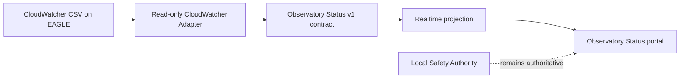

# Observatory Status Realtime Telemetry Pilot

| Campo | Valore |
|---|---|
| Identificativo | DSG-OBS-RT-001 |
| Versione | 0.1 |
| Stato | In development |
| Data | 16/08/2026 |
| Target | Observatory Status read-only telemetry pilot |
| Dipendenze | AP-003; AP-004; AP-008; AP-010; AP-012 |

## 1. Scopo

Definire il primo vertical slice read-only per alimentare la pagina **Observatory Status** con telemetria operativa osservata sull'EAGLE, senza introdurre command path, safety authority remota o una tecnologia di transport non ancora validata.

Il pilot implementa il contratto `contracts/telemetry/observatory-status-v1.schema.json` e mantiene il portale come consumer read-only. Stato assente, stale o non verificabile resta `UNKNOWN`/`STALE`.

## 2. Current state verificato

- `docs/status/index.md` espone già una superficie Observatory Status.
- `docs/javascripts/observatory-status.js` consuma la projection `docs/data/realtime/observatory-status.json` e applica freshness lato browser.
- L'EAGLE fisico è il nodo di controllo centrale e ospita Windows, N.I.N.A., CPWI, PHD2 e ASCOM.
- Il runtime AP-014 ha verificato sul nodo `EAGLE30154` la sorgente CloudWatcher `C:\Users\PrimaLuceLab\Documents\CloudWatcher\CloudWatcher.csv`.
- Il CSV CloudWatcher reale contiene `Date`, `Time`, condizioni cloud/rain/brightness, temperatura ambiente, vento, umidità relativa, dew point, pressioni e `Safe Status`.
- La documentazione della cupola richiede sensori OPEN, CLOSED e SAFE, ma polarità, schema elettrico e interfaccia runtime restano `DA VALIDARE`.
- ASCOM è documentato come middleware per montatura, camere e potenzialmente cupola/meteo, ma versioni, driver e interfacce runtime effettive restano da validare.
- Il RUT955 governa indicativamente WAN/VPN/failover, ma health-check, API/management interface e criteri runtime non sono ancora attestati.

## 3. Producer inventory

| Producer / capability | Evidenza repository | Interfaccia verificata | Stato pilot | Regola |
|---|---|---|---|---|
| CloudWatcher meteo | AP14-W07 runtime evidence + CSV sessione versionato | CSV locale su EAGLE | **Verified source** | primo adapter read-only |
| Cupola OPEN/CLOSED/SAFE | Capitolo 3 | non verificata | Open issue | nessuna lettura fino a runtime inspection |
| Montatura CGX-L | Capitoli 6/14, AP-003 | ASCOM/CPWI come capability, runtime contract non verificato | Open issue | no connessione concorrente al driver |
| Camera | Capitoli 6/14 | N.I.N.A./driver presenti, status interface non verificata | Open issue | nessun polling diretto finché non definito adapter sicuro |
| Network Starlink/RUT955/VPN/LTE | Capitolo 5 | componenti/topologia documentati, management telemetry non verificata | Open issue | no credenziali o scraping non governato |
| Power / UPS | EAGLE power distribution documentata | UPS/source interface non verificata | Open issue | `UNKNOWN` fino a evidence |

## 4. Primo adapter: CloudWatcher

Il primo adapter legge **soltanto** il CSV locale già verificato. Non modifica CloudWatcher, non apre device connection, non invia comandi e non influenza gli interlock.

### Campi governati nel primo incremento

- timestamp: `Date` + `Time`;
- stato meteo osservato: `Safe Status` -> `SAFE`, `UNSAFE` o `UNKNOWN`;
- condizioni raw conservabili come evidence diagnostica: `Cloud Condition`, `Rain Condition`, `Brightness Condition`, `Wind Condition`, `Switch Status`.

I campi numerici del CSV non vengono ancora proiettati nelle proprietà normalizzate con unità (`*_c`, `*_kmh`, `*_hpa`, ecc.) finché l'unità e la semantica non sono deliberate da documentazione del dispositivo o runtime evidence. Questo evita conversioni implicite o false precisioni.

## 5. Freshness e qualità

La durata di freshness è un parametro esplicito del collector e **non** viene codificata come soglia operativa definitiva.

Regole del pilot:

1. il timestamp del signal deriva dalla riga CloudWatcher, non dall'orologio del portale;
2. `fresh_until_utc = observed_at_utc + freshness configurata`;
3. se il dato ha superato `fresh_until_utc`, il weather signal diventa `STALE/UNKNOWN` nel consumer;
4. payload complessivo `DEGRADED` quando solo il meteo è integrato, anche con dato corrente;
5. safety complessiva resta `UNKNOWN` finché la Local Safety Authority non è integrata come osservazione separata;
6. `Safe Status = Safe` del CloudWatcher non equivale a dichiarazione di overall observatory safety.

## 6. Target state del pilot

Il transport tra projection runtime e GitHub Pages non è scelto in questa fase. L'adapter produce un file conforme al contratto; deployment/transport verranno selezionati solo dopo misure di frequenza, affidabilità, reachability e failure mode.

## 7. Failure modes

| Scenario | Comportamento |
|---|---|
| CSV assente | collector fallisce in modo esplicito; nessun falso dato |
| header inatteso | collector fallisce; schema drift da investigare |
| riga non parsabile | collector fallisce; timestamp non inventato |
| dato stale | projection consumata come `STALE/UNKNOWN` |
| `Safe Status` sconosciuto | weather `UNKNOWN` |
| portale non raggiungibile | nessun impatto su CloudWatcher o safety locale |
| collector arrestato | ultimo dato decade per freshness |

## 8. Acceptance del primo slice

- source CloudWatcher e schema CSV sono tracciati da evidence reale;
- adapter PowerShell 5.1-compatible, read-only sulla sorgente;
- nessun device command o accesso concorrente ASCOM;
- output conforme semanticamente al contratto Observatory Status v1;
- freshness configurabile e fail-closed sul dato stale;
- overall safety non derivata dal solo `Safe Status` meteo;
- cupola, mount, camera, power e network restano `UNKNOWN` finché non esiste evidence runtime;
- CI documentale/applicativa verde;
- runtime test sull'EAGLE registrato separatamente prima di dichiarare il producer operativo.

## 9. Prossimi incrementi

1. eseguire collector CloudWatcher in read-only su EAGLE e acquisire output/evidence;
2. validare unità e semantica dei campi numerici CloudWatcher prima della normalizzazione;
3. ispezionare l'interfaccia reale dei segnali cupola OPEN/CLOSED/SAFE;
4. definire adapter montatura senza creare una seconda catena di controllo concorrente;
5. verificare capability read-only RUT955/VPN/LTE;
6. misurare frequenza, volume, availability e failure behavior;
7. deliberare il transport permanente solo dopo il pilot.

## 10. Traceability

- `docs/architecture/packages/AP-004-Enterprise-Telemetry-and-Observability-Architecture.md`
- `docs/architecture/enterprise-observability-reference-architecture.md`
- `docs/architecture/packages/AP-012-Enterprise-Operations-Center-Architecture.md`
- `docs/chapters/03-struttura-cupola.md`
- `docs/chapters/05-infrastruttura-rete.md`
- `docs/chapters/06-eagle.md`
- `docs/chapters/14-ascom.md`
- `docs/chapters/26-monitoraggio-meteo-sicurezza-ambientale.md`
- `docs/architecture/validation/AP14-W07-EAGLE-M27-OAT-Result.md`
