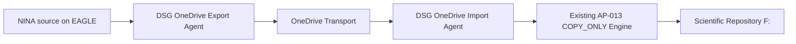

# AP-013B — OneDrive Transport Operational Acceptance

| Campo | Valore |
|---|---|
| Identificativo | `OAT-AP013B-001` |
| Package | AP-013 — Scientific Image Repository Architecture |
| Incremento | AP-013B — OneDrive-mediated COPY_ONLY Transport |
| Stato | **Passed — Limited Production** |
| Modalità | `COPY_ONLY` |
| Source cleanup | Prohibited |
| Overwrite | Prohibited |
| Data baseline | 11/08/2026 |
| Promotion review | `QG20-AP013B-001` |

## 1. Scopo

Definire la Operational Acceptance del trasporto scientifico mediato da OneDrive che sostituisce il data path SMB/VPN diretto tra EAGLE e PC principale, senza modificare le invarianti di sicurezza e integrità del motore AP-013.

## 2. Current State verificato

Il percorso end-to-end validato è:

```text
D:\Images NINA\Target
  -> DSG OneDrive Export Agent
  -> OneDrive locale EAGLE
  -> sincronizzazione Microsoft OneDrive
  -> OneDrive locale PC principale
  -> DSG OneDrive Import Agent
  -> F:\Astrofotografia
```

Pilot hash end-to-end verificato sul file `DARK_1x1_1.05s_910_99_Flat_LDN1320_Skywatcher quattro 200p__-0.90C_LPRO_0002_2026-07-09_17-35-59_FWHM_0.00_Fok_.xisf`:

- dimensione: `23190016` byte;
- SHA-256 sorgente EAGLE: `44a636a84a141f8108038f613649af093385425c9c56b9fbbe29208d3da13ade`;
- SHA-256 OneDrive PC principale: identico;
- SHA-256 destinazione `F:`: identico;
- `EndToEndVerified = True`;
- `SourceDeleted = False`;
- `OverwritePerformed = False`.

## 3. Target State



Regole vincolanti:

- la sorgente NINA non viene cancellata;
- il transport OneDrive non viene cancellato automaticamente;
- il manifest `*.ready.json` viene pubblicato solo dopo verifica del file transport;
- l'import considera soltanto manifest `READY`;
- ogni file viene verificato per dimensione e SHA-256 prima dell'import;
- overwrite vietato;
- OneDrive è transport/staging e non repository scientifico autorevole.

## 4. Baseline implementativa verificata

Componenti:

- `tools/dsdm/session-importer/DSG.OneDriveTransport.psm1`;
- `tools/dsdm/session-importer/Start-DSGOneDriveExport.ps1`;
- `tools/dsdm/session-importer/Start-DSGOneDriveImport.ps1`;
- `tools/dsdm/session-importer/Start-DSGOneDriveImportScheduled.ps1`;
- `tools/dsdm/session-importer/tests/DSG.OneDriveTransport.Tests.ps1`.

Commit principali:

- `b5c435c9b0ebfcb1f0123ae9d89c9984ba4cb939` — transport module;
- `381c52e80c2e6eb5e7c5cdb5a5f2c8c3b69b8137` — export agent;
- `3ef1118bb5d78c178eb4f3d4901674ed7c2f6075` — import agent;
- `142b2f92f5cd3578d4ece5cfdc790e44a1047db6` — Pester isolation fix;
- `0b00d1f23c825a2f753cef2a13fc41d2ea5e3b1a` — export backlog progression fix;
- `6a26af52b33a4e2a17846c7852a064dee951ec1b` — scheduled import launcher;
- `55b0e81cc123341dae07f82e9051181566a8caf1` — scheduled launcher exit handling fix;
- `5323cb5a5c3aa3ac809603a26e1b1a46ddc57dfc` — import backlog progression fix.

## 5. Runtime evidence

### 5.1 Synthetic regression

- `DSG.OneDriveTransport.Tests.ps1`: `9 passed`, `0 failed`;
- `DSG.SessionTransfer.Tests.ps1`: `Failed = 0`;
- `DSG.SessionImporter.Tests.ps1`: `Failed = 0`.

### 5.2 OAT-RUN-010 — controlled 10-file export/import

Export EAGLE: `Requested = 10`, `Ready = 10`, `Failed = 0`, `SourceFilesDeleted = 0`.

Import PC: `Requested = 10`, `CopiedVerified = 10`, `DeferredNoPlan = 0`, `Failed = 0`, `SourceFilesDeleted = 0`, `TransportFilesDeleted = 0`, `OverwritesPerformed = 0`.

Retry idempotente: `SkippedIdentical = 10`, process exit code `0`.

### 5.3 Scheduler pilot e backlog progression

- task Export e Import attive;
- `MultipleInstances = IgnoreNew`;
- execution policy bypass limitato al processo schedulato;
- task legacy SMB disabilitata e mantenuta come rollback;
- esecuzione hidden validata;
- `LastTaskResult = 0` osservato sui due scheduler;
- batch operativo 30 verificato su Export e Import;
- soglia cumulativa di 100 asset superata con backlog progression verificata;
- nessuna cancellazione o overwrite osservati.

### 5.4 QG-11 — OneDrive sync interruption and recovery

Interruzione OneDrive sul PC principale verificata fail-safe: nessuna destinazione incompleta. Dopo recovery, payload e READY hanno riconvergito, hash e size sono risultati coerenti e l'import ha completato con `CopiedVerified = 1`, `Failed = 0`, zero delete/overwrite e `EndToEndVerified = True`.

### 5.5 QG-12A — PC principal restart recovery

Dopo reboot/login del PC principale OneDrive ha riconvergito payload e READY; size/hash verificati; import completato con `CopiedVerified = 1`, `Failed = 0`, zero delete/overwrite e `EndToEndVerified = True`.

### 5.6 QG-12B — EAGLE restart recovery

Un `.dsg-partial` residuo è rimasto non pubblicato come READY. Dopo reboot EAGLE il retry Export ha ricostruito il payload, eliminato lo staging parziale, pubblicato READY e consentito l'import finale verificato con zero delete/overwrite.

### 5.7 QG-18 — Security and ACL review

EAGLE transport ACL:

- owner `BUILTIN\Administrators`;
- `SYSTEM`, `Administrators`, `EAGLE30154\PrimaLuceLab`: `FullControl`;
- `Everyone`: inherited `Deny DeleteSubdirectoriesAndFiles`;
- nessuna ACE generica con write/modify/full-control.

Export task: principal `PrimaLuceLab`, Interactive, Highest, IgnoreNew, script AP-013B esplicito, nessun secret/token/credential path.

PC transport ACL:

- owner/group `AzureAD\MassimoMainini`;
- `SYSTEM`, `Administrators`, `AzureAD\MassimoMainini`: `FullControl`;
- `Everyone`: inherited `Deny DeleteSubdirectoriesAndFiles`;
- nessuna ACE generica con write/modify/full-control.

Import task: principal `MassimoMainini`, Interactive, Limited, IgnoreNew, launcher schedulato AP-013B, `MaxFilesPerRun 30`, nessun secret/token/credential path.

## 6. Quality-gate matrix

| Gate | Criterio | Stato | Evidenza / vincolo |
|---|---|---|---|
| QG-01 Architecture | OneDrive transport, repository finale `F:` | Passed | runtime AP-013B |
| QG-02 Source immutability | nessuna cancellazione sorgente | Passed | `SourceFilesDeleted=0` |
| QG-03 No overwrite | nessun overwrite | Passed | `OverwritesPerformed=0` |
| QG-04 End-to-end integrity | SHA-256 coerente | Passed | pilot + recovery |
| QG-05 Manifest READY | import dopo READY | Passed | runtime + Pester |
| QG-06 Unit/Pester | suite OneDrive | Passed | 9/9 |
| QG-07 Existing regression | importer/transfer | Passed | Failed=0 |
| QG-08 Batch 10 | controlled batch | Passed | OAT-RUN-010 |
| QG-09 Batch 100 | progression/reconciliation | Passed | >100 asset |
| QG-10 Batch 1000 | soak/capacity | Not Executed | waiver solo con batch <=30 |
| QG-11 Sync interruption | fail-safe + recovery | Passed | QG-11 |
| QG-12 Restart recovery | PC + EAGLE | Passed | QG-12A/B |
| QG-13 Tamper detection | hash mismatch blocks | Passed synthetic | Pester |
| QG-14 Conflict | no overwrite | Passed synthetic | Pester |
| QG-15 Idempotency | retry sicuro | Passed | SKIP_IDENTICAL |
| QG-16 Evidence | CSV/JSON | Passed | runtime evidence |
| QG-17 Scheduler | hidden/no overlap/evidence | Passed | scheduler runtime |
| QG-18 Security | ACL/principal/no secrets | Passed | security review |
| QG-19 Operations | runbook + rollback | Passed | §7 |
| QG-20 Production authorization | promotion review | **Passed** | `QG20-AP013B-001`; limited production |

## 7. Runbook operativo AP-013B

### 7.1 Baseline

- EAGLE source: `D:\Images NINA\Target`;
- EAGLE transport: `C:\Users\PrimaLuceLab\OneDrive - Massimo Mainini\Manciano\DigitalStarGate-Transport`;
- PC transport: `C:\Users\MassimoMainini\OneDrive - Massimo Mainini\Manciano\DigitalStarGate-Transport`;
- repository finale: `F:\Astrofotografia`;
- batch massimo autorizzato: `30`;
- task Export: `Digital StarGate - OneDrive Export`;
- task Import: `Digital StarGate - OneDrive Import`;
- legacy rollback: `Digital StarGate - Morning Transfer`, disabilitata.

### 7.2 Daily check

Verificare `Get-ScheduledTaskInfo` per Export e Import. Condizione nominale `LastTaskResult = 0`; `267009 / 0x41301` durante un run indica task in esecuzione.

### 7.3 Evidence check

Controllare gli ultimi `export-manifest.json` e `import-manifest.json`. Stop/escalation se `Failed > 0`, `SourceFilesDeleted > 0`, `TransportFilesDeleted > 0` o `OverwritesPerformed > 0`.

### 7.4 Transport check

Verificare conteggi `READY`, `XISF`, `PARTIAL`. Mismatch temporanei READY/XISF possono derivare dalla sincronizzazione asincrona; `.dsg-partial` persistenti richiedono verifica del run EAGLE prima di cleanup manuale.

### 7.5 OneDrive unavailable

Non forzare import incompleti; ripristinare OneDrive; attendere XISF+READY locali; verificare size/hash; lasciare completare il successivo Import.

### 7.6 Restart recovery

PC: verificare OneDrive, convergenza XISF+READY, hash e import. EAGLE: il partial non è READY; il retry Export ricostruisce il payload verificato.

### 7.7 Stop conditions

- mismatch SHA-256;
- overwrite;
- cancellazione source/transport;
- failure ripetute;
- partial persistenti;
- ACL con scrittura generica;
- task principal/arguments fuori baseline;
- backlog persistentemente oltre capacità batch 30.

### 7.8 Rollback

1. disabilitare Export;
2. disabilitare Import;
3. non cancellare source/transport/destinazioni;
4. conservare evidence;
5. ispezionare partial;
6. riabilitare la task legacy SMB solo dopo decisione esplicita;
7. rieseguire Pester e batch limitato prima di nuova promotion.

### 7.9 Change control

Nuova validazione obbligatoria per batch >30, modifica path, principal/logon type, hash/READY/staging, cleanup automatico, semantica COPY_ONLY o riattivazione permanente SMB/VPN.

## 8. Evidence bundle

Conservare manifest JSON, results CSV, transfer plan, timestamp, conteggi, sample hash, partial inventory e configurazione non-secret.

## 9. Risk and waiver register

| Rischio | Stato |
|---|---|
| OneDrive delay/throttling | mitigato con batch 30/READY/IgnoreNew |
| Files On-Demand | mitigato con local payload verification |
| cloud interruption | QG-11 Passed |
| restart host | QG-12A/B Passed |
| ACL/account exposure | QG-18 Passed |
| backlog | mitigato a scala corrente |
| path locali | technical debt/change control |
| QG-10 non eseguito | waiver limitato a batch <=30; nessuna scale-out claim |

Nessun waiver autorizza delete, overwrite o hash bypass.

## 10. CI promotion baseline

Baseline candidata `0fa5cfb6a3778f7529083418c2c3e5fba62064a6` verificata con GitHub Actions:

- `deploy`: `completed/success`;
- `quality-gate`: `completed/success`;
- `build-word`: `completed/success`.

## 11. Promotion disposition

**QG-20 PASSED — APPROVED FOR LIMITED PRODUCTION.**

Condizioni: `MaxFilesPerRun <= 30`, COPY_ONLY, SHA-256 e READY obbligatori, no cleanup automatico, no overwrite, legacy SMB disabilitato salvo rollback, nuova validazione per qualsiasi modifica governata.

## 12. AP-013 package boundary

Questa acceptance chiude AP-013B, non l'intero AP-013. Il package AP-013 resta `active` finché il suo evidence manifest non è completamente soddisfatto, inclusi ARB-013, OAT canonico e Operational Acceptance canonica.
