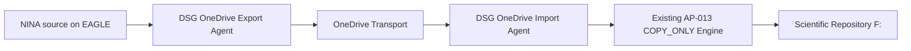

# AP-013B — OneDrive Transport Operational Acceptance

| Campo | Valore |
|---|---|
| Identificativo | `OAT-AP013B-001` |
| Package | AP-013 — Scientific Image Repository Architecture |
| Incremento | AP-013B — OneDrive-mediated COPY_ONLY Transport |
| Stato | OAT partially passed — recovery/security gates open |
| Modalità | `COPY_ONLY` |
| Source cleanup | Prohibited |
| Overwrite | Prohibited |
| Data baseline | 07/08/2026 |

## 1. Scopo

Definire la Operational Acceptance del trasporto scientifico mediato da OneDrive che sostituisce il data path SMB/VPN diretto tra EAGLE e PC principale, senza modificare le invarianti di sicurezza e integrità del motore AP-013.

Il documento separa esplicitamente evidenze già osservate, validazioni non ancora eseguite e gate necessari prima della promozione definitiva.

## 2. Current State verificato

Il percorso end-to-end validato è:

```text
D:\Images NINA\Target
  -> DSG OneDrive Export Agent
  -> OneDrive locale EAGLE
  -> sincronizzazione Microsoft OneDrive
  -> OneDrive locale PC principale
  -> DSG OneDrive Import Agent
  -> F:\Astrofotografia
```

Per il pilot iniziale sul file `DARK_1x1_1.05s_910_99_Flat_LDN1320_Skywatcher quattro 200p__-0.90C_LPRO_0002_2026-07-09_17-35-59_FWHM_0.00_Fok_.xisf` sono state osservate le seguenti evidenze:

- dimensione: `23190016` byte;
- SHA-256 sorgente EAGLE: `44a636a84a141f8108038f613649af093385425c9c56b9fbbe29208d3da13ade`;
- SHA-256 file OneDrive sul PC principale: identico;
- SHA-256 destinazione `F:`: identico;
- `EndToEndVerified = True`;
- destinazione già presente classificata `SKIP_IDENTICAL`;
- `SourceDeleted = False`;
- `OverwritePerformed = False`;
- hash locale EAGLE sul file da 22.12 MiB: circa `0.16 s`;
- copia locale EAGLE -> OneDrive staging: circa `0.08 s`, `287.72 MiB/s` osservati;
- hash OneDrive sul PC principale: circa `1.12 s`, `19.71 MiB/s` osservati;
- precedente lettura SMB/UNC dello stesso file: circa `71.19 s`, `0.31 MiB/s` osservati.

Queste misure descrivono il pilot osservato e non costituiscono una SLA.

## 3. Target State



Regole vincolanti:

- la sorgente NINA non viene cancellata;
- il transport OneDrive non viene cancellato durante la fase di acceptance;
- il manifest `*.ready.json` viene pubblicato solo dopo verifica del file transport;
- l'import considera soltanto manifest `READY`;
- ogni file viene verificato per dimensione e SHA-256 prima dell'import;
- il motore COPY_ONLY esistente resta autoritativo per `COPIED_VERIFIED`, `SKIP_IDENTICAL` e conflitti;
- overwrite vietato;
- file `.dsg-partial` residui sono condizioni di attenzione/stop;
- OneDrive è transport/staging e non repository scientifico autorevole.

## 4. Baseline implementativa verificata

Repository: `maininimassimo-bit/digital-stargate-manual`.

Componenti:

- `tools/dsdm/session-importer/DSG.OneDriveTransport.psm1`;
- `tools/dsdm/session-importer/Start-DSGOneDriveExport.ps1`;
- `tools/dsdm/session-importer/Start-DSGOneDriveImport.ps1`;
- `tools/dsdm/session-importer/Start-DSGOneDriveImportScheduled.ps1`;
- `tools/dsdm/session-importer/tests/DSG.OneDriveTransport.Tests.ps1`.

Commit principali verificati:

- `b5c435c9b0ebfcb1f0123ae9d89c9984ba4cb939` — transport module;
- `381c52e80c2e6eb5e7c5cdb5a5f2c8c3b69b8137` — export agent;
- `3ef1118bb5d78c178eb4f3d4901674ed7c2f6075` — import agent;
- `b9b9f6d1e2db8cee896839eaf57086d4ff0fb14e` — Pester coverage definition;
- `142b2f92f5cd3578d4ece5cfdc790e44a1047db6` — Pester isolation fix;
- `0b00d1f23c825a2f753cef2a13fc41d2ea5e3b1a` — export backlog progression fix;
- `6a26af52b33a4e2a17846c7852a064dee951ec1b` — scheduled import launcher;
- `55b0e81cc123341dae07f82e9051181566a8caf1` — scheduled launcher exit handling fix;
- `5323cb5a5c3aa3ac809603a26e1b1a46ddc57dfc` — import backlog progression fix.

## 5. Runtime evidence — 07/08/2026

### 5.1 Synthetic regression

Eseguito sul PC principale:

- `DSG.OneDriveTransport.Tests.ps1`: `9 passed`, `0 failed`;
- `DSG.SessionTransfer.Tests.ps1`: completed with `Failed = 0`;
- `DSG.SessionImporter.Tests.ps1`: completed with `Failed = 0`.

### 5.2 OAT-RUN-010 — controlled 10-file export/import

EAGLE Export:

- `Requested = 10`;
- `Ready = 10`;
- `Deferred = 0`;
- `Failed = 0`;
- `SourceFilesDeleted = 0`.

OneDrive PC principale:

- `10 XISF` e `10 READY` osservati;
- `10/10` file presenti nel transfer plan selezionato.

PC Import:

- `Requested = 10`;
- `CopiedVerified = 10`;
- `SkippedIdentical = 0`;
- `DeferredNoPlan = 0`;
- `Failed = 0`;
- `SourceFilesDeleted = 0`;
- `TransportFilesDeleted = 0`;
- `OverwritesPerformed = 0`.

Retry idempotente tramite scheduled launcher:

- `Requested = 10`;
- `SkippedIdentical = 10`;
- `Failed = 0`;
- process exit code `0`.

### 5.3 Scheduler pilot

Configurazione verificata:

- `Digital StarGate - OneDrive Export` su EAGLE;
- `Digital StarGate - OneDrive Import` sul PC principale;
- `MultipleInstances = IgnoreNew`;
- execution policy bypass limitato al processo PowerShell schedulato;
- legacy `Digital StarGate - Morning Transfer` disabilitata e mantenuta come rollback.

Sono state osservate esecuzioni autonome con `LastTaskResult = 0` su entrambi gli host e avanzamento del backlog senza intervento manuale.

### 5.4 Batch operativo 30 e progression evidence

EAGLE Export completato:

- `SourceFilesObserved = 203`;
- `AlreadyReadySkipped = 130`;
- `Requested = 30`;
- `Ready = 30`;
- `Deferred = 0`;
- `Failed = 0`;
- `SourceFilesDeleted = 0`;
- durata osservata: circa `6m44s`;
- scheduler interval: `10 min`;
- `LastTaskResult = 0`.

PC Import completato:

- `ReadyManifestsObserved = 165`;
- `AlreadyImportedSkipped = 123`;
- `DeferredNoPlan = 0`;
- `DeferredTransportNotReady = 0`;
- `Requested = 30`;
- `CopiedVerified = 30`;
- `SkippedIdentical = 0`;
- `Failed = 0`;
- `SourceFilesDeleted = 0`;
- `TransportFilesDeleted = 0`;
- `OverwritesPerformed = 0`;
- scheduler `LastTaskResult = 0`.

Durante la sincronizzazione sono stati osservati temporaneamente conteggi diversi tra READY e XISF (`97 READY / 91 XISF` e successivamente `176 READY / 172 XISF`), coerenti con sincronizzazione asincrona. L'Importer aggiornato differisce i manifest il cui payload XISF non è ancora localmente disponibile.

Il sistema ha quindi superato la soglia cumulativa di 100 asset osservati/importabili, con batch limitato a 30 per singola esecuzione e backlog progression verificata.

## 6. Quality-gate matrix

| Gate | Criterio | Stato | Evidenza / azione richiesta |
|---|---|---|---|
| QG-01 Architecture | OneDrive resta transport, repository finale resta `F:` | Passed | pilot e runtime AP-013B |
| QG-02 Source immutability | nessuna cancellazione sorgente | Passed | tutti i run: `SourceFilesDeleted=0` |
| QG-03 No overwrite | destinazioni esistenti non sovrascritte | Passed | `OverwritesPerformed=0`; retry `SKIP_IDENTICAL` |
| QG-04 End-to-end integrity | SHA-256 EAGLE = OneDrive = final | Passed | pilot hash end-to-end + `COPIED_VERIFIED` runtime |
| QG-05 Manifest READY | import soltanto dopo pubblicazione READY | Passed | runtime e Pester |
| QG-06 Unit/Pester | nuova suite OneDrive passa integralmente | Passed | 9/9, Failed=0 |
| QG-07 Existing regression | SessionImporter e SessionTransfer restano verdi | Passed | entrambe le suite rieseguite con Failed=0 |
| QG-08 Batch 10 | 10 file completati senza failure/deletion/overwrite | Passed | OAT-RUN-010 |
| QG-09 Batch 100 | almeno 100 asset gestiti con progression e reconciliation | Passed | >100 READY osservati, progression autonoma, batch 30 verificati |
| QG-10 Batch 1000 | soak/capacity test su 1000 file | Not Executed | opzionale prima di scale-out oltre batch limitato |
| QG-11 Sync interruption | stop/sospensione OneDrive non produce import incompleto | Not Executed | fault injection controllata ancora richiesta |
| QG-12 Restart recovery | reboot EAGLE/PC non corrompe manifest o destinazioni | Not Executed | recovery test ancora richiesto |
| QG-13 Tamper detection | mismatch hash blocca import | Passed synthetic | Pester dedicato passato; runtime destructive fault non necessario per pilot |
| QG-14 Conflict | destinazione diversa blocca senza overwrite | Passed synthetic | Pester dedicato passato; runtime conflict injection ancora opzionale |
| QG-15 Idempotency | retry produce `SKIP_IDENTICAL` | Passed | scheduled launcher: 10/10 SKIP_IDENTICAL, exit 0 |
| QG-16 Evidence | export/import producono CSV/JSON per run | Passed | evidence runtime su EAGLE e PC principale |
| QG-17 Scheduler | task disabilitabili, no overlap, logging/evidence | Passed for pilot | Export/Import schedulati; legacy SMB disabilitato; IgnoreNew attivo |
| QG-18 Security | OneDrive account e ACL appropriate; no secrets negli script | Partially Passed | account/path verificati; ACL review formale ancora richiesta |
| QG-19 Operations | runbook AP-013B e rollback disponibili | In Progress | aggiornamento runbook ancora richiesto |
| QG-20 Production authorization | disposizione esplicita dopo review | Blocked | dipende da QG-11, QG-12, QG-18, QG-19 |

## 7. Failure and recovery validation ancora richiesta

Prima della chiusura piena dell'OAT eseguire almeno:

1. sospensione OneDrive durante sincronizzazione file;
2. riavvio EAGLE dopo staging ma prima del completamento di un batch;
3. riavvio PC principale prima/durante una finestra Import;
4. verifica che il retry successivo non generi overwrite o duplicazioni;
5. ACL review sul transport OneDrive e sui task principal.

Ogni scenario deve preservare source, transport e destinazione verificata; nessun recupero può usare overwrite automatico.

## 8. Evidence bundle

Per ogni run conservare almeno:

- `export-manifest.json` / `import-manifest.json`;
- `export-results.csv` / `import-results.csv`;
- transfer plan utilizzato;
- timestamp di start/end;
- conteggi di stato;
- sample di hash end-to-end;
- elenco di eventuali `.dsg-partial`;
- configurazione non-secret del run;
- eventuali log OneDrive pertinenti se si verifica un fault.

I log grezzi locali non devono essere pubblicati automaticamente nel repository; vanno prima curati e trasformati in evidence documentale.

## 9. Risk and waiver register

| Rischio | Stato | Mitigazione / waiver |
|---|---|---|
| ritardo o throttling OneDrive | Mitigated for pilot | batch 30, READY manifest, scheduler indipendenti, IgnoreNew |
| Files On-Demand / placeholder | Mitigated in importer | nessun import senza payload locale; hash prima del copy |
| sincronizzazione selettiva | Mitigated for pilot path | `Manciano\DigitalStarGate-Transport` verificato sui due host |
| duplicazione temporanea dati | Accepted during OAT | nessun cleanup fino a policy separata |
| indisponibilità cloud | Open but fail-safe | nessun import senza file+READY validi; retry successivo |
| account OneDrive compromesso | Open | ACL/account review ancora richiesta |
| backlog crescente | Mitigated | progression verificata; export ~6m44s per batch 30 sotto intervallo 10m |
| dipendenza da path locali | Technical debt | configurazioni locali governate da formalizzare |

Nessun waiver autorizza cancellazioni, overwrite o bypass degli hash.

## 10. Rollback

Rollback AP-013B:

1. disabilitare `Digital StarGate - OneDrive Export` e `Digital StarGate - OneDrive Import`;
2. non cancellare sorgenti, transport o destinazioni verificate;
3. conservare evidence del run;
4. rimuovere solo `.dsg-partial` dopo controllo manuale;
5. riabilitare `Digital StarGate - Morning Transfer` soltanto dopo decisione esplicita di rollback;
6. rieseguire Pester e un batch limitato prima di una nuova promozione.

## 11. Readiness recommendation corrente

**Recommendation: CONDITIONALLY READY FOR LIMITED PRODUCTION PILOT.**

Sono passati i gate software, regressione, batch-10, batch-100 cumulativo, idempotenza, scheduler pilot, evidence e backlog progression.

La promozione a piena produzione resta bloccata da:

- fault injection OneDrive (QG-11);
- restart/recovery test EAGLE e PC principale (QG-12);
- ACL/security review formale (QG-18);
- runbook operativo finale (QG-19).

Il batch operativo candidato resta `30` file per run. Non aumentare oltre questa soglia fino alla chiusura dei gate residui.

## 12. Exit criteria

Per dichiarare `Operational Acceptance: PASSED` devono essere `Passed`:

- QG-01..QG-09;
- QG-11..QG-19, salvo waiver esplicito approvato;
- QG-20 nella successiva promotion decision.

QG-10 (1000 file) può restare `Not Executed` se la produzione mantiene il batch limitato a 30 e non viene dichiarata capacità scale-out non dimostrata.
