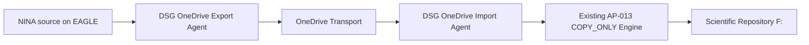

# AP-013B — OneDrive Transport Operational Acceptance

| Campo | Valore |
|---|---|
| Identificativo | `OAT-AP013B-001` |
| Package | AP-013 — Scientific Image Repository Architecture |
| Incremento | AP-013B — OneDrive-mediated COPY_ONLY Transport |
| Stato | OAT ready for promotion review |
| Modalità | `COPY_ONLY` |
| Source cleanup | Prohibited |
| Overwrite | Prohibited |
| Data baseline | 11/08/2026 |

## 1. Scopo

Definire la Operational Acceptance del trasporto scientifico mediato da OneDrive che sostituisce il data path SMB/VPN diretto tra EAGLE e PC principale, senza modificare le invarianti di sicurezza e integrità del motore AP-013.

## 2. Current State verificato

Il percorso end-to-end validato è:

```text
D:\Images NINA\Target
  -> DSG OneDrive Export Agent
  -> OneDrive locale EAGLE
  -> sincronizzazione Microsoft OneDrive
  -> OneDrive locale PC principale
  -> DSG OneDrive Import Agent
  -> F:\Astrofotografia
```

Pilot hash end-to-end verificato sul file `DARK_1x1_1.05s_910_99_Flat_LDN1320_Skywatcher quattro 200p__-0.90C_LPRO_0002_2026-07-09_17-35-59_FWHM_0.00_Fok_.xisf`:

- dimensione: `23190016` byte;
- SHA-256 sorgente EAGLE: `44a636a84a141f8108038f613649af093385425c9c56b9fbbe29208d3da13ade`;
- SHA-256 OneDrive PC principale: identico;
- SHA-256 destinazione `F:`: identico;
- `EndToEndVerified = True`;
- `SourceDeleted = False`;
- `OverwritePerformed = False`.

## 3. Target State



Regole vincolanti:

- la sorgente NINA non viene cancellata;
- il transport OneDrive non viene cancellato automaticamente;
- il manifest `*.ready.json` viene pubblicato solo dopo verifica del file transport;
- l'import considera soltanto manifest `READY`;
- ogni file viene verificato per dimensione e SHA-256 prima dell'import;
- overwrite vietato;
- OneDrive è transport/staging e non repository scientifico autorevole.

## 4. Baseline implementativa verificata

Componenti:

- `tools/dsdm/session-importer/DSG.OneDriveTransport.psm1`;
- `tools/dsdm/session-importer/Start-DSGOneDriveExport.ps1`;
- `tools/dsdm/session-importer/Start-DSGOneDriveImport.ps1`;
- `tools/dsdm/session-importer/Start-DSGOneDriveImportScheduled.ps1`;
- `tools/dsdm/session-importer/tests/DSG.OneDriveTransport.Tests.ps1`.

Commit principali:

- `b5c435c9b0ebfcb1f0123ae9d89c9984ba4cb939` — transport module;
- `381c52e80c2e6eb5e7c5cdb5a5f2c8c3b69b8137` — export agent;
- `3ef1118bb5d78c178eb4f3d4901674ed7c2f6075` — import agent;
- `142b2f92f5cd3578d4ece5cfdc790e44a1047db6` — Pester isolation fix;
- `0b00d1f23c825a2f753cef2a13fc41d2ea5e3b1a` — export backlog progression fix;
- `6a26af52b33a4e2a17846c7852a064dee951ec1b` — scheduled import launcher;
- `55b0e81cc123341dae07f82e9051181566a8caf1` — scheduled launcher exit handling fix;
- `5323cb5a5c3aa3ac809603a26e1b1a46ddc57dfc` — import backlog progression fix.

## 5. Runtime evidence

### 5.1 Synthetic regression

- `DSG.OneDriveTransport.Tests.ps1`: `9 passed`, `0 failed`;
- `DSG.SessionTransfer.Tests.ps1`: `Failed = 0`;
- `DSG.SessionImporter.Tests.ps1`: `Failed = 0`.

### 5.2 OAT-RUN-010 — controlled 10-file export/import

Export EAGLE:

- `Requested = 10`;
- `Ready = 10`;
- `Failed = 0`;
- `SourceFilesDeleted = 0`.

Import PC:

- `Requested = 10`;
- `CopiedVerified = 10`;
- `DeferredNoPlan = 0`;
- `Failed = 0`;
- `SourceFilesDeleted = 0`;
- `TransportFilesDeleted = 0`;
- `OverwritesPerformed = 0`.

Retry idempotente: `SkippedIdentical = 10`, process exit code `0`.

### 5.3 Scheduler pilot e backlog progression

- `Digital StarGate - OneDrive Export` attivo su EAGLE;
- `Digital StarGate - OneDrive Import` attivo sul PC principale;
- `MultipleInstances = IgnoreNew`;
- execution policy bypass limitato al processo schedulato;
- task legacy `Digital StarGate - Morning Transfer` disabilitata e mantenuta come rollback;
- esecuzione hidden validata su entrambi gli host;
- `LastTaskResult = 0` osservato su entrambi gli scheduler.

Batch operativo 30 Export:

- `SourceFilesObserved = 203`;
- `AlreadyReadySkipped = 130`;
- `Requested = 30`;
- `Ready = 30`;
- `Failed = 0`;
- `SourceFilesDeleted = 0`;
- durata osservata circa `6m44s` con scheduler interval `10m`.

Batch operativo 30 Import:

- `ReadyManifestsObserved = 165`;
- `AlreadyImportedSkipped = 123`;
- `Requested = 30`;
- `CopiedVerified = 30`;
- `Failed = 0`;
- `SourceFilesDeleted = 0`;
- `TransportFilesDeleted = 0`;
- `OverwritesPerformed = 0`.

La soglia cumulativa di 100 asset è stata superata con backlog progression verificata.

### 5.4 QG-11 — OneDrive sync interruption and recovery

Test isolato in `DigitalStarGate-QG11` con destinazione `F:\DSG-OAT\QG11-Destination`.

Durante l'interruzione del client OneDrive sul PC principale:

- Export EAGLE completato nel transport locale;
- destinazione finale rimasta assente (`FinalExists = False`);
- nessun import incompleto osservato.

Dopo riavvio OneDrive:

- payload XISF e manifest READY sincronizzati;
- `SizeMatch = True`;
- `HashMatch = True`;
- import: `Requested = 1`, `CopiedVerified = 1`, `Failed = 0`;
- `SourceFilesDeleted = 0`;
- `TransportFilesDeleted = 0`;
- `OverwritesPerformed = 0`;
- SHA-256 manifest = transport = destination;
- `EndToEndVerified = True`.

### 5.5 QG-12A — PC principal restart recovery

Test isolato in `DigitalStarGate-QG12` con OneDrive fermato prima della convergenza e successivo reboot del PC principale.

Dopo reboot/login:

- OneDrive avviato correttamente;
- payload XISF e READY riconvergenti;
- `SizeMatch = True`;
- `HashMatch = True`;
- destinazione pre-import assente;
- import: `Requested = 1`, `CopiedVerified = 1`, `Failed = 0`;
- zero delete/overwrite;
- `EndToEndVerified = True`.

### 5.6 QG-12B — EAGLE restart recovery

Test isolato in `DigitalStarGate-QG12B`.

Prima del reboot è stato predisposto uno stato di staging interrotto contenente solo `<file>.xisf.dsg-partial`.

Dopo reboot EAGLE il partial era ancora presente e nessun READY era stato pubblicato. Il retry dell'Exporter ha:

- rimosso il partial residuo;
- ricopiato e verificato la sorgente;
- pubblicato il payload XISF;
- pubblicato il manifest READY;
- `PartialCount = 0`;
- `XisfCount = 1`;
- `ReadyCount = 1`;
- `Requested = 1`, `Ready = 1`, `Failed = 0`;
- `SourceFilesDeleted = 0`.

Sul PC principale, dopo sincronizzazione:

- `SizeMatch = True`;
- `HashMatch = True`;
- import: `Requested = 1`, `CopiedVerified = 1`, `Failed = 0`;
- zero delete/overwrite;
- `EndToEndVerified = True`.

### 5.7 QG-18 — Security and ACL review

EAGLE transport ACL:

- owner `BUILTIN\Administrators`;
- `NT AUTHORITY\SYSTEM` — `FullControl`;
- `BUILTIN\Administrators` — `FullControl`;
- `EAGLE30154\PrimaLuceLab` — `FullControl`;
- `Everyone` — inherited `Deny DeleteSubdirectoriesAndFiles`;
- nessuna ACE generica con `Write`, `Modify` o `FullControl`.

Scheduled Task Export:

- principal `PrimaLuceLab`;
- `LogonType = Interactive`;
- `RunLevel = Highest`;
- `MultipleInstances = IgnoreNew`;
- script AP-013B esplicito;
- `-NoProfile -NonInteractive -WindowStyle Hidden -ExecutionPolicy Bypass`;
- nessun secret, token o credential path negli argomenti.

PC principale transport ACL:

- owner/group `AzureAD\MassimoMainini`;
- `NT AUTHORITY\SYSTEM` — `FullControl`;
- `BUILTIN\Administrators` — `FullControl`;
- `AzureAD\MassimoMainini` — `FullControl`;
- `Everyone` — inherited `Deny DeleteSubdirectoriesAndFiles`;
- nessuna ACE generica con `Write`, `Modify` o `FullControl`.

Scheduled Task Import:

- principal `MassimoMainini`;
- `LogonType = Interactive`;
- `RunLevel = Limited`;
- `MultipleInstances = IgnoreNew`;
- script `Start-DSGOneDriveImportScheduled.ps1`;
- `-NoProfile -NonInteractive -WindowStyle Hidden -ExecutionPolicy Bypass`;
- `-MaxFilesPerRun 30`;
- nessun secret, token o credential path negli argomenti.

Conclusione: ACL e task principal sono coerenti con l'uso previsto del transport; il bypass della execution policy è limitato al singolo processo schedulato e non modifica la policy di sistema.

## 6. Quality-gate matrix

| Gate | Criterio | Stato | Evidenza / azione richiesta |
|---|---|---|---|
| QG-01 Architecture | OneDrive resta transport, repository finale resta `F:` | Passed | pilot e runtime AP-013B |
| QG-02 Source immutability | nessuna cancellazione sorgente | Passed | tutti i run: `SourceFilesDeleted=0` |
| QG-03 No overwrite | destinazioni esistenti non sovrascritte | Passed | `OverwritesPerformed=0`; retry idempotenti |
| QG-04 End-to-end integrity | SHA-256 EAGLE = OneDrive = final | Passed | pilot, QG-11, QG-12A/B |
| QG-05 Manifest READY | import soltanto dopo pubblicazione READY | Passed | runtime, Pester e recovery tests |
| QG-06 Unit/Pester | nuova suite OneDrive passa integralmente | Passed | 9/9, Failed=0 |
| QG-07 Existing regression | SessionImporter e SessionTransfer restano verdi | Passed | entrambe Failed=0 |
| QG-08 Batch 10 | 10 file senza failure/deletion/overwrite | Passed | OAT-RUN-010 |
| QG-09 Batch 100 | almeno 100 asset con progression e reconciliation | Passed | >100 asset e batch 30 verificati |
| QG-10 Batch 1000 | soak/capacity test su 1000 file | Not Executed | opzionale prima di scale-out oltre batch 30 |
| QG-11 Sync interruption | perdita OneDrive non produce import incompleto | Passed | fault injection QG11 + recovery end-to-end |
| QG-12 Restart recovery | reboot EAGLE/PC non corrompe manifest/destinazioni | Passed | QG12A + QG12B |
| QG-13 Tamper detection | mismatch hash blocca import | Passed synthetic | Pester dedicato |
| QG-14 Conflict | destinazione diversa blocca senza overwrite | Passed synthetic | Pester dedicato |
| QG-15 Idempotency | retry produce stato sicuro | Passed | SKIP_IDENTICAL e progression runtime |
| QG-16 Evidence | export/import producono CSV/JSON | Passed | evidence runtime per run |
| QG-17 Scheduler | no overlap, disabilitabili, hidden, evidence | Passed | Export/Import operativi, IgnoreNew, legacy disabilitato |
| QG-18 Security | account/ACL appropriati; no secret negli script | Passed | ACL + principal/task action review EAGLE/PC |
| QG-19 Operations | runbook AP-013B e rollback disponibili | Passed | runbook operativo §7 |
| QG-20 Production authorization | disposizione esplicita dopo review | Blocked | promotion/release review richiesta |

## 7. Runbook operativo AP-013B

### 7.1 Baseline operativa

- EAGLE source: `D:\Images NINA\Target`;
- EAGLE transport: `C:\Users\PrimaLuceLab\OneDrive - Massimo Mainini\Manciano\DigitalStarGate-Transport`;
- PC transport: `C:\Users\MassimoMainini\OneDrive - Massimo Mainini\Manciano\DigitalStarGate-Transport`;
- repository finale: `F:\Astrofotografia`;
- batch massimo autorizzato: `30` file/run;
- task Export: `Digital StarGate - OneDrive Export`;
- task Import: `Digital StarGate - OneDrive Import`;
- task legacy SMB: `Digital StarGate - Morning Transfer`, disabilitata.

### 7.2 Controllo giornaliero rapido

Su EAGLE:

```powershell
Get-ScheduledTaskInfo -TaskName 'Digital StarGate - OneDrive Export' |
    Format-List LastRunTime,LastTaskResult,NextRunTime
```

Sul PC principale:

```powershell
Get-ScheduledTaskInfo -TaskName 'Digital StarGate - OneDrive Import' |
    Format-List LastRunTime,LastTaskResult,NextRunTime
```

Condizione nominale: `LastTaskResult = 0`. Durante un run attivo `267009 / 0x41301` indica task in esecuzione e non va classificato come failure.

### 7.3 Verifica evidence

EAGLE:

```powershell
$LatestRun = Get-ChildItem "$env:USERPROFILE\DSG-Inventory\OneDriveExport" -Directory |
    Where-Object { Test-Path (Join-Path $_.FullName 'export-manifest.json') } |
    Sort-Object LastWriteTime -Descending |
    Select-Object -First 1
Get-Content (Join-Path $LatestRun.FullName 'export-manifest.json') -Raw | ConvertFrom-Json | Format-List
```

PC principale:

```powershell
$LatestRun = Get-ChildItem "$env:USERPROFILE\DSG-Inventory\OneDriveImport" -Directory |
    Where-Object { Test-Path (Join-Path $_.FullName 'import-manifest.json') } |
    Sort-Object LastWriteTime -Descending |
    Select-Object -First 1
Get-Content (Join-Path $LatestRun.FullName 'import-manifest.json') -Raw | ConvertFrom-Json | Format-List
```

Stop/escalation se `Failed > 0`, `SourceFilesDeleted > 0`, `TransportFilesDeleted > 0` o `OverwritesPerformed > 0`.

### 7.4 Verifica transport

```powershell
Get-ChildItem -LiteralPath $TransportRoot -File |
    Group-Object {
        if ($_.Name -like '*.ready.json') { 'READY' }
        elseif ($_.Name -like '*.xisf') { 'XISF' }
        elseif ($_.Name -like '*.dsg-partial') { 'PARTIAL' }
        else { 'OTHER' }
    } |
    Select-Object Name,Count
```

Un mismatch temporaneo tra READY e XISF può essere dovuto alla sincronizzazione asincrona; l'Importer deve differire i payload non ancora localmente disponibili. La presenza persistente di `.dsg-partial` richiede controllo del run EAGLE prima di qualsiasi cleanup manuale.

### 7.5 OneDrive non disponibile

- non forzare import da file incompleti;
- verificare che la destinazione non sia stata creata;
- ripristinare il client OneDrive;
- attendere la presenza locale di XISF + READY;
- verificare dimensione/SHA-256;
- lasciare che il run Import successivo completi il recovery.

QG-11 ha verificato questo comportamento end-to-end.

### 7.6 Restart recovery

PC principale:

- dopo reboot verificare che OneDrive sia avviato;
- attendere riconvergenza XISF + READY;
- verificare manifest/hash;
- eseguire o attendere Import;
- verificare `CopiedVerified`/`SkippedIdentical` e `Failed = 0`.

EAGLE:

- un `.dsg-partial` residuo non equivale a READY;
- il retry Export rimuove lo staging residuo e ricostruisce il payload verificato;
- verificare `PartialCount = 0`, XISF presente e READY presente dopo il retry.

QG-12A/B ha verificato entrambi i percorsi.

### 7.7 Stop conditions

Interrompere la promozione o disabilitare le nuove task se si osserva uno dei seguenti eventi:

- mismatch SHA-256;
- overwrite eseguito o richiesto;
- cancellazione di source o transport;
- failure ripetute;
- `.dsg-partial` persistenti senza recovery;
- ACL modificate con scrittura generica;
- task principal/arguments diversi dalla baseline approvata;
- backlog in crescita tale da superare stabilmente la capacità del batch 30.

### 7.8 Rollback

1. disabilitare `Digital StarGate - OneDrive Export`;
2. disabilitare `Digital StarGate - OneDrive Import`;
3. non cancellare sorgenti, transport o destinazioni verificate;
4. conservare evidence dell'ultimo run;
5. ispezionare eventuali `.dsg-partial` prima di rimuoverli;
6. riabilitare `Digital StarGate - Morning Transfer` soltanto dopo decisione esplicita di rollback;
7. rieseguire Pester e un batch limitato prima di una nuova promozione.

### 7.9 Change control

Richiedono nuova validazione prima dell'uso operativo:

- aumento `MaxFilesPerRun` oltre `30`;
- modifica dei path source/transport/destination;
- modifica principal o logon type delle Scheduled Task;
- modifica della logica hash/READY/staging;
- introduzione di cleanup automatico;
- modifica della semantica `COPY_ONLY`;
- riattivazione permanente del data path SMB/VPN.

## 8. Evidence bundle

Per ogni run conservare almeno:

- `export-manifest.json` / `import-manifest.json`;
- `export-results.csv` / `import-results.csv`;
- transfer plan utilizzato;
- timestamp di start/end;
- conteggi di stato;
- sample hash end-to-end;
- elenco eventuali `.dsg-partial`;
- configurazione non-secret del run.

## 9. Risk and waiver register

| Rischio | Stato | Mitigazione / waiver |
|---|---|---|
| ritardo/throttling OneDrive | Mitigated for pilot | batch 30, READY, IgnoreNew |
| Files On-Demand / placeholder | Mitigated | nessun import senza payload locale verificato |
| sincronizzazione selettiva | Mitigated for pilot path | path verificato sui due host |
| duplicazione temporanea dati | Accepted | nessun cleanup automatico |
| indisponibilità cloud | Mitigated / fail-safe | QG-11 Passed |
| restart host | Mitigated | QG-12A/B Passed |
| ACL/account exposure | Mitigated | QG-18 Passed; ACL/principal verificati |
| backlog crescente | Mitigated | progression verificata; batch 30 |
| dipendenza da path locali | Technical debt | change control §7.9 |

Nessun waiver autorizza cancellazioni, overwrite o bypass hash.

## 10. CI baseline prima della chiusura QG-18/QG-19

Commit precedente `152e4295c28d43aa89aa2711255de4e9ce30cc65`: GitHub Actions verificati verdi prima dell'aggiornamento documentale. I check osservati, inclusi `quality-gate`, `deploy` e `build-word`, risultavano `completed/success`.

## 11. Readiness recommendation corrente

**Recommendation: READY FOR QG-20 PROMOTION REVIEW.**

QG-01..QG-09 e QG-11..QG-19 risultano `Passed`. QG-10 resta `Not Executed` ed è esplicitamente non bloccante finché il batch operativo resta limitato a `30` file/run e non viene dichiarata capacità scale-out a 1000 file.

La piena produzione non è ancora dichiarata: resta necessaria la disposition esplicita QG-20.

## 12. Exit criteria

Per dichiarare `Operational Acceptance: PASSED` resta da completare esclusivamente QG-20 — Production Authorization / promotion review.
