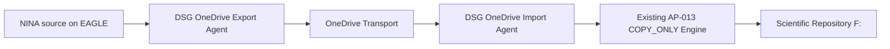

# AP-013B — OneDrive Transport Operational Acceptance

| Campo | Valore |
|---|---|
| Identificativo | `OAT-AP013B-001` |
| Package | AP-013 — Scientific Image Repository Architecture |
| Incremento | AP-013B — OneDrive-mediated COPY_ONLY Transport |
| Stato | In validation |
| Modalità | `COPY_ONLY` |
| Source cleanup | Prohibited |
| Overwrite | Prohibited |
| Data baseline | 07/08/2026 |

## 1. Scopo

Definire la Operational Acceptance del trasporto scientifico mediato da OneDrive che sostituisce il data path SMB/VPN diretto tra EAGLE e PC principale, senza modificare le invarianti di sicurezza e integrità del motore AP-013.

Il documento separa esplicitamente evidenze già osservate, validazioni non ancora eseguite e gate necessari prima della schedulazione produttiva.

## 2. Current State verificato

Il pilot manuale end-to-end ha validato il percorso:

```text
D:\Images NINA\Target
  -> OneDrive locale EAGLE
  -> sincronizzazione Microsoft OneDrive
  -> OneDrive locale PC principale
  -> F:\Astrofotografia
```

Per il file pilot `DARK_1x1_1.05s_910_99_Flat_LDN1320_Skywatcher quattro 200p__-0.90C_LPRO_0002_2026-07-09_17-35-59_FWHM_0.00_Fok_.xisf` sono state osservate le seguenti evidenze:

- dimensione: `23190016` byte;
- SHA-256 sorgente EAGLE: `44a636a84a141f8108038f613649af093385425c9c56b9fbbe29208d3da13ade`;
- SHA-256 file OneDrive sul PC principale: identico;
- SHA-256 destinazione `F:`: identico;
- `EndToEndVerified = True`;
- destinazione già presente classificata `SKIP_IDENTICAL`;
- `SourceDeleted = False`;
- `OverwritePerformed = False`;
- hash locale EAGLE sul file da 22.12 MiB: circa `0.16 s`;
- copia locale EAGLE -> OneDrive staging: circa `0.08 s`, `287.72 MiB/s` osservati;
- hash OneDrive sul PC principale: circa `1.12 s`, `19.71 MiB/s` osservati;
- precedente lettura SMB/UNC dello stesso file: circa `71.19 s`, `0.31 MiB/s` osservati.

Queste misure descrivono il pilot osservato e non costituiscono ancora una SLA o una soglia di produzione.

## 3. Target State

Il target AP-013B separa il trasferimento in due agenti:



Regole vincolanti:

- la sorgente NINA non viene cancellata;
- il transport OneDrive non viene cancellato durante la fase di acceptance;
- il manifest `*.ready.json` viene pubblicato solo dopo verifica del file transport;
- l'import considera soltanto manifest `READY`;
- ogni file viene verificato per dimensione e SHA-256 prima dell'import;
- il motore COPY_ONLY esistente resta autoritativo per `COPIED_VERIFIED`, `SKIP_IDENTICAL` e conflitti;
- overwrite vietato;
- file `.dsg-partial` residui sono condizioni di attenzione/stop;
- OneDrive è transport/staging e non repository scientifico autorevole.

## 4. Baseline implementativa verificata

Repository: `maininimassimo-bit/digital-stargate-manual`.

Componenti introdotti:

- `tools/dsdm/session-importer/DSG.OneDriveTransport.psm1`;
- `tools/dsdm/session-importer/Start-DSGOneDriveExport.ps1`;
- `tools/dsdm/session-importer/Start-DSGOneDriveImport.ps1`;
- `tools/dsdm/session-importer/tests/DSG.OneDriveTransport.Tests.ps1`.

Commit verificati:

- `b5c435c9b0ebfcb1f0123ae9d89c9984ba4cb939` — transport module;
- `381c52e80c2e6eb5e7c5cdb5a5f2c8c3b69b8137` — export agent;
- `3ef1118bb5d78c178eb4f3d4901674ed7c2f6075` — import agent;
- `b9b9f6d1e2db8cee896839eaf57086d4ff0fb14e` — Pester coverage definition.

La presenza dei test nel repository non equivale a test eseguiti.

## 5. Quality-gate matrix

| Gate | Criterio | Stato | Evidenza / azione richiesta |
|---|---|---|---|
| QG-01 Architecture | OneDrive resta transport, repository finale resta `F:` | Passed | Pilot e design AP-013B |
| QG-02 Source immutability | nessuna cancellazione sorgente | Passed | pilot: `SourceDeleted=False`; implementazione COPY_ONLY |
| QG-03 No overwrite | destinazioni esistenti non sovrascritte | Passed | pilot: `SKIP_IDENTICAL`, `OverwritePerformed=False` |
| QG-04 End-to-end integrity | SHA-256 EAGLE = OneDrive = final | Passed | hash pilot identici |
| QG-05 Manifest READY | import soltanto dopo pubblicazione READY | Passed by design / runtime pilot partial | manifest pilot osservato; suite Pester definita |
| QG-06 Unit/Pester | nuova suite OneDrive passa integralmente | Not Executed | eseguire `Invoke-Pester` sul PC principale |
| QG-07 Existing regression | test SessionImporter e SessionTransfer restano verdi | Not Executed for AP-013B baseline | rieseguire suite completa |
| QG-08 Batch 10 | 10 file completati senza failure/deletion/overwrite | Not Executed | OAT-RUN-010 |
| QG-09 Batch 100 | 100 file completati con reconciliation completa | Not Executed | OAT-RUN-100 |
| QG-10 Batch 1000 | soak/capacity test su 1000 file | Not Executed | OAT-RUN-1000; può essere post-pilot ma pre-scale |
| QG-11 Sync interruption | stop/sospensione OneDrive non produce import incompleto | Not Executed | fault injection controllata |
| QG-12 Restart recovery | reboot EAGLE/PC non corrompe manifest o destinazioni | Not Executed | recovery test |
| QG-13 Tamper detection | mismatch hash blocca import | Not Executed runtime | Pester case definito, da eseguire |
| QG-14 Conflict | destinazione diversa blocca senza overwrite | Passed in existing AP-013; AP-013B runtime not executed | eseguire scenario AP-013B |
| QG-15 Idempotency | retry produce `SKIP_IDENTICAL` | Passed pilot single-file | estendere a batch |
| QG-16 Evidence | export/import producono CSV/JSON per run | Not Executed runtime | eseguire agenti reali |
| QG-17 Scheduler | task disabilitabili, no overlap, logging | Blocked | creare solo dopo OAT minimo |
| QG-18 Security | OneDrive account e ACL appropriate; no secrets negli script | Partially Passed | account condiviso verificato; ACL review ancora richiesta |
| QG-19 Operations | runbook AP-013B e rollback disponibili | In Progress | aggiornamento documentale richiesto |
| QG-20 Production authorization | disposizione esplicita dopo review | Blocked | dipende dai gate OAT |

## 6. OAT execution sequence

### Phase A — Synthetic regression

Eseguire sul PC principale, dopo aggiornamento del checkout:

```powershell
git pull
Invoke-Pester .\tools\dsdm\session-importer\tests\DSG.OneDriveTransport.Tests.ps1 -Output Detailed
Invoke-Pester .\tools\dsdm\session-importer\tests\DSG.SessionTransfer.Tests.ps1 -Output Detailed
Invoke-Pester .\tools\dsdm\session-importer\tests\DSG.SessionImporter.Tests.ps1 -Output Detailed
```

Criterio PASS: `Failed: 0` per tutte le suite.

### Phase B — Controlled batch 10

Eseguire prima l'export EAGLE con `MaxFilesPerRun=10`, attendere la sincronizzazione OneDrive e poi l'import sul PC principale con lo stesso limite.

Criteri PASS:

- export `Failed = 0`;
- import `Failed = 0`;
- `SourceFilesDeleted = 0`;
- `TransportFilesDeleted = 0`;
- `OverwritesPerformed = 0`;
- ogni `COPIED_VERIFIED` presenta hash coerenti;
- ogni destinazione preesistente identica produce `SKIP_IDENTICAL`;
- nessun `.dsg-partial` residuo.

### Phase C — Controlled batch 100

Ripetere con dataset rappresentativo di almeno 100 file e raccogliere:

- durata export;
- tempo fino alla disponibilità dei manifest READY sul PC principale;
- durata import;
- numero di copied/skipped/deferred/failed;
- distribuzione dimensioni file;
- backlog OneDrive iniziale/finale;
- eventuali throttling, placeholder o download on-demand.

Non fissare soglie prestazionali definitive prima della baseline osservata.

### Phase D — Failure and recovery

Eseguire separatamente:

1. sospensione OneDrive durante sincronizzazione file;
2. manifest non READY;
3. file transport alterato dopo manifest;
4. destinazione in conflict;
5. riavvio EAGLE dopo staging ma prima del READY;
6. riavvio PC principale prima dell'import;
7. rilancio identico dopo completamento.

Ogni scenario deve preservare source, transport e destinazione verificata; nessun recupero può usare overwrite automatico.

### Phase E — Scale/soak 1000

Eseguire solo dopo Phase B e C positive. Il test misura capacità e operabilità; non è necessario per autorizzare un pilot limitato a 10 file, ma è richiesto prima di una promozione a volumi elevati senza batch limit.

## 7. Evidence bundle richiesto

Per ogni run conservare almeno:

- `export-manifest.json` / `import-manifest.json`;
- `export-results.csv` / `import-results.csv`;
- transfer plan utilizzato;
- timestamp di start/end;
- conteggi di stato;
- sample di hash end-to-end;
- elenco di eventuali `.dsg-partial`;
- configurazione non-secret del run;
- eventuali log OneDrive pertinenti se si verifica un fault.

I log grezzi locali non devono essere pubblicati automaticamente nel repository; vanno prima curati e trasformati in evidence documentale.

## 8. Risk and waiver register

| Rischio | Stato | Mitigazione / waiver |
|---|---|---|
| ritardo o throttling OneDrive | Open | batch limitato, READY manifest, misure Phase C |
| Files On-Demand / placeholder | Open | rendere il transport disponibile localmente sul PC importatore e verificare hash prima del copy |
| sincronizzazione selettiva | Mitigated for pilot path | usare `Manciano\DigitalStarGate-Transport`; percorso già sincronizzato sui due host |
| duplicazione temporanea dati | Accepted during OAT | nessun cleanup fino a policy separata |
| indisponibilità cloud | Open | fail-safe: nessun import senza file+READY validi; retry successivo |
| account OneDrive compromesso | Open | ACL/account review e nessun secret nel codice |
| backlog crescente | Open | metriche backlog e batch tuning dopo Phase C |
| dipendenza da path locali | Technical debt | introdurre configurazioni locali governate prima della produzione |

Nessun waiver autorizza cancellazioni, overwrite o bypass degli hash.

## 9. Rollback

Rollback AP-013B:

1. disabilitare gli scheduler OneDrive, se creati;
2. non cancellare sorgenti, transport o destinazioni verificate;
3. conservare evidence del run;
4. rimuovere solo `.dsg-partial` dopo controllo manuale;
5. ripristinare il precedente workflow soltanto come fallback controllato e non come azione automatica;
6. rieseguire Pester e un batch limitato prima di una nuova promozione.

Il precedente trasferimento SMB/VPN non è dichiarato production-ready come conseguenza di questo documento.

## 10. Readiness recommendation corrente

**Recommendation: CONDITIONALLY READY FOR CONTROLLED OAT.**

È autorizzabile il proseguimento della validazione con batch controllati. Non è ancora autorizzata la schedulazione produttiva continuativa.

Blocker principali:

- Pester AP-013B non ancora eseguito;
- regression suite non ancora rieseguita sulla baseline AP-013B;
- batch 10 e batch 100 non ancora eseguiti con gli agenti automatici;
- recovery/fault injection non ancora eseguiti;
- ACL/operational review da completare;
- scheduler non ancora sottoposti a OAT.

## 11. Exit criteria

Per dichiarare `Operational Acceptance: PASSED` devono essere almeno `Passed`:

- QG-01..QG-09;
- QG-11..QG-16;
- QG-18..QG-19.

QG-10 (1000 file) può restare pianificato soltanto se la produzione iniziale mantiene un batch limitato approvato e non viene dichiarata capacità scale-out non dimostrata.

QG-17 e QG-20 vengono chiusi nella successiva promotion decision dopo OAT positiva.
