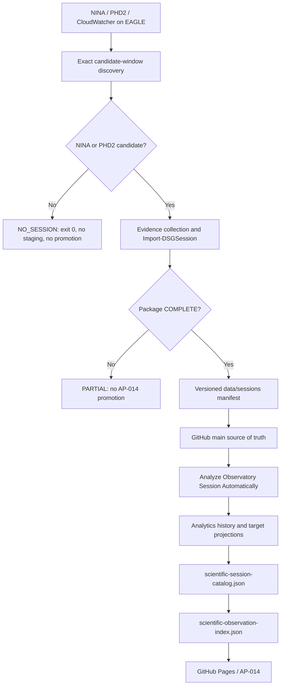

# AP-014 EAGLE Session Package Producer Alignment

- **Identifier:** AP14-W07-EAGLE-001
- **Status:** Verified architecture alignment; unattended NO_SESSION runtime PASS; full M27 OAT pending
- **Date:** 2026-08-18

## Verified source-of-truth alignment

The session package evidence producer belongs on the EAGLE observatory computer.

The approved environment assessment assigns the following responsibilities to EAGLE:

- NINA execution;
- PHD2 execution;
- weather acquisition;
- collection of logs;
- collection of weather and safety data;
- local session packaging;
- scheduled upload or synchronization.

The reconciled production runtime uses:

```text
C:\Users\PrimaLuceLab\AppData\Local\NINA\Logs
C:\Users\PrimaLuceLab\Documents\PHD2
C:\Users\PrimaLuceLab\Documents\CloudWatcher\CloudWatcher.csv
C:\DigitalStarGate\digital-stargate-manual-ap14-runtime
C:\DigitalStarGate\Automation\reporting.config.psd1
```

The certified producer baseline is `DigitalStarGate.Reporting 1.0.6`.

`Import-DSGSession` creates the governed package structure for real candidate sessions:

```text
data/sessions/YYYY/MM/<session-id>/
  raw/nina/
  raw/phd2/
  raw/weather/
  report/
  manifest.json
  README.md
```

It sets `COMPLETE` only when NINA, PHD2 and weather evidence are available; otherwise a real candidate package may be `PARTIAL`.

For `NO_SESSION`, Reporting 1.0.6 performs discovery on the exact candidate window using NINA/PHD2 creation/write timestamps. If neither source has evidence in that window, it returns `NO_SESSION` before staging creation and before weather processing.

## Correct end-to-end ownership



The AP-013B OneDrive XISF transport remains a separate operational data path:

```text
EAGLE D:\Images NINA\Target
  -> OneDrive Transport
  -> PC Principale
  -> F:\Astrofotografia
```

It must not become the producer of scientific quality, guiding or weather metrics.

## Existing certified producer

Reference implementation: `maininimassimo-bit/DigitalStarGate.Reporting`, runtime baseline `1.0.6`.

Relevant production paths and commands are:

```powershell
Import-Module DigitalStarGate.Reporting -Force
$config = 'C:\DigitalStarGate\Automation\reporting.config.psd1'

Import-DSGSession `
  -SessionStart <actual-start> `
  -SessionEnd <actual-end> `
  -ConfigPath $config `
  -CopyToRepository

Get-DSGSessionStatus -SessionId <session-id> -ConfigPath $config

Publish-DSGSession `
  -SessionId <session-id> `
  -ConfigPath $config `
  -CreateBranch `
  -Push
```

The Scheduled Task `Digital StarGate - Daily Session Upload` invokes the governed EAGLE preflight chain and runs daily at `07:20` local.

Before the launcher is allowed to run, the runtime clone must be clean, on `main`, fast-forward synchronized and exactly aligned with `origin/main`.

## Runtime validation completed

### Manual controlled replay — 17 August 2026

With Reporting 1.0.6, the no-observation candidate window `2026-08-16 19:00` -> `2026-08-17 06:00` produced:

```text
DISCOVERY session=2026-08-16_2026-08-17 status=NO_SESSION nina=0 phd2=0 weatherRows=0
END outcome=NO_SESSION
```

Exit code was `0`, and no false staging directory remained.

### Unattended scheduled run — 18 August 2026

The production task ran at `07:20:20`, returned `LastTaskResult = 0`, and logged:

```text
MODULE version=1.0.6
DISCOVERY session=2026-08-17_2026-08-18 status=NO_SESSION nina=0 phd2=0 weatherRows=0
END outcome=NO_SESSION
```

Therefore the automatic `NO_SESSION` producer path is **validated in production**.

## AP-014 consequence

The remaining automation work is not to collect NINA/PHD2/CloudWatcher on the PC Principale. It is to complete acceptance of the real-session EAGLE reporting path so that a `COMPLETE` package is copied, versioned, promoted and consumed automatically by AP-014.

Once `data/sessions/**/manifest.json` reaches `main`, the AP-014 analytics/catalog pipeline implemented in the repository is the downstream consumer.

## M 27 OAT

For M 27 (`2026-08-10_2026-08-11`), source evidence and a controlled staging preview have already demonstrated `Status = COMPLETE`.

Remaining operational verification is:

1. execute the controlled repository copy for the M27 package;
2. verify manifest, file content and hashes against staging;
3. publish through `session/<session-id>`;
4. observe governed promotion to `main`;
5. observe automatic analytics/catalog execution;
6. verify M27 in `sessions.csv`, `target-exposures.csv`, `targets.csv`, `scientific-session-catalog.json` and `scientific-observation-index.json`;
7. verify CI and Pages deployment;
8. verify real-session re-run/idempotency behavior.

No XISF file is moved, deleted or used to invent missing evidence during this OAT.
