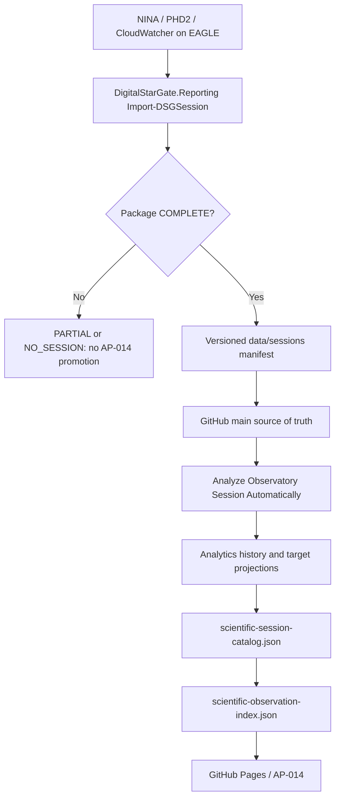

# AP-014 EAGLE Session Package Producer Alignment

- **Identifier:** AP14-W07-EAGLE-001
- **Status:** Verified architecture alignment; runtime OAT pending
- **Date:** 2026-08-13

## Verified source-of-truth alignment

The session package evidence producer belongs on the EAGLE observatory computer.

The approved environment assessment assigns the following responsibilities to EAGLE:

- NINA execution;
- PHD2 execution;
- weather acquisition;
- collection of logs;
- collection of weather and safety data;
- local session packaging;
- scheduled upload or synchronization.

The certified `maininimassimo-bit/DigitalStarGate.Reporting` module confirms the same deployment model. Its production configuration references the EAGLE account and paths:

```text
C:\Users\PrimaLuceLab\AppData\Local\NINA\Logs
C:\Users\PrimaLuceLab\Documents\PHD2
C:\DigitalStarGate\Weather\CloudWatcher.csv
C:\DigitalStarGate\digital-stargate-manual
```

`Import-DSGSession` creates the governed package structure:

```text
data/sessions/YYYY/MM/<session-id>/
  raw/nina/
  raw/phd2/
  raw/weather/
  report/
  manifest.json
  README.md
```

It sets `COMPLETE` only when NINA, PHD2 and weather evidence are available; otherwise the package is `PARTIAL`. It also has an explicit `NO_SESSION` outcome when neither NINA nor PHD2 evidence exists.

## Correct end-to-end ownership



The AP-013B OneDrive XISF transport remains a separate operational data path:

```text
EAGLE D:\Images NINA\Target
  -> OneDrive Transport
  -> PC Principale
  -> F:\Astrofotografia
```

It must not become the producer of scientific quality, guiding or weather metrics.

## Existing certified producer

Reference implementation: `maininimassimo-bit/DigitalStarGate.Reporting`, release baseline `1.0.4`.

Relevant commands are:

```powershell
Import-Module DigitalStarGate.Reporting -Force
$config = 'C:\DigitalStarGate\digital-stargate-manual\templates\reporting\reporting.config.psd1'

Import-DSGSession `
  -SessionStart <actual-start> `
  -SessionEnd <actual-end> `
  -ConfigPath $config `
  -CopyToRepository

Get-DSGSessionStatus -SessionId <session-id> -ConfigPath $config

Publish-DSGSession `
  -SessionId <session-id> `
  -ConfigPath $config `
  -Push
```

The actual EAGLE scheduled task/script that invokes these operations must be inspected and validated before any new scheduler or duplicate collector is introduced.

## AP-014 consequence

The remaining automation work is not to collect NINA/PHD2/CloudWatcher on the PC Principale. It is to ensure that the existing EAGLE reporting automation automatically produces and versions a `COMPLETE` session package after a real observing session.

Once `data/sessions/**/manifest.json` reaches `main`, the AP-014 analytics/catalog pipeline implemented in the repository is the downstream consumer.

## M 27 OAT

For M 27 (`2026-08-10_2026-08-11`) the next operational verification is:

1. inspect the EAGLE reporting task/script and its current configuration;
2. verify that the NINA, PHD2 and CloudWatcher evidence for the actual session window exists on EAGLE;
3. execute or replay the certified reporting import for the actual session window;
4. require `Status = COMPLETE`;
5. version the resulting session package to GitHub;
6. observe automatic analytics/catalog execution;
7. verify M 27 in `sessions.csv`, `target-exposures.csv`, `targets.csv`, `scientific-session-catalog.json` and `scientific-observation-index.json`;
8. verify CI and Pages deployment.

No XISF file is moved, deleted or used to invent missing evidence during this OAT.
