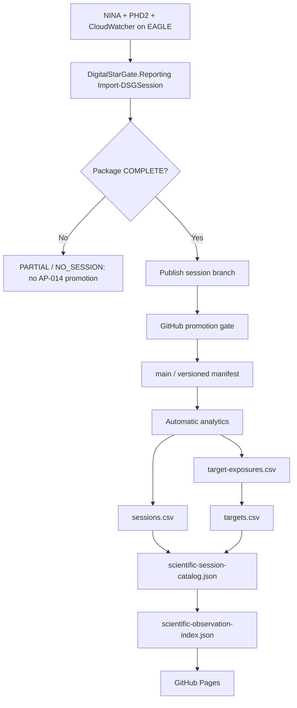

# AP-014 Session Package to Scientific Portal Automation

- **Identifier:** AP14-W07-AUTO-001
- **Status:** Downstream and GitHub promotion implemented; EAGLE producer OAT pending
- **Version:** 1.3
- **Target:** AP-014 / RC3 readiness
- **Dependencies:** DigitalStarGate.Reporting, versioned session packages, DSG Analytics v2.8, AP-014 catalog projections

## Purpose

Close the governed automation gap between the EAGLE-produced session package and the AP-014 Scientific Portal without making XISF transport or the operational image repository an AP-014 source of truth.

## Architecture rule

The EAGLE is the producer of NINA, PHD2 and CloudWatcher evidence and of the governed session package. The PC Principale remains the development/integration and downstream analytics environment. AP-013B XISF transport is a separate data path.

## Target flow

## Verified producer

The certified `maininimassimo-bit/DigitalStarGate.Reporting` module is the existing session-package producer. Its configuration uses the EAGLE `PrimaLuceLab` NINA/PHD2 paths and the local CloudWatcher CSV. `Import-DSGSession` copies the three evidence streams into the session package, writes `manifest.json` and sets `COMPLETE`, `PARTIAL` or `NO_SESSION` according to actual evidence.

`Publish-DSGSession -CreateBranch -Push` creates and pushes `session/<session-id>`. It does not itself promote the package to `main`. Historical repository evidence shows session commits becoming direct ancestors of `main`; the promotion boundary was therefore real but not explicitly governed in the current source.

## GitHub promotion gate

`.github/workflows/promote-session-package.yml` is the authoritative promotion gate for newly pushed `session/**` branches. It:

1. accepts only branch names `session/YYYY-MM-DD_YYYY-MM-DD`;
2. requires the matching manifest under `data/sessions/YYYY/MM/<session-id>/manifest.json`;
3. requires `report_status = COMPLETE`;
4. requires NINA, PHD2 and weather evidence directories to contain files;
5. verifies every manifest file that declares size/SHA-256 against the committed package;
6. rejects a session branch that is not a fast-forward descendant of current `main`;
7. rejects changes outside the matching session/report directories;
8. fast-forwards `main` to the validated session commit;
9. explicitly dispatches `analyze-session-automatic.yml` on `main` for that session.

This keeps EAGLE as producer while making GitHub the governed promotion authority.

## Downstream implementation

1. A versioned `data/sessions/**/manifest.json` on `main` is the AP-014 processing boundary.
2. `.github/workflows/analyze-session-automatic.yml` validates package completeness, runs analytics/report/history/target projections, regenerates the scientific session catalog and observation index, verifies deterministic output, and commits only derived versioned projections.
3. `.github/scripts/generate-scientific-session-catalog.mjs` deterministically derives the AP-014 session catalog from `sessions.csv` and `targets.csv`.
4. `.github/scripts/generate-scientific-catalog.mjs` remains the observation-index generator from the session catalog.
5. AP-013B continues to transport XISF files independently to `F:\Astrofotografia`; those files are not used to synthesize missing NINA/PHD2/weather evidence.

## Superseded implementation note

The PC-side collector introduced in commit `5d9f954e0cff39b5ac85a5f7db64e6a8d0891a4f` was based on an incorrect ownership assumption and is superseded. It must not be deployed or scheduled. The authoritative producer is the existing EAGLE reporting flow.

## Fail-safe and idempotency rules

- `PARTIAL` and `NO_SESSION` are not promoted.
- Missing NINA, PHD2 or weather evidence is never inferred from XISF filenames or AP-013B transport metadata.
- No quality metric is synthesized when analytics does not provide it.
- Scientific XISF files are never deleted, overwritten or moved by AP-014.
- AP-013B transport/import behavior remains unchanged.
- Promotion is fast-forward only and session-path scoped.
- Re-running deterministic downstream projections with unchanged inputs produces no new projection commit.

## Validation matrix

| Check | Status |
| --- | --- |
| EAGLE responsibility documented in EA-001 | VERIFIED |
| DigitalStarGate.Reporting EAGLE paths | VERIFIED |
| Import-DSGSession package/evidence behavior | VERIFIED |
| Publish-DSGSession session branch behavior | VERIFIED |
| Historical session branch -> main lineage | VERIFIED |
| Governed GitHub session promotion gate | IMPLEMENTED |
| AP-013B XISF transport separation | VERIFIED |
| AP-014 downstream analytics/catalog automation | IMPLEMENTED |
| Actual EAGLE scheduled reporting task/script | TO INSPECT / OAT |
| M 27 EAGLE package | OAT PENDING |
| M 27 end-to-end analytics/catalog | Pending package publication |

## Acceptance criteria

The slice is operationally accepted only when the existing EAGLE reporting automation produces a real `COMPLETE` M 27 session package, pushes its governed `session/<id>` branch, the GitHub promotion gate fast-forwards it to `main`, and the downstream automatic chain creates analytics containing that session, regenerates both AP-014 projections, passes CI, deploys Pages, and shows M 27 without manual catalog edits.