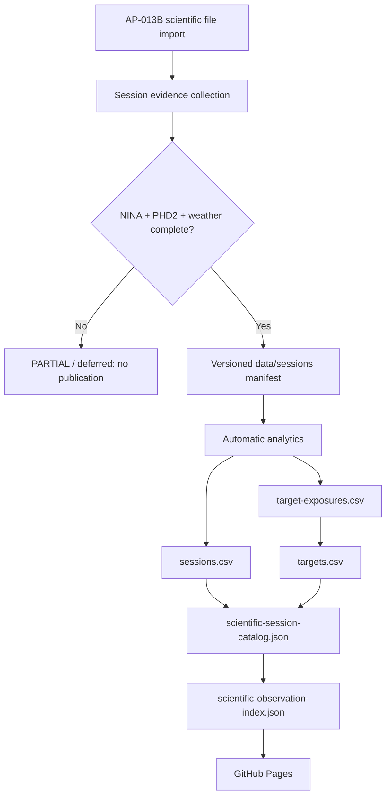

# AP-014 Session Package to Scientific Portal Automation

- **Identifier:** AP14-W07-AUTO-001
- **Status:** Implemented, validation pending
- **Version:** 1.0
- **Target:** AP-014 / RC3 readiness
- **Dependencies:** AP-013B OneDrive ingestion, versioned session packages, DSG Analytics v2.8, AP-014 catalog projections

## Purpose

Close the governed automation gap between an operational scientific-file import and the AP-014 Scientific Portal without making the operational filesystem an AP-014 source of truth.

## Architecture rule

The portal remains a projection of versioned scientific analytics. XISF filenames, transfer plans, OneDrive READY manifests and `F:\Astrofotografia` are not direct catalog inputs and must not be used to invent quality, guiding, weather or scientific metrics.

## Target flow

## Implementation

1. `scripts/reporting/Collect-SessionLogs.ps1` remains the canonical evidence collector and manifest writer.
2. `scripts/reporting/Publish-Session.ps1` is the publication gate. It refuses packages that are not `COMPLETE` or that lack NINA, PHD2 or weather evidence, stages only the requested session package, and treats an unchanged package as an idempotent success.
3. `.github/workflows/analyze-session-automatic.yml` is triggered by a versioned session manifest. It validates package completeness, runs analytics/history/target projections, regenerates the scientific session catalog and observation index, verifies deterministic output, and commits only versioned projections.
4. `.github/scripts/generate-scientific-session-catalog.mjs` deterministically derives the AP-014 session catalog from `sessions.csv` and `targets.csv`.
5. `.github/scripts/generate-scientific-catalog.mjs` remains the observation-index generator from the session catalog.

## Fail-safe and idempotency rules

- A `PARTIAL` session is never analyzed or promoted to the catalog.
- Missing NINA, PHD2 or weather evidence stops publication/analytics.
- No quality metric is synthesized when analytics does not provide it.
- Re-running the projection pipeline with unchanged inputs produces no commit.
- Scientific XISF files are never deleted, overwritten or moved by this slice.
- AP-013B transport/import behavior is unchanged.
- The workflow does not recursively trigger itself because its projection commit does not modify a session manifest and bot-triggered runs are excluded.

## Traceability

| Requirement | Implementation / evidence |
| --- | --- |
| GitHub source of truth | versioned `data/sessions` and `data/analytics` |
| AP-013 / AP-014 separation | operational repository is not read by catalog generators |
| No invented metrics | catalog consumes analytics fields only; absent values remain null/UNKNOWN |
| Idempotency | deterministic generators + no-op commit gate |
| Fail-safe | COMPLETE/evidence validation before analytics |
| Auditability | session manifest hashes + versioned analytics/catalog commit history |
| Pages automation | existing Pages workflow runs on projection commit to `main` |

## Validation matrix

| Check | Expected |
| --- | --- |
| Node syntax for session-catalog generator | PASS |
| Generator `--write` then `--check` on current analytics fixtures | PASS |
| Existing scientific observation index generator check | CI required |
| PowerShell publication gate | CI/Windows OAT required |
| Analytics end-to-end with new M 27 package | OAT required |
| Developer Foundation | CI required |
| GitHub Pages deployment | CI required |

## Acceptance criteria

The slice is operationally accepted only when a complete M 27 session package is published and the automatic chain creates versioned analytics containing that session, regenerates both AP-014 projections, passes CI, deploys Pages, and shows M 27 without manual catalog edits.

## Open operational dependency

The PC Principale must still collect the session evidence (NINA, PHD2 and weather) and invoke the existing collection/publication scripts after the scientific import. This change deliberately does not infer those evidence streams from the XISF repository.
