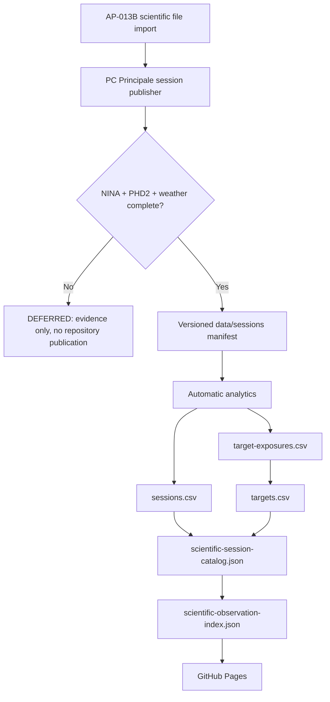

# AP-014 Session Package to Scientific Portal Automation

- **Identifier:** AP14-W07-AUTO-001
- **Status:** Implemented, operational evidence pending
- **Version:** 1.1
- **Target:** AP-014 / RC3 readiness
- **Dependencies:** AP-013B OneDrive ingestion, versioned session packages, DSG Analytics v2.8, AP-014 catalog projections

## Purpose

Close the governed automation gap between an operational scientific-file import and the AP-014 Scientific Portal without making the operational filesystem an AP-014 source of truth.

## Architecture rule

The portal remains a projection of versioned scientific analytics. XISF filenames, transfer plans, OneDrive READY manifests and `F:\Astrofotografia` are not direct catalog inputs and must not be used to invent quality, guiding, weather or scientific metrics.

## Target flow



## Implementation

1. `tools/dsdm/session-importer/Publish-DSGSessionPackage.ps1` is the PC Principale bridge. It reads an external production configuration, collects only NINA/PHD2/weather evidence into temporary staging, and publishes only when all three evidence streams are present.
2. Publication is additive. Existing identical files are accepted; an existing file with different SHA-256 aborts publication rather than overwriting evidence.
3. `tools/dsdm/session-importer/Start-DSGPreviousNightSessionPublish.ps1` provides the scheduler-friendly previous-night wrapper. No scheduler is installed by repository code.
4. `scripts/reporting/Common.ps1` and `Export-WeatherWindow.ps1` remain the canonical manifest/weather helpers.
5. `.github/workflows/analyze-session-automatic.yml` validates the selected versioned package, runs analytics/report/history/target projections, regenerates both AP-014 catalog projections and commits the derived outputs.
6. `.github/scripts/generate-scientific-session-catalog.mjs` deterministically derives the AP-014 session catalog from `sessions.csv` and `targets.csv`.
7. `.github/workflows/session-publisher-contract.yml` validates publisher PowerShell syntax on Windows and validates the sample configuration contract.

## Production configuration

Production filesystem paths are intentionally not stored in Git. Copy `tools/dsdm/session-importer/session-publisher.sample.json` to:

`%USERPROFILE%\DSG-Inventory\SessionPublisher\session-publisher.production.json`

and replace the placeholder paths with the actual PC Principale locations for the repository clone, NINA logs, PHD2 logs and CloudWatcher CSV.

## M 27 OAT command

After the production configuration is populated on PC Principale, the governed M 27 OAT command is:

```powershell
pwsh -File .\tools\dsdm\session-importer\Publish-DSGSessionPackage.ps1 `
  -SessionStart '2026-08-10T18:00:00' `
  -SessionEnd '2026-08-11T08:00:00'
```

The exact time window may be adjusted to the actual observing session before execution. The publisher never derives NINA/PHD2/weather evidence from the 34 XISF files.

## Fail-safe and idempotency rules

- Incomplete evidence produces `DEFERRED_INCOMPLETE_EVIDENCE` and no repository publication.
- Missing NINA, PHD2 or weather evidence stops publication/analytics.
- No quality metric is synthesized when analytics does not provide it.
- Re-running with unchanged evidence is a no-op.
- Existing differing evidence is never overwritten.
- Scientific XISF files are never deleted, overwritten or moved by this slice.
- AP-013B transport/import behavior is unchanged.
- The workflow does not recursively trigger itself because its projection commit does not modify a session manifest and bot-triggered runs are excluded.

## Validation matrix

| Check | Status |
| --- | --- |
| Session catalog generator deterministic check | PASS |
| Developer Foundation on implementation HEAD | PASS |
| GitHub Pages deployment on implementation HEAD | PASS |
| PC publisher Windows syntax/contract | CI added |
| M 27 evidence package | BLOCKED until real NINA/PHD2/weather paths/evidence are available on PC Principale |
| M 27 end-to-end analytics/catalog OAT | Pending package publication |

## Acceptance criteria

The slice is operationally accepted only when a complete M 27 session package is published from real PC Principale evidence and the automatic chain creates versioned analytics containing that session, regenerates both AP-014 projections, passes CI, deploys Pages, and shows M 27 without manual catalog edits.
