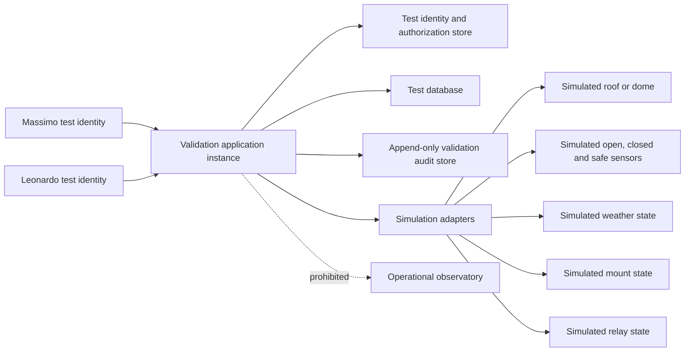

# ARB-012-C04 — Validation Environment Baseline

| Field | Value |
|---|---|
| Evidence ID | E-ARB012-C04-03 |
| Work item | C04-W05 — Validation Environment Baseline |
| Package | AP-012 — Enterprise Operations Center Architecture |
| Condition | ARB-012-C04 — Role Assignment and Four-Eyes Enforcement |
| Version | 1.0 |
| Date | 2026-07-31 |
| Status | Baseline defined; environment not yet provisioned |
| Runtime effect | None |

## 1. Purpose

This document defines the minimum controlled environment required to execute the C04 four-eyes validation scenarios without connecting to, controlling or affecting the operational observatory. It establishes the isolation, identity, simulation, evidence and acceptance rules that must be satisfied before any scenario in `ARB-012-C04-Four-Eyes-Validation-Plan.md` may move from `Not Executed` to an executed result.

This baseline does not assert that the environment already exists, that any account has been created, or that any validation scenario has passed.

## 2. Scope

The environment is limited to organizational and technical validation of:

- requester and approver separation;
- self-approval denial;
- incompatible-role denial;
- revocation and approval invalidation;
- Maintainer and Return-to-Service separation;
- Safety and Security Authority decisions;
- audit-trail completeness and evidence traceability;
- continued denial of positive C4 and break-glass paths.

The environment shall not validate physical-device behaviour, motor timing, relay wiring, roof movement, local interlocks, weather hardware or operational recovery of the real observatory.

## 3. Mandatory isolation boundary

The validation environment shall be logically and physically isolated from the operational observatory.

The following connections are prohibited:

- operational PLC or relay controllers;
- real roof or dome motors;
- operational ASCOM or Alpaca device endpoints;
- operational MQTT brokers or topics;
- weather-station production endpoints;
- mount, telescope, camera, focuser or flat-panel controllers;
- production VPN routes;
- production credentials, API keys, certificates or secrets;
- production databases or audit stores.

A validation run shall be stopped immediately if any route, credential, endpoint or adapter can reach real equipment.

## 4. Baseline topology

The prohibited path to the operational observatory must remain absent at network, configuration and credential level.

## 5. Software baseline register

Before execution, the following values shall be recorded and frozen for the validation campaign.

| Baseline item | Required value | Current status |
|---|---|---|
| Repository | `maininimassimo-bit/digital-stargate-manual` and applicable implementation repository | Documentation repository confirmed; implementation repository pending |
| Validation branch | Dedicated existing validation branch or immutable commit reference | Pending |
| Application commit SHA | Exact tested commit | Pending |
| Configuration version | Versioned non-production configuration | Pending |
| Runtime version | Exact framework/runtime version | Pending |
| Database engine and version | Non-production instance | Pending |
| Identity provider or local auth version | Non-production instance | Pending |
| Simulation adapter version | Exact commit or package version | Pending |
| Test fixture version | Versioned dataset identifier | Pending |
| Audit schema version | Exact schema identifier | Pending |

No scenario result is acceptable without the exact application commit and configuration version.

## 6. Infrastructure baseline

The validation environment may use a local workstation, virtual machine, container stack or isolated laboratory host, provided that it satisfies all acceptance criteria.

Minimum requirements:

- dedicated non-production execution context;
- network rules that deny access to operational subnets and VPN routes;
- separate test database;
- separate audit store;
- no reuse of production secrets;
- deterministic reset between scenarios;
- synchronized clock and explicit timezone;
- preserved logs and evidence export;
- documented backup or snapshot of the initial state.

| Infrastructure item | Baseline value | Evidence | Status |
|---|---|---|---|
| Host or runner | Pending | Pending | Not provisioned |
| Operating system | Pending | Pending | Not provisioned |
| Isolation mechanism | Pending | Pending | Not provisioned |
| Network deny rules | Pending | Pending | Not verified |
| Test database | Pending | Pending | Not provisioned |
| Audit store | Pending | Pending | Not provisioned |
| Snapshot or reset method | Pending | Pending | Not defined |
| Time synchronization | Pending | Pending | Not verified |

## 7. Identity and access baseline

The environment shall use two distinct authenticated identities mapped to natural persons.

| Identity | Permitted validation roles | Prohibited actions | Status |
|---|---|---|---|
| Massimo Mainini | Requester, Operator, Maintainer in isolated validation scope | Self-approval, C3 approval of own request, Return-to-Service approval of own maintenance, C4 approval | Account and evidence pending |
| Leonardo Di Egidio | C3 Approver, Safety Authority, Security Authority, Return-to-Service Approver | Acting as requester for the same operation, approving own privileged access, positive C4 completion, independent audit closure | Account and evidence pending |

Requirements:

- unique accounts;
- distinct credentials and sessions;
- no shared accounts;
- least-privilege role grants;
- explicit role-to-permission mapping;
- login, logout, failed access and role-change audit events;
- revocation effective before subsequent authorization checks;
- no account may hold permissions beyond the approved validation scope.

Identity and training evidence from C04-W03 must be accepted before positive scenarios are executed.

## 8. Simulation baseline

All external devices and environmental states shall be represented by deterministic simulation adapters.

| Simulator | Required states or operations | Physical effect |
|---|---|---|
| Roof or dome | `Closed`, `Opening`, `Open`, `Closing`, `Fault` | None |
| Position sensors | Open, closed, both false, inconsistent | None |
| Safety state | Safe, unsafe, unknown | None |
| Weather | Nominal, wind unsafe, rain unsafe, stale data | None |
| Relay | Off, requested on, denied, simulated on | None |
| Mount | Parked, unparked, unknown | None |
| Approval service | Pending, approved, denied, revoked, expired | None |
| Identity service | Active, suspended, revoked | None |

Simulation adapters must not contain fallback logic that resolves to production endpoints.

## 9. Canonical test fixtures

The validation campaign shall use versioned fixtures with stable identifiers.

| Fixture ID | Description | Expected governance effect |
|---|---|---|
| FX-001 | Valid C3 request from Massimo | Requires independent Leonardo approval |
| FX-002 | Massimo attempts self-approval | Denied and audited |
| FX-003 | Leonardo acts as requester and approver for same request | Denied and audited |
| FX-004 | Leonardo approval role revoked before execution | Pending approval invalidated; execution denied |
| FX-005 | Massimo Operator role revoked before execution | Execution denied |
| FX-006 | Maintenance completed by Massimo | Independent Return-to-Service decision required |
| FX-007 | Unsafe weather state | Permit denied or stop decision recorded |
| FX-008 | Inconsistent roof sensors | Execution denied; safe-state handling recorded |
| FX-009 | Privileged access request benefiting Leonardo | Leonardo self-approval denied |
| FX-010 | Positive C4 request | Remains denied due insufficient independent actors |
| FX-011 | Break-glass request | Remains denied |
| FX-012 | Evidence mutation attempt | Detected or prevented; original evidence preserved |

## 10. Logging and evidence baseline

Each scenario execution shall produce an evidence bundle containing:

- scenario and fixture identifiers;
- application commit SHA;
- configuration and schema versions;
- start and end timestamps;
- requester and approver identities;
- effective roles and permissions;
- request payload or normalized command intent;
- policy decision and reason;
- approval, denial, revocation or expiry event;
- simulated execution result;
- correlation ID;
- audit event IDs;
- relevant logs and screenshots;
- final result: `Passed`, `Failed`, `Blocked` or `Not Executed`;
- reviewer and review date.

Evidence must exclude passwords, secrets, private keys, authentication tokens and identity-document images.

## 11. Reset and repeatability

Before each scenario:

1. restore the approved initial snapshot or reset state;
2. verify both identity states and role assignments;
3. clear transient queues while preserving prior immutable evidence;
4. load the required fixture version;
5. confirm the absence of operational routes and credentials;
6. record the new campaign and correlation identifiers.

A scenario shall be repeated after any implementation, configuration or policy change affecting its result.

## 12. Stop conditions

The validation campaign shall stop when:

- any connection to operational hardware or network is detected;
- an identity can self-approve;
- a revoked identity remains authorized;
- a denied request reaches simulated execution as approved;
- audit events are missing, mutable without detection or not attributable;
- test state cannot be reset deterministically;
- configuration or tested commit cannot be identified;
- positive C4 or break-glass becomes available;
- a local-interlock bypass is introduced or implied.

No later positive scenario may compensate for a failed denial or isolation test.

## 13. Environment acceptance checklist

| Check ID | Acceptance criterion | Evidence | Result |
|---|---|---|---|
| ENV-001 | Operational subnets and VPN routes are unreachable | Pending | Not executed |
| ENV-002 | No production credential or secret is present | Pending | Not executed |
| ENV-003 | All device adapters resolve only to simulators | Pending | Not executed |
| ENV-004 | Two distinct authenticated accounts exist | Pending | Not executed |
| ENV-005 | Role-to-permission mapping matches C04-W03 | Pending | Not executed |
| ENV-006 | Self-approval is denied by policy | Pending | Not executed |
| ENV-007 | Revocation is enforced before execution | Pending | Not executed |
| ENV-008 | Test database and audit store are non-production | Pending | Not executed |
| ENV-009 | Initial state can be reset deterministically | Pending | Not executed |
| ENV-010 | Logs, correlation IDs and evidence export are available | Pending | Not executed |
| ENV-011 | Tested commit and configuration are immutable and recorded | Pending | Not executed |
| ENV-012 | C4, break-glass and physical control remain unavailable | Pending | Not executed |

The environment is accepted only when ENV-001 through ENV-012 are `Passed` and reviewed by an identified person who did not configure the control being accepted where a material conflict exists.

## 14. Traceability

| Source | Relationship |
|---|---|
| `ARB-012-Final-Re-Review.md` | Defines C04 as an unresolved release condition |
| `ARB-012-C04-Closure-Plan.md` | Defines the closure sequence and restrictions |
| `ARB-012-C04-Role-Assignment-Register.md` | Defines provisional role allocation and segregation limits |
| `ARB-012-C04-Identity-Training-Access-Review.md` | Defines identity, training, access and revocation prerequisites |
| `ARB-012-C04-Four-Eyes-Validation-Plan.md` | Defines scenarios that may execute only after environment acceptance |

## 15. Work-item exit criteria

C04-W05 may be marked complete only when:

- the environment is provisioned and uniquely identified;
- software and infrastructure baseline values are recorded;
- ENV-001 through ENV-012 are executed and passed;
- evidence references are committed without secrets;
- an identified reviewer accepts the environment;
- no operational route, device or credential is available;
- the exact baseline is frozen for the validation campaign.

## 16. Current disposition

**C04-W05: IN PROGRESS — baseline defined; environment provisioning and acceptance checks not yet executed.**

No four-eyes scenario has been executed by this document. `ARB-012-C04` remains `Blocked`. Runtime activation, physical-device control, positive C4, break-glass, self-approval and local-interlock bypass remain prohibited.
