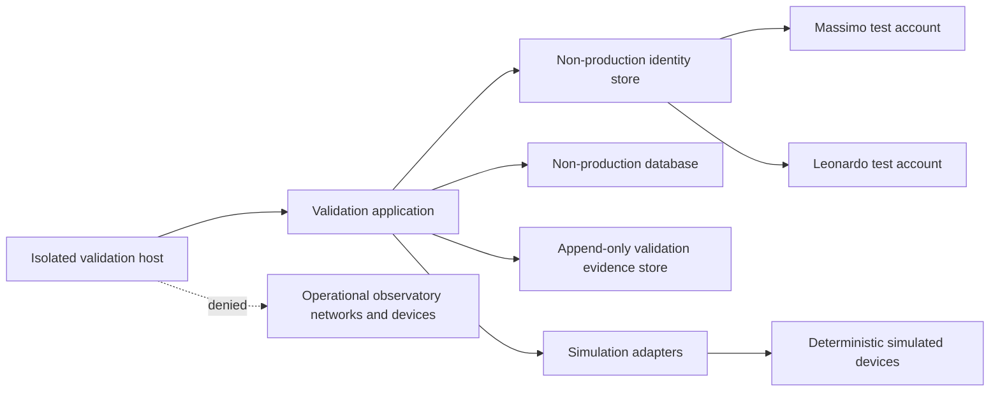

# ARB-012-C04 — Validation Environment Provisioning and Account Setup Record

| Field | Value |
|---|---|
| Evidence ID | E-ARB012-C04-04 |
| Work item | C04-W06 — Validation Environment Provisioning and Account Setup |
| Package | AP-012 — Enterprise Operations Center Architecture |
| Condition | ARB-012-C04 — Role Assignment and Four-Eyes Enforcement |
| Version | 1.1 |
| Date | 2026-07-31 |
| Status | Immutable DSOC implementation baseline recorded; isolated environment and accounts not yet provisioned |
| Runtime effect | None |

## 1. Purpose

This record governs the controlled provisioning of the isolated environment defined by `ARB-012-C04-Validation-Environment-Baseline.md` and the creation of the two distinct non-production accounts required for later four-eyes validation.

The authoritative DSOC implementation repository and immutable application baseline are now identified. This record does not assert that any validation host, container, database, identity account, audit store, isolation rule or runtime environment has already been provisioned. Execution fields remain pending unless supported by verifiable evidence.

## 2. Preconditions

Provisioning may start only when:

- the documentation baseline on `main` is identified;
- the implementation repository, component and exact commit to be tested are identified;
- no production credentials, secrets, certificates or VPN profiles are imported;
- the host or runner is dedicated to non-production validation;
- the person performing each provisioning action is recorded;
- the planned reviewer is identified and has no material conflict for the control being accepted.

Identity, training and least-privilege checks from C04-W03 remain prerequisites for positive scenario execution even if the environment is technically available.

## 3. Target provisioning topology

The denied path to operational networks and devices must be enforced by configuration and network controls, not only by operator intent.

## 4. Immutable implementation baseline

| Baseline field | Recorded value |
|---|---|
| Repository | `maininimassimo-bit/DigitalStarGate.Control` |
| Default branch | `main` |
| Immutable merge commit | `37bbd581f37b62243f012cb7a72057207ab10ca6` |
| Source pull request | `DigitalStarGate.Control#1` |
| CI workflow | `DSOC Bootstrap CI` run `#2` |
| CI result | `success` |
| Component | `DigitalStarGate.Control.Domain` fail-safe safety policy and tests |
| Runtime target | `.NET 8` |
| Configuration mode | simulator-only; no production endpoint fallback |
| Simulator manifest | `validation/simulators/manifest.json` at the immutable commit |
| Fixture manifest | `validation/fixtures/manifest.json` at the immutable commit |
| Canonical fixture | `validation/fixtures/unsafe-weather.json` |
| Fixture SHA-256 | `d4071db1a4b534d8cfb0e8dee9f931665d28307a26b000e7c3ec61811f091c94` |

This baseline authorizes only isolated provisioning preparation and deterministic simulator validation. It does not authorize deployment to an operational host, physical-device adapters, production routes, credentials, positive C4, break-glass, self-approval or local-interlock bypass.

## 5. Provisioning register

| Item ID | Item | Required recorded value | Evidence reference | Owner | Reviewer | Status |
|---|---|---|---|---|---|---|
| PRV-001 | Validation host or runner | Unique hostname or runner ID | Pending | Pending | Pending | Not provisioned |
| PRV-002 | Operating system | Product, edition and exact version | Pending | Pending | Pending | Not provisioned |
| PRV-003 | Isolation mechanism | VM, container network or dedicated host boundary | Pending | Pending | Pending | Not provisioned |
| PRV-004 | Network deny controls | Rules denying operational subnets, VPN routes and device endpoints | Pending | Pending | Pending | Not configured |
| PRV-005 | Validation application | Repository, component and immutable commit SHA | `DigitalStarGate.Control` `main` at `37bbd581f37b62243f012cb7a72057207ab10ca6` | Massimo Mainini | Independent review pending | Baselined |
| PRV-006 | Non-production configuration | Configuration identifier and checksum | Simulator-only baseline embedded in immutable commit; environment-specific checksum pending provisioning | Massimo Mainini | Independent review pending | Baseline identified; deployment evidence pending |
| PRV-007 | Test database | Engine, version and instance identifier | Pending | Pending | Pending | Not provisioned |
| PRV-008 | Audit evidence store | Store identifier, append-only control and retention setting | Pending | Pending | Pending | Not provisioned |
| PRV-009 | Simulation adapters | Package or commit version | `validation/simulators/manifest.json` at `37bbd581f37b62243f012cb7a72057207ab10ca6` | Massimo Mainini | Independent review pending | Source baseline identified; not deployed |
| PRV-010 | Canonical fixtures | Fixture bundle version and checksum | `validation/fixtures/manifest.json`; fixture SHA-256 `d4071db1a4b534d8cfb0e8dee9f931665d28307a26b000e7c3ec61811f091c94` | Massimo Mainini | Independent review pending | Source baseline identified; not loaded |
| PRV-011 | Reset method | Snapshot, seed or rebuild procedure | Pending | Pending | Pending | Not verified |
| PRV-012 | Time source | Time synchronization source and timezone | Pending | Pending | Pending | Not verified |

## 6. Account setup register

Only distinct, named, non-production accounts are permitted.

| Account ID | Natural person | Validation role scope | Prohibited permissions | Evidence | Reviewer | Status |
|---|---|---|---|---|---|---|
| ACC-001 | Massimo Mainini | Requester, Operator and Maintainer in isolated validation only | Self-approval, C3 approval, Return-to-Service approval of own maintenance, C4 approval, production access | Pending | Leonardo Di Egidio subject to conflict check | Not created |
| ACC-002 | Leonardo Di Egidio | C3 Approver, Safety Authority, Security Authority and Return-to-Service Approver in isolated validation only | Request and approval for same operation, approval of own privileged access, positive C4 completion, production access, independent audit closure | Pending | Massimo Mainini as Sponsor subject to self-benefit exclusion; independent ARB verification required | Not created |

Mandatory controls:

- unique usernames;
- distinct credentials and sessions;
- no shared accounts;
- no production identity federation unless explicitly isolated and approved;
- deny-by-default role grants;
- explicit role-to-permission mapping;
- login, failed-login, logout, role-change and revocation audit events;
- immediate revocation effect before later authorization checks;
- credentials excluded from repository evidence.

## 7. Role-to-permission mapping

| Permission | Massimo test account | Leonardo test account | Notes |
|---|---|---|---|
| Create C0-C3 validation request | Allow | Deny for requests later approved by Leonardo | Prevent same-person request and approval |
| Approve C3 request from Massimo | Deny | Allow | Non-operational validation only |
| Execute approved simulated operation | Allow when policy permits | Deny | No physical effect |
| Perform simulated maintenance | Allow | Deny | Return-to-Service remains independent |
| Approve Return-to-Service for Massimo maintenance | Deny | Allow | Non-operational validation only |
| Make Safety Authority decision | Deny | Allow | No physical or runtime authority |
| Approve privileged access for Massimo | Deny | Allow | Leonardo may not approve own access |
| Positive C4 completion | Deny | Deny | Insufficient independent actors |
| Break-glass | Deny | Deny | Prohibited |
| Production network, credentials or devices | Deny | Deny | Mandatory isolation |
| Modify immutable evidence | Deny | Deny | Evidence administration separated where available |

## 8. Provisioning procedure

1. Record the target host and operator.
2. Install or initialize the isolated execution context.
3. Apply network deny controls before application deployment.
4. Verify that operational subnets, VPN routes and device endpoints are unreachable.
5. Deploy exact commit `37bbd581f37b62243f012cb7a72057207ab10ca6` from `maininimassimo-bit/DigitalStarGate.Control`.
6. Generate and record the environment-specific non-production configuration checksum.
7. Provision separate database and audit stores.
8. Deploy only the simulation adapters declared by the immutable simulator manifest.
9. Verify the canonical fixture checksum before loading fixtures.
10. Create ACC-001 and ACC-002 with deny-by-default privileges.
11. Capture role-to-permission exports without secrets.
12. Configure audit events and correlation identifiers.
13. Create the initial snapshot or reset baseline.
14. Execute ENV-001 through ENV-012 and record results.
15. Freeze the accepted environment baseline before W07 begins.

## 9. Evidence package structure

The W06 evidence package shall contain:

- host and execution-context identifiers;
- operating-system and runtime versions;
- application repository and tested commit SHA;
- non-production configuration identifier and checksum;
- network isolation rule export or equivalent evidence;
- simulator endpoint inventory;
- database and audit-store identifiers;
- account identifiers and role assignments;
- role-to-permission matrix export;
- screenshots or logs for login and denial checks;
- reset or snapshot evidence;
- ENV-001 through ENV-012 results;
- reviewer name, date and disposition.

No passwords, tokens, private keys, certificates, recovery codes, identity-document images or production endpoint secrets may be committed.

## 10. Acceptance checklist

| Check ID | Acceptance criterion | Evidence | Result |
|---|---|---|---|
| ENV-001 | Operational subnets and VPN routes are unreachable | Pending | Not executed |
| ENV-002 | No production credential or secret is present | Pending | Not executed |
| ENV-003 | All device adapters resolve only to simulators | Immutable simulator source baseline identified; deployment evidence pending | Ready for execution |
| ENV-004 | Two distinct authenticated accounts exist | Pending | Not executed |
| ENV-005 | Role-to-permission mapping matches C04-W03 | Pending | Not executed |
| ENV-006 | Self-approval is denied by policy | Domain fail-safe policy and unit-test baseline identified; environment evidence pending | Ready for execution |
| ENV-007 | Revocation is enforced before execution | Pending | Not executed |
| ENV-008 | Test database and audit store are non-production | Pending | Not executed |
| ENV-009 | Initial state can be reset deterministically | Pending | Not executed |
| ENV-010 | Logs, correlation IDs and evidence export are available | Pending | Not executed |
| ENV-011 | Tested commit and configuration are immutable and recorded | Application commit recorded; environment configuration checksum pending | Ready for execution |
| ENV-012 | C4, break-glass and physical control remain unavailable | Source baseline prohibits physical adapters and production endpoints; environment evidence pending | Ready for execution |

## 11. Stop conditions

Provisioning or validation must stop immediately if:

- a production route, VPN profile, credential or device endpoint is discovered;
- either account can self-approve;
- Leonardo can request and approve the same operation;
- Massimo can approve Return-to-Service for his own maintenance;
- revocation is not effective before execution;
- positive C4 or break-glass is available;
- evidence can be changed without detection;
- the tested commit or configuration cannot be identified;
- simulator configuration can fall back to production endpoints.

## 12. Traceability

| Source | Relationship |
|---|---|
| `maininimassimo-bit/DigitalStarGate.Control` commit `37bbd581f37b62243f012cb7a72057207ab10ca6` | Authoritative immutable DSOC source baseline for W06 provisioning |
| `ARB-012-C04-W06-DSOC-Implementation-Repository-Bootstrap-Specification.md` | Defines repository bootstrap and simulator-only constraints |
| `ARB-012-C04-Identity-Training-Access-Review.md` | Defines identity, training, least-privilege and revocation prerequisites |
| `ARB-012-C04-Validation-Environment-Baseline.md` | Defines the mandatory environment baseline and ENV-001 through ENV-012 |
| `ARB-012-C04-Four-Eyes-Validation-Plan.md` | Defines W07 scenarios that remain blocked until this environment is accepted |
| `ARB-012-C04-Traceability-Status.md` | Records package-level status and remaining blockers |

## 13. Work-item exit criteria

C04-W06 may be marked complete only when:

- PRV-001 through PRV-012 have recorded values and accepted evidence;
- ACC-001 and ACC-002 exist as distinct non-production accounts;
- role grants match the approved least-privilege matrix;
- ENV-001 through ENV-012 are executed and passed;
- the exact application commit and configuration are frozen;
- the initial reset baseline is proven repeatable;
- an identified reviewer accepts the environment;
- no production access or physical-device path exists.

## 14. Current disposition

**C04-W06: IN PROGRESS — immutable DSOC source baseline recorded; isolated provisioning and account setup remain pending.**

`ENV-011` is **Ready for Execution**, not passed: the application commit is immutable and recorded, while the environment-specific configuration checksum still requires provisioning evidence.

C04-W07 remains blocked. `ARB-012-C04` remains `Blocked`. Runtime activation, physical-device control, positive C4, break-glass, self-approval and local-interlock bypass remain prohibited.
