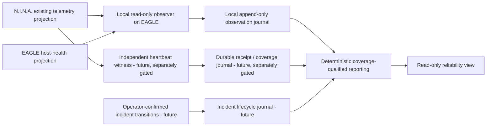

# BKL-043 F2 — System Detection Architecture Proposal

| Field | Value |
|---|---|
| Evidence ID | `BKL043-F2-SYSTEM-DETECTION-ARCHITECTURE-2026-09-24` |
| Gate | `M-BKL043-F2-DETECTION-ARCHITECTURE` |
| Status | Proposed architecture prepared from repository evidence; owner/ARB decision pending |
| Owner / accountable | Massimo Mainini |
| Authority | Design-only; repository evidence only; command/execution/safety `NONE` |
| Baseline | `77fb7980492cad24b86fa51fcbe7ef1437783eca` |

## 1. Executive finding

A process started only when EAGLE boots cannot measure whole-observatory MTBF or
MTTR by itself. It is unable to record when EAGLE loses power or becomes
unreachable, and startup provides only a point observation. A boot trigger must
be paired with repeated observations and durable history to establish coverage.
To observe EAGLE being unavailable, a second witness outside EAGLE is necessary;
even that witness initially establishes only a bounded missing-heartbeat window,
not the failure cause or exact onset.

Repository evidence supports a **two-plane, per-component, read-only design
candidate**:

1. reuse existing N.I.N.A. and EAGLE source projections locally, with a
   non-elevated observer and append-only local observation journal; and
2. separately govern an independent heartbeat witness and durable receipt
   history outside EAGLE if the objective remains whole-observatory coverage.

The existing hosted telemetry relay is a candidate integration point, not an
accepted history service: it serves latest snapshots and process-local counters
and has no repository-evidenced durable observability/incident timeline. No
collector, startup task, recurring writer, relay change, or live source access
is authorized by this proposal.

## 2. Evidence and source eligibility

| Component/source | Repository evidence | Design eligibility | Important limit |
|---|---|---|---|
| EAGLE host | BKL-030 G1/G2 read-only source map and projection contract; G5 manual runtime OAT; G6 history schema/writer and one manual 14-signal persistence cycle | Reuse `DSG.EagleHostHealthCollector` and `DSG.EagleHealthHistoryWriter` contracts and behavior as the host-health source/history pattern | No permanent G5/G6 task/service cadence is approved. The current committed public projection is `UNKNOWN/UNAVAILABLE`; a host-local process cannot observe EAGLE while it is off. |
| N.I.N.A. observatory telemetry | Versioned `observatory-status-v1` contract; runtime commissioning evidence for N.I.N.A. exporter, passive network, TS Shelter J6 mains-presence and component observations; existing producer writes a local projection and publishes snapshots | Consume the existing local producer projection/health and documented source provenance; do not add duplicate device probes | Repository projection is stale/`UNKNOWN`; runtime commissioning is historical evidence, not present live status. A current source must be revalidated in a separately authorized pilot. |
| N.I.N.A. application activity | 35 `.log` artifacts in 23 session folders, 32 unique contents by SHA-256; owner accepts a N.I.N.A.-logged activity as the definition of an observed attempt | Later offline parser may create an observed-activity summary after event semantics are validated | Logs are not an incident ledger or complete planned-session denominator; duplicate/overlapping logs and unvalidated event semantics preclude counting attempts/faults today. |
| Power | 2026-08-27 TS Shelter J6 read-only commissioning verified mains-present/lost/restored mapping | A source-specific power observation, if current and freshly verified | J6 senses mains presence only; it does not establish UPS/battery state, EAGLE power, or system safety. |
| Network | 2026-08-26 passive N.I.N.A. network adapter commissioning | Source-specific connectivity observations from the existing producer | A network observation is not network control; interface/VPN/failover fields were unresolved. Loss of the same path can hide the reporting host. |
| Dome, mount, camera, weather | Observatory Status schema defines fields; current repository projection has all component states `UNKNOWN`, null source and expired snapshot | Eligible only when a current, source-attributed projection is available and its freshness/quality validates | Schema presence is not proof of an active producer or current physical state; local Safety Authority remains outside this design. |
| Hosted telemetry relay | Relay accepts current snapshot channels and atomically replaces latest snapshot files; `/health` counters live in process memory | Possible future independent receipt witness only after its failure domain, persistence, retention, and data contract are approved | Current relay is a latest-value transport/read model, not a durable heartbeat or incident history. No relay modification or redeploy is authorized. |
| Incident records | OPSC-ALM-001 is draft; owner confirms no incident register is present | Future separate append-only incident/event ledger with operator-confirmed lifecycle transitions | No present correlated incident population; no MTTR or MTBF can be calculated from the draft model. |

The N.I.N.A. producer's documented poll/freshness settings apply only to that
commissioned producer and must not be generalized into a new system-wide
cadence. The current EAGLE host-health collector OAT expressly did not enable a
permanent scheduled task or service. The history writer's no-delete and
idempotent append behavior is useful design precedent, not permission to schedule
it.

## 3. Alternatives considered

| Option | What it observes | Benefits | Limit / disposition |
|---|---|---|---|
| A. Boot-only snapshot | EAGLE and reachable sources at startup | Smallest footprint; simple recovery point | Cannot establish coverage between boots or record EAGLE loss. **Reject for MTBF/MTTR.** |
| B. EAGLE-local recurring observer | Existing sources while EAGLE and local storage operate | Reuses local projections; can establish bounded EAGLE-observed intervals; no external dependency | Gaps during host/power/storage failure are unobserved; cannot support whole-system availability or exact failure/restoration times alone. Suitable only for a clearly labelled local observed-coverage pilot. |
| C. Independent remote witness only | Arrival/missing heartbeat from EAGLE producer | Can record EAGLE reachability gaps outside the host failure domain | Cannot identify whether the cause is EAGLE, network, producer or receiver; needs durable timestamped receipts and a defined freshness contract, neither of which is evidenced today. |
| D. Local observer + independent witness + human-confirmed incident lifecycle | Component observations plus host reachability and verified incident transitions | Strongest candidate for whole-observatory, coverage-qualified reliability evidence; supports explicit ambiguity and independent failure domains | Highest governance and operational complexity; needs new persistent event storage, source and security reviews, cadence/OAT and separate runtime approval. **Recommended target for design, not approved for implementation.** |

## 4. Proposed logical architecture



No edge is permitted from observer, witness, journal, report or view to device
commands, scheduling decisions, automatic remediation or Safety Authority. The
diagram is logical; it selects no deployment product, store, service identity,
or numeric polling interval.

### 4.1 Local plane

- Consume source-owned local projections, not duplicate direct probes of N.I.N.A.,
  ASCOM, dome, mount, camera, power, router or weather hardware.
- Reuse BKL-030 signal provenance (`source`, observation time, freshness, quality,
  cadence class and reason) and G6 deterministic identity/non-overlap principles.
- Keep raw source observations separate from detected-condition candidates and
  from operator-confirmed incidents.
- Append bounded, schema-versioned records to a local journal; never rewrite a
  prior observation to make it appear current. Journal durability, ACLs,
  retention and export remain decisions for the runtime gate.
- Start-on-boot is only a lifecycle trigger. Repeated sampling is a separate
  cadence decision and must not be added to the existing N.I.N.A. producer task
  or G6 writer without workload/non-interference validation.

### 4.2 Independent witness plane

- Receive a minimal heartbeat/receipt outside the EAGLE host failure domain.
- Record receiver time, source identity, sequence/idempotency key, source
  observation time and quality; persist receipts durably before acknowledging
  acceptance.
- Preserve the interval between last accepted heartbeat and first confirmed
  missing-heartbeat condition as an uncertain/bounded interval. Do not label it
  an exact device failure time.
- Treat absence of heartbeat as `UNREACHABLE/UNKNOWN` for the reporter path,
  not as proof of EAGLE power failure, system-wide outage, or unsafe state.
- Do not extend source freshness or replace source-observed time with receipt
  time. Report both.

This is a new writer and hosted data-retention function; it requires explicit
architecture/security/privacy/release review and a follow-on owner-authorized
runtime gate. The present relay is not silently promoted into this role.

### 4.3 Incident plane

- Store incidents separately from telemetry samples and automatic condition
  candidates.
- Record append-only transitions with `incident_id`, component/service, actor,
  reason, source/evidence references, transition time, time-quality, previous
  and new state, and correlation identity.
- `detected` may be proposed by a deterministic rule but remains a candidate
  until accepted under an approved operations policy. Acknowledgement is not
  restoration. Signal cessation is not closure.
- Require an explicit operator confirmation or independently verified
  source-specific condition for restoration; retain reopen history.
- OPSC-ALM-001 remains draft and AP-007 still needs owner assignments; this
  proposal does not create the incident register or define alert routing.

## 5. Event, time and coverage semantics

Prospective record envelopes should distinguish:

```text
record_id / schema_version
component_id / source_id / source_instance
source_observed_at_utc / collector_received_at_utc
fresh_until_utc / source_quality / clock_quality
host_boot_id / process_run_id / sequence_id
observation_state / coverage_state / reason_code
correlation_id / evidence_reference / payload_hash
```

- UTC timestamps are retained as emitted and paired with a monotonic elapsed
  duration within a single host boot/process run. Monotonic values are never
  compared across restarts.
- Clock unsynchronized, future-dated, missing or conflicting timestamps make
  the affected interval `UNKNOWN`; the observer does not silently correct them.
- `CURRENT`, `STALE`, `UNKNOWN`, `UNAVAILABLE` and `CONFLICTING` remain evidence
  quality states, not severity or safety states.
- Replayed records are idempotently recognized by stable source identity,
  sequence/observation identity and content digest; conflicting reuse is
  preserved as a conflict, not overwritten.
- Every report must show measured coverage beside any statistic. Unknown gaps
  are excluded from eligible exposure and never assumed healthy.

## 6. Candidate metric definitions — not yet approved

| Measure | Candidate definition | Conditions before computation |
|---|---|---|
| Component MTBF | Eligible observed in-service exposure for component `c` divided by the count of validated, unique qualifying failures for `c` in the same window | Component boundary, event taxonomy, exposure states, coverage floor and duplicate/correlation rules must be accepted. If no qualifying failure is observed, report “none observed in covered exposure”; do not report infinity. |
| Detection-to-restore duration | `verified_restored_at - confirmed_detected_at` per accepted incident | Must be labelled detection-to-restore, not failure-to-repair; restoration evidence and clock quality must validate. |
| Failure-to-restore duration | `verified_restored_at - evidenced_failure_onset_at` | Compute only when onset is independently evidenced; otherwise unavailable. |
| Acknowledgement delay | `acknowledged_at - confirmed_detected_at` | Operator identity and transition timestamps required; not an MTTR substitute. |
| N.I.N.A.-observed attempt outcome | Parsed outcome for one validated N.I.N.A.-logged attempt | Parser, attempt grouping, retries, terminal states and deduplication still require a separate contract; excludes sessions with no N.I.N.A. log activity. |

No whole-system scalar is proposed. Component results stay separate until a
dependency/service boundary, inclusion policy and aggregate semantics are
reviewed. No SLI/SLO, service target, failure budget, availability percentage,
or numeric MTBF/MTTR value is approved in F2.

## 7. Failure modes and required behavior

| Failure mode | Required architectural behavior |
|---|---|
| EAGLE powered off / host unavailable | Independent witness may record a missing-heartbeat interval; cause remains unknown absent independent power/network evidence. |
| N.I.N.A. stopped or no telemetry projection | N.I.N.A. component signals become stale/unknown; do not infer camera/dome failure solely from process absence. |
| Network partition | Distinguish source observation from receiver reachability; preserve last receipt and gap interval; do not infer remote hardware state. |
| Relay/witness unavailable | Remote coverage is unknown for that interval; local journal may continue; reconcile append-only after recovery. |
| Local disk full/corrupt or writer failure | Preserve existing evidence, emit explicit coverage gap where possible, never claim continuous coverage or delete old history. |
| Clock jump/unsynchronized time | Flag time quality; avoid negative/overstated durations; require reconciliation or exclude affected intervals. |
| Duplicate/reordered events | Deterministic idempotency; retain conflicting lineage; do not double-count a failure. |
| Sensor stale/unavailable/conflicting | Propagate source quality; never map missing to healthy, safe or restored. |
| Imaging workload pressure | Bounded, non-overlapping, low-priority read-only work; stop/fail closed under unvalidated resource conditions; prove non-interference before any runtime pilot. |

## 8. Security, safety, privacy and operations

- Local observer should run with the least privilege that supports already
  approved read-only projections; no `SYSTEM`/highest privilege is assumed for
  the proposed new observer.
- Do not copy ingest credentials, environment variables, raw command output,
  arbitrary log bodies, private paths or personal data into reliability records.
- Restrict journal access; define integrity, backup, retention and disposal in
  the follow-on design. G6's `retention_deletion_enabled=false` remains precedent
  until a separate policy is accepted.
- Separate EAGLE local host, N.I.N.A. source, relay/witness and reporting trust
  boundaries; authenticate external receipt transport through separately
  reviewed identity and secret handling.
- Failures in observation, storage, relay or reporting cannot change interlocks
  or control behavior. `safety_authority=NONE` remains invariant for the tool.
- Assign operational/service owners, incident roles, maintenance, upgrade,
  rollback, support and recovery before activating any persistent process.

## 9. Validation plan for a future pilot gate

No pilot is authorized by this design. A separate pilot proposal should require:

1. current source-by-source provenance and read-only access verification;
2. local and independent-witness failure-domain analysis;
3. synthetic schema, duplicate, reorder, stale, missing, conflict and clock-step
   tests;
4. journal crash, disk-full, corruption, restart and reconciliation tests;
5. controlled host-offline/network-partition/recovery tests using synthetic or
   explicitly approved non-safety-impacting methods;
6. imaging-session CPU, memory, disk-I/O and N.I.N.A./PHD2 non-interference
   evidence before recurring cadence;
7. confirmed incident lifecycle and time-quality tests, with no automatic
   restoration/closure;
8. security/privacy, retention, backup, rollback and operational readiness
   review;
9. independent ARB and release-quality dispositions;
10. owner authorization for exact target, cadence, source, retention and runtime
    deployment before any change is activated.

## 10. Architecture recommendation and decision

**Recommendation:** retain Option D as the target for the stated whole-system
objective, but phase delivery. First validate the local source map and a bounded
EAGLE/N.I.N.A. observation design; do not call that “whole-system MTBF/MTTR.”
Only a separately approved independent witness plus a governed incident
lifecycle could support broader system-level claims. If no independent witness
is approved, explicitly narrow the capability to “EAGLE-observed component
telemetry” and leave offline gaps unknown.

The decision requested from owner/ARB is whether to accept this two-plane
architecture as the F2 design baseline, with the independent durable witness and
incident journal remaining separate runtime gates. Approval of this proposal
does not authorize either writer or any boot/recurring task.

## References

- `docs/architecture/validation/BKL-043-F1-SOURCE-DISCOVERY-2026-09-24.md`
- `docs/architecture/validation/BKL-043-F1-POPULATION-AND-CONTRACT-GAP-DISCOVERY-2026-09-24.md`
- `docs/architecture/telemetry/BKL-030-EAGLE-Health-Projection-Contract.md`
- `docs/architecture/telemetry/BKL-030-G6-EAGLE-Health-History-Persistence-Design.md`
- `docs/architecture/telemetry/evidence/BKL-030-G5-Runtime-OAT-2026-09-03.md`
- `docs/architecture/telemetry/evidence/BKL-030-G6-Runtime-OAT-2026-09-04.md`
- `docs/architecture/telemetry/NINA-Network-Telemetry-Runtime-Commissioning-2026-08-26.md`
- `docs/architecture/telemetry/NINA-Power-Telemetry-Runtime-Commissioning-2026-08-27.md`
- `docs/architecture/packages/AP-004-Enterprise-Telemetry-and-Observability-Architecture.md`
- `docs/architecture/packages/AP-007-Enterprise-Operations-and-Service-Management-Architecture.md`
- `docs/architecture/alarm-and-incident-model.md` (draft OPSC-ALM-001)
- `infrastructure/telemetry-relay/README.md`
