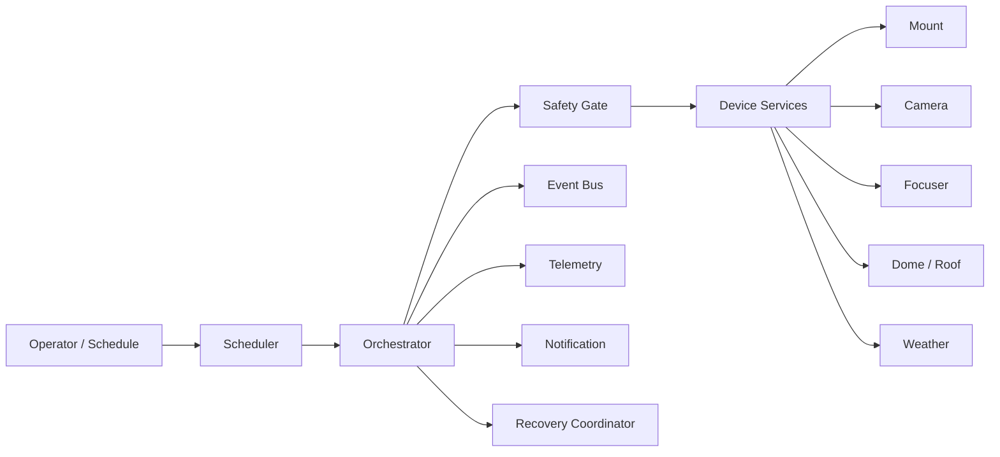

# Automation Architecture

## Componenti logici

## Responsabilità

- **Scheduler**: seleziona il piano osservativo e la finestra temporale.
- **Orchestrator**: esegue i workflow e mantiene lo stato della sessione.
- **Safety Gate**: autorizza o blocca le transizioni operative.
- **Device Services**: astraggono i singoli apparati.
- **Recovery Coordinator**: gestisce retry, fallback e chiusura sicura.
- **Event Bus**: pubblica gli eventi di dominio.
- **Telemetry**: registra metriche, log e health state.
