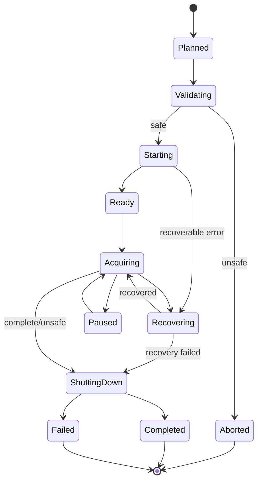

# Session State Machine

```mermaid
stateDiagram-v2
    [*] --> Planned
    Planned --> Validating
    Validating --> Starting: safe
    Validating --> Aborted: unsafe
    Starting --> Ready
    Starting --> Recovering: recoverable error
    Ready --> Acquiring
    Acquiring --> Paused
    Paused --> Acquiring
    Acquiring --> Recovering
    Recovering --> Acquiring: recovered
    Recovering --> ShuttingDown: recovery failed
    Acquiring --> ShuttingDown: complete/unsafe
    ShuttingDown --> Completed
    ShuttingDown --> Failed
    Aborted --> [*]
    Completed --> [*]
    Failed --> [*]
```
