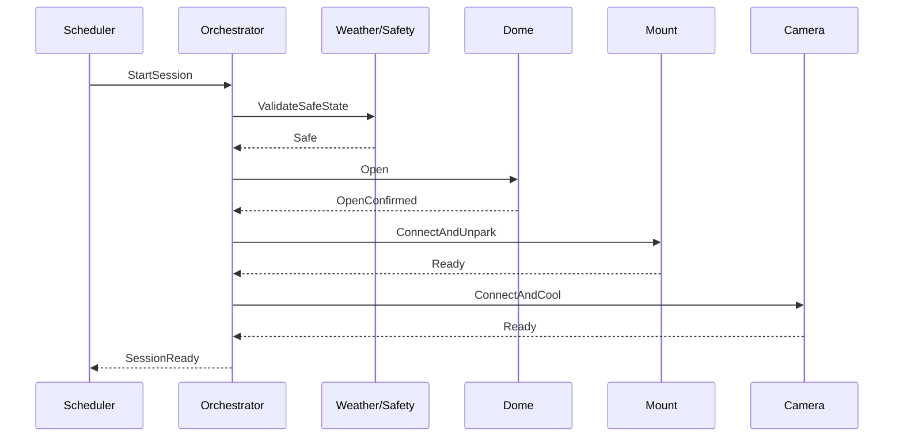

# AUTO-002 — Safe Startup

## Sequenza

## Failure handling

- meteo unsafe: sessione non avviata;
- cupola non aperta: abort e notifica;
- montatura non disponibile: chiusura controllata;
- camera non raffreddata: retry limitato o prosecuzione secondo policy.
