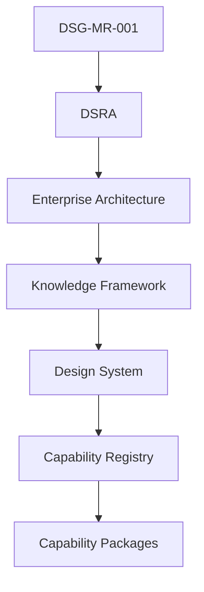
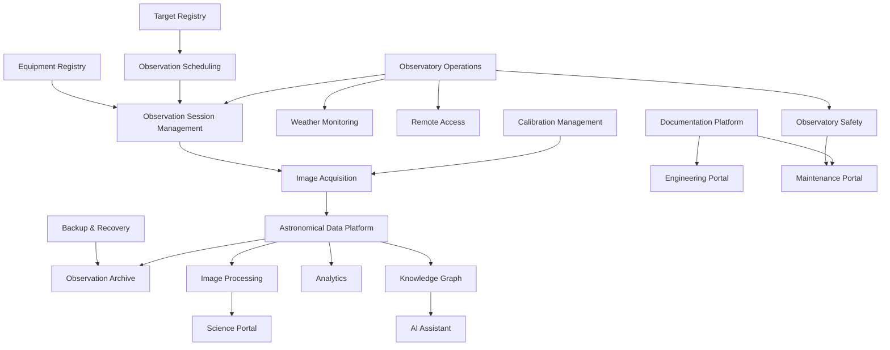
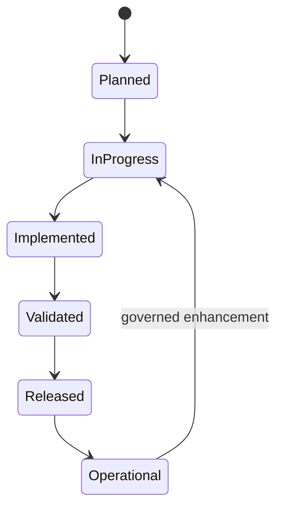

# CAP-000 - Capability Registry

| Campo | Valore |
|---|---|
| Documento | Capability Registry |
| ID | `CAP-000` |
| Stato | Official Capability Registry |
| Versione | 1.0 |
| Data | 2026-07-27 |
| Owner | Chief Solution Architect / Repository Manager |
| Fonte gerarchica | `DSG-MR-001` -> DSRA -> Enterprise Architecture -> Knowledge Framework -> Design System -> Capability Registry |
| Ambito | Capability gia presenti in roadmap, Enterprise Architecture, Knowledge Framework o capability package |

## Purpose

Il Capability Registry e l'indice autorevole delle capability Digital StarGate presenti nel repository. Funziona come dashboard operativa documentale: mostra stato, maturita, readiness, copertura e tracciabilita senza introdurre nuove capability e senza modificare roadmap, architettura o governance.

## Governance Chain

## Registry Rules

- Il registry cataloga solo capability gia supportate dal repository.
- Il registry non e una roadmap e non crea priorita di implementazione.
- Maturity e readiness sono qualitative e basate su evidenza documentale.
- Se owner, ADR, SOP, runbook, manuale, test o release non sono presenti, il campo resta `OPEN` o `Not yet available`.
- Capability package futuri devono essere aggiunti qui prima della pubblicazione come riferimento ufficiale.

## Maturity Indicators

| Maturity | Meaning |
|---|---|
| Not Started | Capability presente come intenzione o dipendenza, senza documentazione specifica sufficiente. |
| Defined | Capability descritta da architettura o Knowledge Framework. |
| Documented | Capability coperta da documentazione dedicata o documenti operativi rilevanti. |
| Validated | Capability con test/assessment/acceptance evidence validata. |
| Operational | Capability con evidenza repository di uso operativo o piattaforma attiva. |

## Readiness Scores

| Readiness | Meaning |
|---|---|
| Not Started | Non pronta per implementazione o package dedicato. |
| Architecture Complete | Architettura baseline sufficiente, package non ancora completo. |
| Documentation Complete | Documentazione dedicata completa, implementazione non certificata. |
| Implementation Ready | Package, requisiti, SOP, runbook, test e acceptance pronti per fase implementativa. |
| Operational | Capability gia sostenuta da evidenza operativa/release nel repository. |

## Capability Dependency Map

## Capability Lifecycle

## Capability Implementation Flow

```mermaid
flowchart LR
    Registry[Capability Registry] --> Package[Capability Package]
    Package --> Req[Requirements]
    Req --> ADR[Capability ADR]
    ADR --> SOP[SOP]
    SOP --> RB[Runbooks]
    RB --> Manual[Technical Manual]
    Manual --> Test[Test Plan]
    Test --> AC[Acceptance Criteria]
    AC --> Release[Release Notes]
```

## Implementation Dashboard

| Capability | Status | Coverage | ADR | SOP | Runbooks | Manuals | Tests | Release | Readiness |
|---|---|---|---|---|---|---|---|---|---|
| Observation Session Management | In Progress | Full capability package | 2 capability ADR + ADR-001 | 5 | 8 | 1 | 1 | OPEN | Implementation Ready |
| Observation Scheduling | Planned | Architecture only | OPEN | OPEN | OPEN | Chapter 17 reference | OPEN | OPEN | Architecture Complete |
| Observatory Operations | In Progress | Architecture + manuals/SOP chapters | ADR-001 | Chapters 16, 25, 26 | Chapter 18 / capability runbooks related | Chapters 5, 6, 16, 25, 26 | OPEN | OPEN | Architecture Complete |
| Equipment Registry | Planned | Architecture + manual references | OPEN | Chapter 22 | OPEN | Chapters 7-10, 22 | OPEN | OPEN | Architecture Complete |
| Target Registry | Planned | Architecture only | OPEN | OPEN | OPEN | Chapter 17 reference | OPEN | OPEN | Architecture Complete |
| Calibration Management | Planned | Architecture + manual references | OPEN | Chapter 28 | OPEN | Chapters 10, 28 | OPEN | OPEN | Architecture Complete |
| Image Acquisition | In Progress | Architecture + manuals + ADR-001 | ADR-001 | Chapter 17 | Capability camera/N.I.N.A./ASCOM runbooks related | Chapters 11-17 | OPEN | OPEN | Architecture Complete |
| Image Processing | Planned | Architecture + manual references | OPEN | Chapter 28 | OPEN | Chapter 28 | OPEN | OPEN | Architecture Complete |
| Astronomical Data Platform | In Progress | Architecture + ADR-003 | ADR-003 | Chapter 28 | OPEN | Warehouse docs, Chapter 28 | OPEN | OPEN | Architecture Complete |
| Observation Archive | Planned | Architecture + backup/manual references | OPEN | Chapters 21, 28 | OPEN | Chapters 21, 28 | OPEN | OPEN | Architecture Complete |
| Knowledge Graph | Planned | Knowledge Framework conceptual model | OPEN | OPEN | OPEN | Knowledge docs | OPEN | OPEN | Architecture Complete |
| AI Assistant | Planned | Architecture only | OPEN | OPEN | OPEN | Knowledge docs | OPEN | OPEN | Architecture Complete |
| Science Portal | Planned | Architecture + Design System patterns | OPEN | OPEN | OPEN | Data architecture / design docs | OPEN | OPEN | Architecture Complete |
| Engineering Portal | In Progress | Architecture + repository docs | DSG-ADR-004 | Release docs | OPEN | Enterprise Architecture docs | OPEN | OPEN | Architecture Complete |
| Maintenance Portal | Planned | Architecture + manuals/runbook references | OPEN | Chapters 18, 21, 30-32 | OPEN | Chapters 18-19, 21, 30-32 | OPEN | OPEN | Architecture Complete |
| Documentation Platform | Implemented | Enterprise docs + Design System + MkDocs | DSG-ADR-004 | Governance/release docs | OPEN | Enterprise docs, developer docs | OPEN | UI 6.1 | Operational |
| Analytics | In Progress | ADR + dashboard docs | ADR-002, ADR-003 | Release docs | OPEN | Analytics and warehouse docs | OPEN | UI 6.1 | Architecture Complete |
| Remote Access | Planned | Technology/Security architecture + manual chapter | OPEN | Chapter 24 | OPEN | Chapters 5, 24 | OPEN | OPEN | Architecture Complete |
| Observatory Safety | In Progress | DSRA + Observability + manuals | ADR-001 related | Chapters 18, 25, 26 | Capability safety runbooks related | Chapters 18, 25, 26 | OPEN | OPEN | Architecture Complete |
| Weather Monitoring | In Progress | Observability + manual chapter | OPEN | Chapter 26 | Weather Unsafe runbook related | Chapter 26 | OPEN | OPEN | Architecture Complete |
| Backup & Recovery | Planned | Technology/Security + manual chapter | OPEN | Chapter 21 | OPEN | Chapter 21 | OPEN | OPEN | Architecture Complete |

## Capability Registry Entries

### CAP-OSM-001 - Observation Session Management

| Field | Value |
|---|---|
| Capability Identifier | `CAP-OSM-001` |
| Capability Name | Observation Session Management |
| Purpose | Governare la sessione osservativa come unita operativa, informativa e di tracciabilita. |
| Business Domain | Observatory Operations / Data / Knowledge |
| Owner | Lead Solution Architect / Operations Owner |
| Current Status | In Progress |
| Maturity | Documented |
| Roadmap reference | `DSG-MR-001` Operations/Data |
| DSRA reference | DSRA safety, remote operation and data lineage layer |
| Enterprise Architecture reference | `application-architecture.md`, `data-architecture.md`, `observability-architecture.md` |
| Knowledge Framework reference | `domain-model.md`, `canonical-information-model.md`, `traceability-matrix.md` |
| Design System reference | `DSG-DS-001`, Component Library, Dashboard Patterns |
| Capability Package | `docs/capabilities/observation-session-management/` |
| Related ADR | `ADR-001`, `OSM-ADR-001`, `OSM-ADR-002` |
| Related SOP | `OSM-SOP-001` through `OSM-SOP-005` |
| Related Runbooks | `OSM-RB-001` through `OSM-RB-008` |
| Related Manuals | `technical-manual.md`, Chapters 11-17, 28 |
| Related Test Plans | `test-plan.md` |
| Related Acceptance Criteria | `acceptance-criteria.md` |
| Implementation status | Documentation package complete; software implementation not certified. |
| Release version | OPEN |
| Dependencies | Scheduler, Target Registry, Equipment Registry, Observatory Control, N.I.N.A., ASCOM, Data Platform, Weather/Safety. |
| Open decisions | Manifest schema, session ID format, session quality scale. |
| Readiness | Implementation Ready |

### CAP-SCH-001 - Observation Scheduling

| Field | Value |
|---|---|
| Capability Identifier | `CAP-SCH-001` |
| Capability Name | Observation Scheduling |
| Purpose | Preparare piani osservativi usando target, finestra, meteo, profilo ottico e priorita. |
| Business Domain | Prepare Observation / Automation |
| Owner | OPEN |
| Current Status | Planned |
| Maturity | Defined |
| Roadmap reference | `DSG-MR-001` Operations |
| DSRA reference | DSRA TO-BE / operational planning layer |
| Enterprise Architecture reference | Scheduler in `application-architecture.md` |
| Knowledge Framework reference | Observation Request, Target Registry, Domain Model |
| Design System reference | Future dashboard/session UI patterns if UI exists |
| Capability Package | Not yet available |
| Related ADR | OPEN |
| Related SOP | OPEN / Chapter 17 reference |
| Related Runbooks | Scheduler Failure runbook related through OSM package |
| Related Manuals | Chapter 17 reference |
| Related Test Plans | OPEN |
| Related Acceptance Criteria | OPEN |
| Implementation status | Architecture-defined; no dedicated package. |
| Release version | OPEN |
| Dependencies | Target Registry, Equipment Registry, Weather Monitoring, Observatory Operations. |
| Open decisions | Observation Request schema, scheduler policy, target priority model. |
| Readiness | Architecture Complete |

### CAP-OPS-001 - Observatory Operations

| Field | Value |
|---|---|
| Capability Identifier | `CAP-OPS-001` |
| Capability Name | Observatory Operations |
| Purpose | Operare osservatorio remoto in modo sicuro, ripetibile e tracciabile. |
| Business Domain | Operate Observatory |
| Owner | Operations Owner |
| Current Status | In Progress |
| Maturity | Documented |
| Roadmap reference | `DSG-MR-001` Operations/Security |
| DSRA reference | DSRA Observatory / safety boundary |
| Enterprise Architecture reference | Business, Technology, Observability Architecture |
| Knowledge Framework reference | Observatory, Weather Event, Safety Event, Alert |
| Design System reference | Operations Dashboard and alerts patterns |
| Capability Package | Not yet available |
| Related ADR | `ADR-001` related |
| Related SOP | Chapters 16, 25, 26 |
| Related Runbooks | OSM emergency/weather/roof runbooks related |
| Related Manuals | Chapters 5, 6, 16, 18, 25, 26 |
| Related Test Plans | OPEN |
| Related Acceptance Criteria | OPEN |
| Implementation status | Operational documentation exists; dedicated capability package not yet created. |
| Release version | OPEN |
| Dependencies | Remote Access, Weather Monitoring, Observatory Safety, Equipment Registry. |
| Open decisions | Operational metrics and release evidence refinement. |
| Readiness | Architecture Complete |

### CAP-EQR-001 - Equipment Registry

| Field | Value |
|---|---|
| Capability Identifier | `CAP-EQR-001` |
| Capability Name | Equipment Registry |
| Purpose | Governare asset, configurazioni, driver, profili e stato equipment. |
| Business Domain | Support Engineering / Observatory Operations |
| Owner | Engineering Owner |
| Current Status | Planned |
| Maturity | Defined |
| Roadmap reference | `DSG-MR-001` Observatory |
| DSRA reference | DSRA asset/configuration TBD layer |
| Enterprise Architecture reference | Equipment Registry in Application/Data Architecture |
| Knowledge Framework reference | Equipment, Equipment Registry, Configuration, Engineering Asset |
| Design System reference | Equipment cards pattern |
| Capability Package | Not yet available |
| Related ADR | OPEN |
| Related SOP | Chapter 22 reference |
| Related Runbooks | OSM equipment-related failure runbooks |
| Related Manuals | Chapters 7-10, 22 |
| Related Test Plans | OPEN |
| Related Acceptance Criteria | OPEN |
| Implementation status | Architecture-defined; registry details open. |
| Release version | OPEN |
| Dependencies | Observatory Operations, Calibration Management, Scheduling, Maintenance Portal. |
| Open decisions | Formal attributes and storage model. |
| Readiness | Architecture Complete |

### CAP-TGR-001 - Target Registry

| Field | Value |
|---|---|
| Capability Identifier | `CAP-TGR-001` |
| Capability Name | Target Registry |
| Purpose | Gestire target candidati e osservati, coordinate, priorita e stato osservativo. |
| Business Domain | Prepare Observation / Support Scientific Research |
| Owner | Science Owner |
| Current Status | Planned |
| Maturity | Defined |
| Roadmap reference | `DSG-MR-001` Data/Community |
| DSRA reference | DSRA Knowledge TBD layer |
| Enterprise Architecture reference | Target Registry in Application/Data Architecture |
| Knowledge Framework reference | Target, Target Registry, Observation Request |
| Design System reference | Observation cards / Science Dashboard if UI exists |
| Capability Package | Not yet available |
| Related ADR | OPEN |
| Related SOP | OPEN |
| Related Runbooks | Scheduler Failure related |
| Related Manuals | Chapter 17 reference |
| Related Test Plans | OPEN |
| Related Acceptance Criteria | OPEN |
| Implementation status | Architecture-defined; registry structure open. |
| Release version | OPEN |
| Dependencies | Scheduling, Science Portal, Observation Catalog. |
| Open decisions | Target registry structure, priority model. |
| Readiness | Architecture Complete |

### CAP-CAL-001 - Calibration Management

| Field | Value |
|---|---|
| Capability Identifier | `CAP-CAL-001` |
| Capability Name | Calibration Management |
| Purpose | Governare calibration frames e master calibration per acquisizione e processing. |
| Business Domain | Calibrate Data |
| Owner | Imaging Owner |
| Current Status | Planned |
| Maturity | Defined |
| Roadmap reference | `DSG-MR-001` Data |
| DSRA reference | DSRA data lineage |
| Enterprise Architecture reference | Calibration Library in Application/Data Architecture |
| Knowledge Framework reference | Calibration Asset, Raw Image, Registered Image |
| Design System reference | Future dashboard/table patterns if UI exists |
| Capability Package | Not yet available |
| Related ADR | OPEN |
| Related SOP | Chapter 28 reference |
| Related Runbooks | OPEN |
| Related Manuals | Chapters 10, 28 |
| Related Test Plans | OPEN |
| Related Acceptance Criteria | OPEN |
| Implementation status | Architecture-defined; dedicated package not yet created. |
| Release version | OPEN |
| Dependencies | Equipment Registry, Image Acquisition, Image Processing. |
| Open decisions | Calibration library validity and storage decisions. |
| Readiness | Architecture Complete |

### CAP-ACQ-001 - Image Acquisition

| Field | Value |
|---|---|
| Capability Identifier | `CAP-ACQ-001` |
| Capability Name | Image Acquisition |
| Purpose | Acquisire e organizzare FITS, header, log e raw workspace durante sessioni osservative. |
| Business Domain | Acquire Scientific Data |
| Owner | Operations / Imaging Owner |
| Current Status | In Progress |
| Maturity | Documented |
| Roadmap reference | `DSG-MR-001` Image Repository |
| DSRA reference | DSRA data lineage |
| Enterprise Architecture reference | Imaging Pipeline in Application Architecture |
| Knowledge Framework reference | Raw Image, Observation Session, Session Manifest |
| Design System reference | Session cards, dashboard cards, log viewer if UI exists |
| Capability Package | Covered by OSM as related acquisition phase |
| Related ADR | `ADR-001` |
| Related SOP | Chapter 17; OSM Execute Session |
| Related Runbooks | Camera, N.I.N.A., ASCOM, Mount runbooks in OSM package |
| Related Manuals | Chapters 11-17 |
| Related Test Plans | OSM test plan related |
| Related Acceptance Criteria | OSM acceptance criteria related |
| Implementation status | Existing architecture/manual evidence; dedicated capability package not yet separate. |
| Release version | OPEN |
| Dependencies | OSM, Observatory Control, N.I.N.A., ASCOM, PHD2, Calibration Management. |
| Open decisions | Raw/intermediate retention and manifest schema. |
| Readiness | Architecture Complete |

### CAP-PRC-001 - Image Processing

| Field | Value |
|---|---|
| Capability Identifier | `CAP-PRC-001` |
| Capability Name | Image Processing |
| Purpose | Trasformare raw data in registered, integrated, processed images and scientific products. |
| Business Domain | Process Images |
| Owner | Imaging Owner |
| Current Status | Planned |
| Maturity | Defined |
| Roadmap reference | `DSG-MR-001` Data/Analytics |
| DSRA reference | DSRA data lineage |
| Enterprise Architecture reference | Image Processing in Application/Data Architecture |
| Knowledge Framework reference | Registered Image, Integrated Image, Processed Image, Scientific Product |
| Design System reference | Science/Analytics dashboard patterns if UI exists |
| Capability Package | Not yet available |
| Related ADR | OPEN |
| Related SOP | Chapter 28 reference |
| Related Runbooks | OPEN |
| Related Manuals | Chapter 28 |
| Related Test Plans | OPEN |
| Related Acceptance Criteria | OPEN |
| Implementation status | Architecture-defined; processing quality decisions remain open. |
| Release version | OPEN |
| Dependencies | Calibration Management, Data Platform, PixInsight, ASTAP, Archive. |
| Open decisions | Processing quality metrics and publication criteria. |
| Readiness | Architecture Complete |

### CAP-DAT-001 - Astronomical Data Platform

| Field | Value |
|---|---|
| Capability Identifier | `CAP-DAT-001` |
| Capability Name | Astronomical Data Platform |
| Purpose | Organizzare session metadata, cataloghi, warehouse, datasets, archive e lineage. |
| Business Domain | Data Platform / Preserve Knowledge |
| Owner | Data Owner |
| Current Status | In Progress |
| Maturity | Documented |
| Roadmap reference | `DSG-MR-001` Data/Analytics |
| DSRA reference | DSRA data lineage |
| Enterprise Architecture reference | Data Architecture, Data Platform in Application Architecture |
| Knowledge Framework reference | Canonical Information Model, Observation Catalog |
| Design System reference | Analytics dashboard and tables if UI exists |
| Capability Package | Not yet available |
| Related ADR | `ADR-003` |
| Related SOP | Chapter 28 reference |
| Related Runbooks | OPEN |
| Related Manuals | Warehouse docs, Chapter 28 |
| Related Test Plans | OPEN |
| Related Acceptance Criteria | OPEN |
| Implementation status | Architecture and warehouse decisions documented; capability package not yet created. |
| Release version | OPEN |
| Dependencies | OSM, Image Acquisition, Observation Archive, Analytics, Knowledge Graph. |
| Open decisions | Catalog boundary, storage, retention classes. |
| Readiness | Architecture Complete |

### CAP-ARC-001 - Observation Archive

| Field | Value |
|---|---|
| Capability Identifier | `CAP-ARC-001` |
| Capability Name | Observation Archive |
| Purpose | Preservare dati osservativi, manifest, prodotti, metadata and recovery evidence. |
| Business Domain | Preserve Knowledge / Backup & Recovery |
| Owner | Data / Infrastructure Owner |
| Current Status | Planned |
| Maturity | Defined |
| Roadmap reference | `DSG-MR-001` Data/DR |
| DSRA reference | DSRA continuity/data lineage |
| Enterprise Architecture reference | Data and Technology Architecture |
| Knowledge Framework reference | Archive, Observation Catalog, Scientific Product |
| Design System reference | Archive/status tables if UI exists |
| Capability Package | Not yet available |
| Related ADR | OPEN |
| Related SOP | Chapters 21, 28 |
| Related Runbooks | OPEN |
| Related Manuals | Chapters 21, 28 |
| Related Test Plans | OPEN |
| Related Acceptance Criteria | OPEN |
| Implementation status | Architecture-defined; retention and RTO/RPO decisions open. |
| Release version | OPEN |
| Dependencies | Data Platform, Backup & Recovery, OSM, Image Processing. |
| Open decisions | Retention, archive storage, restore evidence. |
| Readiness | Architecture Complete |

### CAP-KG-001 - Knowledge Graph

| Field | Value |
|---|---|
| Capability Identifier | `CAP-KG-001` |
| Capability Name | Knowledge Graph |
| Purpose | Collegare concettualmente dati, documenti, decisioni, asset, sessioni e conoscenza. |
| Business Domain | Preserve Knowledge |
| Owner | Knowledge Owner |
| Current Status | Planned |
| Maturity | Defined |
| Roadmap reference | `DSG-MR-001` Knowledge |
| DSRA reference | DSRA KG TBD |
| Enterprise Architecture reference | Knowledge Graph in Application/Data Architecture |
| Knowledge Framework reference | `knowledge-graph-model.md` |
| Design System reference | Knowledge navigation patterns if UI exists |
| Capability Package | Not yet available |
| Related ADR | OPEN |
| Related SOP | OPEN |
| Related Runbooks | OPEN |
| Related Manuals | Knowledge Framework docs |
| Related Test Plans | OPEN |
| Related Acceptance Criteria | OPEN |
| Implementation status | Conceptual model only; no database design authorized. |
| Release version | OPEN |
| Dependencies | Data Platform, Documentation Platform, Observation Catalog, ADR, SOP. |
| Open decisions | Graph storage, ontology formalism, AI evidence model. |
| Readiness | Architecture Complete |

### CAP-AI-001 - AI Assistant

| Field | Value |
|---|---|
| Capability Identifier | `CAP-AI-001` |
| Capability Name | AI Assistant |
| Purpose | Supportare analisi, ricerca, troubleshooting e raccomandazioni revisionabili su fonti governate. |
| Business Domain | Knowledge / Engineering Support |
| Owner | Governance Owner / OPEN |
| Current Status | Planned |
| Maturity | Defined |
| Roadmap reference | `DSG-MR-001` AI/Knowledge |
| DSRA reference | DSRA safety boundary / AI governance |
| Enterprise Architecture reference | AI Assistant in Application/Security Architecture |
| Knowledge Framework reference | AI Recommendation, Knowledge Graph Model |
| Design System reference | AI Dashboard patterns if UI exists |
| Capability Package | Not yet available |
| Related ADR | OPEN |
| Related SOP | OPEN |
| Related Runbooks | OPEN |
| Related Manuals | Knowledge docs |
| Related Test Plans | OPEN |
| Related Acceptance Criteria | OPEN |
| Implementation status | TO-BE; no implementation authorized by registry. |
| Release version | OPEN |
| Dependencies | Knowledge Graph, Documentation Platform, Security Architecture. |
| Open decisions | AI guardrails, evidence model, OpenAI integration governance. |
| Readiness | Architecture Complete |

### CAP-SCI-001 - Science Portal

| Field | Value |
|---|---|
| Capability Identifier | `CAP-SCI-001` |
| Capability Name | Science Portal |
| Purpose | Pubblicare osservazioni, prodotti scientifici, metadata and publication candidates. |
| Business Domain | Support Scientific Research / Publish Results |
| Owner | Science Owner |
| Current Status | Planned |
| Maturity | Defined |
| Roadmap reference | `DSG-MR-001` Community/Data |
| DSRA reference | DSRA Web Portal / data |
| Enterprise Architecture reference | Science Portal in Application Architecture |
| Knowledge Framework reference | Scientific Product, Observation Catalog |
| Design System reference | Science Dashboard, Observation cards |
| Capability Package | Not yet available |
| Related ADR | OPEN |
| Related SOP | OPEN |
| Related Runbooks | OPEN |
| Related Manuals | Data Architecture, Chapter 28 |
| Related Test Plans | OPEN |
| Related Acceptance Criteria | OPEN |
| Implementation status | Architecture-defined; access/publication decisions open. |
| Release version | OPEN |
| Dependencies | Image Processing, Observation Catalog, Archive, Security. |
| Open decisions | Publication workflow and access rules. |
| Readiness | Architecture Complete |

### CAP-ENG-001 - Engineering Portal

| Field | Value |
|---|---|
| Capability Identifier | `CAP-ENG-001` |
| Capability Name | Engineering Portal |
| Purpose | Pubblicare architettura, ADR, registri, dashboard engineering and technical evidence. |
| Business Domain | Support Engineering |
| Owner | Documentation / Engineering Owner |
| Current Status | In Progress |
| Maturity | Documented |
| Roadmap reference | `DSG-MR-001` Documentation/Governance |
| DSRA reference | DSRA documentation |
| Enterprise Architecture reference | Engineering Portal in Application Architecture |
| Knowledge Framework reference | Repository Taxonomy, Traceability Matrix |
| Design System reference | Engineering Dashboard, Navigation Patterns |
| Capability Package | Not yet available |
| Related ADR | `DSG-ADR-004` |
| Related SOP | Release documentation |
| Related Runbooks | OPEN |
| Related Manuals | Enterprise Architecture and developer docs |
| Related Test Plans | OPEN |
| Related Acceptance Criteria | OPEN |
| Implementation status | Repository documentation exists; dedicated portal capability package not yet created. |
| Release version | OPEN |
| Dependencies | Documentation Platform, Analytics, Equipment Registry. |
| Open decisions | Engineering evidence and access model. |
| Readiness | Architecture Complete |

### CAP-MNT-001 - Maintenance Portal

| Field | Value |
|---|---|
| Capability Identifier | `CAP-MNT-001` |
| Capability Name | Maintenance Portal |
| Purpose | Supportare incident, backup, asset, obsolescenza, checklist and recovery evidence. |
| Business Domain | Maintenance / Support Engineering |
| Owner | Maintenance Owner |
| Current Status | Planned |
| Maturity | Defined |
| Roadmap reference | `DSG-MR-001` Operations/DR |
| DSRA reference | DSRA transition/continuity |
| Enterprise Architecture reference | Maintenance Portal in Application Architecture |
| Knowledge Framework reference | Maintenance Activity, Engineering Asset |
| Design System reference | Maintenance Dashboard, Timeline, Equipment cards |
| Capability Package | Not yet available |
| Related ADR | OPEN |
| Related SOP | Chapters 18, 19, 21, 30-32 |
| Related Runbooks | OSM runbooks related where session-impacting |
| Related Manuals | Chapters 18-19, 21, 30-32 |
| Related Test Plans | OPEN |
| Related Acceptance Criteria | OPEN |
| Implementation status | Architecture-defined; workflow evidence open. |
| Release version | OPEN |
| Dependencies | Equipment Registry, Backup & Recovery, Observatory Safety. |
| Open decisions | Maintenance workflow and evidence model. |
| Readiness | Architecture Complete |

### CAP-DOC-001 - Documentation Platform

| Field | Value |
|---|---|
| Capability Identifier | `CAP-DOC-001` |
| Capability Name | Documentation Platform |
| Purpose | Gestire source of record documentale, MkDocs, GitHub, ADR, SOP and release evidence. |
| Business Domain | Preserve Knowledge / Support Engineering |
| Owner | Documentation Owner |
| Current Status | Implemented |
| Maturity | Operational |
| Roadmap reference | `DSG-MR-001` Documentation |
| DSRA reference | DSRA Web Portal / documentation |
| Enterprise Architecture reference | Documentation Platform in Application Architecture, Repository Map |
| Knowledge Framework reference | Repository Taxonomy, Repository Quality Model |
| Design System reference | Design System Baseline and navigation patterns |
| Capability Package | Not yet available |
| Related ADR | `DSG-ADR-004` |
| Related SOP | Governance/release documentation |
| Related Runbooks | OPEN |
| Related Manuals | Enterprise docs, developer guidelines |
| Related Test Plans | OPEN |
| Related Acceptance Criteria | OPEN |
| Implementation status | Repository and MkDocs documentation platform active in repository evidence. |
| Release version | UI 6.1 / enterprise documentation releases where applicable |
| Dependencies | GitHub, MkDocs, Design System, Knowledge Framework. |
| Open decisions | Formal freshness cadence and automated quality tooling. |
| Readiness | Operational |

### CAP-ANL-001 - Analytics

| Field | Value |
|---|---|
| Capability Identifier | `CAP-ANL-001` |
| Capability Name | Analytics |
| Purpose | Produrre KPI, dashboard, warehouse datasets and quality evidence. |
| Business Domain | Validate Results / Continuous Improvement |
| Owner | Analytics Owner |
| Current Status | In Progress |
| Maturity | Documented |
| Roadmap reference | `DSG-MR-001` Analytics |
| DSRA reference | DSRA data lineage |
| Enterprise Architecture reference | Analytics in Application Architecture, Observability Architecture |
| Knowledge Framework reference | Requirements Repository, Repository Quality Model |
| Design System reference | Analytics Dashboard patterns |
| Capability Package | Not yet available |
| Related ADR | `ADR-002`, `ADR-003` |
| Related SOP | Release docs |
| Related Runbooks | OPEN |
| Related Manuals | Analytics docs, warehouse docs |
| Related Test Plans | OPEN |
| Related Acceptance Criteria | OPEN |
| Implementation status | Dashboard and architecture evidence exist; dedicated capability package not yet created. |
| Release version | UI 6.1 evidence available |
| Dependencies | Data Platform, Observation Catalog, Documentation Platform. |
| Open decisions | Metrics catalog and dashboard publication rules. |
| Readiness | Architecture Complete |

### CAP-RAC-001 - Remote Access

| Field | Value |
|---|---|
| Capability Identifier | `CAP-RAC-001` |
| Capability Name | Remote Access |
| Purpose | Supportare operazioni remote tramite VPN, connettivita e access governance. |
| Business Domain | Observatory Operations / Security |
| Owner | Security / Infrastructure Owner |
| Current Status | Planned |
| Maturity | Defined |
| Roadmap reference | `DSG-MR-001` Operations/Security |
| DSRA reference | DSRA remote operation and security |
| Enterprise Architecture reference | Security and Technology Architecture |
| Knowledge Framework reference | Security requirements, Configuration |
| Design System reference | Engineering/Operations dashboard patterns if UI exists |
| Capability Package | Not yet available |
| Related ADR | OPEN |
| Related SOP | Chapter 24 reference |
| Related Runbooks | OPEN |
| Related Manuals | Chapters 5, 24 |
| Related Test Plans | OPEN |
| Related Acceptance Criteria | OPEN |
| Implementation status | Architecture-defined; detailed access ADR open. |
| Release version | OPEN |
| Dependencies | Teltonika, VPN, Internet Connectivity, EAGLE, Security Architecture. |
| Open decisions | Identity/access model and audit requirements. |
| Readiness | Architecture Complete |

### CAP-SAF-001 - Observatory Safety

| Field | Value |
|---|---|
| Capability Identifier | `CAP-SAF-001` |
| Capability Name | Observatory Safety |
| Purpose | Proteggere osservatorio, equipment and session execution from unsafe conditions. |
| Business Domain | Operate Observatory / Security |
| Owner | Operations Owner |
| Current Status | In Progress |
| Maturity | Documented |
| Roadmap reference | `DSG-MR-001` Operations/Security |
| DSRA reference | DSRA safety boundary |
| Enterprise Architecture reference | Observability and Security Architecture |
| Knowledge Framework reference | Safety Event, Alert, Weather Event |
| Design System reference | Alerts, Weather cards, Operations Dashboard |
| Capability Package | Partially covered by OSM runbooks |
| Related ADR | `ADR-001` related |
| Related SOP | Chapters 18, 25, 26; OSM Abort/Recover |
| Related Runbooks | Weather Unsafe, Roof Failure, Emergency Stop |
| Related Manuals | Chapters 18, 25, 26 |
| Related Test Plans | OSM recovery tests related |
| Related Acceptance Criteria | OSM operational acceptance related |
| Implementation status | Safety documentation exists; dedicated capability package not yet created. |
| Release version | OPEN |
| Dependencies | Weather Monitoring, Remote Access, Equipment Registry, Observatory Operations. |
| Open decisions | Alerting rules and safety evidence model. |
| Readiness | Architecture Complete |

### CAP-WEA-001 - Weather Monitoring

| Field | Value |
|---|---|
| Capability Identifier | `CAP-WEA-001` |
| Capability Name | Weather Monitoring |
| Purpose | Acquisire e classificare evidenze meteo per readiness and safety decisions. |
| Business Domain | Observatory Safety / Operations |
| Owner | Operations Owner |
| Current Status | In Progress |
| Maturity | Documented |
| Roadmap reference | `DSG-MR-001` Operations/Safety |
| DSRA reference | DSRA safety/weather layer |
| Enterprise Architecture reference | Observability and Integration Architecture |
| Knowledge Framework reference | Weather Event, Safety Event |
| Design System reference | Weather cards, alerts, Operations Dashboard |
| Capability Package | Partially covered by OSM runbook Weather Unsafe |
| Related ADR | OPEN |
| Related SOP | Chapter 26, OSM Prepare/Abort |
| Related Runbooks | Weather Unsafe |
| Related Manuals | Chapter 26, AllSky Chapter 27 |
| Related Test Plans | OSM recovery tests related |
| Related Acceptance Criteria | OSM operational acceptance related |
| Implementation status | Architecture/manual evidence exists; dedicated capability package not yet created. |
| Release version | OPEN |
| Dependencies | Weather Station, AllSky, Observatory Safety, OSM. |
| Open decisions | Freshness thresholds and alerting model. |
| Readiness | Architecture Complete |

### CAP-BRC-001 - Backup & Recovery

| Field | Value |
|---|---|
| Capability Identifier | `CAP-BRC-001` |
| Capability Name | Backup & Recovery |
| Purpose | Preservare e ripristinare repository, configurazioni, dati osservativi and archive evidence. |
| Business Domain | Business Continuity / Preserve Knowledge |
| Owner | Infrastructure / Data Owner |
| Current Status | Planned |
| Maturity | Defined |
| Roadmap reference | `DSG-MR-001` DR/Data |
| DSRA reference | DSRA continuity and backup risk |
| Enterprise Architecture reference | Technology and Security Architecture |
| Knowledge Framework reference | Repository Quality Model, Archive, Configuration |
| Design System reference | Maintenance Dashboard if UI exists |
| Capability Package | Not yet available |
| Related ADR | OPEN |
| Related SOP | Chapter 21 reference |
| Related Runbooks | OPEN |
| Related Manuals | Chapter 21 |
| Related Test Plans | OPEN |
| Related Acceptance Criteria | OPEN |
| Implementation status | Architecture-defined; RTO/RPO and encryption decisions open. |
| Release version | OPEN |
| Dependencies | Observation Archive, Cloud Storage/NAS, Documentation Platform, Security. |
| Open decisions | RTO/RPO, backup encryption, retention, restore testing. |
| Readiness | Architecture Complete |

## Maturity Summary

| Maturity | Count | Capabilities |
|---|---:|---|
| Not Started | 0 | None catalogued with this maturity. |
| Defined | 12 | Scheduling, Equipment Registry, Target Registry, Calibration Management, Image Processing, Observation Archive, Knowledge Graph, AI Assistant, Science Portal, Maintenance Portal, Remote Access, Backup & Recovery |
| Documented | 8 | Observation Session Management, Observatory Operations, Image Acquisition, Astronomical Data Platform, Engineering Portal, Analytics, Observatory Safety, Weather Monitoring |
| Validated | 0 | None validated by release/assessment evidence in this registry. |
| Operational | 1 | Documentation Platform |
| **Total** | **21** |  |

## Readiness Summary

| Readiness | Count | Capabilities |
|---|---:|---|
| Not Started | 0 | None |
| Architecture Complete | 19 | All catalogued capabilities except Observation Session Management and Documentation Platform |
| Documentation Complete | 0 | None |
| Implementation Ready | 1 | Observation Session Management |
| Operational | 1 | Documentation Platform |
| **Total** | **21** |  |

## Traceability Coverage

| Metric | Value |
|---|---:|
| Capabilities catalogued | 21 |
| Capabilities with roadmap reference | 21 / 21 |
| Capabilities with DSRA reference | 21 / 21 |
| Capabilities with Enterprise Architecture reference | 21 / 21 |
| Capabilities with Knowledge Framework reference | 21 / 21 |
| Capabilities with Design System reference or explicit UI condition | 21 / 21 |
| Capabilities with dedicated package | 1 / 21 |
| Duplicate capability identifiers | 0 |

## Release Notes

Release notes are linked only when repository evidence is available. Current registry evidence includes `docs/releases/ui-6.1.md` for UI/portal-related release history. Future capability releases shall add explicit release references here.
