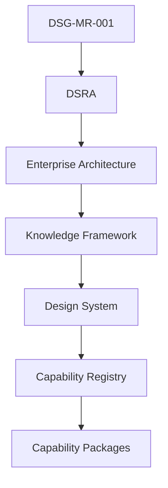
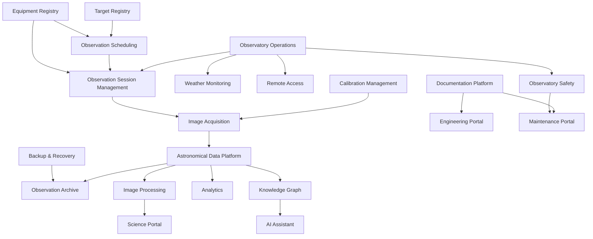
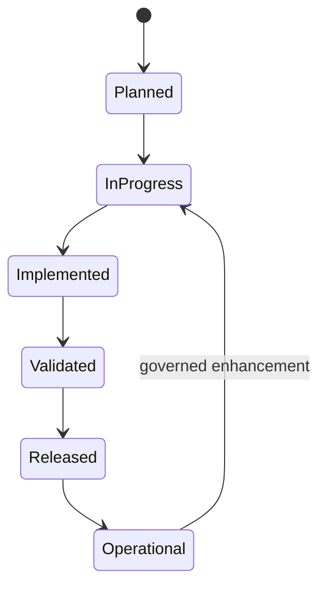

# CAP-000 - Capability Registry

| Campo | Valore |
|---|---|
| Documento | Capability Registry |
| ID | `CAP-000` |
| Stato | Official Capability Registry |
| Versione | 1.0 |
| Data | 2026-07-27 |
| Owner | Chief Solution Architect / Repository Manager |
| Fonte gerarchica | `DSG-MR-001` -> DSRA -> Enterprise Architecture -> Knowledge Framework -> Design System -> Capability Registry |
| Ambito | Capability gia presenti in roadmap, Enterprise Architecture, Knowledge Framework o capability package |

## Purpose

Il Capability Registry e l'indice autorevole delle capability Digital StarGate presenti nel repository. Funziona come dashboard operativa documentale: mostra stato, maturita, readiness, copertura e tracciabilita senza introdurre nuove capability e senza modificare roadmap, architettura o governance.

## Governance Chain



## Registry Rules

- Il registry cataloga solo capability gia supportate dal repository.
- Il registry non e una roadmap e non crea priorita di implementazione.
- Maturity e readiness sono qualitative e basate su evidenza documentale.
- Se owner, ADR, SOP, runbook, manuale, test o release non sono presenti, il campo resta `OPEN` o `Not yet available`.
- Capability package futuri devono essere aggiunti qui prima della pubblicazione come riferimento ufficiale.

## Capability Identifier Convention

### Identifier Format

Capability identifiers SHALL use:

```text
CAP-<DOMAIN>-<NUMBER>
```

Where:

- `CAP` identifies a governed capability.
- `<DOMAIN>` is a short uppercase domain prefix.
- `<NUMBER>` is a three-digit sequence within the domain.

### Domain Prefixes

| Prefix | Domain |
|---|---|
| `OSM` | Observation Session Management |
| `SCH` | Observation Scheduling |
| `EQR` | Equipment Registry |
| `TGT` | Target Registry |
| `OPS` | Observatory Operations |
| `CAL` | Calibration Management |
| `ACQ` | Image Acquisition |
| `PRC` | Image Processing |
| `DAT` | Astronomical Data Platform |
| `ARC` | Observation Archive |
| `KG` | Knowledge Graph |
| `AI` | AI Assistant |
| `SCI` | Science Portal |
| `ENG` | Engineering Portal |
| `MNT` | Maintenance Portal |
| `DOC` | Documentation Platform |
| `ANL` | Analytics |
| `RAC` | Remote Access |
| `SAF` | Observatory Safety |
| `WEA` | Weather Monitoring |
| `BRC` | Backup & Recovery |

### Governance Rules

- Identifier allocation is governed by `CAP-000`.
- Existing capability identifiers SHALL NOT be changed by routine package updates.
- A new capability package SHALL reference its registry identifier in all primary artefacts.
- Identifier changes require governance review and traceability impact assessment.
- Historical aliases, if any, must remain traceable rather than silently removed.

### Validation Rules

- Capability identifiers must be unique in `CAP-000`.
- Capability package paths must map to exactly one registry identifier.
- Related ADR, SOP, runbook, manual, test and acceptance artefacts must reference the owning capability.
- Validation shall check duplicate identifiers and missing registry/package cross references.

### Artifact Identifier Conventions

| Artefact | Convention | Example |
|---|---|---|
| ADR | `<DOMAIN>-ADR-<NUMBER>-<short-title>` | `TGT-ADR-001-authoritative-target-model.md` |
| SOP | Verb phrase in package `sop/` folder | `register-target.md` |
| Runbook | Failure/recovery phrase in package `runbooks/` folder | `duplicate-target.md` |
| Manual | Package-level `technical-manual.md` | `technical-manual.md` |
| Test Plan | Package-level `test-plan.md` | `test-plan.md` |
| Acceptance Criteria | Package-level `acceptance-criteria.md` | `acceptance-criteria.md` |
| Traceability | Package-level `traceability.md` | `traceability.md` |

## Maturity Indicators

| Maturity | Meaning |
|---|---|
| Not Started | Capability presente come intenzione o dipendenza, senza documentazione specifica sufficiente. |
| Defined | Capability descritta da architettura o Knowledge Framework. |
| Documented | Capability coperta da documentazione dedicata o documenti operativi rilevanti. |
| Validated | Capability con test/assessment/acceptance evidence validata. |
| Operational | Capability con evidenza repository di uso operativo o piattaforma attiva. |

## Readiness Scores

| Readiness | Meaning |
|---|---|
| Not Started | Non pronta per implementazione o package dedicato. |
| Architecture Complete | Architettura baseline sufficiente, package non ancora completo. |
| Documentation Complete | Documentazione dedicata completa, implementazione non certificata. |
| Implementation Ready | Package, requisiti, SOP, runbook, test e acceptance pronti per fase implementativa. |
| Operational | Capability gia sostenuta da evidenza operativa/release nel repository. |

## Capability Dependency Map



## Capability Lifecycle



## Capability Implementation Flow

```mermaid
flowchart LR
    Registry[Capability Registry] --> Package[Capability Package]
    Package --> Req[Requirements]
    Req --> ADR[Capability ADR]
    ADR --> SOP[SOP]
    SOP --> RB[Runbooks]
    RB --> Manual[Technical Manual]
    Manual --> Test[Test Plan]
    Test --> AC[Acceptance Criteria]
    AC --> Release[Release Notes]
```



## Implementation Dashboard

| Capability | Status | Coverage | ADR | SOP | Runbooks | Manuals | Tests | Release | Readiness |
|---|---|---|---|---|---|---|---|---|---|
| Observation Session Management | In Progress | Full capability package | 2 capability ADR + ADR-001 | 5 | 8 | 1 | 1 | OPEN | Implementation Ready |
| Observation Scheduling | Documented | Full capability package | 2 capability ADR | 4 | 4 | 1 | 1 | 0.1 | Implementation Ready |
| Observatory Operations | In Progress | Architecture + manuals/SOP chapters | ADR-001 | Chapters 16, 25, 26 | Chapter 18 / capability runbooks related | Chapters 5, 6, 16, 25, 26 | OPEN | OPEN | Architecture Complete |
| Equipment Registry | Documented | Full capability package | 2 capability ADR | 4 | 4 | 1 | 1 | 0.1 | Implementation Ready |
| Target Registry | Documented | Full capability package | 2 capability ADR | 4 | 4 | 1 | 1 | 0.1 | Implementation Ready |
| Calibration Management | Planned | Architecture + manual references | OPEN | Chapter 28 | OPEN | Chapters 10, 28 | OPEN | OPEN | Architecture Complete |
| Image Acquisition | In Progress | Architecture + manuals + ADR-001 | ADR-001 | Chapter 17 | Capability camera/N.I.N.A./ASCOM runbooks related | Chapters 11-17 | OPEN | OPEN | Architecture Complete |
| Image Processing | Planned | Architecture + manual references | OPEN | Chapter 28 | OPEN | Chapter 28 | OPEN | OPEN | Architecture Complete |
| Astronomical Data Platform | In Progress | Architecture + ADR-003 | ADR-003 | Chapter 28 | OPEN | Warehouse docs, Chapter 28 | OPEN | OPEN | Architecture Complete |
| Observation Archive | Planned | Architecture + backup/manual references | OPEN | Chapters 21, 28 | OPEN | Chapters 21, 28 | OPEN | OPEN | Architecture Complete |
| Knowledge Graph | Planned | Knowledge Framework conceptual model | OPEN | OPEN | OPEN | Knowledge docs | OPEN | OPEN | Architecture Complete |
| AI Assistant | Planned | Architecture only | OPEN | OPEN | OPEN | Knowledge docs | OPEN | OPEN | Architecture Complete |
| Science Portal | Planned | Architecture + Design System patterns | OPEN | OPEN | OPEN | Data architecture / design docs | OPEN | OPEN | Architecture Complete |
| Engineering Portal | In Progress | Architecture + repository docs | DSG-ADR-004 | Release docs | OPEN | Enterprise Architecture docs | OPEN | OPEN | Architecture Complete |
| Maintenance Portal | Planned | Architecture + manuals/runbook references | OPEN | Chapters 18, 21, 30-32 | OPEN | Chapters 18-19, 21, 30-32 | OPEN | OPEN | Architecture Complete |
| Documentation Platform | Implemented | Enterprise docs + Design System + MkDocs | DSG-ADR-004 | Governance/release docs | OPEN | Enterprise docs, developer docs | OPEN | UI 6.1 | Operational |
| Analytics | In Progress | ADR + dashboard docs | ADR-002, ADR-003 | Release docs | OPEN | Analytics and warehouse docs | OPEN | UI 6.1 | Architecture Complete |
| Remote Access | Planned | Technology/Security architecture + manual chapter | OPEN | Chapter 24 | OPEN | Chapters 5, 24 | OPEN | OPEN | Architecture Complete |
| Observatory Safety | In Progress | DSRA + Observability + manuals | ADR-001 related | Chapters 18, 25, 26 | Capability safety runbooks related | Chapters 18, 25, 26 | OPEN | OPEN | Architecture Complete |
| Weather Monitoring | In Progress | Observability + manual chapter | OPEN | Chapter 26 | Weather Unsafe runbook related | Chapter 26 | OPEN | OPEN | Architecture Complete |
| Backup & Recovery | Planned | Technology/Security + manual chapter | OPEN | Chapter 21 | OPEN | Chapter 21 | OPEN | OPEN | Architecture Complete |

## Capability Registry Entries

| Identifier | Capability | Purpose | Domain | Owner | Status | Maturity | Readiness | Version | Package | ADR | SOP | Runbooks | Manuals | Tests | Acceptance | Dependencies | Open decisions |
|---|---|---|---|---|---|---|---|---|---|---|---|---|---|---|---|---|---|
| `CAP-OSM-001` | Observation Session Management | Governare la sessione osservativa come unita operativa, informativa e di tracciabilita. | Observatory Operations / Data / Knowledge | Lead Solution Architect / Operations Owner | In Progress | Documented | Implementation Ready | OPEN | `docs/capabilities/observation-session-management/` | `ADR-001`, `OSM-ADR-001`, `OSM-ADR-002` | 5 package SOP | 8 package runbooks | `technical-manual.md`, Chapters 11-17, 28 | `test-plan.md` | `acceptance-criteria.md` | Scheduler, Target Registry, Equipment Registry, N.I.N.A., ASCOM, Data Platform, Weather/Safety | Manifest schema, session ID format, session quality scale |
| `CAP-SCH-001` | Observation Scheduling | Preparare piani osservativi usando target, finestra, meteo, profilo ottico e priorita. | Prepare Observation / Automation | OPEN | Documented | Documented | Implementation Ready | 0.1 | `docs/capabilities/observation-scheduling/` | `OSD-ADR-001`, `OSD-ADR-002` | `create-schedule.md`, `update-schedule.md`, `approve-schedule.md`, `cancel-schedule.md` | `scheduling-conflict.md`, `weather-window-lost.md`, `resource-unavailable.md`, `schedule-recovery.md` | `technical-manual.md`, Chapter 17 reference | `acceptance-criteria.md` | Target Registry, Equipment Registry, Weather Monitoring, Observatory Safety, CAP-001 | Priority scoring model, schedule evidence retention, future scheduling UI, notification behavior |
| `CAP-OPS-001` | Observatory Operations | Operare osservatorio remoto in modo sicuro, ripetibile e tracciabile. | Operate Observatory | Operations Owner | In Progress | Documented | Architecture Complete | OPEN | Not yet available | `ADR-001` related | Chapters 16, 25, 26 | OSM emergency/weather/roof runbooks related | Chapters 5, 6, 16, 18, 25, 26 | OPEN | OPEN | Remote Access, Weather Monitoring, Observatory Safety, Equipment Registry | Operational metrics and release evidence refinement |
| `CAP-EQR-001` | Equipment Registry | Governare asset, configurazioni, driver, firmware, gruppi logici, stato e lifecycle equipment. | Support Engineering / Observatory Operations | Engineering Owner / OPEN | Documented | Documented | Implementation Ready | 0.1 | `docs/capabilities/equipment-registry/` | `EQR-ADR-001`, `EQR-ADR-002` | `register-equipment.md`, `update-equipment.md`, `verify-equipment.md`, `retire-equipment.md` | `equipment-not-found.md`, `configuration-mismatch.md`, `equipment-offline.md`, `registry-recovery.md` | `technical-manual.md`, Chapters 7-10, 22 | `test-plan.md` | `acceptance-criteria.md` | CAP-OSM-001, CAP-SCH-001, Observatory Safety, Maintenance Portal, Engineering Portal, Knowledge Framework | Identifier format, physical storage model, telemetry ingestion, compatibility matrix |
| `CAP-TGT-001` | Target Registry | Governare identita, riferimenti catalogo, coordinate, classificazione, vincoli e lifecycle dei target astronomici. | Prepare Observation / Support Scientific Research | Science Owner / OPEN | Documented | Documented | Implementation Ready | 0.1 | `docs/capabilities/target-registry/` | `TGT-ADR-001`, `TGT-ADR-002` | `register-target.md`, `update-target.md`, `validate-target.md`, `retire-target.md` | `duplicate-target.md`, `unresolved-identifier.md`, `invalid-coordinates.md`, `registry-recovery.md` | `technical-manual.md`, Chapter 17 reference | `test-plan.md` | `acceptance-criteria.md` | CAP-SCH-001, CAP-OSM-001, CAP-EQR-001, Knowledge Framework, Data Platform | Target identifier format, physical storage model, automated catalogue import, moving target ephemeris handling |
| `CAP-CAL-001` | Calibration Management | Governare calibration frames e master calibration per acquisizione e processing. | Calibrate Data | Imaging Owner | Planned | Defined | Architecture Complete | OPEN | Not yet available | OPEN | Chapter 28 reference | OPEN | Chapters 10, 28 | OPEN | OPEN | Equipment Registry, Image Acquisition, Image Processing | Calibration library validity and storage decisions |
| `CAP-ACQ-001` | Image Acquisition | Acquisire e organizzare FITS, header, log e raw workspace durante sessioni osservative. | Acquire Scientific Data | Operations / Imaging Owner | In Progress | Documented | Architecture Complete | OPEN | Covered by OSM as related acquisition phase | `ADR-001` | Chapter 17; OSM Execute Session | Camera, N.I.N.A., ASCOM, Mount runbooks in OSM package | Chapters 11-17 | OSM test plan related | OSM acceptance related | OSM, Observatory Control, N.I.N.A., ASCOM, PHD2, Calibration Management | Raw/intermediate retention and manifest schema |
| `CAP-PRC-001` | Image Processing | Trasformare raw data in registered, integrated, processed images and scientific products. | Process Images | Imaging Owner | Planned | Defined | Architecture Complete | OPEN | Not yet available | OPEN | Chapter 28 reference | OPEN | Chapter 28 | OPEN | OPEN | Calibration Management, Data Platform, PixInsight, ASTAP, Archive | Processing quality metrics and publication criteria |
| `CAP-DAT-001` | Astronomical Data Platform | Organizzare session metadata, cataloghi, warehouse, datasets, archive e lineage. | Data Platform / Preserve Knowledge | Data Owner | In Progress | Documented | Architecture Complete | OPEN | Not yet available | `ADR-003` | Chapter 28 reference | OPEN | Warehouse docs, Chapter 28 | OPEN | OPEN | OSM, Image Acquisition, Observation Archive, Analytics, Knowledge Graph | Catalog boundary, storage, retention classes |
| `CAP-ARC-001` | Observation Archive | Preservare dati osservativi, manifest, prodotti, metadata and recovery evidence. | Preserve Knowledge / Backup & Recovery | Data / Infrastructure Owner | Planned | Defined | Architecture Complete | OPEN | Not yet available | OPEN | Chapters 21, 28 | OPEN | Chapters 21, 28 | OPEN | OPEN | Data Platform, Backup & Recovery, OSM, Image Processing | Retention, archive storage, restore evidence |
| `CAP-KG-001` | Knowledge Graph | Collegare concettualmente dati, documenti, decisioni, asset, sessioni e conoscenza. | Preserve Knowledge | Knowledge Owner | Planned | Defined | Architecture Complete | OPEN | Not yet available | OPEN | OPEN | OPEN | Knowledge Framework docs | OPEN | OPEN | Data Platform, Documentation Platform, Observation Catalog, ADR, SOP | Graph storage, ontology formalism, AI evidence model |
| `CAP-AI-001` | AI Assistant | Supportare analisi, ricerca, troubleshooting e raccomandazioni revisionabili su fonti governate. | Knowledge / Engineering Support | Governance Owner / OPEN | Planned | Defined | Architecture Complete | OPEN | Not yet available | OPEN | OPEN | OPEN | Knowledge docs | OPEN | OPEN | Knowledge Graph, Documentation Platform, Security Architecture | AI guardrails, evidence model, OpenAI integration governance |
| `CAP-SCI-001` | Science Portal | Pubblicare osservazioni, prodotti scientifici, metadata and publication candidates. | Support Scientific Research / Publish Results | Science Owner | Planned | Defined | Architecture Complete | OPEN | Not yet available | OPEN | OPEN | OPEN | Data Architecture, Chapter 28 | OPEN | OPEN | Image Processing, Observation Catalog, Archive, Security | Publication workflow and access rules |
| `CAP-ENG-001` | Engineering Portal | Pubblicare architettura, ADR, registri, dashboard engineering and technical evidence. | Support Engineering | Documentation / Engineering Owner | In Progress | Documented | Architecture Complete | OPEN | Not yet available | `DSG-ADR-004` | Release docs | OPEN | Enterprise Architecture and developer docs | OPEN | OPEN | Documentation Platform, Analytics, Equipment Registry | Engineering evidence and access model |
| `CAP-MNT-001` | Maintenance Portal | Supportare incident, backup, asset, obsolescenza, checklist and recovery evidence. | Maintenance / Support Engineering | Maintenance Owner | Planned | Defined | Architecture Complete | OPEN | Not yet available | OPEN | Chapters 18, 19, 21, 30-32 | OSM runbooks related where session-impacting | Chapters 18-19, 21, 30-32 | OPEN | OPEN | Equipment Registry, Backup & Recovery, Observatory Safety | Maintenance workflow and evidence model |
| `CAP-DOC-001` | Documentation Platform | Gestire source of record documentale, MkDocs, GitHub, ADR, SOP and release evidence. | Preserve Knowledge / Support Engineering | Documentation Owner | Implemented | Operational | Operational | UI 6.1 | Not yet available | `DSG-ADR-004` | Governance/release documentation | OPEN | Enterprise docs, developer guidelines | OPEN | OPEN | GitHub, MkDocs, Design System, Knowledge Framework | Freshness cadence and automated quality tooling |
| `CAP-ANL-001` | Analytics | Produrre KPI, dashboard, warehouse datasets and quality evidence. | Validate Results / Continuous Improvement | Analytics Owner | In Progress | Documented | Architecture Complete | UI 6.1 | Not yet available | `ADR-002`, `ADR-003` | Release docs | OPEN | Analytics and warehouse docs | OPEN | OPEN | Data Platform, Observation Catalog, Documentation Platform | Metrics catalog and dashboard publication rules |
| `CAP-RAC-001` | Remote Access | Supportare operazioni remote tramite VPN, connettivita e access governance. | Observatory Operations / Security | Security / Infrastructure Owner | Planned | Defined | Architecture Complete | OPEN | Not yet available | OPEN | Chapter 24 reference | OPEN | Chapters 5, 24 | OPEN | OPEN | Teltonika, VPN, Internet Connectivity, EAGLE, Security Architecture | Identity/access model and audit requirements |
| `CAP-SAF-001` | Observatory Safety | Proteggere osservatorio, equipment and session execution from unsafe conditions. | Operate Observatory / Security | Operations Owner | In Progress | Documented | Architecture Complete | OPEN | Partially covered by OSM runbooks | `ADR-001` related | Chapters 18, 25, 26; OSM Abort/Recover | Weather Unsafe, Roof Failure, Emergency Stop | Chapters 18, 25, 26 | OSM recovery tests related | OSM operational acceptance related | Weather Monitoring, Remote Access, Equipment Registry, Observatory Operations | Alerting rules and safety evidence model |
| `CAP-WEA-001` | Weather Monitoring | Acquisire e classificare evidenze meteo per readiness and safety decisions. | Observatory Safety / Operations | Operations Owner | In Progress | Documented | Architecture Complete | OPEN | Partially covered by OSM Weather Unsafe | OPEN | Chapter 26, OSM Prepare/Abort | Weather Unsafe | Chapter 26, AllSky Chapter 27 | OSM recovery tests related | OSM operational acceptance related | Weather Station, AllSky, Observatory Safety, OSM | Freshness thresholds and alerting model |
| `CAP-BRC-001` | Backup & Recovery | Preservare e ripristinare repository, configurazioni, dati osservativi and archive evidence. | Business Continuity / Preserve Knowledge | Infrastructure / Data Owner | Planned | Defined | Architecture Complete | OPEN | Not yet available | OPEN | Chapter 21 reference | OPEN | Chapter 21 | OPEN | OPEN | Observation Archive, Cloud Storage/NAS, Documentation Platform, Security | RTO/RPO, backup encryption, retention, restore testing |

## Maturity Summary

| Maturity | Count | Capabilities |
|---|---:|---|
| Not Started | 0 | None catalogued with this maturity. |
| Defined | 9 | Calibration Management, Image Processing, Observation Archive, Knowledge Graph, AI Assistant, Science Portal, Maintenance Portal, Remote Access, Backup & Recovery |
| Documented | 11 | Observation Session Management, Observation Scheduling, Observatory Operations, Equipment Registry, Target Registry, Image Acquisition, Astronomical Data Platform, Engineering Portal, Analytics, Observatory Safety, Weather Monitoring |
| Validated | 0 | None validated by release/assessment evidence in this registry. |
| Operational | 1 | Documentation Platform |
| **Total** | **21** |  |

## Readiness Summary

| Readiness | Count | Capabilities |
|---|---:|---|
| Not Started | 0 | None |
| Architecture Complete | 16 | All catalogued capabilities except Observation Session Management, Observation Scheduling, Equipment Registry, Target Registry and Documentation Platform |
| Documentation Complete | 0 | None |
| Implementation Ready | 4 | Observation Session Management, Observation Scheduling, Equipment Registry, Target Registry |
| Operational | 1 | Documentation Platform |
| **Total** | **21** |  |

## Traceability Coverage

| Metric | Value |
|---|---:|
| Capabilities catalogued | 21 |
| Capabilities with roadmap reference | 21 / 21 |
| Capabilities with DSRA reference | 21 / 21 |
| Capabilities with Enterprise Architecture reference | 21 / 21 |
| Capabilities with Knowledge Framework reference | 21 / 21 |
| Capabilities with Design System reference or explicit UI condition | 21 / 21 |
| Capabilities with dedicated package | 4 / 21 |
| Duplicate capability identifiers | 0 |

## Release Notes

Release notes are linked only when repository evidence is available. Current registry evidence includes `docs/releases/ui-6.1.md` for UI/portal-related release history. Future capability releases shall add explicit release references here.
