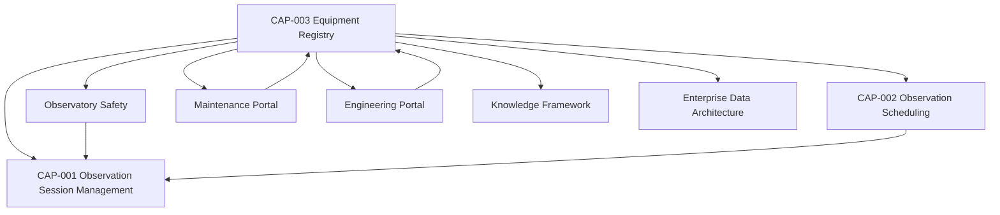

# CAP-003 - Architecture Mapping

## Purpose

Questo documento collega Equipment Registry alle architetture e capability approvate. Non ridefinisce Enterprise Architecture o capability esistenti.

## Logical Position

## Application Architecture Mapping

| Application Service | CAP-003 Relation |
|---|---|
| Equipment Registry | Core capability: authoritative registry of physical and logical assets. |
| Observation Scheduling | Consumes availability, assignment and compatibility constraints. |
| Observation Session Manager | Consumes verified configuration and readiness before execution. |
| Maintenance Portal | Consumes and produces maintenance records and lifecycle updates. |
| Engineering Portal | Publishes technical evidence, dependency and configuration views. |
| Observatory Safety | Consumes safety-critical equipment state and health evidence. |
| Documentation Platform | Stores controlled documentation and package evidence. |

## Data Architecture Mapping

| Information Object | CAP-003 Responsibility |
|---|---|
| Equipment | Owned conceptually by CAP-003. |
| Equipment Registry | Capability-owned information domain. |
| Engineering Asset | Linked to Knowledge Framework. |
| Configuration | Owned as equipment configuration evidence. |
| Maintenance Activity | Produced/consumed with Maintenance Portal. |
| Observation Session | Consumer context through CAP-001. |
| Observation Schedule | Consumer context through CAP-002. |
| Safety Event | Linked when equipment state affects safety. |

## Technology Architecture Mapping

CAP-003 covers equipment categories already relevant to the observatory platform:

| Category | Architectural Role |
|---|---|
| Optical Tubes | Scientific acquisition setup. |
| Mounts | Pointing and tracking resources. |
| Cameras / Guide Cameras | Imaging and guiding resources. |
| Filter Wheels / Focusers / Rotators / Flat Panels | Imaging train configuration resources. |
| Guidescopes | Guiding optical resources. |
| Weather Stations / Roof Controllers | Safety and environment resources. |
| UPS / Power Distribution | Continuity and power resources. |
| Network Devices / Mini PCs | Connectivity and local execution resources. |
| Storage | Data preservation and handoff resources. |
| Firmware / Drivers | Logical dependencies and compatibility evidence. |
| Logical Equipment Groups | Governed grouping of assets for session profiles or operational assignments. |

No vendor-specific implementation is introduced by this capability package.

## Knowledge Framework Mapping

CAP-003 derives from canonical entities:

- Equipment;
- Equipment Registry;
- Engineering Asset;
- Configuration;
- Maintenance Activity;
- Software Component;
- Alert;
- Safety Event;
- Documentation Asset.

## Design System Mapping

CAP-003 does not implement UI. Future interfaces must conform to Design System patterns for:

- equipment cards;
- status badges;
- tables;
- alerts;
- maintenance timelines;
- engineering dashboard;
- maintenance dashboard.

## Governance Boundaries

- CAP-003 owns authoritative equipment records and state model.
- CAP-002 owns scheduling decisions that consume equipment availability.
- CAP-001 owns observation session execution that consumes verified equipment state.
- Observatory Safety owns safety decisioning and consumes safety-relevant equipment evidence.
- Maintenance Portal owns user-facing maintenance workflow when implemented.

## Open Dependencies

- Final physical storage model remains OPEN.
- Exact asset identifier format remains OPEN unless governed later.
- Automated telemetry ingestion remains OPEN.
- Future UI implementation remains OPEN and must follow Design System.
