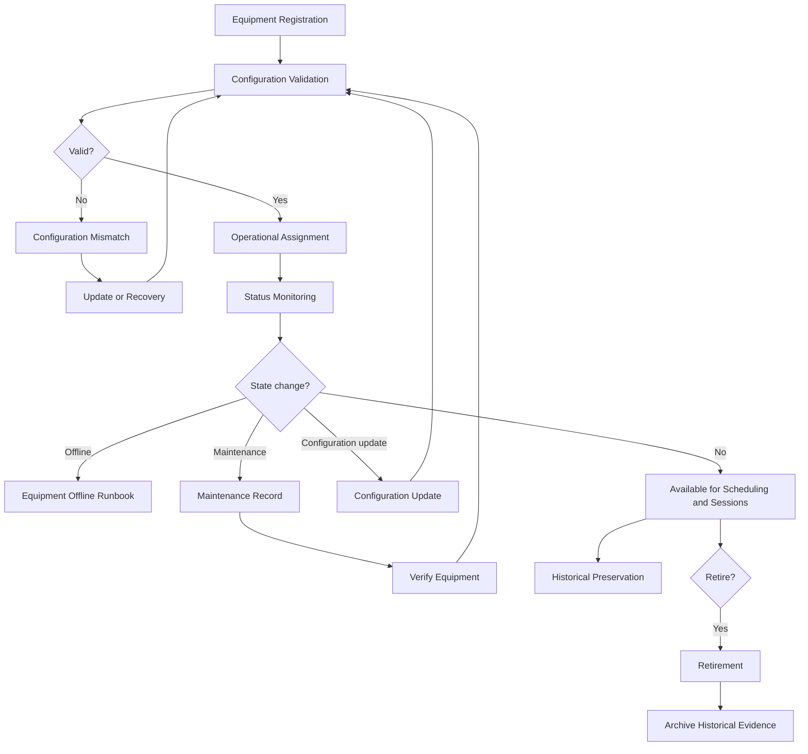

# CAP-003 - Business Process

## Purpose

Questo documento descrive il processo operativo per governare equipment fisico e logico lungo l'intero ciclo di vita. Il processo produce evidenza documentale per scheduling, session management, maintenance, safety and engineering governance.

## Workflow

## Process Steps

| Step | Description | Output |
|---|---|---|
| Equipment Registration | Registra asset fisico o logico con identificatore, tipo, owner, posizione e stato iniziale. | Equipment record. |
| Configuration Validation | Verifica configurazione, firmware, driver, dipendenze e compatibilita note. | Verified configuration or mismatch. |
| Operational Assignment | Collega equipment a capability, gruppo logico o uso operativo. | Assignment record. |
| Status Monitoring | Mantiene stato operativo e health status basato su evidenza disponibile. | Equipment state evidence. |
| Configuration Update | Registra cambi controllati a configurazione, driver, firmware o dipendenze. | Updated configuration record. |
| Maintenance | Collega attivita manutentive, verifiche, recovery e impatti. | Maintenance record. |
| Retirement | Rimuove asset dall'uso operativo preservando storico e dipendenze. | Retired asset record. |
| Historical Preservation | Mantiene storia di stati, configurazioni, assegnazioni e manutenzioni. | Audit and knowledge evidence. |

## Controls

- Un asset non verificato non puo essere indicato come disponibile per scheduling o sessione.
- Un asset offline non puo essere assegnato come risorsa operativa.
- Ogni cambio configurazione deve preservare la versione precedente.
- Retirement non deve cancellare storico, dipendenze o evidenza di utilizzo.
- Asset safety-critical devono evidenziare impatto su Observatory Safety.

## Related Documents

- `requirements.md`
- `architecture-mapping.md`
- `data-model.md`
- `sop/register-equipment.md`
- `sop/verify-equipment.md`
- `runbooks/configuration-mismatch.md`
- `runbooks/equipment-offline.md`
