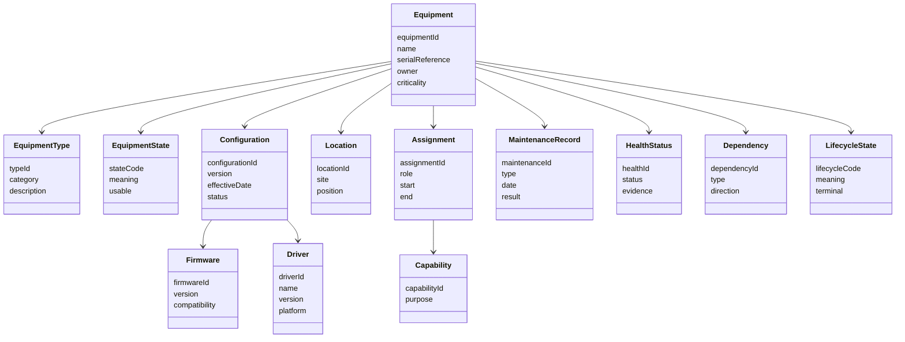

# CAP-003 - Conceptual Data Model

## Purpose

Questo documento descrive le entita concettuali dell'Equipment Registry. Non definisce database fisico, API, backend o storage implementation.

## Conceptual Model

## Entities

| Entity | Purpose | Owner | Producer | Consumer | Lifecycle |
|---|---|---|---|---|---|
| Equipment | Canonical physical or logical asset record. | Engineering Owner | Register/Update SOP | CAP-001, CAP-002, Safety, Maintenance | Proposed -> Registered -> Verified -> Available -> Retired -> Archived |
| Equipment Type | Controlled category of equipment. | Engineering Owner | Registry governance | Operators, schedulers, maintainers | Active -> Superseded |
| Equipment State | Operational usability state. | Engineering/Operations | Verify/Monitor process | Scheduling, Session Management | Unknown -> Verified -> Available/Offline/Maintenance |
| Configuration | Governed configuration baseline for equipment. | Engineering Owner | Update SOP | CAP-001, CAP-002 | Draft -> Verified -> Active -> Superseded |
| Firmware | Logical dependency version evidence. | Engineering Owner | Update SOP | Maintenance, Engineering | Active -> Superseded -> Retired |
| Driver | Logical software dependency for equipment operation. | Engineering Owner | Update SOP | CAP-001, Engineering | Active -> Superseded -> Retired |
| Capability | Consuming or supported capability. | Capability owner | CAP-000 / package | Traceability | Defined -> Documented -> Operational |
| Location | Physical or logical placement. | Operations/Engineering | Register/Update SOP | Safety, Maintenance | Active -> Changed -> Historical |
| Assignment | Link between equipment and use context. | Operations/Engineering | Scheduling/session/maintenance processes | CAP-001, CAP-002 | Candidate -> Active -> Released |
| Maintenance Record | Evidence of maintenance activity. | Maintenance Owner | Maintenance process | Registry, Safety, Engineering | Open -> Completed -> Archived |
| Health Status | Health evidence and operational readiness. | Operations/Engineering | Verify/Monitoring | Scheduling, Session, Safety | Unknown -> Healthy/Degraded/Offline |
| Dependency | Relationship to other equipment, firmware, driver or service. | Engineering Owner | Register/Update SOP | Engineering, Recovery | Active -> Changed -> Retired |
| Lifecycle State | Controlled vocabulary for asset lifecycle. | Registry Owner | ADR/state model | All consumers | Governed vocabulary |

## State Vocabulary

| Equipment State | Meaning | Usable for operations |
|---|---|---|
| Unknown | Asset exists but state is not verified. | No |
| Registered | Asset record exists. | No |
| Verified | Identity and configuration are checked. | Conditional |
| Available | Asset can be assigned operationally. | Yes |
| Assigned | Asset is reserved or bound to an operational context. | Conditional |
| In Use | Asset is actively used by a session or operation. | Yes |
| Degraded | Asset has limitation requiring operator awareness. | Conditional |
| Offline | Asset is unavailable. | No |
| Maintenance | Asset is under maintenance. | No |
| Retired | Asset is no longer operational. | No |
| Archived | Historical record only. | No |

## Retention and Storage

CAP-003 does not define database or storage technology. Retention and storage follow Enterprise Data Architecture, Knowledge Framework and future ADR if needed. Retirement preserves historical evidence rather than deleting asset records.
