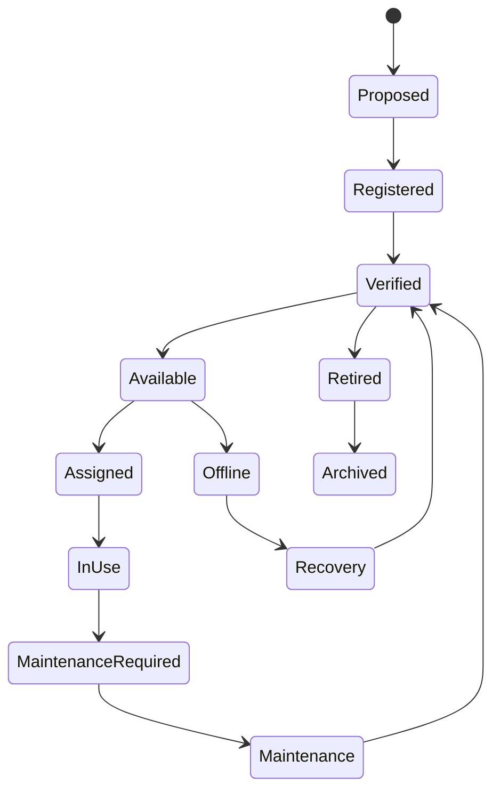

# CAP-003 - Equipment Registry

| Campo | Valore |
|---|---|
| Capability | Equipment Registry |
| ID | `CAP-003` / `CAP-EQR-001` |
| Stato | Documented |
| Readiness | Implementation Ready |
| Versione | 0.1 |
| Owner | Engineering Owner / OPEN for final accountability |
| Fonte gerarchica | `DSG-MR-001` -> DSRA -> Enterprise Architecture -> Knowledge Framework -> Design System -> Capability Registry -> Capability Package |

## Purpose

Equipment Registry stabilisce il registro autorevole degli asset fisici e logici dell'osservatorio Digital StarGate. La capability definisce come registrare, verificare, aggiornare, monitorare, assegnare, mantenere, ritirare e preservare storicamente ogni componente tecnico rilevante.

Il registry e la single source of truth documentale per equipment identity, configuration, state, health, dependency and lifecycle evidence. Non implementa software, API, database o interfacce utente.

## Business Value

- Riduce errori operativi causati da asset non censiti o configurazioni non allineate.
- Fornisce evidenza a Observation Scheduling per resource availability e compatibility.
- Fornisce evidenza a Observation Session Management per readiness e recovery.
- Supporta Maintenance Portal, Engineering Portal, Observatory Safety e Backup & Recovery.
- Preserva storico di configurazioni, firmware, driver, manutenzioni e dismissioni.

## Scope

Incluso:

- modello documentale di registrazione equipment;
- processo di registration, validation, assignment, monitoring, update, maintenance, retirement e historical preservation;
- requisiti e acceptance criteria;
- modello dati concettuale;
- ADR specifici della capability;
- SOP operative;
- runbook di recovery;
- manuale tecnico;
- test plan e traceability.

Escluso:

- database fisico;
- CMDB software;
- API o backend;
- frontend o portale;
- integrazione vendor-specific;
- modifica di Roadmap, DSRA, Enterprise Architecture, Knowledge Framework, Design System, CAP-001, CAP-002 o REL-000.

## Equipment Coverage

Il registro supporta concettualmente:

- Optical Tubes;
- Mounts;
- Cameras;
- Filter Wheels;
- Focusers;
- Guidescopes;
- Guide Cameras;
- Rotators;
- Flat Panels;
- Weather Stations;
- Roof Controllers;
- UPS;
- Power Distribution;
- Network Devices;
- Mini PCs;
- Storage;
- Firmware;
- Drivers;
- Logical Equipment Groups.

## Actors

| Actor | Responsibility |
|---|---|
| Engineering Owner | Governa asset, configurazioni e coerenza tecnica. |
| Operations Owner | Usa stato e disponibilita per sessioni e scheduling. |
| Maintenance Owner | Registra maintenance activity, health e retirement. |
| Safety Owner | Consuma stato safety-critical di equipment. |
| Scheduler | Consuma disponibilita e compatibilita per CAP-002. |
| Observation Session Manager | Consuma readiness e configurazione per CAP-001. |
| Documentation Owner | Mantiene evidenza nel repository. |

## Stakeholders

| Stakeholder | Interest |
|---|---|
| Operations | Asset readiness e disponibilita osservativa. |
| Engineering | Configurazione corretta e dipendenze gestite. |
| Science | Coerenza tra target, setup e qualita dati. |
| Safety | Stati equipment compatibili con operazioni safe. |
| Release Management | Evidenza per readiness e future release. |
| Knowledge Architecture | Tracciabilita degli asset nella knowledge base. |

## Dependencies

| Dependency | Role |
|---|---|
| CAP-001 Observation Session Management | Consuma equipment readiness, configuration and health evidence. |
| CAP-002 Observation Scheduling | Consuma resource availability and assignment constraints. |
| Observatory Safety | Consuma health and critical state for safety decisions. |
| Maintenance Portal | Consuma maintenance and lifecycle evidence. |
| Engineering Portal | Pubblica evidenza tecnica e registri. |
| Knowledge Framework | Definisce Equipment, Configuration, Engineering Asset and Maintenance Activity. |
| Enterprise Architecture | Definisce Equipment Registry come application/data capability. |
| REL-000 | Governa readiness e promotion evidence. |

## Lifecycle

## Success Criteria

- Ogni asset critico ha identificatore, tipo, stato, configurazione, ownership e lifecycle state.
- Ogni assegnazione operativa e tracciabile verso CAP-001 o CAP-002 quando applicabile.
- Ogni mismatch di configurazione produce record e recovery path.
- Asset offline, mancanti o non verificati non sono usati come disponibili.
- Retirement preserva storico, configurazione e dipendenze.
- CAP-000 registra status `Documented`, readiness `Implementation Ready`, version `0.1`.

## References

- `DSG-MR-001` Master Roadmap.
- DSRA baseline and operational risk context.
- `EA-000` Enterprise Architecture Baseline.
- Knowledge Framework Domain Model and Canonical Information Model.
- `CAP-000` Capability Registry.
- `CAP-001` Observation Session Management.
- `CAP-002` Observation Scheduling.
- `REL-000` Release Management Baseline.
